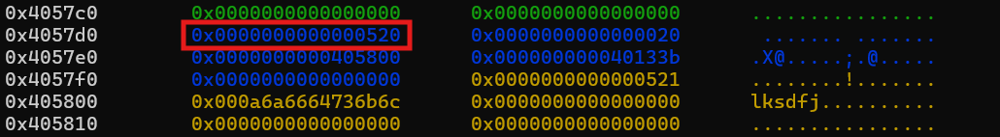
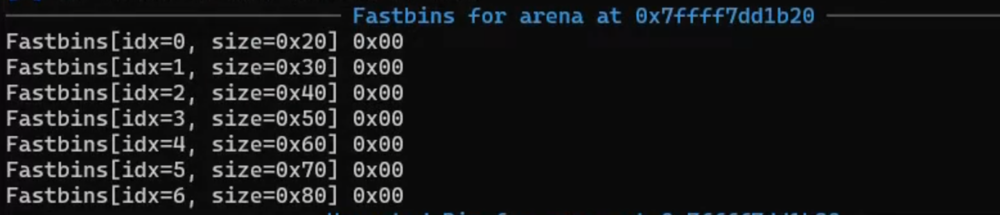
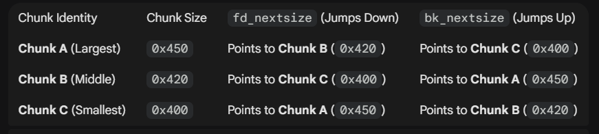
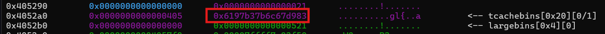

# HEAP EXPLOIT

# Concept

## Heap

- `Heap` là một vùng nhớ được sử dụng cho cấp phát động. 

- Do các hàm `malloc` hay `calloc`,... ở trên libc => các phiên bản `libc` khác nhau thì các hàm đó cũng vận hành khác nhau

## Malloc Chunk

- Khi ta gọi hàm `malloc` thì nó sẽ trả về địa chỉ của `chunk` vừa tạo. Mỗi `chunk` đều có `heap header` (`heap metadata`)

- Mỗi chunk sẽ có cấu trúc:

```
0x0: Kích thước của chunk trước
0x8: Kích thước của chunk hiện tại
0x10: Nội dung của chunk đó
```
### Prev_size



- Khi ta `free` 1 `chunk` trước đó mà chương trình sử dụng `Standard Freeing` (`Unsorted / Small / Large Bins`) thì lúc đó `prev_size` của chunk sau đó được cập nhật và `chunksize` để chương trình biết các `chunk` trước đó không còn sử dụng thì sẽ gộp vào thành 1 `freed chunk` lớn hơn.

- Còn `Optimized Freeing` (`Tcache / Fastbins`) sẽ không thay đổi `prev_size` và vẫn để `PREV_INUSE` bit là 1 để chương trình nghĩ là `chunk` trước vẫn sử dụng nên không gộp chúng

### Chunk_size

- Đây là kích thước của `chunk` đó, bao gồm `0x10` của `metadata` và size của `Chunk content`. Bit cuối của `chunk size` là `PREV_INUSE` bit cho ta biết:

    - `0x0`: `chunk` trước không sử dụng

    - `0x1`: `Previous in Use` ( báo cho chương trình `chunk` trước đang sử dụng => không được gộp )

    - `0x2`: `Is MMAPPED`: chunk được tạo bởi `mmap()`

    - `0x4`: `Non Main Arena `: chunk được tạo bởi thread khác

## Bin

- Khi ta `free` 1 `chunk` thì nó sẽ được cho vào các danh sách bin. 

### Fast Bins

- `Fast Bin` có 7 danh sách, ở 64 bit thì kích thước mặc định của các danh sách đó từ `0x20 - 0x80`:



- `chunk` cuối cùng vào `fast bin` thì khi `malloc` thì sẽ đc sử dụng đầu tiên : `LIFO` (LAST IN FIRST OUT)

### Tcache Bin

- Từ libc phiên bản `2.26` trở lên mới có `tcache bin`. Cách lưu trữ chunk tương tự `Fast Bin`

- 1 danh sách trong tcache chứa tối đa 7 `chunk`, khi đến `chunk` thứ 8 thì chương trình sẽ đẩy `chunk` đó vào các danh sách khác

```
gef➤  heap bins
─────────────────────────────────────────────────────────────────────────────────── Tcachebins for arena 0x7ffff7faec40 ───────────────────────────────────────────────────────────────────────────────────
Tcachebins[idx=0, size=0x10] count=7  ←  Chunk(addr=0x555555559320, size=0x20, flags=PREV_INUSE)  ←  Chunk(addr=0x555555559300, size=0x20, flags=PREV_INUSE)  ←  Chunk(addr=0x5555555592e0, size=0x20, flags=PREV_INUSE)  ←  Chunk(addr=0x5555555592c0, size=0x20, flags=PREV_INUSE)  ←  Chunk(addr=0x5555555592a0, size=0x20, flags=PREV_INUSE)  ←  Chunk(addr=0x555555559280, size=0x20, flags=PREV_INUSE)  ←  Chunk(addr=0x555555559260, size=0x20, flags=PREV_INUSE)
Tcachebins[idx=1, size=0x20] count=7  ←  Chunk(addr=0x555555559460, size=0x30, flags=PREV_INUSE)  ←  Chunk(addr=0x555555559430, size=0x30, flags=PREV_INUSE)  ←  Chunk(addr=0x555555559400, size=0x30, flags=PREV_INUSE)  ←  Chunk(addr=0x5555555593d0, size=0x30, flags=PREV_INUSE)  ←  Chunk(addr=0x5555555593a0, size=0x30, flags=PREV_INUSE)  ←  Chunk(addr=0x555555559370, size=0x30, flags=PREV_INUSE)  ←  Chunk(addr=0x555555559340, size=0x30, flags=PREV_INUSE)
──────────────────────────────────────────────────────────────────────────────────── Fastbins for arena 0x7ffff7faec40 ────────────────────────────────────────────────────────────────────────────────────
Fastbins[idx=0, size=0x10] 0x00
Fastbins[idx=1, size=0x20] ←  Chunk(addr=0x555555559490, size=0x30, flags=PREV_INUSE)
Fastbins[idx=2, size=0x30] 0x00
Fastbins[idx=3, size=0x40] 0x00
Fastbins[idx=4, size=0x50] 0x00
Fastbins[idx=5, size=0x60] 0x00
Fastbins[idx=6, size=0x70] 0x00
─────────────────────────────────────────────────────────────────────────────────── Unsorted Bin for arena 'main_arena' ───────────────────────────────────────────────────────────────────────────────────
[+] Found 0 chunks in unsorted bin.
──────────────────────────────────────────────────────────────────────────────────── Small Bins for arena 'main_arena' ────────────────────────────────────────────────────────────────────────────────────
[+] Found 0 chunks in 0 small non-empty bins.
──────────────────────────────────────────────────────────────────────────────────── Large Bins for arena 'main_arena' ────────────────────────────────────────────────────────────────────────────────────
[+] Found 0 chunks in 0 large non-empty bins.
```
- Có tổng cộng 64 danh sách tcache kích thước từ `0x20-0x410`

### Unsorted, Large and Small Bins

- 3 ngăn xếp này được lưu trữ theo cấu trúc như sau:

```
0x00:         Not Used
0x01:         Unsorted Bin
0x02 - 0x3f:  Small Bin
0x40 - 0x7e:  Large Bin
```

- Trong đó `Small Bin` sẽ chứa các chunk có các size cố định vào các danh sách từ `0x20-0x3f0`
- `Large Bin thì có 63 ngăn xếp`

#### Unsorted bin

- khi `free` đến các chunks mà không vào `fast bin` hay `tcache` được nữa thì các chunks đó sẽ được cho vào `Unsorted Bin` chứ không đi vào `Small Bin` hay `Large Bin` ngay

- Khi đến lần `malloc` kế tiếp, chương trình xem có thể cấp phát bộ nhớ động từ chunks trong `Unsorted bin` hay không. 

    - Nếu có thì sẽ cắt đi một phần rồi để lại phần chunk còn lại trong `unsorted bin` 
    - Nếu không thì sẽ sắp xếp các chunk đang có trong `unsorted bin` vào `Small Bin` hay `Large Bin`

#### Small bin

- Chứa các `chunk` có kích thước dưới `0x400` bytes (`64` bit) ,`0x200` bytes (`32` bit)

- FIFO

#### Large bin

- Chứa các chunks từ 0x400 bytes trở lên. Sắp xếp các danh sách có kích thước từ lớn đến nhỏ

### Fwd,bk pointer

- Khi free thì cấu trúc ở phần đầu của các chunk sẽ trông như thế này:

```
Small Bin Chunk:

gef➤  x/6g 0x602000
0x602000: 0x0 0x211
0x602010: 0x7ffff7dd1d78  0x7ffff7dd1d78
0x602020: 0x0 0x0

Large Bin Chunk:

gef➤  x/6g 0x602000
0x602000: 0x0 0x411
0x602010: 0x7ffff7dd1f68  0x7ffff7dd1f68
0x602020: 0x602000  0x602000

Unsorted Bin Chunk:

gef➤  x/6g 0x602210
0x602210: 0x0 0x201
0x602220: 0x7ffff7dd1b78  0x7ffff7dd1b78
0x602230: 0x0 0x0
```

- Pointer đầu tiên là `fwd` pointer (trỏ đến chunks sau đó), thứ hai là `bk` pointer (trỏ đến chunks trước đó).

- Khác biệt với 2 ngăn xếp còn lại, Large Bin có thêm 2 pointer ở đằng sau đó là `fwd_nextsize` and `bk_nextsize` nó sẽ trỏ tới chunk có kích thước khác nhau. Điều này giúp khi malloc, chương trình không cần duyệt qua các chunk có cùng kích thước với nhau nữa mà nhảy đến danh sách chunk có kích thước khác luôn.



## Main Arena

- Đây là vùng để quản lý bộ nhớ `heap`, nó chứa các địa chỉ tới các danh sách ngăn xếp. Khi các chunk free vào Unsorted, Small, và Large bins thì nó sẽ trỏ tới địa chỉ của `Main Arena`

# Exploitation

## Heap overflow

- Tương tự như buffer overflow nhưng ở đây là điều chỉnh các giá trị trên heap. 

## Double free

- Khi các `chunk` được đưa vào `Tcache bin` thì chương trình sẽ để 1 giá trị random ở chunk đó để tránh `Double free`:



- Như vậy để thực hiện `double free` cùng 1 chunk đó thì ta chỉ cần thay đổi giá trị đó thành giá trị khác bất kỳ

- Từ đó ta có thể `malloc` lại chunk đó và tìm cách thay đổi `fd` pointer thành địa chỉ mục tiêu, khi `malloc` lần tiếp theo thì chương trình sẽ nhảy `malloc` ở địa chỉ mục tiêu đó và ta có thể overwrite để `get shell`
`
- Ở các version `glibc` cũ thì chương trình chỉ check xem 2 chunk `free` liên tiếp có giống nhau không thôi, vì vậy ta chỉ cần `free` 1 chunk khác trước khi `free` chunk lần 2 là được
## Use after free

- Khi chương trình `free` 1 chunk mà không xóa con trỏ đến chunk đó thì ta có thể thay đổi các giá trị trong chunk đó 

## Heap consolidation

- Nguồn tham khảo : [Heap Consolidation - Nightmare](https://guyinatuxedo.github.io/27-edit_free_chunk/heap_consolidation_explanation/index.html)

- Áp dụng cho glibc `2.23` và `2.27`

- Chiến thuật này là sẽ tạo ra 3 chunk, rồi điều chỉnh `prev_size` của chunk thứ 3 để đánh lừa chương trình rằng 2 chunk trên đã được `free`. Từ đó ta `malloc` lại , rồi `free`. Như thế ta có thể sử dụng chunk lúc đầu để `overwrite` chunk mới đã free

## Overwrite hook

- Từ `glibc 2.34` trở xuống, khi chương trình thực hiện các hàm như `malloc()`, `realloc()`, `free()`, nó sẽ kiểm tra tại các hook có `!= 0` không. Nếu khác thì sẽ thực thi hàm đó. Ví dụ:

- Thay đổi giá trị ở `__malloc_hook` thành hàm `realloc`, rồi `__realloc_hook = one_gadget_offset`. Khi đó, nếu chương trình thực thi `malloc()` -> run `realloc()` -> run `one_gadget`. Vì tùy điều kiện của `one_gadget` nên ta có thể cơ động trong việc write `one_gadget` vào `__malloc_hook` nếu đã đạt điều kiện. Còn không thì nhảy vào realloc sẽ cho phép ta điều chỉnh stack do ở đầu có nhiều lệnh push

- Thay đổi `__free_hook = system()` rồi free 1 chunk có content = `/bin/sh` => chương trình sẽ chạy `system("/bin/sh")` tạo được shell

## Poison null byte

- Khi ta chỉ overwrite được 1 byte `0` vào `sizechunk` thì sẽ khiến chương trình nhầm lẫn rằng byte trước đó không được sử dụng => Khi malloc, nó sẽ lấy chunk từ trước đó ra. 

- Tạo 2 chunk nhỏ từ đó, => Ta có chunk `A` -> `B` ->`C`. Khi ta free chunk `A` và `C` => chương trình sẽ gộp lại => ta có thể malloc lại 1 chunk lớn rồi overwrite chunk B 
