# FSOP

## Giới thiệu

- FILE là một struct để miêu tả đặc tính của các file được mở trong chương trình. Nó được khởi tạo như khi chạy hàm `fopen()` và nó giá trị của nó ở trên heap.

- FILE struct được định nghĩa như sau:

```c
struct _IO_FILE
{
  int _flags;		/* High-order word is _IO_MAGIC; rest is flags. */

  /* The following pointers correspond to the C++ streambuf protocol. */
  char *_IO_read_ptr;	/* Current read pointer */
  char *_IO_read_end;	/* End of get area. */
  char *_IO_read_base;	/* Start of putback+get area. */
  char *_IO_write_base;	/* Start of put area. */
  char *_IO_write_ptr;	/* Current put pointer. */
  char *_IO_write_end;	/* End of put area. */
  char *_IO_buf_base;	/* Start of reserve area. */
  char *_IO_buf_end;	/* End of reserve area. */

  /* The following fields are used to support backing up and undo. */
  char *_IO_save_base; /* Pointer to start of non-current get area. */
  char *_IO_backup_base;  /* Pointer to first valid character of backup area */
  char *_IO_save_end; /* Pointer to end of non-current get area. */

  struct _IO_marker *_markers;

  struct _IO_FILE *_chain;

  int _fileno;
  int _flags2;
  __off_t _old_offset; /* This used to be _offset but it's too small.  */

  /* 1+column number of pbase(); 0 is unknown. */
  unsigned short _cur_column;
  signed char _vtable_offset;
  char _shortbuf[1];

  _IO_lock_t *_lock;
  __off64_t _offset;
  /* Wide character stream stuff.  */
  struct _IO_codecvt *_codecvt;
  struct _IO_wide_data *_wide_data;
  struct _IO_FILE *_freeres_list;
  void *_freeres_buf;
  size_t __pad5;
  int _mode;
  /* Make sure we don't get into trouble again.  */
  char _unused2[15 * sizeof (int) - 4 * sizeof (void *) - sizeof (size_t)];
};

```

FILE structure sẽ được kết nối với những structure khác thông qua linked_list đại diện bằng ` _IO_list_all`:

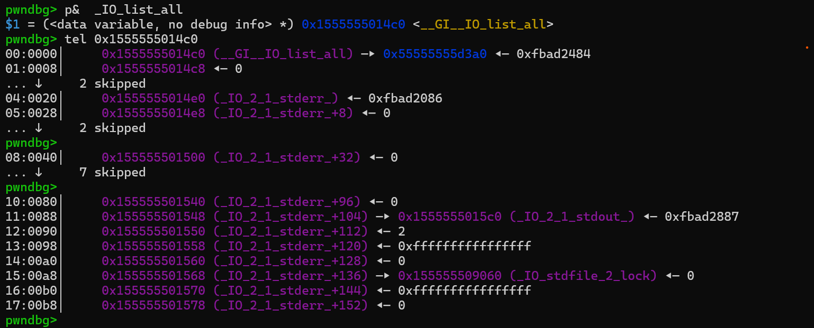

- Khi mà ta chạy chương trình thì File struct của stdin, stdout, stderr sẽ ở trên libc thay vì ở vùng nhớ heap như khi ta mở file bằng `fopen()`

`vtable` là bảng chứa con  trỏ đến các hàm sẽ được các hàm khác như `fwrite`,`fread`,... gọi qua `vtable` mà không gọi trực tiếp

- `FSOP` là viết tắt của `File Stream Oriented Programming` (lập trình hướng luồng tệp)

- Vì nó có thể hướng luồng tệp nên nếu ta có thể thay đổi được các giá trị của file struct, ta có thể khai thác.

## Một số cách khai thác cơ bản

### 1. `Kỹ thuật Arbitrary Read`

- Đây là một kỹ thuật lợi dụng hàm `fread()` để bắt chương trình đọc dữ liệu vào địa chỉ target:

- Đầu tiên chúng ta hiểu cơ bản rằng chương trình gọi hàm `fread()` thì sẽ đọc dữ liệu vào địa chỉ của `read_ptr`:

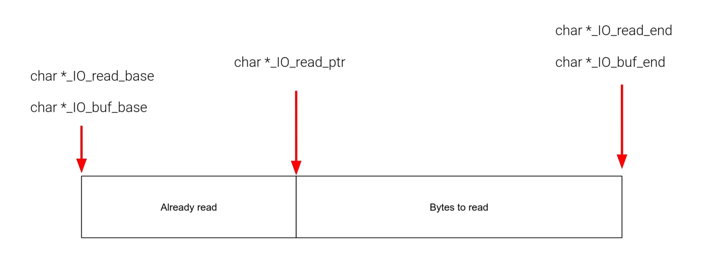

- Khi `read_ptr` = `read_end` tức vùng nhớ này đã đọc hết, chương trình sẽ phân bổ một vùng nhớ mới để đọc tiếp. Như vậy việc đầu tiên trong kĩ thuật này là chúng ta sẽ thay đổi sao cho `read_ptr` = `read_end`:

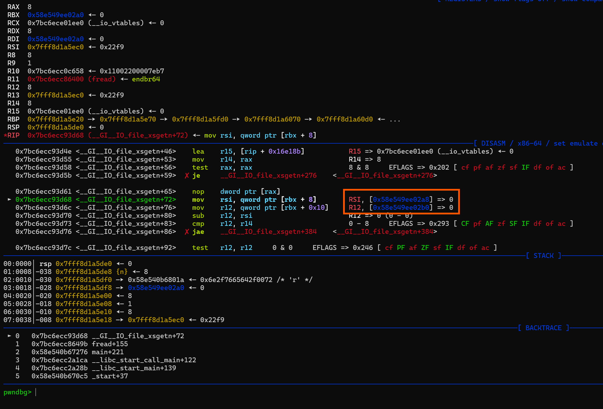

- Như hình trên mình đã cho 2 trường đó đều `= 0` từ đó chương trình sẽ hiểu là "Hết bộ nhớ rồi, cần cấp phát thêm thôi"

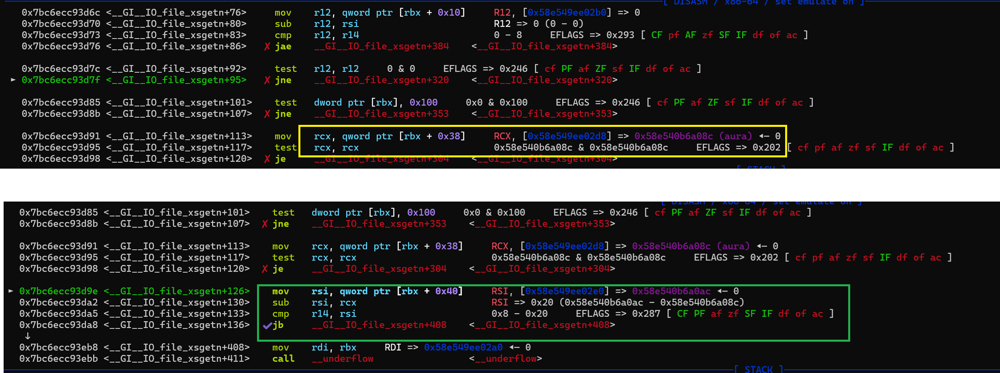

- Vậy nên chương trình lấy địa chỉ từ `buf_base` và `buf_end` rồi trừ cho nhau để xem kích thước có hợp lệ không. 

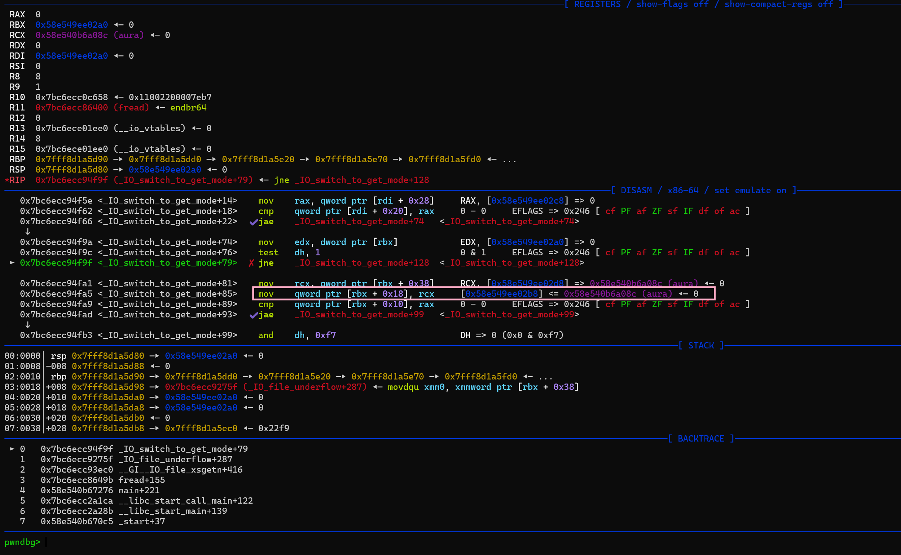

- Sau khi đã kiểm tra hợp lệ, chương trình sẽ gán `read_base` = `buf_base` = `target addr`

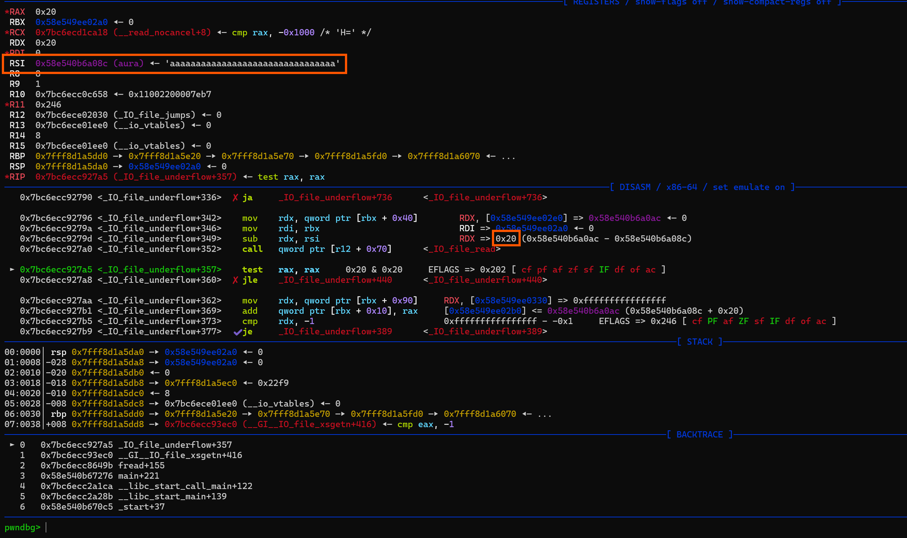

- Rồi hàm sẽ kiểm tra kích thước giữa `buf_base` và `buf_end` 1 lần nữa, sau đó thực thi `_IO_file_read` để đọc dữ liệu vào. Như ví dụ trên ta thấy chương trình đã đọc thành công vào địa chỉ target của chúng ta

- Như bên trên, nếu ta có thể overwrite được file struct, hoàn toàn ta có thể thay đổi địa chỉ tại `buff_base` và `buff_end` thành địa chỉ mà ta muốn.

- Để cho kỹ thuật này thành công thì ta cần thỏa mãn 1 số điều kiện:

    - `Flags` set value cho phép đọc

    - `read_ptr` = `read_end` 
    
    - `buff_end - buff_base` > số byte ta muốn đọc vào.

Ví dụ : [FSOP1](./chall/fsop1/)

### 2. `Kỹ thuật Arbitrary Write`

- Tương tự như trên, ta có thể điểu chỉnh các địa chỉ để chương trình thay vì ghi dữ liệu vào file thì ta có thể ghi ra ngoài màn hình hoặc tệp của chúng ta

- Điều kiện để thành công:

    - Flag cho phép ghi

    - kích thước `buff_end - buff_base` đủ lớn

    - `read_end` = `write_base` trỏ đến dữ liệu mà ta muốn in ra

    -`write_ptr` trỏ đến địa chỉ kết thúc.

### 3. `Bypassing vtable Check`

- Như ta đã biết thì khi thực hiện các hàm như `fread()`, `fwrite()` thì chương trình sẽ gọi các hàm `IO` thông qua `vtable` nên nếu ta thay đổi được địa chỉ của trường vtable trỏ đến `fake_vtable` của ta thì ta sẽ đánh lừa được chương trình thực thi hàm mà ta muốn

- Tuy nhiên ở các phiên bản libc mới, libc kiểm tra các điều kiện nghiêm ngặt hơn,kiểm tra xem địa chỉ `vtable` xem có ở trên vùng `vtable` của libc hay không,`vtable` nằm dưới `_lock` nên ta phải set lại trường `_lock` sao cho thỏa mãn phải là một địa chỉ writeable và có giá trị = 0.:


- Tuy nhiên vẫn có lỗ hổng để ta có thể trỏ đến `_fake_vtable` của ta đó là thay đổi địa chỉ `_wide_data` đến `fake_wide_data` của chúng ta.

- Khi mà chương trình thực thi hàm `_IO_wfile_overflow`, hàm đó sẽ gọi tiếp đến `_IO_wdoallocbuf`, hàm này sẽ sử dụng `wide_data`.Bản chất `wide_data` là một con trỏ tới một cấu trúc khác:

```c
struct _IO_wide_data
{
  wchar_t *_IO_read_ptr;	/* Current read pointer */
  wchar_t *_IO_read_end;	/* End of get area. */
  wchar_t *_IO_read_base;	/* Start of putback+get area. */
  wchar_t *_IO_write_base;	/* Start of put area. */
  wchar_t *_IO_write_ptr;	/* Current put pointer. */
  wchar_t *_IO_write_end;	/* End of put area. */
  wchar_t *_IO_buf_base;	/* Start of reserve area. */
  wchar_t *_IO_buf_end;		/* End of reserve area. */
  /* The following fields are used to support backing up and undo. */
  wchar_t *_IO_save_base;	/* Pointer to start of non-current get area. */
  wchar_t *_IO_backup_base;	/* Pointer to first valid character of
				   backup area */
  wchar_t *_IO_save_end;	/* Pointer to end of non-current get area. */

  __mbstate_t _IO_state;
  __mbstate_t _IO_last_state;
  struct _IO_codecvt _codecvt;

  wchar_t _shortbuf[1];

  const struct _IO_jump_t *_wide_vtable;
};


```
 Như ta thấy thì struct này cũng chứa một con trỏ `vtable` của riêng nó. Vậy nên nếu ta thay đổi thành `fake_wide_data` của ta rồi từ đó kiểm soát `vtable` => hàm `_IO_wdoallocbuf` sẽ lấy `vtable` từ struct đó gọi hàm mà không kiểm tra bảo mật

 - Vậy để thực hiện được hàm `_IO_wfile_overflow` thì ta sẽ thay đổi vtable thành địa chỉ của `_IO_wfile_jumps` để khi chương trình nảy tới `r15 + 0x38` thì sẽ nhảy vào hàm `_IO_wfile_xsputn`:

 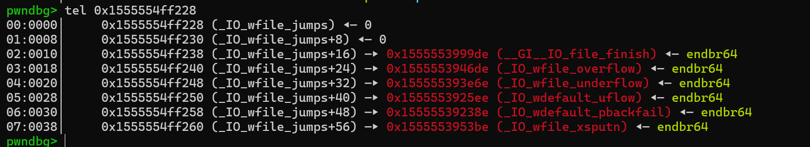

- Từ đó gọi được `_IO_wfile_overflow` -> `_IO_wdoallocbuf` -> lấy con trỏ `_fake_wide_data` và lấy `fake_vtable` trong đó. Từ đó sẽ gọi hàm trong `vtable` đó.

Giải thích chi tiết hơn trong bài: [FSOP2](./chall/fsop2/)

### 4. `House of Pig` (`2.31` <= `glibc` <`2.34`)

- Kĩ thuật này áp dụng khi chúng ta có bug như `uaf` hay lỗi khác nhưng không thể sử dụng `tcache poisioning` để overwrite `__free_hook` như chương trình chỉ dùng hàm `calloc()`

- Khi đó `calloc()` sẽ bỏ qua `tcache bins` vậy nên chúng ta sẽ không `malloc` được `target chunk` trỏ đến `__free_hook` để overwrite.

**Vậy để thực hiện được kĩ thuật này,ta cần các kĩ thuật sau**:

- `Tcache Stashing Unlink Attack (TSUA)`: Lý do cần sử dụng đến kĩ thuật này bởi vì, khi `calloc()` chương trình sẽ lấy chunk có kích thước đó từ `small bin`, khi ngăn xếp của size đó có nhiều chunk khác, chương trình sẽ nghĩ rằng: (à chắc là chunk có kích thước này sẽ được sử dụng tiếp trong chương trình), vậy nên nó `stashing` các chunk còn lại và đưa vào `tcache bins`

  - => Kĩ thuật này sẽ giúp ta đưa target chunk vào `tcache bins`

- `Large Bin Attack`: Bởi vì từ `glibc 2.29`, libc đã thêm kiểm tra điều kiện `bck->fd != victim` khi thực hiện unlink small bin.

  - => Kĩ thuật này để có thể ghi được offset của heap đến trước địa chỉ target và vượt qua được điều kiện kiểm tra

- Control được `_IO_FILE`: Đây là phần quan trọng nhất để các kỹ thuật trên có ý nghĩa. 

#### Detail

- Vì chúng ta đang tập trung vào `FSOP` nên các kĩ thuật còn lại các bạn có thể đọc ở đây và tìm hiểu thêm

[Tcache Stashing Unlink Attack](https://github.com/shellphish/how2heap/blob/master/glibc_2.33/tcache_stashing_unlink_attack.c)

[Large Bin Attack](https://github.com/shellphish/how2heap/blob/master/glibc_2.33/large_bin_attack.c)
  
- **Bước đầu tiên** chúng ta sẽ dùng kĩ thuật `Large Bin Attack` để có thể ghi vào biến `_IO_list_all` (là một biến nằm trong libc lưu các địa chỉ trỏ đến các File Struct) thành địa chỉ heap ta có thể control được. Từ đó ta có thể tạo fake File Struct của chúng ta

- Như ta đã biết ở kĩ thuật `FSOP` trước, các phiên bản libc hiện đại sẽ kiểm tra liệu địa chỉ `vtable` có nằm trong `vtable libc` hay không. Vậy nên ý tưởng ở đây là chúng ta sẽ thay đổi địa chỉ `vtable` thành `_IO_str_jumps` hoặc đôi khi là `__io_vtables` để có thể trigger chương trình gọi hàm `_IO_str_overflow` :

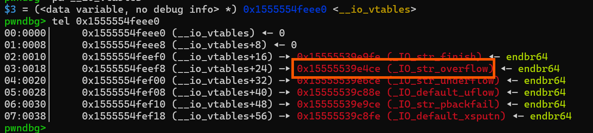

Okay, trước tiên chúng ta hãy tìm hiểu làm cách nào để chương trình sẽ gọi đến địa chỉ `vtable + 0x18` để có thể kích hoạt được.

- Khi chương trình sử dụng hàm `exit()` hoặc bị `crashes` do gặp lỗi thì nó sẽ sử dụng chung một hàm để có thể flush các file streams. Ví dụ trong hàm `exit()`:

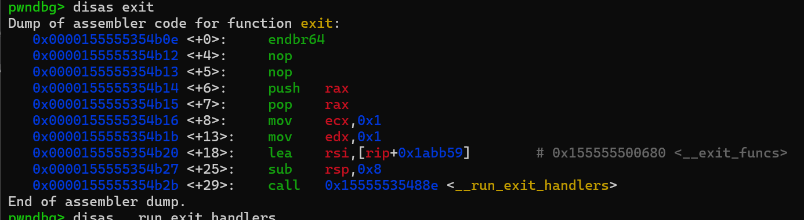

- Trong hàm `exit()` sẽ gọi `__run_exit_handlers`

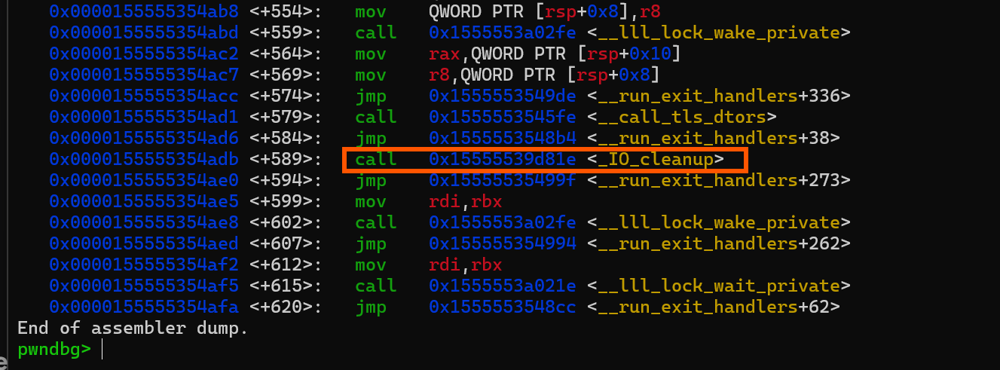

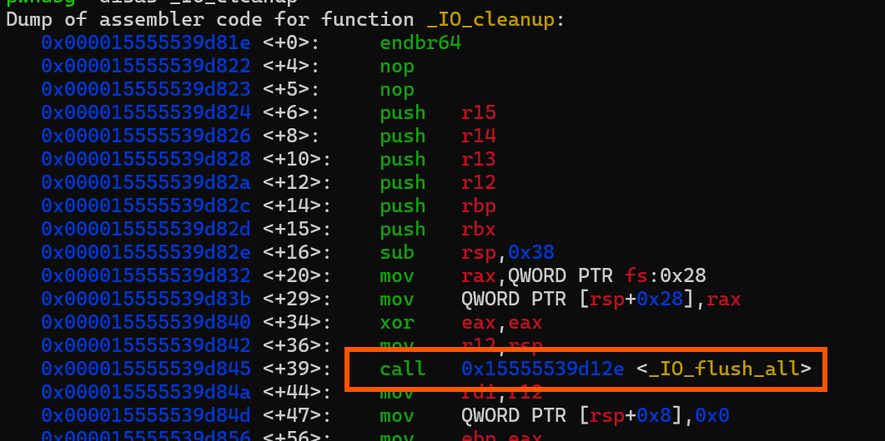

- Hàm này lại gọi `IO_cleanup` để dọn dẹp và nó lại gọi hàm `IO_flush_all`

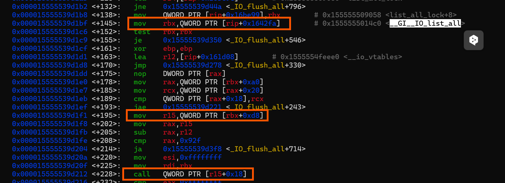

- Trong hàm `IO_flush_all`, chương trình sẽ lấy địa chỉ `IO_FILE` tại `IO_list_all`. Từ địa chỉ `IO_FILE` đó, nó sẽ lấy vtable và run hàm tại `vtable + 0x18` => call `_IO_str_overflow`

Okay, bây giờ chúng ta hãy xem trong hàm `_IO_str_overflow` có gì để chúng ta khai thác nó

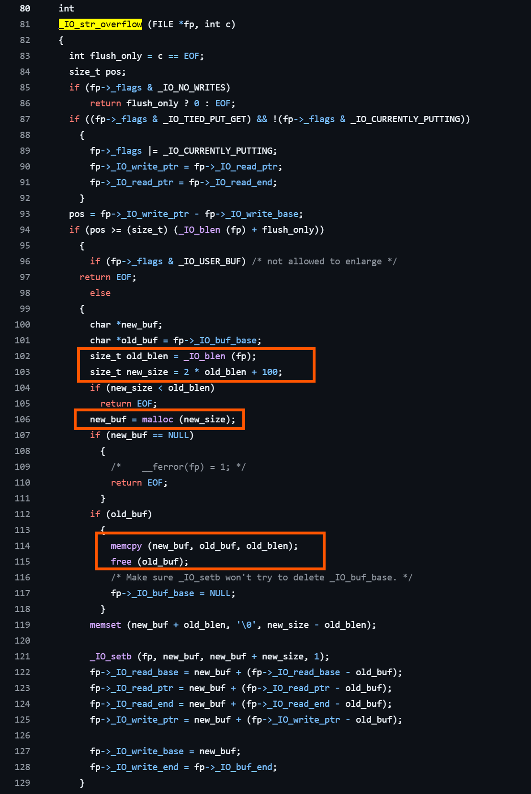

- Ồ, đập ngay vào mắt chúng ta là hàm `malloc()` => Ta hoàn toàn có thể malloc được `target address` ở trong `tcache bin`. => chúng ta cần làm cho kích thước phù hợp

- Đến với cách tính kích thước:

  - `old_blen = fp->_IO_buf_end - fp->_IO_buf_base;`
  - `new_size = 2 * old_blen + 100;`

- Vì ta có thể điều kiển được `buf_end` và `buf_base`, vậy nên hoàn toàn ta có thể điều khiển được `new_size` và malloc được chunk mà ta cần.

- Sau đó chương trình copy từ `old_buf -> new_buf`. Lúc này `old_buf` là địa chỉ mà ta có thể kiểm soát. còn `new_buf` là target address. Ở đây để có thể tạo được shell, chúng ta sẽ ghi vào từ `__free_hook - 0x10`. Như vậy chuỗi ở `old_buf` copy sang sẽ là:
`b'/bin/sh\0'` + `p64(0)` + `p64(libc.sym['system'])`

- Như vậy `_free_hook` sẽ chứa địa chỉ hàm `system()`

- Và khi `free(old_buf)` => chương trình sẽ thực thi lệnh `system("/bin/sh")`

### 5. `House of Emma`

- Kỹ thuật này có thể áp dụng cho các glibc phiên bản mới nhất.
- Để kích hoạt thì cũng tương tự như kĩ thuật trước, đó là thực thi hàm `exit()` hoặc gây lỗi như thông qua `malloc_printerr`. 

- Chúng ta cũng sẽ dùng `Large Bin Attack` để thay đổi `IO_list_all` đến chunk ta control được. Từ đó khi kích hoạt chương trình sẽ gọi hàm tại `vtable + 0x18`.

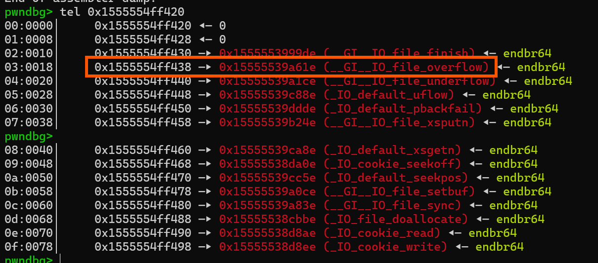

- Ở chương trình mẫu này của mình không hiện địa chỉ đầu nhưng ở đây là `_IO_cookie_jumps`. Phần này có một struct riêng:

```c
struct _IO_cookie_file {
    struct _IO_FILE_plus __fp;              // The standard FILE header (0x00 - 0xe0)
    void *__cookie;                         // A custom argument (0xe0)
    cookie_io_functions_t __io_functions;   // The custom functions! (0xe8)
};

struct {
    ...
    cookie_read_function_t *read;     // 0xe8
    cookie_write_function_t *write;   // 0xf0
    cookie_seek_function_t *seek;     // 0xf8
    cookie_close_function_t *close;   // 0x100
} cookie_io_functions_t;

```


Vậy sau khi gọi hàm `__GI__IO_file_overflow` thì chương trình sẽ làm gì?

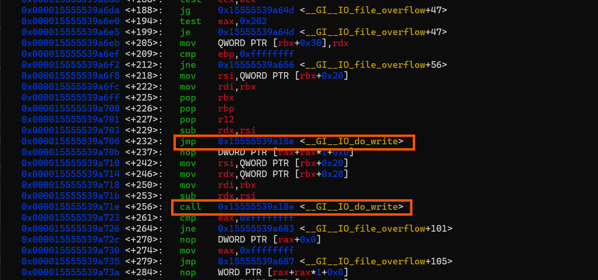

- Để ý ở đây chương trình sẽ gọi hàm `do_write`

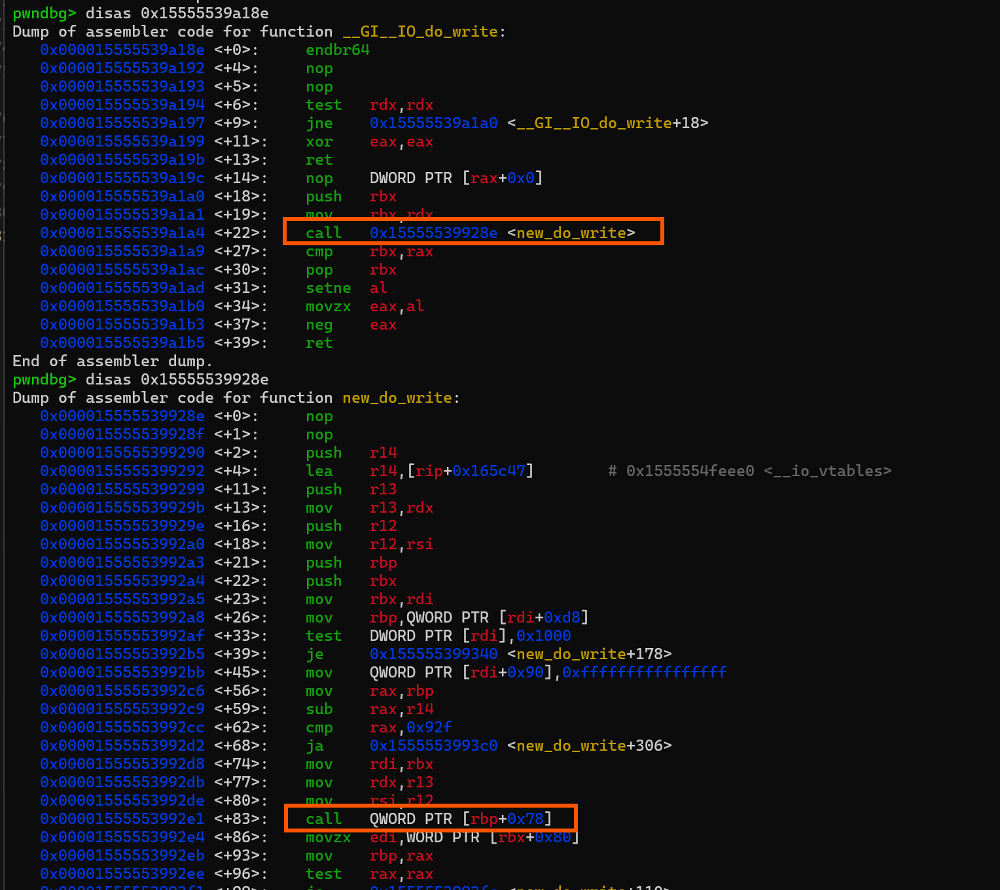

Cuối cùng dẫn tới gọi hàm `vtable + 0x78` đó chính là:

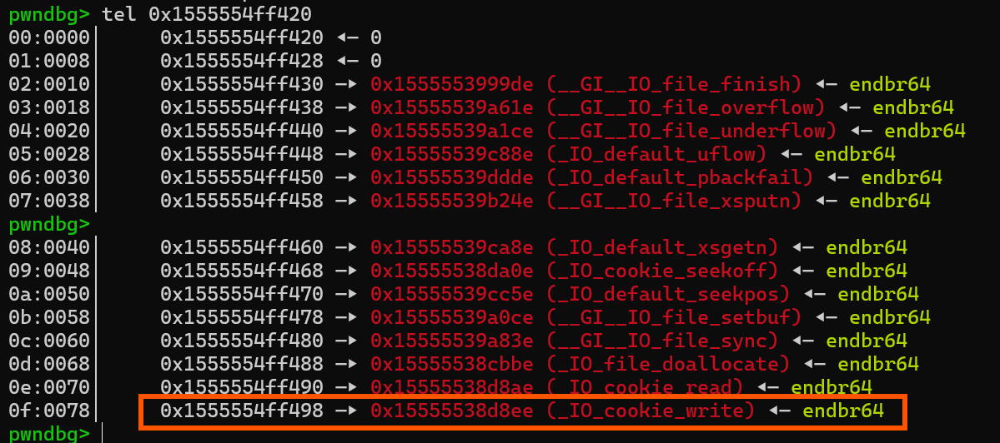

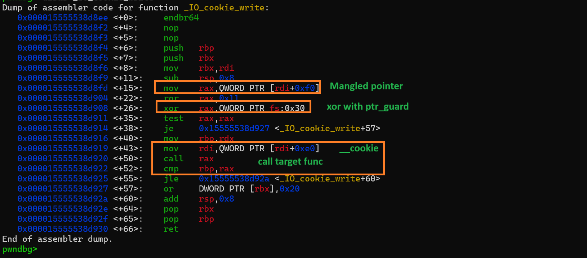

```
_IO_cookie_write
cookie_write_function_t *write_cb = cfile->__io_functions.write;
PTR_DEMANGLE(write_cb);  // <--- THE PROTECTION
write_cb(cfile->__cookie, buf, size);

```

Ở hàm này, chương trình sẽ lấy địa chỉ của `__io_functions` trong struct `_IO_cookie_file`, sau đó decrypt thông qua việc `ror 0x11`; `xor ptr_guard`. Sau khi decrypt thì sẽ thực thi hàm đó với rdi là trường `__cookie` trong struct.

- Vậy nếu ta overwrite được `ptr_guard` ta sẽ biết trước được giá trị `xor` là gì => có thể biết được địa chỉ `system()` khi encrypt là gì.

Vậy để thực hiện kĩ thuật này cần các bước sau đây:

- `Large Bin Attack`: overwrite `pointer_guard`; `_IO_list_all` để địa chỉ `vtable` là `_IO_cookie_jumps`

- Tính toán địa chỉ sau khi đã encrypt: Vì glibc dùng `ror` vậy nên để đảo ngược lại ta sẽ dùng `rol`(rotate left):

```python
def ror(val, shift, bits=64):
    return ((val >> shift) | (val << (bits - shift))) & ((1 << bits) - 1)

def rol(val, shift, bits=64):
    return ((val << shift) | (val >> (bits - shift))) & ((1 << bits) - 1)

pointer_guard = Heap_Address 
mangled_system = rol(system_address ^ pointer_guard, 0x11)

```


- Tạo một struct `_IO_cookie_file` giả với `__cookie` là địa chỉ của chuỗi `/bin/sh\0` (vì tại hàm `_IO_cookie_write` bên trên, chương trình set `rdi =  [__cookie]`  ) ; `*write` trong `__io_functions` thành địa chỉ hàm `system()` đã encrypt. Như vậy khi decrypt ra thì chương trình sẽ gọi `system("/bin/sh")`

