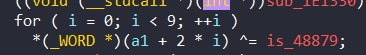

## Anti-Debug

Đề bài cho chúng ta 1 file antidebug_3.exe

### DIE

Mở file bằng DIE thì chúng ta biết được đây là file 32 bit


### IDA

Khi biết được đó là file 32 bit thì ta mở file bằng Ida 32 bit.


#### Overview


Nhìn qua hàm main mình thấy có hàm [SetUnhandledExeptionFilter](https://learn.microsoft.com/en-us/windows/win32/api/errhandlingapi/nf-errhandlingapi-setunhandledexceptionfilter) thì đây là hàm xử lý các Unhandled expeption. Tức là sau khi gọi hàm này, nếu có lỗi xảy ra trong chương trình thì chương trình sẽ chạy vào hàm `TopLevelExceptionFilter`. Ta cũng có thể dùng hàm này để anti-debug

Giờ chúng ta thử chạy chương trình bằng debugger mà không đặt breakpoint xem sao:


Ida báo lỗi chia cho 0. Mà trong hàm main chỉ có một dòng sử dụng phép chia:


Như vậy giá trị tại `[ebp+var_4]` = 0. Nhìn những dòng code bên trên khi tính toán giá trị tại `[ebp+var_4]` thì mình nhận thấy rằng chương trình cố tình gây ra lỗi chia 0 để chạy vào hàm `TopLevelExceptionFilter`.

#### Detail

Vì khi debug đến dòng chia cho `[ebp+var_4]` khi ta tiếp tục chương trình thì sẽ báo lỗi chia 0. Vậy nên để debugger chạy được vào hàm `TopLevelExceptionFilter`
ta phải set địa chỉ của thanh ghi EIP (Extended Instruction Pointer ) trở thành địa chỉ của hàm `TopLevelExceptionFilter`. Có 2 cách để set ip cho thanh ghi EIP trong ida

- **Cách 1**: Nhấn đúp vào thanh ghi EIP trên cửa sổ `General registers` rồi thay đổi giá trị của thanh ghi


- **Cách 2**: Cài file `IDA_InitTool.exe` mới có chức năng này. Chúng ta sẽ nhấn vào phần **Set IP** khi ấn chuột phải vào dòng muốn Set IP. (Lưu ý, không ấn **Ctrl + N** để set ip vì lúc này ida sẽ ưu tiên chắc năng patch lệnh `nop` vào dòng đó)


Khi nhấn vào hàm `TopLevelExceptionFilter` thì ta thấy có nhiều byte mà ida không chuyển đổi thành code được:


Và ở bên trên có lệnh gọi hàm thì mình ấn thử vào địa chỉ nhưng không hợp lệ nên mình đoán đây là code lỗi. 


Mình còn thấy bên trên có lệnh jump đến địa chỉ có byte lẻ: 


Kết hợp 3 dữ kiện trên thì mình thấy rằng chương trình đã nhét thêm byte vào để ida không detect được. Vậy nên mình ấn "**U**" để undefine từ hàm call:


Ta có thể thấy sau khi undefine thì lệnh jump đã có địa chỉ chính xác. Vậy chương trình đã thêm byte `E8` vào. Để make code thì mình ấn "**C**":


Sau đó, mình patch chương trình để biến byte `E8` thành `90`(nop). Có 2 cách:
 
 - **Cách 1**: Ấn vào "Edit" ở góc bên trái ida -> "Keypatch" -> "Patcher". Sau khi patch thì phải Apply patch.

 - **Cách 2**: Cài file `IDA_InitTool.exe` mới có chức năng này. Ta nhấn chuột phải vào dòng muốn patch -> "Keypatch" -> "Patcher". Sau khi patch thì phải Apply patch. 

Sau khi patch xong thì ta make code dòng đó.

Bên dưới ta thấy có byte `88` chưa được make code và lệnh or bên dưới có chỉ tới byte tại địa chỉ 84083(không có). => Dòng code đó bị lỗi. 
 


Để xử lý lỗi này, mình undefine từ dòng chứa lệnh or đó và make code từ byte `88`


Do ida gặp sự cố trong vấn đề make code nên chưa make fuction cho hàm `TopLevelExceptionFilter` vậy nên ta trỏ vào dòng lệnh đầu tiên của hàm và ấn "**P**" để make funtion:


Sau khi make funtion ta có thể ấn "**F5**" để xem mã giả C:


Ở dòng code đầu tiên này, chương trình gọi hàm `NtCurrentPeb()` để lấy địa chỉ của PEB


Đến câu lệnh tiếp theo, biến v4 được tính toán bằng cách sử dụng `AND` 2 vế. 


Mình ấn tab để nhìn sang bên asm để xem chi tiết hơn:


Mình thấy có `fs:30` là lấy địa chỉ PEB, sau đó sử dụng lệnh `mov` để cuối cùng `ecx` chứa giá trị là địa chỉ của PEB, Sau đó lấy `ecx` cộng với `0BFC0h` rồi mov vào `[ebp+var_8]`.Vậy nên `[ebp+var_8]` != 0. 


Lệnh `jz` thực hiện khi `[ebp+var_8]` = 0.Vậy ta suy ra được rằng chương trình cố tình để cho `[ebp+var_8]` != 0 để không nhảy đến `locB14FF:` mà chạy tiếp ở bên dưới.


Lúc này mình nhìn thấy `70h`, thì nghĩ rằng chương trình truy xuất thông tin trong peb và `AND` với `70h`. Mình lên google tìm thử thì có 1 cách Antidebug mà `AND` với `70h` là bằng cách sử dụng `NtGlobalFlag`. Tuy nhiên mình không hiểu lấy địa chỉ đầu của PEB + `0BFC0h` để trích xuất thông tin gì nữa.


Nhìn sang code C thì mình thấy nếu lệnh `jz` không được thực hiện thì `v4` sẽ nhận giá trị là 1. Và khi `XOR` với 0xCD thì kết quả sẽ là 0xCC. Mà 0xCC lại là opcode để phá hiện software breakpoint nên mình càng chắc rằng phép `AND` trên để check rằng có đang bị debug hay không.

Vậy flow đúng là chương trình sẽ nhảy vào `loc_B14FF:` nên mình sẽ nop 2 lệnh này để chương trình chạy đúng flow:


Sau khi nop thì mình v4 = 0


Để cho dễ dàng hơn trong việc debug thì mình đổi tên `byte_1E4083` thành `is_0xCD` bằng cách ấn "**N**". Ở dòng dưới là giá trị ở trường BeingDebugged(Check xem process có đang bị debug hay không) nên bình thường chương trình không debug thì giá trị của trường này = 0 => mình đổi tên `byte_1E4082` thành `is_0xAB`


Khi mình ấn vào 2 hàm sub này thì có chứa `_acrt_iob_func(1u)` và `_acrt_iob_func(0)` lần lượt tương ứng với `printf` và `scanf` nên mình thay tên 2 hàm đó cho dễ nhìn.


Hàm `memcpy` này sao chép 100 kí tự từ string mình vừa nhập lưu từ giá trị tại địa chỉ `&unk_1E4560`. Dòng lệnh bên dưới có hàm `sub_1E1400()` nên mình ấn vào để xem:


Nhìn qua hàm mình thấy xor với 0x55  != 153 tức là hàm này check xem chương trình có bị debug hay không. Ở dòng return mình thấy v1-i +48879 mà nếu chương trình không bị debug thì chương trình sẽ chạy hết vòng lặp tức v1  = i => Theo flow chương trình không bị debug thì hàm này trả về giá trị 48879 nên mình patch lại chương trình cho kết quả ra như vậy:


Hàm for này là lấy 17 kí tự đầu từ input string rồi xor với 1. Dòng lệnh tiếp theo gọi hàm `sub_1E1460`. với đầu vào lạ quá nên mình ấn thử vào xem sao:


khi ấn vào thì mình thấy có 17 dấu hỏi bên trên nên mình nghĩ `&unk_1E4652` là giá trị của kí tự thứ 18 của input string. Mình ấn vào xem hàm `sub_1E1460`:


Lúc này a1 là con trỏ tro tới giá trị của kí tự thứ 18. Mà mình thấy dòng 3 có `stdcall`, `(&a1)` là giá trị truyên vào nên đây có lẽ là 1 hàm. Mình ấn vào `loc_1E1330`:


Lại thấy code bị lỗi,lệnh jz nhảy đến 1E133A + 2, nên mình ấn "**U**" để undefine xong ấn "**C**" để make code, rồi cuối cùng ấn "**P**" để make funtion và nop byte được chèn vào. Kết quả sẽ ra như này:


Hàm này chỉ đơn giản là mã hóa các kí tự mình nhập vào từ kí tự 18 đến kí tự thứ 38



Vòng lặp for này cũng chỉ sử dụng `XOR` để mã hóa 18 kí tự tiếp theo (vì mỗi lần lặp lấy ra 1 word tức là 2 kí tự)

Sau khi ấn vào hàm `sub_1E11D0` và xem bằng chế độ graph(ấn nút "**Space**" khi chọn vào cửa sổ IDA View):


Quan sát thì mình thấy chương trình hàm này có `int 2Dh`(Khi chương trình chạy đến đây thì sẽ gặp lỗi và chạy vào hàm xử lý ngoại lệ ) tức là flow của chương trình sẽ nhảy đến `loc_1E1269`


Theo flow của chương trình đến đây thì lại có `int3` (cũng tương tự như int2D) nên flow của chương trình là nhảy đến `loc_1E12E1`

Sau khi đổi màu nền theo đúng flow chương trình khi không bị debug và nop những câu lệnh đằng sau int2d và int3 đi thì ta sẽ ra được kết quả như này :


Màu đỏ là những câu lệnh khi chạy hết vòng lặp thì chương trình sẽ nhảy đến đó.


Sau khi tìm hiểu thì đây là vòng lặp for xử lý 5 kí tự từ 59 đến 63.


Sau khi kết thúc vòng lặp for,vì ecx là dword nên chương trình mov giá trị từ kí tự thứ 65->69 vào ecx, rồi dùng phép `XOR` để mã hóa.


Lệnh call này gọi hàm `sub_1E1190` với đầu vào là địa chỉ của kí tự thứ 70. Hàm `sub_1E1190`:


Hàm này dùng vòng lặp for để mã hóa 30 kí tự cuối cùng.

Bên dưới lệnh gọi hàm `sub_1E1190` thì chương trình gọi hàm `sub_1E1100`:


 
Hàm này so sánh string của mình nhập vào (đã mã hóa) với string cho trước. Nếu đúng thì in ra flag. Vậy để xem string cho trước thì ta ấn đúp vào `byte_1E4118[i]`:


Để lấy được 100 byte này ra để code script reverse thì mình bôi đen những dòng cần lấy xong ấn nút "**Shift + E**" rồi copy trong cử sổ Preview:


Sau khi đã lấy đước string cho trước thì mình viết 1 script python để tìm ra được flag:

```Python
cipher = [  0x74, 0x6F, 0x69, 0x35, 0x4F, 0x65, 0x6D, 0x32, 0x32, 0x79, 
  0x42, 0x32, 0x71, 0x55, 0x68, 0x31, 0x6F, 0x5F, 0xDB, 0xCE, 
  0xC9, 0xEF, 0xCE, 0xC9, 0xFE, 0x92, 0x5F, 0x10, 0x27, 0xBC, 
  0x09, 0x0E, 0x17, 0xBA, 0x4D, 0x18, 0x0F, 0xBE, 0xAB, 0x5F, 
  0x9C, 0x8E, 0xA9, 0x89, 0x98, 0x8A, 0x9D, 0x8D, 0xD7, 0xCC, 
  0xDC, 0x8A, 0xA4, 0xCE, 0xDF, 0x8F, 0x81, 0x89, 0x5F, 0x69, 
  0x37, 0x1D, 0x46, 0x46, 0x5F, 0x5E, 0x7D, 0x8A, 0xF3, 0x5F, 
  0x59, 0x01, 0x57, 0x67, 0x06, 0x41, 0x78, 0x01, 0x65, 0x2D, 
  0x7B, 0x0E, 0x57, 0x03, 0x68, 0x5D, 0x07, 0x69, 0x23, 0x55, 
  0x37, 0x60, 0x14, 0x7E, 0x1D, 0x2F, 0x62, 0x5F, 0x62, 0x5F
]

for i in range(17):
    cipher[i] ^= 1 
    print(chr(cipher[i]),end="")

print(chr(cipher[17]),end="")

for i in range(18,26):
    cipher[i] ^= 0xAB
    print(chr(cipher[i]),end="")
print(chr(cipher[26]),end="")
for i in range(27,39):
    a = i + 0xCD
    a -= 27
    cipher[i] ^= a
    cipher[i] |= 1
    cipher[i] //= 2
    print(chr(cipher[i]),end="")
print(chr(cipher[39]),end="")

for i in range (40,57,2):
    cipher[i] ^= 0xEF
    cipher[i+1] ^= 0xBE
    print(chr(cipher[i])+chr(cipher[i+1]),end="")
print(chr(cipher[58]),end="")


for i in range (59,64):
    a = cipher[i] << (i-59)&0xff
    b = cipher[i] >> (8-(i-59)) &0xff
    cipher[i] =  a | b
    print(chr(cipher[i]),end="")   
print(chr(cipher[64]),end="")

cipher[65] ^= 0x37 
cipher[66] ^= 0x13
cipher[67] ^= 0xFE
cipher[68] ^= 0xC0
for i in range(65,70):
  print(chr(cipher[i]),end="")

for i in range(99,70,-1):
  cipher[i] ^= cipher[i-1]
   
for i in range (70,100):
   print(chr(cipher[i]),end="")
```

Và khi chạy thì ta có được input string:
`unh4Ndl33xC3pTi0n_pebDebU9_nt9lob4Lfl49_s0F7w4r38r34Kp01n7_int2d_int3_YXV0aG9ydHVuYTk5ZnJvbWtjc2M===`

Chạy file và nhập flag ta được:


**Flag:** kcsc{unh4Ndl33xC3pTi0n_pebDebU9_nt9lob4Lfl49_s0F7w4r38r34Kp01n7_int2d_int3_YXV0aG9ydHVuYTk5ZnJvbWtjc2M===}