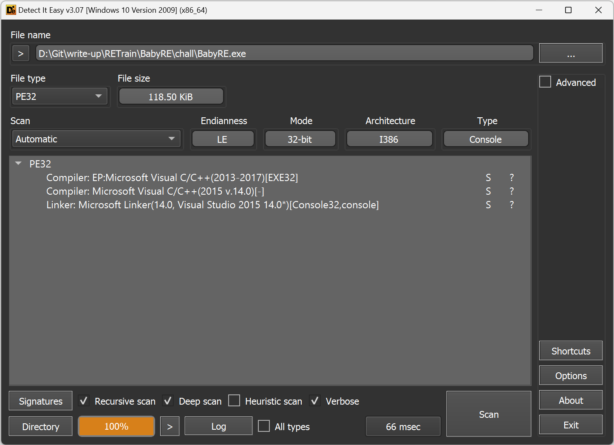
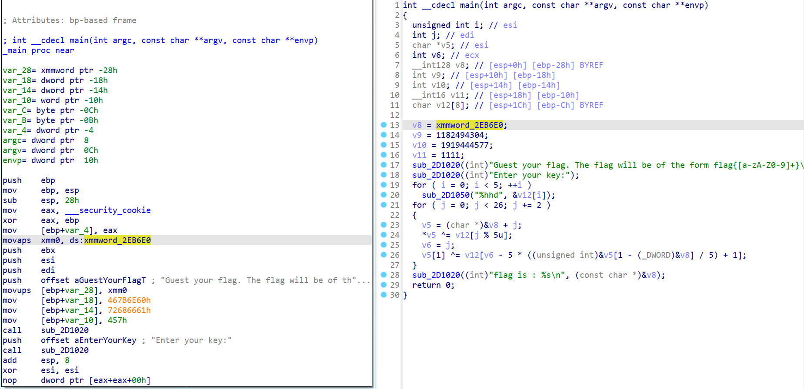
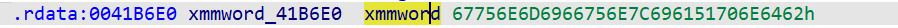
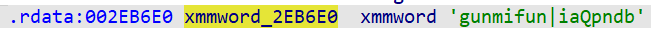
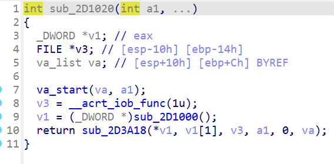
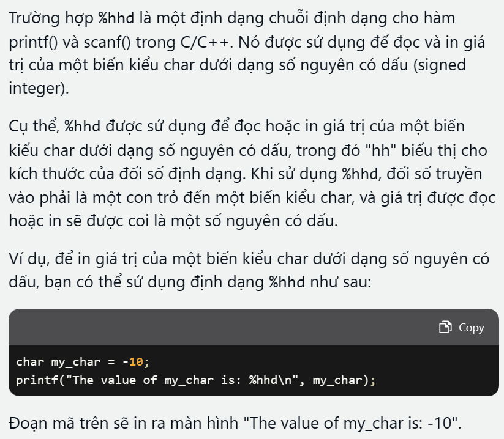
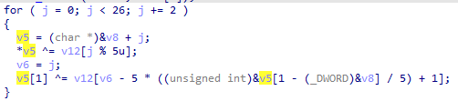
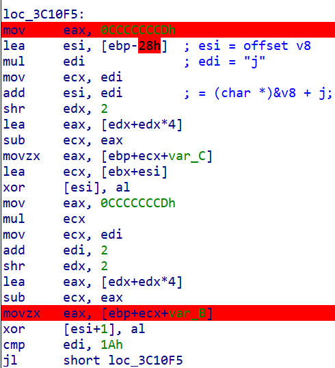
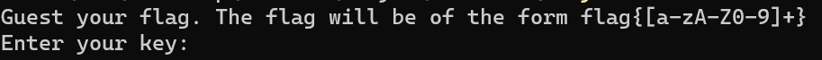
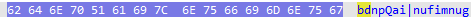

# BabyRE

## DIE

Đề bài cho ta file PE32 được code bằng C/C++:

## IDA32

Load chương trình vào ida, bắt đầu từ hàm main:

Đầu tiên, ở dòng 13 `v8 = xmmword_41B6E0` tức là biến xmmword_41B6E0 được truyền vào thanh ghi xmm0 128bit rồi sau đó truyền vào v8. Còn **"41B6E0"** là offset của v8

Ấn vào dòng đó thì chúng ta có thể xem được giá trị của v8:

Thấy giá trị theo các byte như `67, 75, 6E,...` ta thấy các giá trị không quá **7F** nên đây có thể là các kí tự. Mình ấn `R` trong ida để hiển thị giá trị theo kiểu char:

Nhìn vào mã giả C thì không thấy dùng biến `v9`,`v10`,`v11` nên chúng ta tạm thời bỏ qua 3 dòng tiếp theo. Ở dòng 17,18, có `sub_2D1020` thì mình thử ấn vào xem nó là gì:

Tương tự như trên thì `sub_2D1050` là `__acrt_iob_func(0)` nghĩa là `stdin`. 

Sau khi hỏi Chat GPT thì ra được kết quả như này. Giải thích dễ hiểu hơn thì khi dùng định dạng %hhd thì khi ta nhập số `0` thì chương trình sẽ lưu vào bộ nhớ là `0` thay vì `0x30h`. Vậy chốt lại thì vòng lặp for này bắt chúng ta nhập 5 lần số nguyên và lưu giá trị vào địa chỉ của biến `v12`

`v5` được gán giá trị tại địa chỉ của (`v8`) + `j`. Rồi sau đó `v5` = `v5` XOR mảng v12(mảng lưu kí tự đã nhập), `j % 5u` là để lấy phần tử từ 0 đến 4.

Thấy dòng 26 biểu thức loằng ngoằng quá nên chuyển sang bên masm xem thế nào

Đây là vòng lặp for dùng XOR để mã hóa kí tự nhập vào. Sau khi đọc đoạn này xong thì biểu thức loằng ngoằng kia chỉ là sử dụng phép toán XOR giữa từng kí tự của chuỗi v8 với các kí tự chúng ta nhập vào trong mảng v12. Vậy nên để tìm ra chính xác 5 số cần nhập vào thì chúng ta chỉ cần lấy kết quả XOR với chuỗi v8 là được

Khi chạy chương trình thì thấy flag có form như trên, nhận thấy 5 kí tự đầu là `f`, `l` , `a`, `g`, `{` nên mình sẽ lấy 5 kí tự đó XOR với 5 kí tự của `v8` 

vì khi lưu vào memory thì do là little edian nên sẽ lấy ngược lại khi đó ta có

`f` XOR `b` = 4
`l` XOR `d` = 8
`a` XOR `n` = 15
`g` XOR `p` = 23
`{` XOR `Q` = 42
Ta cùng nhập thử vào chương trình xem sao

FLAG:  flag{easy_baby_challenge}
