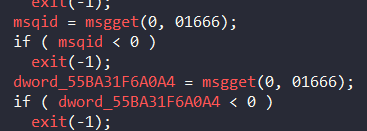
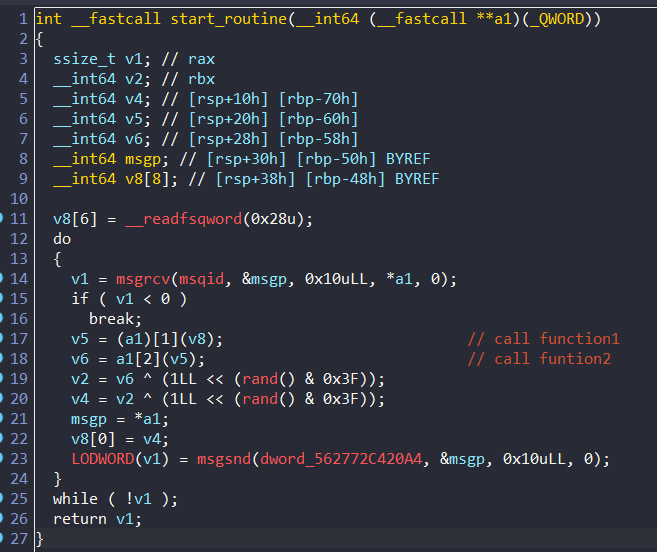

## Everlasting_Message

### Intro

Đề bài cho ta 2 file:  và [messages](./chall/messages) là file elf và [flag_enc](./chall/flag_enc) là file binary. 

Dựa vào tên file thì ta có thể đoán rằng có 1 file được encrypt bằng file `messages` rồi xuất ra file `flag_enc`.

Vì file `flag_enc` có kích thước hơn 200 MB nên có thể file ban đầu là 1 file `png` hoặc `mp4` chứ không đơn thuần là file `txt`

### Overview

Ta sẽ bắt tay phân tích file `messages` trong ida:

#### Main function

Đầu tiên hương trình mở 2 file được lấy tên từ `agrv1` và `agrv2`.

```c
int open(const char *pathname, int flags, mode_t mode);
```
##### Open() 

Tham số `flags` = `0` => `O_RDONLY` có thể đây là file `flag input`. Vì file readonly nên giá trị thứ 3 là mode nên ta có thể bỏ qua.


`flags` = `66` => `O_CREAT | O_RDWR` 

- O_CREAT (64): Tạo tệp tin nếu nó không tồn tại.

- O_RDWR (2): Mở tệp tin để đọc và ghi.

`mode` = `420` = `0644` trong octal

- Chủ sở hữu có quyền đọc và ghi (rw- = 6).

- Nhóm có quyền đọc (r-- = 4).

- Người dùng khác có quyền đọc (r-- = 4).

=> Rất có thể đây là `flag_enc`


##### Msgget()

Chương trình dùng hàm 2 `msgget` để lấy id với quyền `read`, `write` cho tất cả user của 2 hàng đợi tin nhắn khác nhau



##### pthread_create()

Vòng lặp for này tạo 4 thread. 

- `ThreadIds[]`: Lưu id của 4 thread

- `start_routine`: Hàm này sẽ được thực thi bởi những thread mới.

- `&unk_55BA31F6A020 + 24 * i`: Đây là tham số được truyền vào hàm `start_routine`


##### read()

Hàm đọc `0x500` byte từ file input và lưu vào biến `buf` và trả về số byte thực tế đọc được.

Hàm if check byte đọc vào có phải là bội số của 10 hay không. Nếu không thì bù vào để tổng số byte trở thành bội số của 10.

Có thể mục đích của hàm này để bảo toàn tính đúng đắn của các hàm xử lý khác


##### do-while()

Vậy vòng lặp này đọc lần lượt `0x500` byte từ file input lưu vào `buf` và bù byte vào nếu thiếu. Sau đó dùng vòng lặp `while` để gửi lần lượt 0x10 byte sang các thread khác và rồi viết 5 byte được trả về từ các thread vào file mới. Nhưng tại sao gửi đi 0x10 byte mà mỗi lần lặp `v12` lại chỉ tăng thêm 10 byte ???


Chúng ta cùng đi phân tích hàm xử lý của thread để xem tại sao.

#### start_routine()

Đây là hàm sẽ được thực thi bởi các thread:



Ta thấy ngay đầu vòng lặp `do-while` là hàm `msgrcv` nhận tin nhắn và lưu tại `&msgp` mà sau đó lại gọi hàm `(a1)[1]` với đầu vào `v8`. Thấy `msgp` và `v8[8]` được declare gần nhau nên mình nghĩ đây có thể do ida detect sai nên minh đã declare lại:


Để biết được `a1[1]` và `a1[2]` là hàm xử lý như nào, ta đi xem tham số được truyền vào hàm là `&unk_562772C42020 + 24 * i`. Kiểm tra địa chỉ `unk_562772C42020` thì ta thấy được rằng mỗi thread sẽ xử lý 2 hàm `filtering_function` và `processing_function` khác nhau


Nhấn vào 4 hàm `filtering_function` ta đều thấy các hàm chỉ lấy ra lần lượt 5 phần tử`(0xXXXXX)`.


Ta có thể thấy các hàm `processing_function` sẽ dùng thuật toán để mã hóa 5 phần tử vừa truyền vào. Nhìn vào các lệnh tính toán thì ta thấy `output` chỉ bị ảnh hưởng bởi mỗi `input` thôi. Vậy nên thay vì reverse 4 hàm mã hóa dài như này thì ta sẽ brute force `input`.

<center>


Do  quá dài nên mình chỉ chụp 1 chút
</center>


Quay lại hàm `start_routine()` xem nó làm gì:

- Nhận `message` là `0x10` byte được gửi từ hàm `main` lưu vào `msgp`. 

- Gọi hàm `filtering_function` với tham số đầu vào là `0x10` byte  vừa nhận. Trả về 5 phần tử 

- Lấy 5 phần tử đó làm tham số cho hàm `processing_function`. 

- Giá trị trả về của hàm sẽ được flip bit 2 lần với số random khác nhau.

- Dùng hàm `msgsnd` để gửi kết quả vào hàng đợi tin nhắn thứ 2 và cho hàm main xử lý viết ra file.

### Solve

Vì 4 hàm mã hóa của chương trình rất dài và rất khó để có thể reverse nên chúng ta sẽ đi theo hướng brute-force.

- **B1**: Sử dụng gdb chạy 4 hàm mã hóa với `input` là 5 phần tử (`0x0->0xfffff`). Vì bruteforce ra rất nhiều kết quả nên ta sẽ chia `output` ra và lưu vào 4 file tương ứng với kết quả 4 hàm.

- **B2**:Chia file `flag_enc` thành 8 file nhỏ bằng nhau để thời gian xử lý nhanh hơn.

- **B3**: Lấy `20 byte/ lần` để xử lý. Chia thành `4x5 byte` phù hợp với 4 output của thread. 

- **B4**: Lật 0-2 bit và so sanh với `output`. Nếu khớp thì sẽ viết `input` ra file

- **B5**: khôi phục lại file gốc và xem flag là gì.

Vậy chúng ta bắt tay vào thực hiện từng bước thôi @_@

#### B1
- Bây giờ chúng ta sẽ viết 1 script python để thực thi và ghi `output` ra file:

Để thuận tiện hơn thì ta sẽ để `base_address` của file cố định. Từ đó sẽ trích xuất ra địa chỉ các hàm mã hóa một cách dễ dàng.

Do đó ta cần disable `ASLR` => `base_address` mặc định trong linux là `0x0000555555554000`

Ta cần tìm địa chỉ của các hàm mã hóa nên mình sẽ set `base_address` trong ida bằng cách


Sau khi đổi thì địa chỉ các hàm lần lượt là: `00005555555552E9`; `000055555555664D`; `0000555555557977`; `0000555555558C0E`.

-  ta phải cấp quyền cho `execute` file `messages`: `chmod u+x messages`


- Sau đó ta sẽ chạy file [caculate.py](./calculate.py) bằng lệnh `gdb -q -x caculate.py` ( Script chỉ hỗ trợ cho `GEF`)

**Output:** 4 file `output.json`

#### B2

Script python [split.py](./Solve/split.py) này sẽ chia `flag_enc` thành 8 file nhỏ:

```python
def split(input_file):
    with open(input_file, 'rb') as f:
        data = f.read()
    l = len(data)
    t = l // 8
    t = (t // 10) * 10
    for i in range(8):
        s = i * t
        e = (i + 1) * t
        with open(f'flag_enc_{i + 1}', 'wb') as c:
            c.write(data[s:e])

split('flag_enc')

```
**Output**: 8 file `flag_enc_i`

#### B3,B4

Giờ chúng ta sẽ code 1 script để brute force:

- Đầu tiên ta sẽ đọc `output` đã được flip bit mà ta đã lấy được từ `B1`

- Tiếp đến sẽ chuyển dữ liệu đó vào list theo dạng`enum:value` 

- Lấy 20 byte 1 lần và tách làm 4 phần tương ứng 4 thread output

- Sau đó lần lượt lật bit của số đang xét và so sánh xem có giống không. Nếu không giống thì ta tạm đặt byte đó thành 0xfffff rồi tìm cách repair sau

- Sau khi kiểm tra xong thì viết byte `input` vào file.

Mình đã chạy script này với 8 file `flag_enc_i` và nó tốn tận 3 tiếng để chạy xong :)


Script [solve.py](./Solve/solve.py):

```python
import sys

arg = int(sys.argv[1])


### SETUP ###
# imports
import json

# load the outputs
func1_out = json.load(open('output0.json'))
func2_out = json.load(open('output1.json'))
func3_out = json.load(open('output2.json'))
func4_out = json.load(open('output3.json'))

# convert the outputs to a dictionary
func1_out = {int(v,16): x for x, v in enumerate(func1_out)}
func2_out = {int(v,16): x for x, v in enumerate(func2_out)}
func3_out = {int(v,16): x for x, v in enumerate(func3_out)}
func4_out = {int(v,16): x for x, v in enumerate(func4_out)}


### HELPER FUNCTIONS ###
import itertools

def flip_bits(n, bit_positions):
    """Flip the bits in `n` at the positions specified in `bit_positions`."""
    for pos in bit_positions:
        n ^= (1 << pos)
    return n

def generate_possibilities(initial_value):
    bit_length = 40  # 5 bytes = 40 bits
    bit_positions = range(bit_length)
    flipped_values = []

    # Generate all combinations of 2 bit positions||tao to hop 2 bit
    for pos1, pos2 in itertools.combinations(bit_positions, 2):
        # Create a copy of the initial value
        new_value = flip_bits(initial_value, [pos1, pos2])
        flipped_values.append(new_value)

    # generate all combinations of 1 bit positions
    for pos in bit_positions:
        new_value = flip_bits(initial_value, [pos])
        flipped_values.append(new_value)

    return flipped_values+[initial_value]


### SOLVE ###
# split flag_enc into 20-byte chunks
enc = open(f'flag_enc_{arg}', 'rb').read()
chunks = [enc[i:i+20] for i in range(0, len(enc), 20)]

print("Starting")

for chunk in chunks:
    #print(chunk)
    # steps 1 & 2
    func1 = int.from_bytes(bytes.fromhex(chunk[0:5].hex()),'little')
    func2 = int.from_bytes(bytes.fromhex(chunk[5:10].hex()),'little')
    func3 = int.from_bytes(bytes.fromhex(chunk[10:15].hex()),'little')
    func4 = int.from_bytes(bytes.fromhex(chunk[15:20].hex()),'little')

    # calculate possibilities for func1 (2 random bit flips)
    for x in generate_possibilities(func1):
        if func1_out.get(x, None) is not None:
            y = func1_out.get(x, None)
            break
    else:
        print('Failed to find func1',chunk)
        y = 0xfffff

    # calculate possibilities for func2 (2 random bit flips)
    for x in generate_possibilities(func2):
        if func2_out.get(x, None) is not None:
            x = func2_out.get(x, None)
            break
    else:
        print('Failed to find func2',chunk)
        x = 0xfffff
    #ghép byte và chuyển về dạng little edian
    b = bytes.fromhex(hex(int.from_bytes(bytes.fromhex(hex(x << 20 | y)[2:].zfill(10)),'little'))[2:].zfill(10))
    with open(f'flag_{arg}','ab') as f:
        f.write(b)

    

    # calculate possibilities for func3 (2 random bit flips)
    for x in generate_possibilities(func3):
        if func3_out.get(x, None) is not None:
            y = func3_out.get(x, None)
            break
    else:
        print('Failed to find func3',chunk)
        y = 0xfffff

    # calculate possibilities for func4 (2 random bit flips)
    for x in generate_possibilities(func4):
        if func4_out.get(x, None) is not None:
            x = func4_out.get(x, None)
            break
    else:
        print('Failed to find func4',chunk)
        x = 0xfffff

    b = bytes.fromhex(hex(int.from_bytes(bytes.fromhex(hex(x << 20 | y)[2:].zfill(10)),'little'))[2:].zfill(10))
    with open(f'flag_{arg}','ab') as f:
        f.write(b)


```

Sau khi ra 8 file output thì mình dùng lệnh này để gộp file:

`cat flag_1 flag_2 flag_3 flag_4 flag_5 flag_6 flag_7 flag_8 > flag`

Sau khi xong mình mở file trong `HXD`:


Tra trên gg `ftypmp42` thì ta kết luật đây là 1 file mp4. Đổi đuôi file thì file bị lỗi. Vậy ta cần fix file bằng web [fix.video](https://fix.video/)

Sau khi fix ta được file mp4 chứa flag: [fixed.mp4_preview.mov](./fixed.mp4_preview.mov)

### FLAG: `codegate2024{fun_fun_coding_theory}`


