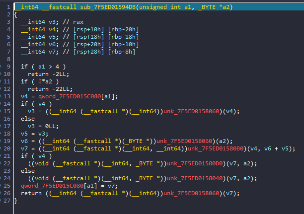

## SATELLITEHIJACK

Chall cho chúng ta 1 file `elf64` và 1 file `.so` là 1 file thư viện. 

### OVERVIEW

Khi chạy file `satellite` thì chương trình in ra và cho chúng ta nhập liên tục


Chúng ta hãy đi vào phân tích kĩ hơn trong ida 

Nhìn qua hàm main thì ta thấy chương trình thực hiện những hàm hệ thống và print ra cơ bản. Sau đó ta để ý thấy chương trình gọi hàm `send_satellite_message()` rồi sau đó cho ta nhập vào rồi lại gọi hàm `send_satellite_message()` để xử lý input


### DETAIL

Do hàm `send_satellite_message()` được gọi sau khi chúng ta nhập vào nên ta sẽ phân tích nó trước:

Mình debug vào hàm đó thì thấy rất khó đọc:



Nên mình dừng debug và nhấn vào hàm thì ta thấy `extrn` nghĩa là hàm được import từ thư viện bên ngoài. Mà tên hàm như thế nên không phải là hàm hệ thống mà chắc chắn đây là hàm trong file `library.so`


Mở `library.so`, ta tìm string để tìm hàm `send_satellite_message`:


Ta đã tìm ra được offset để đến hàm `sub_25D0` nhưng nhìn thấy code không giống với hàm `send_satellite_message` khi debug ở trên nên mình mò xem nó giống hàm nào.

Ta thấy hàm `sub_24DB` này có dạng giống với hàm `send_satellite_message` khi debug nên có lẽ đây chính là hàm `send_satellite_message`


Hàm này chỉ đơn giản là tính toán độ dài và nối chuối input của chúng ta với `START` và cuối cùng chỉ return về độ dài của chuỗi đã nối đó:


Vậy hàm này không phải là hàm check flag nên ta phải đi theo hướng khác. 

Quay lại hàm trước ta thấy chương trình có sử dụng hàm `getenv()` để kiểm tra xem có tồn tại biến môi trường `SAT_PRODUCTION_ENVIRONMENT` hay không.

Ta sẽ debug chương trình `sattellite` để xem chương trình gọi hàm `getenv()` lúc nào. Vì đây là hàm hệ thống của linux nên ta sẽ tìm nó trong thư viện linux được import:


Sau khi tìm được hàm thì ta đặt breakpoint xem hàm được gọi lúc nào.


Ta thấy chương trình vào hàm `send_satellite_message` với tham số `START` thì chương trình được chuyển hướng đến một hàm khác thay vì hàm trả về độ dài của chuỗi.


Khi debug cho đến hàm `getenv` thì mình đã tìm được hàm đã gọi hàm `getenv`:


Tìm bên thư viện thì mình cũng thấy đoạn đầu có dạng giống nhau.


Như vậy ta phải set biến môi trường `SAT_PRODUCTION_ENVIRONMENT`:


Giờ thử chạy lại chương trình xem đã vào được chưa:


Vậy ta đã vào được trong hàm. Sang bên hàm trong thư viện để dễ đọc hơn:

- `getauxval(3)`: `3` - Enum : `PHDR` ; lấy địa chỉ `header` của chương trình 

Hàm này chương trình copy byte vào địa chỉ mà biến `dest` lưu sau đó xor với 42. Rồi return về offset của đoạn byte đó 


Đây là giá trị của offset mà hàm trên trả về. Ta thử makecode xem sao


Đây đúng là shellcode chứa hàm checkflag. Vòng lặp while đánh lừa chúng ta. Nếu chúng ta nhập flag đúng thì chương trình lại return về `-1`. Vậy nên ta sẽ đi ngược lại với chương trình.


Ta vào hàm checkflag


Ta dễ dàng có thể thấy được chương trình chỉ encrypt flag bằng XOR cơ bản nên mình viết script python để tìm ra flag:

```python
cipher="l5{0v0Y7fVf?u>|:O!|Lx!o$j,;f"
print("HTB{",end="")
for i in range(len(cipher)):
    print(chr(ord(cipher[i])^i),end="")
```
### FLAG: `HTB{l4y3r5_0n_l4y3r5_0n_l4y3r5!}`

### IDA Cheatsheet

#### Khi muốn biến 1 đoạn byte thành 1 xâu

- Bôi đen đoạn byte muốn chuyển -> `Alt+A`-> `C-style`


#### Setup debug để bắt đầu từ load library


