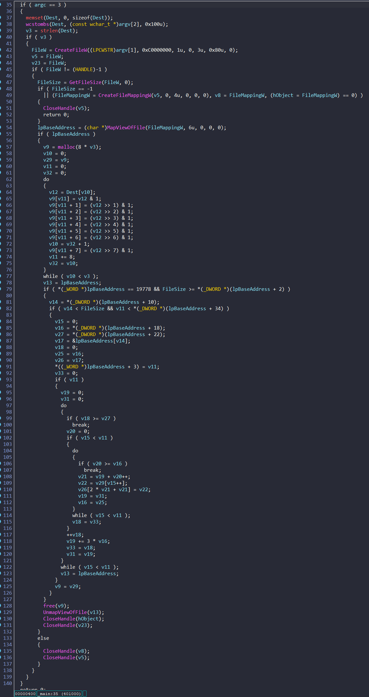

# HiddenTreasure

Đề bài cho ta 1 file [HiddenTreasure](./chall/HiddenTreasure.exe) và 1 image:


<center>


inside-the-mind-of-a-hacker-memory.bmp

</center>


Ta sẽ cùng nhau phân tích chương trình trong ida



Đây là code giả C. Mình sẽ thay đổi tên biến và comment để thuận tiện hơn cho việc phân tích:


Đầu tiên chương trình check `argc` = 3 hay không tức là khi chạy file phải có 3 tham số được truyền vào. Sau đó copy `0x100` kí tự từ tham số truyền vào thứ 3 vào `Strinput`. Mặc dù ta chỉ nhập 0x100 kí tự vào `strinput` nhưng do cách thức hoạt động của hàm `strlen` là gặp số 0 thì dừng; mình nhấn vào xem giá trị của `Strinput` thì có thêm 7 byte nữa => len(strinput) = 0x107:


Nếu `lengh != 0` thì chương trình sẽ mở file, kiểm tra có tạo thành công không -> nếu thành công thì ánh xạ file vào memory.


Sau khi ánh xạ thành công thì sẽ tạo bộ nhớ cấp phát động tiếp đến dùng vòng lặp `do-while` để mã hóa `strinput` và lưu giá trị vào địa chỉ trả về sau khi gọi hàm `malloc`.


Do phần trên của chương trình là tạo file; mà đề bài còn cho ta file `bmp` nên mình đi tìm `bmp file format`:


Nhìn vào bảng bên trên thì phần này chương trình kiểm tra `Signature` để xem có phải file `bmp` không và check kích thước của file truyền vào có giống như dữ liệu trong file hay không. Rồi lại kiểm tra Địa chỉ của data và kích thước có phù hợp hay không. `v11` là kích thước của dữ liệu sau khi mã hóa. Nếu đúng thì chương trình sẽ lấy thông tin ở trong file lần lượt gán vào từng biến.


Đoạn code bên dưới chương trình sẽ sử dụng vòng lặp để tính toán và lấy từng phần tử của mảng `strinput` đã được mã hóa vào `bitmapdata`


Phần còn lại của chương trình chỉ là giải phóng memory và `CloseHandle` thôi.

Mình viết script python mô tả lại thuật toán `encrypt`:

```python
Width = 0x3AA
Height = 0x244
v11 = 0x838
count1 = 0
v19 = 0
CWidth = 0
addr = [1]* 0x839
bmp = [0]*100000
Cheight = 0
while count1 <= v11:
    if Cheight >= Height:
        break
    CWidth = 0
    while count1 <= v11:
        if CWidth >= Width:
            break
        if count1 == 1397:
            print(a)
        a = v19 + CWidth
        enc = addr[count1]
        addr[count1] = 0
        bmp[a*3+0x36] = enc
        count1 +=1
        CWidth += 1

    Cheight +=1
    v19 += 3*Width

```

Chương trình cho ta hình ảnh tức `cipher` sẽ nằm trong `bitmapdata` nên script `decrypt` mình đã đọc dữ liệu từ file; Để biết được những giá trị của các biến khi kết thúc chương trình thì mình đã debug trong `ida` để lấy. Dưới đây là script python để decrypt:

```python
Width = 0xE5
CHeight = 3
v11 = 0x839
v19 = 0x20FA
flag= [0]*0x839
f = open("./chall/inside-the-mind-of-a-hacker-memory.bmp", mode="rb")
bmpdata= f.read()

while v11 > 0:
    if CHeight < 0:
        break
    CHeight -= 1
    CWidth = Width
    Width = 0x3AA
    v19 -= 3*Width
    while v11 > 0:
        CWidth -=1
        if CWidth < 0:
            break
        v11 -=1
        a = v19 + CWidth
        dec = bmpdata[a*3 + 0x36]
        flag[v11]= dec

for i in range(0,0x838,8):
    char = (flag[i+7]<<7) + (flag[i+6]<<6) + (flag[i+5]<<5) + (flag[i+4]<<4) + (flag[i+3]<<3) + (flag[i+2]<<2) + (flag[i+1]<<1) + (flag[i]) 

    print(chr(char),end="")

```
Output: `flag{dont_forget_the_treasure}勜嗏啯坤㡿␱ຯ༮ቺ፻ዎᏀቦᏬᓅኰᅍ໇༟ഴᄔฑๅᎇᓪᎂᐹታฅ௄ሒᇦ঳ఽᄋ࿾ຝ࿭ඒไ໕૔ಖટຯั෺ᔹᎤ኶ᏬᏳᗣᗪጌᖥᏺᛩᖬᔇᓫᓫዡᒝᐙᓫᏯᔪᓫᓫᓫᓫᓫᓫᓫᛌ፪ፐᖬᓮᓫᓫᓫᓫሢᐅጊᑃᗛᓺᓫᎻᤙ⋽䬫婳抴匲囌奐婬哓乒娼仼唞劐嗡埩填夣嗩嫈奭嫇岖圃厰嗟唗剣宏㑺៏ಈክጦሗᐪᏄሀᔎᒺᒱ๺ඳ໭ళ෴຤ᄴᗨᑜᏥᓎུౣሗ᏾൮஽๧ዕኯᆯီชഇுു඘୳࿠ຄၲᎎጳᏜ፬፽ᏬᏬ፮ᗨᏬᏬᖮᓦኛᐴድᓘ፮ᒆᗰᓮᓫᓫᓫᓫᓫᓫᗫᐵᓝᎶᔪᓫᓫᓫᓫᒻᑩዞ߇ᓫᗪᓫᓫᐶᬓⶾ倆摍屈厗大夂奺劓忿剸喖儇哬夿坹嚩坻婾壣媖嗛`

**FLAG:** `flag{dont_forget_the_treasure}`


