# MINIGAME KCSC

## PART1: `KCSC{G00d_J0b_Ag3nt_`

Mình search tên `luc1dkern3l` trên insta:

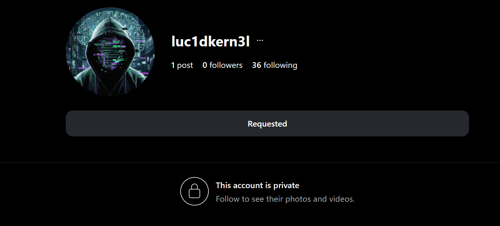

Thấy có 1 post nên mình đoán là tài khoản từ public chuyển về private nên mình đã tìm các web archive thì mình thấy có web xuất hiện:

https://archive.ph/https://www.instagram.com/luc1dkern3l/

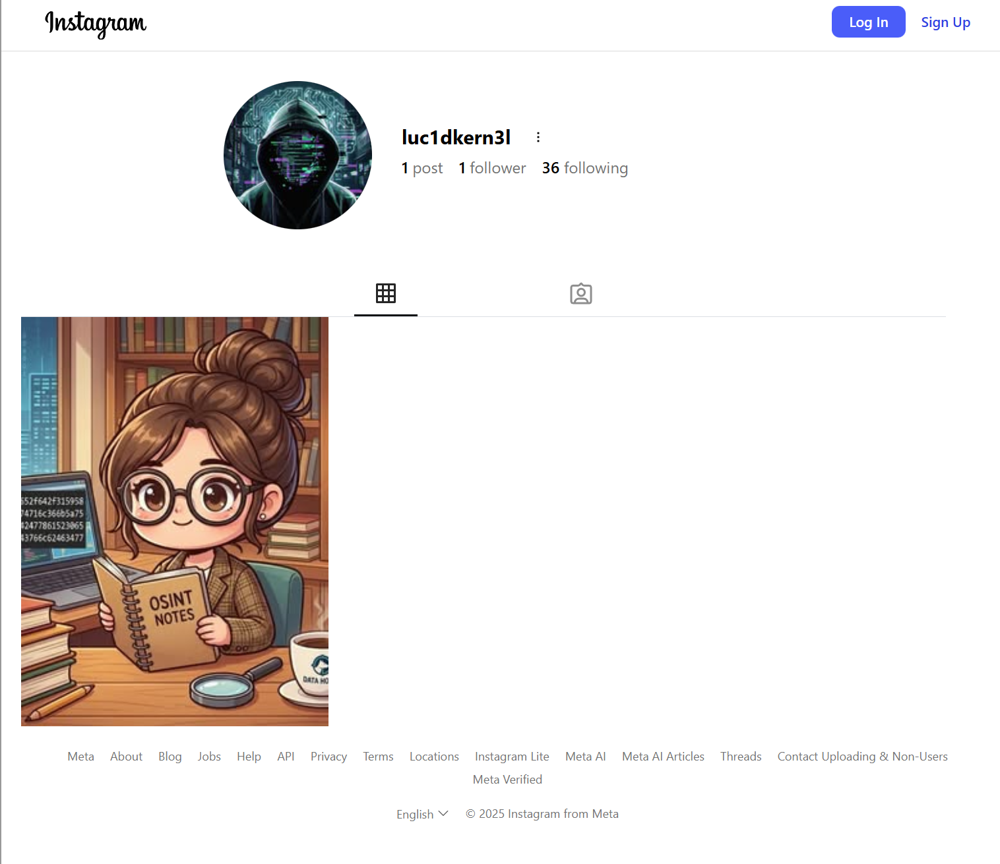

Đúng như dự đoán, vậy bây giờ mình lấy ảnh để lấy mã số kia:


`66696c652f642f31595834446974716c366b5a754b7a4c424778615230655f4c3343766c62463477`

`file/d/1YX4Ditql6kZuKzLBGxaR0e_L3CvlbF4w`
đây mình đoán là link google drive, nên mình mở ra thì có được part 1:

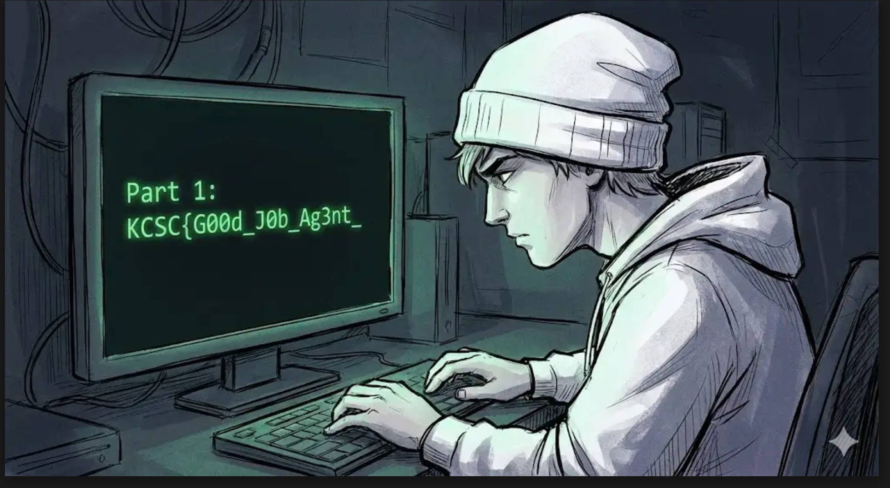

## PART2: `Th3_Trac3_`

Mình lại tiếp tục search `luc1dkern3l` trên go go duck xem có gì không thì ra được link này:

[https://pastebin.com/3UrFcDik](https://pastebin.com/3UrFcDik)

```
# OPERATION: BUSAN PROTOCOL // DATA RELAY LOG
# AUTHORIZED USER: luc1dkern3l
# TIMESTAMP: 2025-11-20T23:59:59Z
#---------------------------------------------------------------------
 
[CHECKPOINT STATUS] Fragment 01 acquisition confirmed. Trace successful.
 
[DATA FRAGMENT 02] The second segment of the cipher is now active. Copy with precision:
 
    DATA_FIELD_Part 2: Th3_Trac3_
 
[MISSION RELAY POINT] We have left the port area and logged our position. The image below confirms the current departure point:
 
    RESOURCE_IMAGE: drive.google.com/file/d/1SvAQWf4g269F_acov3we2Wl2ANfr7FHg
 
[NEXT INSTRUCTION] Our mandatory mission log requires a 5-star public review at the *staging area* closest to this port, maybe in school/uni near that!
 
[SYSTEM MESSAGE] Proceed with caution. End of transmission
```

## PART3: `Is_C0mpl3t3_`

Như link bên trên thì ta thấy có hướng dẫn tìm đánh giá của trường 5 sao. Dựa vào ảnh và ở trên note bảo busan, đồng thời tàu tên là T.S HANBADA. mình tìm được đây là cảng YEONGDO-GU.

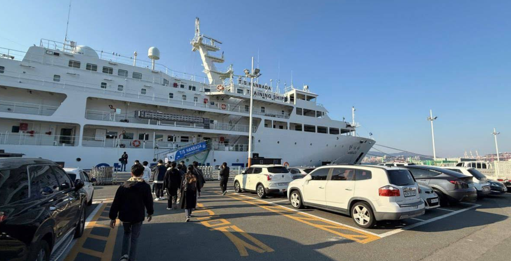

Tìm các trường học 5 sao gần đó thì mình tìm được đánh giá này:

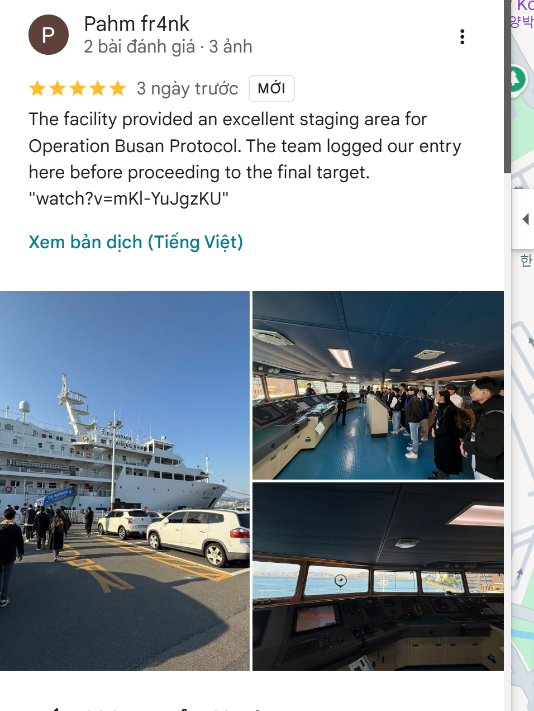

xem các ảnh thì ta có flag 3:

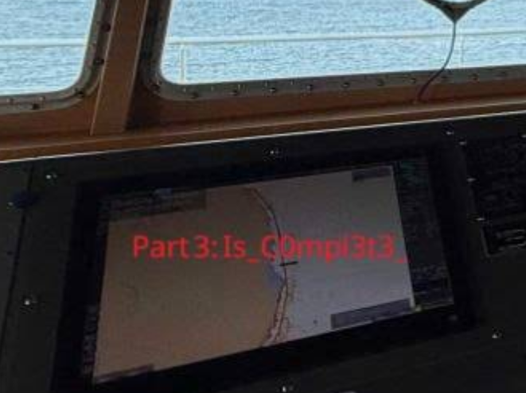

## PART4: `W3lc0m3_T0_KM4_`

Bên trên đánh giá ta thấy có link youtube: [PART 4](https://www.youtube.com/watch?v=mKl-YuJgzKU), dán vào thì ta tìm được 1 chuỗi trong phần mô tả:

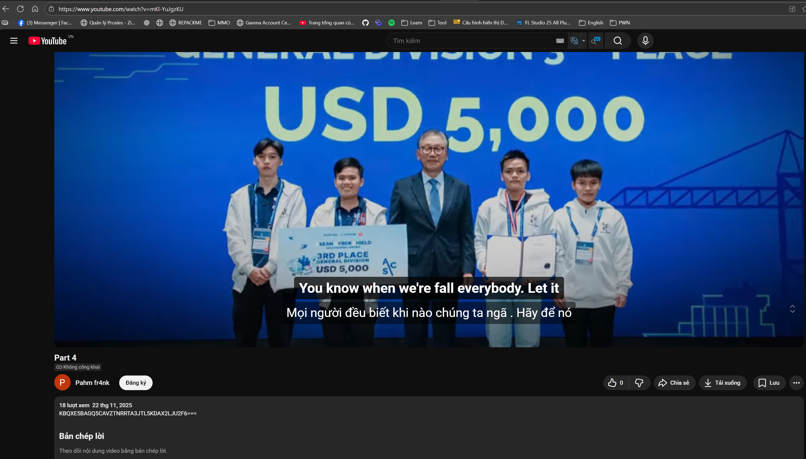

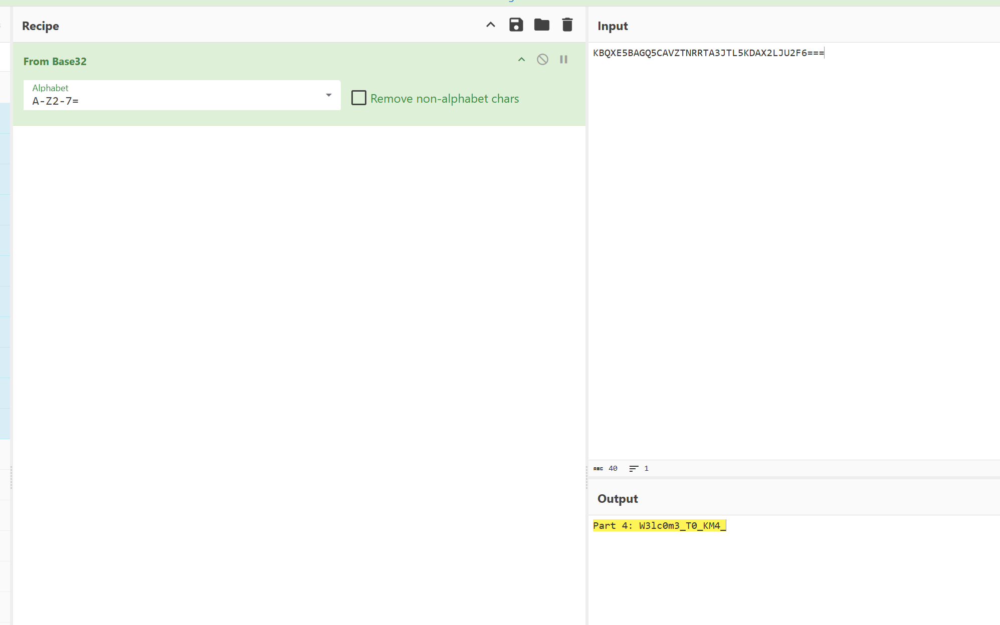
ta đã có part 4

## PART5:  `&_W3_Ar3_`

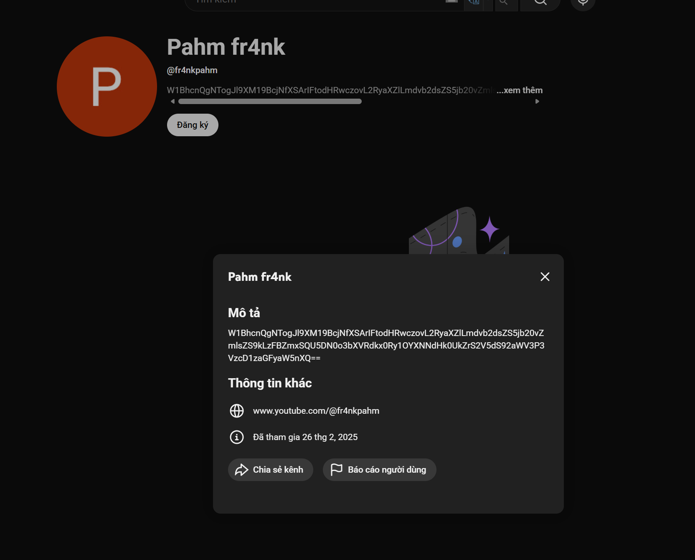

Mình vào profile youtube thì thấy có thêm manh mối khác

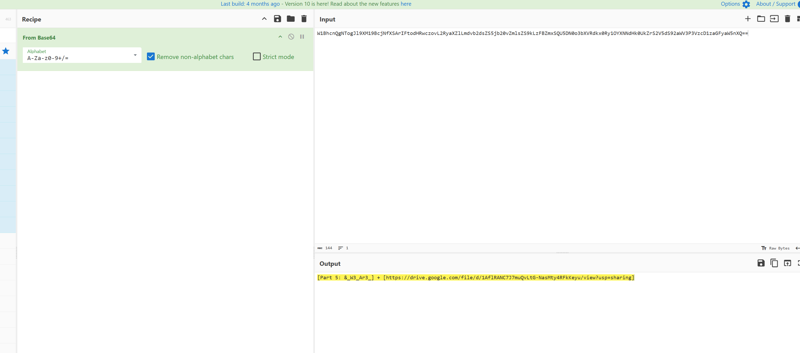

và chúng ta có part 5

## PART6: `W4itinG_F0r_Y0u_`

ta có link google cho part6 tìm đc ở part 5: [https://drive.google.com/file/d/1AflRANC7J7muQvLtG-NasMty4RFkKeyu/view?usp=sharing](https://drive.google.com/file/d/1AflRANC7J7muQvLtG-NasMty4RFkKeyu/view?usp=sharing)

Tải file thì ta nhận được: 

```
MISSION LOG: OPERATION BUSAN SHIELD Date: November 2025 Location: Busan, South Korea Status: MISSION ACCOMPLISHED 🏆

Log Entry #2025-KR: The target has been secured. I repeat, the Championship Trophy is coming home to KMA. The competition at the ASEAN Cyber Shield was intense, but our defense protocols held strong.
Part 6: W4itinG_F0r_Y0u_
We celebrated at Haeundae Beach last night. The view was incredible, but a true agent never rests. I’ve scattered data fragments across our extraction route—from the social networks to the physical coordinates on the map.

If you have made it this far, you have proven your skills in OSINT and tracking. You are the kind of talent KCSC is looking for.

However, one final encryption layer remains. The data package below contains your ultimate reward, but it is locked tight.

Over and out. 
luc1dkern3l

drive.google.com/file/d/1L0uB3U9nP3ImSNGPvC9__zM6-s1qYYSt/view?usp=sharing


```
## PART 7: `At_KCSC_R3cruitm3nt}`

Link [gg drive](drive.google.com/file/d/1L0uB3U9nP3ImSNGPvC9__zM6-s1qYYSt/view?usp=sharing) ta có từ part 6 cho 1 file có mật khẩu là 6 part trước:

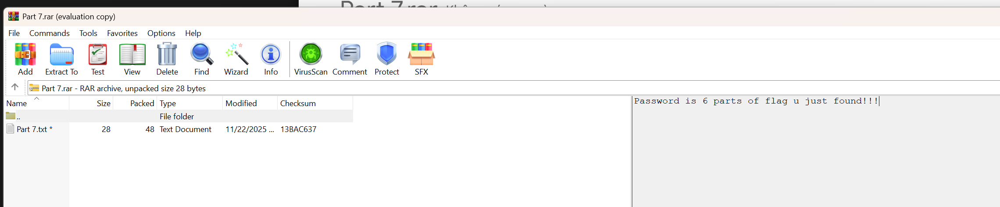
Pass:`KCSC{G00d_J0b_Ag3nt_Th3_Trac3_Is_C0mpl3t3_W3lc0m3_T0_KM4_&_W3_Ar3_W4itinG_F0r_Y0u_`

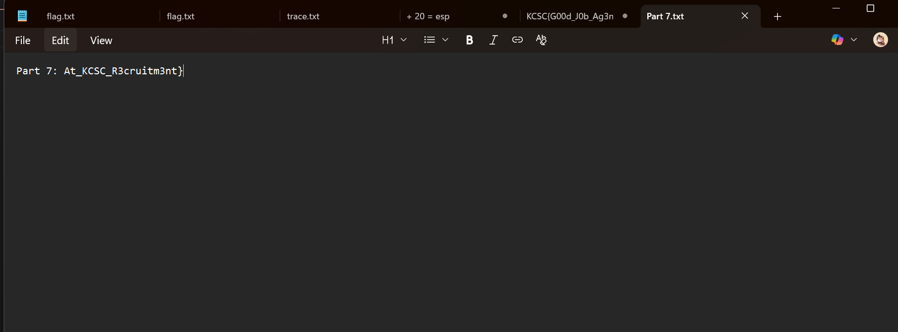

**FLAG**: `KCSC{G00d_J0b_Ag3nt_Th3_Trac3_Is_C0mpl3t3_W3lc0m3_T0_KM4_&_W3_Ar3_W4itinG_F0r_Y0u_At_KCSC_R3cruitm3nt}`