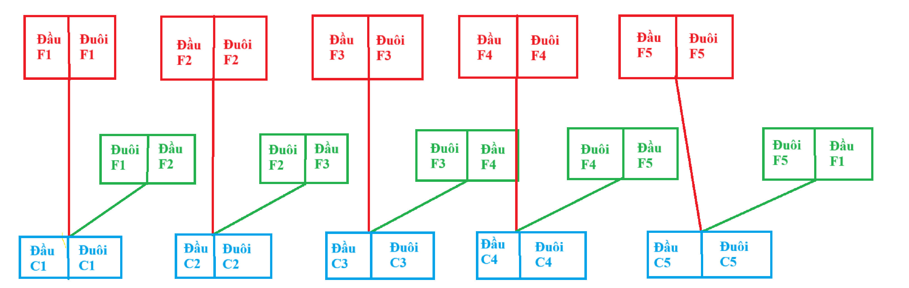
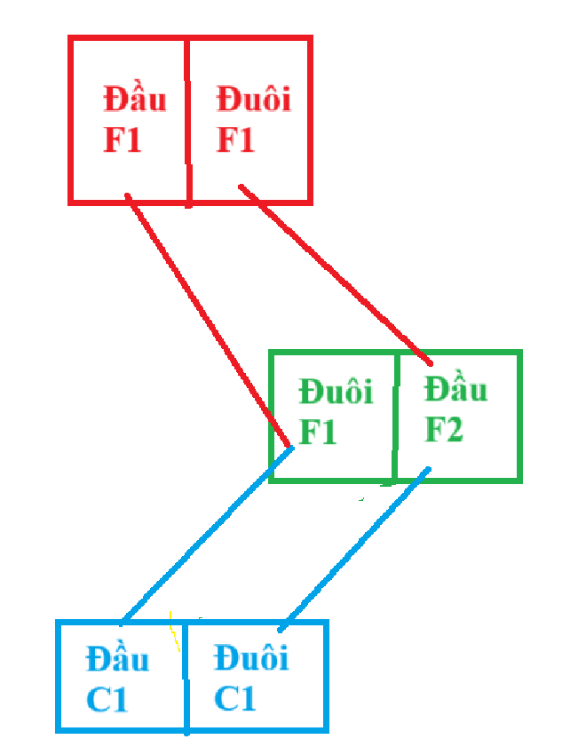
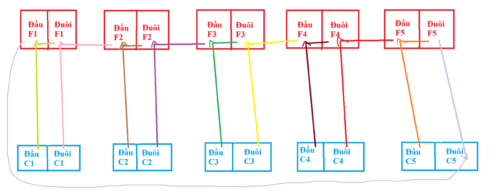

# MERGERXOR

## Overview

- Đề bài cho ta file [MergerXor.c](./MergerXor.c), Format flag là `KCSC{}` và cipher:

```
[+] Cipher: 0x98,0x02,0xaa,0x9b,0xfe,0xdc,0x44,0x73,0xef,0x9d,
            0x40,0xdd,0xd8,0x05,0xc9,0xea,0x51,0xcd,0xab,0x01,
            0x77,0x14,0x8c,0x62,0x51,0xea,0x41,0xbe,0xae,0x33,
            0x23,0xd9,0x9d,0xfe,0x22,0x36,0xdb,0x23,0xfa,0x72,
            0x36,0xfd,0xb9,0xbc,0x11,0x04,0xfc,0xc8,0xdf
```

- Sau khi đọc code thì mình thấy tổng quan là chúng ta sẽ nhập `Flag` và tiến hành mã hóa 5 lần và cuối cùng in ra `Cipher` 



- Mình đã vẽ minh họa vòng lặp encrypt flag như hình trên. Hàm encrypt sẽ dùng vòng lặp và lấy 4 bit cuối của kí tự trước kết hợp với 4 bit đầu của kí tự sau để tạo thành một kí tự và lấy kí tự đó `Xor` với kí tự hiện tại đang xét để tạo ra cipher.

- Khi mình nhìn vào trong hình và nhận thấy rằng, thực chất cách mã hóa này là `Đầu F1 ^ Đuôi F1 = Đầu C1`, `Đuôi F1 ^ Đầu F2 = Đuôi C1`.

- Sau khi đã hiểu được cách mã hóa thì chúng ta bắt đầu tìm Flag. Mình sẽ tìm flag theo 3 cách: **Reverse chay**; **Z3** và **BruteForce**

## Solve

### 1. Reverse chay

- Do chương trình cho Format flag là `KCSC{}` nên mình điều chỉnh chương trình để print `Cipher` sau mỗi lần encrypt và đây là output:


[+] Cipher1: **0xff,0x76,0x67,0x74,0xc**c,0xa9,
[+] Cipher2: **0x08,0x10,0x10,0x38**,0x06,0x36,
[+] Cipher3: **0x89,0x11,0x13,0xb**8,0x65,0x56,
[+] Cipher4: **0x18,0x00,0x28**,0x3e,0x30,0x3e,
[+] Cipher5: **0x98,0x02,0xa**b,0xdd,0x33,0xdf,

- Những phần bôi đậm là kết quả đúng. Ta thấy sau mỗi lần encrypt, sẽ mất đi một byte không đúng do ta nhập kí tự đằng sau sai dẫn đến byte đó sai. Ví dụ như `Đuôi C4 = Đuôi F4 ^ Đầu F5` mà  byte đầu của F5 sai đẫn đến byte cuối của C4 sai.



Dựa vào tính chất mã hóa đối xứng của Xor nên mình đã nghĩ ra cách để decrypt như hình trên. Ta cần ở đây là byte của C1 và F1 để tìm được ra hết mảng Flag. Mà như input bên trên thì chúng ta đã có mảng cipher cuối cùng đầy đủ và byte đầu của mảng trước đó. Mình đã viết 1 script python để decrypt:

```python
def  get_last_4_bit(target):
    return target&0xf


def get_first_4_bit( target):
    return (target>>4)&0xf
def decrypt():
    for i in range (len(cipher)-1):
        flag[i] *=0x10
        flag [i]  +=  get_first_4_bit(flag[i]) ^ get_first_4_bit(cipher[i])
        flag [i+1] = get_last_4_bit(flag[i]) ^ get_last_4_bit(cipher[i])
    flag[48] *=0x10
    flag [48]  +=  get_first_4_bit(flag[48]) ^ get_first_4_bit(cipher[48])
    
    for i in range (len(cipher)):
        cipher[i] = flag[i]
cipher = [0x98,0x02,0xaa,0x9b,0xfe,0xdc,0x44,0x73,0xef,0x9d,
             0x40,0xdd,0xd8,0x05,0xc9,0xea,0x51,0xcd,0xab,0x01,
             0x77,0x14,0x8c,0x62,0x51,0xea,0x41,0xbe,0xae,0x33,
             0x23,0xd9,0x9d,0xfe,0x22,0x36,0xdb,0x23,0xfa,0x72,
             0x36,0xfd,0xb9,0xbc,0x11,0x04,0xfc,0xc8,0xdf]
flag = [0]*len(cipher)
flag [0] = 0x1
decrypt()
flag [0] = 0x8
decrypt()
flag [0] = 0x0
decrypt()
flag [0] = 0xf
decrypt()
flag [0] = 0x4
decrypt()
for f in flag:
    print(chr(f),end="")

```

**Flag:** `KCSC{https://www.youtube.com/watch?v=ueDH4iL7060}`

### 2. Z3

Với cách này khá là nhàn, ta sẽ dùng thư viện z3 để giải bài toán này. Ý tưởng ở đây là mình sẽ thêm các điều kiện của mảng flag vào và để cho máy tính toán.

Những điều kiện của mảng Flag

- 5 kí tự đầu của Flag: `KCSC{`
- Các phần tử trong mảng là kí tự
- Sau khi encrypt mảng Flag = Cipher


```python
def  get_last_4_bit(target):
    return target&0xf


def get_first_4_bit( target):
    return (target>>4)&0xf
def Flat(input,len):
     cipher = [0]*len
     for idx in range(len):
        first_4_bit = get_last_4_bit(input[idx])
        later_4_bit = get_first_4_bit(input[(idx+1)%len])
        
        block = (first_4_bit << 4) + later_4_bit
        cipher[idx] = input[idx]^block
     for i in range(len):
         input[i]=cipher[i]


from z3 import *
cipher=     [0x98,0x02,0xaa,0x9b,0xfe,0xdc,0x44,0x73,0xef,0x9d,
             0x40,0xdd,0xd8,0x05,0xc9,0xea,0x51,0xcd,0xab,0x01,
             0x77,0x14,0x8c,0x62,0x51,0xea,0x41,0xbe,0xae,0x33,
             0x23,0xd9,0x9d,0xfe,0x22,0x36,0xdb,0x23,0xfa,0x72,
             0x36,0xfd,0xb9,0xbc,0x11,0x04,0xfc,0xc8,0xdf]
formatt= [0x4B,0x43,0x53,0x43,0x7B]
flag = [BitVec(f'{i:2}',8) for i in range(len(cipher))]
S = Solver()
for i in flag:
    S.add(i > 0x20,i < 0x7f)
for f,c in zip (flag, formatt):
    S.add(f == c)
Flat(flag, len(flag))
Flat(flag, len(flag))
Flat(flag, len(flag))
Flat(flag, len(flag))
Flat(flag, len(flag))
for f,c in zip (flag, cipher):
    S.add(f == c)

S.check()
m = S.model()
model = sorted([(d, m[d]) for d in m], key = lambda x: str(x[0]))
for m in model:
     print(chr(m[1].as_long()), end='')
```

**Flag:** `KCSC{https://www.youtube.com/watch?v=ueDH4iL7060}`

### 3. Brute Force

Cách này mình cũng dùng tính chất mã hóa đối xứng của `Xor`. Thực chất chúng ta có thể dùng cách brute force từng kí tự một và điều kiện dừng là sau khi encrypt ra giống cipher là được. Các bạn có thể tham khảo cách đó theo link [này](https://github.com/Twil4/KCSC-TTV-Au_Quang_Duc-/blob/main/Merger_Xor.md)

Nhưng mình đã **Make it compicated :3**. Cách của mình là bruteforce byte cuối cùng của mảng trước và điều kiện dừng là `Đầu F1 ^ Đuôi F5 == Đuôi C5`. Thuật toán như hình dưới đây:



Ta bruteforce giá trị của byte cuối cùng trong khoảng từ 0x0 -> 0xf và tạo 1 vòng lặp chạy đến khi ra flag:

```python
def  get_last_4_bit(target):
    return target&0xf


def get_first_4_bit( target):
    return (target>>4)&0xf
cipher = [[0 for _ in range(49)] for _ in range(6)]
cipher[0] = [0x98,0x02,0xaa,0x9b,0xfe,0xdc,0x44,0x73,0xef,0x9d,
             0x40,0xdd,0xd8,0x05,0xc9,0xea,0x51,0xcd,0xab,0x01,
             0x77,0x14,0x8c,0x62,0x51,0xea,0x41,0xbe,0xae,0x33,
             0x23,0xd9,0x9d,0xfe,0x22,0x36,0xdb,0x23,0xfa,0x72,
             0x36,0xfd,0xb9,0xbc,0x11,0x04,0xfc,0xc8,0xdf]
flag=[0x4B,0x43,0x53,0x43,0x7B]
lengh= len(cipher[0])
last = [0]* lengh
now = [0]*lengh
pbf=[0]*5
o=0
while o < 5:
    check = 0
    if pbf[o]<0x10:
        for bf in range(pbf[o],0x10):

            for i in range(lengh):
                last[i]=cipher[o][i]
            now[lengh-1]=bf
            for u in range(lengh-1,-1,-1):
                temp=get_first_4_bit(last[u])^now[u]
                now[u] += (temp*0x10)
                if u != 0:
                    now[u-1] = get_first_4_bit(now[u])^get_last_4_bit(last[u-1])
                else:
                    if get_last_4_bit(now[u-1]) == get_first_4_bit(now[u])^get_last_4_bit(last[u-1]):
                        check = 1
                        pbf[o]=bf+1

                        for p in range(lengh):
                            cipher[o+1][p]= now[p]


            if check:
                if o ==4:
                    count =0
                    for q in range(5):
                        if cipher[o+1][q] == flag[q]:
                            count +=1
                    if count == 5:
                        for i in range(lengh):
                            print(chr(cipher[o+1][i]),end="")
                        o+=1
                else:    
                    o+=1
                    break
            else:
                o-=1
                break
    else:
        pbf[o]=0
        o-=1      

```

**Flag:** `KCSC{https://www.youtube.com/watch?v=ueDH4iL7060}`