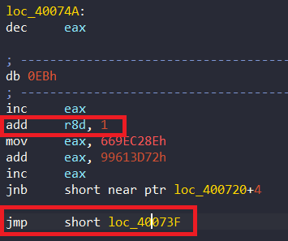
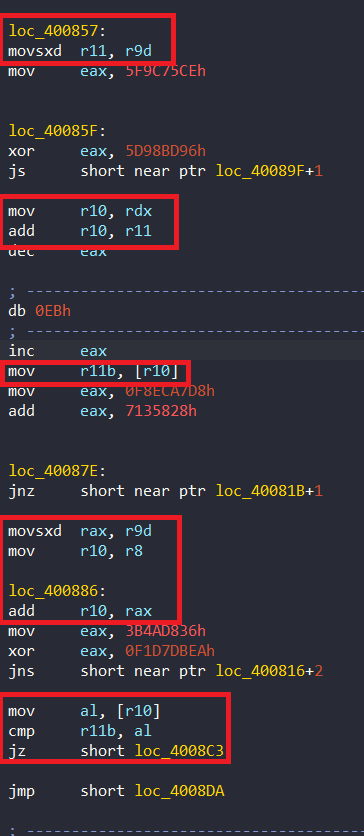
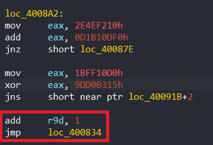

# Obfuscate

## DIE


Đề bài cho ta file `ELF 64-bit` nên ta sẽ mở file bằng ida64

## Overview


Nhin qua hàm `main` mình dự đoán rằng chương trình bắt ta nhập flag vào sau đó thực hiện các phép toán để mã hóa, cuối cùng kiểm tra giá trị trả về của `loc_4006E5()` là gì để xem flag của ta có đúng hay không.

## Detail


Đầu tiên ta thấy tham số truyền vào trong hàm main là `a1`, `a2`, `a3`. Mà ta thấy `a1` có kiểu dữ liệu là `int` nên mình nghĩ `a1` là `argc`(Argument Count)

Bên dưới ta thấy `a1` được so sánh với 1. Nếu `<=` 1 thì sẽ print "need a flag!" tức để `argc`> 1 thì khi chạy file qua terminal ta phải nhập flag đằng sau tên file.

Ví dụ: 
``` 
crackmexxx yourflag
```


Ta có thể thấy ở dòng 11 thì chương trình ghi giá trị vào tại địa chỉ `loc_4006E5` mà ở dòng 13 lại gọi hàm `loc_4006E5` nên có thể ida đã nhận dạng code sai. Để tìm hiểu nguyên nhân thì mình nhấn đúp vào `loc_4006E5`


Ta có thể thấy ida không nhận ra được code và nhìn code ida nhận diện rất lạ. Nên mình sẽ thử debug xem chương trình làm gì với những dòng code này.

Do đây không phải file exe nên ta không thể debug bằng **local window debugger** được nên chúng ta phải dùng **Remote Linux Debugger**


Ta tiến hành mở cmd tại thư mục chứa file `linux_sever64` (lấy file ở trong thư mục `dbgsrv` của ida) và vào ubuntu:


Sau khi vào thì ta đến thư mục chứa file `linux_sever64` và run file đó

Ở ida, ta vào Debugger -> Process options


Ở đây `Parmameters` để ta nhập giá trị của `argv`; `Port` thì ta ghi port mà ở cmd hiện; `Hostname` thì ta ghi `localhost` còn nếu chạy trên máy ảo thì nhập địa chỉ ip ở bên cmd vào. Ví dụ:

 

Sau khi mình debug và chạy đến hàm `loc_4006E5` thì ta thấy code đã thay đổi


Thấy code có vẻ đúng nhưng ida vẫn nhận dạng sai nên để phân tích tĩnh thì ta `Take memory snapshot`. Sau khi xong thì chúng ta dừng debug và bắt tay vào việc **make code**

Sau khi make code ta có được như sau:


Bây giờ chúng ta bắt đầu phân tích chương trình để tìm flag


Hàm `loc_4006E5` đầu tiên sẽ gọi hàm `loc_400702`; sau khi quay trở lại hàm thì ta thấy ` mov cl, al` rồi làm tính toán gì đó xong cuối cùng lại `mov al, cl`. 


Ta thấy qua phép cộng bên trên, eax bị đẩy bit 1 ngoài cùng bên trái ra ngoài -> **CF** flag được bật(CF = 1). lệnh `jnb` sẽ thực hiện khi CF = 0. Vậy thực chất phép tính toán này chỉ để làm rối thôi nên bây giờ khi gặp nó ta không cần bận tâm đến nó


Bỏ qua phần đầu chỉ là push những thứ cần thiết lên stack. 

`mov rdx, rax`


Mình mò ở trên hàm main thì thấy giá trị rax là địa chỉ của string ta nhập vào. 2 dòng tiếp theo thì trừ giá trị của eax và cộng lại nên không ảnh hưởng gì. Sau đó thì rdi = địa chỉ của string ta nhập vào

```
 xor    ecx, ecx
 dec     rcx
 repne scasb
 not     ecx
 dec     ecx
```
`repne`(repeat while not equal); `scasb` đếm theo từng byte một. lệnh ` repne scasb` là để đếm số byte trong chuỗi với địa chỉ của chuỗi là `EDI` và bộ đếm `ECX`. Do lệnh này sẽ đếm và trừ ecx nên sau khi xong ta phải lật ngược lại bằng lệnh `not` còn 2 lệnh `dec ecx` bỏ đi cũng không ảnh hưởng gì.


Tiếp theo, lệnh `jns` nhảy khi cờ **SF** = 0. Cờ SF = 0 khi kết quả phép tính là số dương mà 2 lệnh `xor` đều cho kết quả là số âm nên chương trình sẽ không nhảy 


2 lệnh đầu = `r9 = 50h`. Ta thấy chương trình xóa giá trị của r8d sau đó dùng r8d làm thanh ghi đếm cho vòng lặp bên dưới.


Khi r8 < 539h thì sẽ nhảy vào hàm này. 3 dòng đầu lại thấy giống format của những lệnh làm rối code bên trên nên ta bỏ qua. Hàm này chỉ xóa giá trị r11d và nhảy sang hàm khác thôi.


Hàm này lại có thêm 1 vòng lặp nữa. Như ta đã biết thì ecx là độ dài của string ta nhập vào. Vậy r11d là thanh ghi để đếm.


Mình đã gạch những lệnh jump làm rối code. Sau khi gạch thì 
```
movsxd  r10, r11d
mov     rbx, rdx
add     rbx, r10
```
Như đã nói bên trên thì `rdx` là địa chỉ của string ta nhập vào => rbx là địa chỉ của ký tự đang xét. Tương tự như vậy thì ở bên dưới, rax là địa chỉ của ký tự đang xét. Sau đó `al `= kí tự tại địa chỉ đó. sau đó `xor` với `r9b`rồi lại gán vào địa chỉ đó. Sau đó gán giá trị đó vào `r9b`. Rồi tăng thanh ghi đếm r11d lên.




Sau khi kết thúc vòng lặp trên thì chương trình sẽ tăng thanh ghi đếm `r8d` và quay trở lại vòng lặp đầu tiên

Viết 2 vòng lặp trên bằng python:

```python
for i in range(0x539):
    r11 = 0
    while r11 < lengh :
        flag[r11] ^= r9 
        r9 ^= flag[r11]
        r11 +=1
```

Vậy vòng lặp `for` này dùng để mã hóa flag của chúng ta


Sau khi kết thúc vòng lặp trên thì `r8` = địa chỉ của `unk_4008EB`; `r10 = 1` và `r9d = 0`. `cmp r9d, ecx` tức ta so sánh `r9d` với độ dài flag ta nhập vào.




Lệnh `test r10b,r10b` thức chất là lệnh `AND` nhưng `test` không lưu giá trị. Lệnh đó chỉ kiểm tra xem `r10` có = 0 hay không.

Nếu bằng `r10 = 1` thì nhảy vào `loc_4008857`. Sau đó 4 dòng đầu (không tính code làm rối) gán `r11b` = kí tự đang xét hiện tại của string ta nhập vào.

Tương tự như thế thì `al` = kí tự đang xét hiện tại của địa chỉ `unk_4008EB`. Sau đó so sánh `r11b` với `al`. Từ đó mình nghĩ string ở địa chỉ của `unk_400EB` là cipher


Ở cuối đoạn còn có số 0 (thường ở cuối string) vậy nên mình đoán cipher có 32 kí tự => flag có 32 kí tự

Quay lại flow thì khi so sánh, nếu 2 kí tự giống nhau thì nhảy vào `loc_4008C3`. 




Sau đó `r10 = 1`; `r9 += 1` và quay lại đầu vòng lặp . Còn nếu 2 kí tự không gióng nhau thì `r10 = 0` (out vòng lặp).


Sau khi out vòng lặp thì `mov` giá trị của `r10b` vào `al` và khôi phục lại các giá trị của thanh ghi ban đầu push lên stack. Rồi dùng `ret` để trở lại địa chỉ ban đầu. Sau đó trở về hàm main.


Sau khi nhảy về hàm main thì lập tức nhảy đến `loc_40090D`. Ở đây thực hiên so sánh `rax với 0`. Nếu rax = 1 tức flag đã đúng (=> r10b không bị thay đổi). Còn rax = 0 tức flag đã sai.

Từ những dữ kiện trên, mình đã viết script python để khái quát lại việc encode và kiểm tra flag có giống cipher không:

```python
flag =[ 0x70, 0x63, 0x74, 0x66, 0x7B]
lengh = len(flag)
r9 = 0x50
for i in range(0x539):
    r11 = 0
    while r11 < lengh :
        flag[r11] ^= r9 
        r9 ^= flag[r11]
        r11 +=1

loc_4008EB =[
  0x48, 0x5F, 0x36, 0x35, 0x35, 0x25, 0x14, 0x2C, 0x1D, 0x01, 
  0x03, 0x2D, 0x0C, 0x6F, 0x35, 0x61, 0x7E, 0x34, 0x0A, 0x44, 
  0x24, 0x2C, 0x4A, 0x46, 0x19, 0x59, 0x5B, 0x0E, 0x78, 0x74, 
  0x29, 0x13, 0x2C
]

r10 =1
r9 = 0
while r9 < lengh:
     if(flag [r9]==loc_4008EB[r9]):
        r9 += 1
     else:
        break
```
Vậy để tìm ra được flag khi đã biết cipher thì ta cần phải tìm ra được quy luật của hàm mã hóa để tìm ra được flag. Nên bây giờ mình sẽ xét bài toán nhỏ trước:


Bài toán nhỏ này cho ta biết `r9` và `cipher`; nhiệm vụ của chúng ta là đi tìm flag (F1,F2,F3). Như ta đã thấy trong hình thì nếu ta có `r9` và `cipher` thì không thể nào tìm được ra flag. Vậy mình phải đi tìm thêm một dữ kiện nữa.

Do đề bài chỉ cho như thế nên để tìm được dữ kiện nữa thì chúng ta phải sử dụng kĩ thuật **Brute-force**. 

Sau khi quan sát trên hình thì mình thấy, nếu ta biết được 1 trong 3 `S1`, `S2`, `S3` thì ta sẽ tìm được tất cả các kí tự còn lại. Nhưng cả 2 `S1` và `S2` đều phải xor cho cả đằng trước và đằng sau nên để thuận tiện cho việc viết code thì ta sẽ Brute-force `S3`.

Do đề bài xét các kí tự theo byte nên `S3` < 0x100 nên mình sẽ tạo một vòng lặp for để kiểm tra giá trị đúng của `S3` là gì.

Ta thấy giá trị ban đầu của `r9` là `0x50` nên điều kiện dừng đầu tiên của vòng lặp là `S1 ^ F1 == 0x50`
Lại có flag có dạng là `pctf{}` nên điều kiện thứ 2 là 5 kí tự đầu của flag = `pctf{`

Mình đã viết scirpt python để tìm ra flag theo cách trên:
```python
cipheror = [    0x48, 0x5F, 0x36, 0x35, 0x35, 0x25, 0x14, 0x2C, 0x1D, 0x01, 
                0x03, 0x2D, 0x0C, 0x6F, 0x35, 0x61, 0x7E, 0x34, 0x0A, 0x44, 
                0x24, 0x2C, 0x4A, 0x46, 0x19, 0x59, 0x5B, 0x0E, 0x78, 0x74, 
                0x29, 0x13, 0x2C]
type = [0x70, 0x63, 0x74, 0x66, 0x7B]
lengh = len(cipheror)
temp = [0]*lengh
cipher = [0]*lengh
count = 0
for bf in range(0x100):
    
    temp[lengh-1]= bf
    for j in range(lengh):
            cipher[j] =cipheror[j]

    for i in range (0x539):
        for o in range (lengh-1,0,-1):
            temp[o-1] = cipher[o] ^ temp [o]
        tm = cipher[0]
        for j in range(lengh):
            cipher[j] =temp[j]
        temp[lengh-1] = tm ^ cipher[0]
    
    if temp[lengh-1] == 0x50 :
        for u in range (5):
             if cipher[u] == type[u]:
                  count +=1
        if count == 5:   
            print('\n')
            for i in cipher:
                print(chr(i),end="")
            break

```

**Flag**: `pctf{ok_nothing_too_fancy_there!}`


