# STACKVM

Đề bài cho chúng ta một file [StackVM.exe](./chall/StackVM.exe) 64 bit nên chúng ta sẽ phân tích trong Ida64

## Main Function

<center>


Chương trình tạo lập giá trị cho các biến 
</center>

Tiếp đến, chương trình yêu cầu chúng ta nhập `>= 20` kí tự 


Đoạn này chương trình gán 20 kí tự chúng ta nhập vào các biến:


Sau khi gán xong, chương trình chạy vòng lặp do-while với 0x18C lần lặp. Rồi xét xem `v32[v8+1]` = `0x6` hay không. 
- Nếu có thì `step = 4` và gán các giá trị mảng `vmcode` vào `addr0x28`
- Nếu không thì `step = 2` và gán các giá trị mảng `vmcode` vào `v20`

Tiếp theo, chương trình gán những giá trị đã tính toán bên trên vào mảng `buffer` để thay đổi các giá trị ở phần tử 0->11. Cuối cùng của vòng lặp do-while, chương trình gọi hàm có địa chỉ lưu tại biến `Switchcase` và có 2 tham số truyền vào là địa chỉ của 2 biến `addr0x28cpy`, `Buffer`:

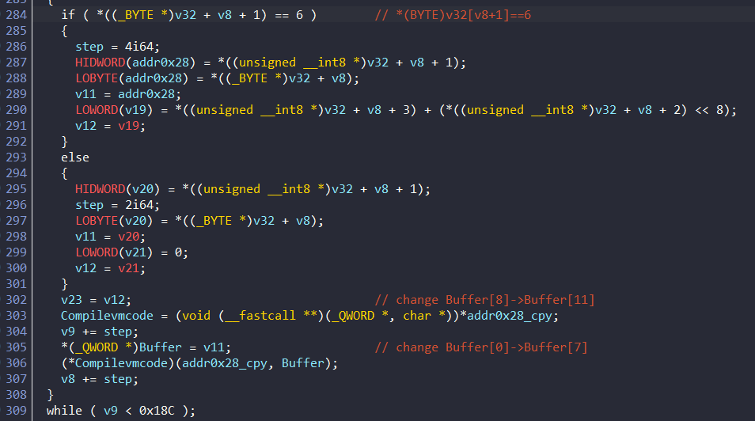

Sau khi kết thúc vòng lặp while, chương trình gọi hàm để kiểm tra. Hàm trả về 1 thì print `Congratulation` còn ngược lại là `Try again`


##  Compilevmcode function

Chương trình sẽ kiểm tra giá trị của `Buffer[4]` để gọi các hàm khác nhau. Ta thấy các hàm được gọi là địa chỉ được lấy từ giá trị của `addr0x28cpy` làm mốc:

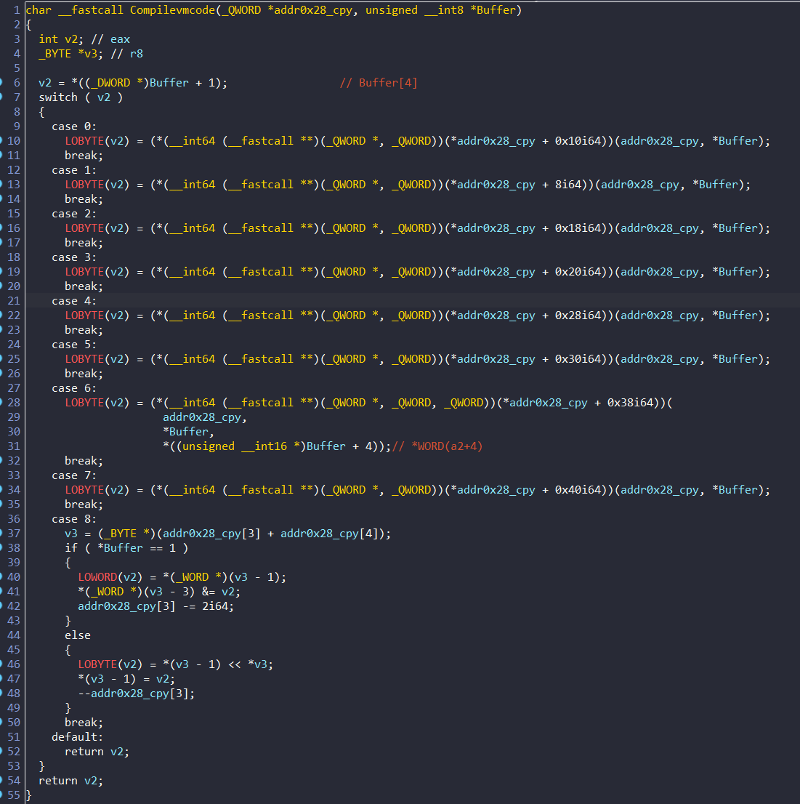

Sau khi tìm được thì địa chỉ đó dẫn đến những hàm khác nhau, ta sẽ đi tìm hiểu từng hàm một xem các hàm làm gì

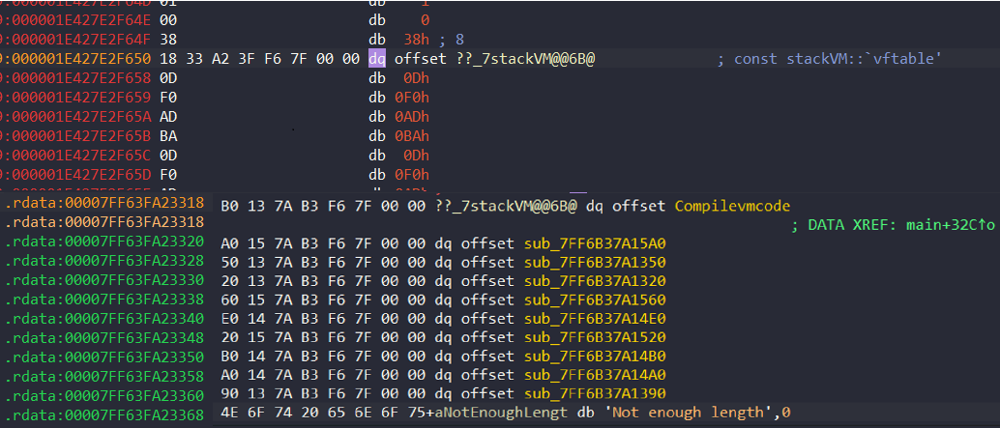

Khi vào trong từng hàm mình thấy đều có điểm chung là đều lấy từ giá trị của `a1+24` cộng với giá trị của `a1+32` nên mình tìm hiểu xem đó là gì.


`a1+24` đầu tiên sẽ có giá trị là `-1` còn `a1+32` chứa địa chỉ của nơi bắt đầu vùng nhớ đã được cấp phát lúc trước:


Dựa vào dữ kiện trên, ta sẽ viết struct để phân tích dễ hơn nhé:

``` c
struct addr0x28
{
  QWORD vftable;
  QWORD isba1;
  QWORD isba2;
  QWORD numcount;
  QWORD addrstart;
};

```

Trong struct này, `addrstart` là địa chỉ bắt đầu của mảng; `numcount` là biến chỉ vị trí của phần tử đang xét trong mảng 

Chúng ta hãy phân tích rõ hơn từng hàm nhé

### sub_7FF63FA21350 || CMP

- `result` sẽ chứa địa chỉ của phần tử chương trình đang xét
- Kiểm tra xem `Buffer[0]` có bằng 1 không
    - Có thì sẽ compare 1 WORD của `result -3` với `result -1`, kết quả lưu tại `result -3` ; `numcount` giảm đi 2 (để cho trường hợp sau xét phần tử ngay sau result vừa được lưu vào mảng)
    - Không thì sẽ compare 1 BYTE của `result` với `result -1`, kết quả lưu tại `result -1`; `numcount` giảm đi 1


**Vậy hàm này để compare**

### sub_7FF63FA215A0 || XOR

Tương tự như hàm `cmp` nhưng ở hàm này, nếu `Buffer[0]` = 1 thì lấy 2 kí tự ở vị trí `result -3` với `result -1` `XOR` với nhau và lưu vào `result -3`; `numcount` giảm đi 2. Còn nếu =0 thì lấy 1 byte `result` XOR với `result -1`

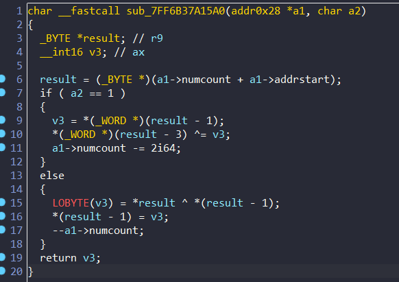

Từ 2 hàm này mình đoán là các hàm sau cũng đảm nhận những chức năng khác nhau:

### sub_7FF63FA21320 || ADD

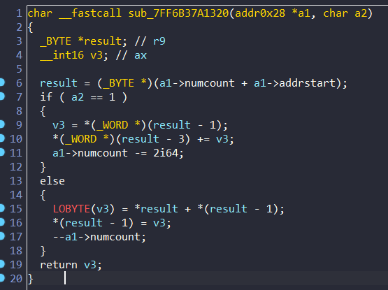

### sub_7FF63FA21560 || SUB

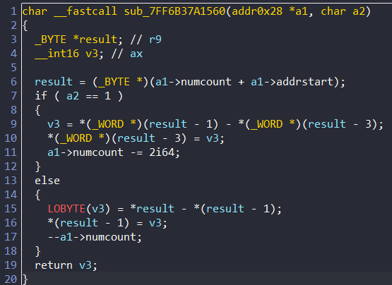

### sub_7FF63FA214E0 || LSH


### sub_7FF63FA21520 || RSH


### sub_7FF63FA214B0 || MOV

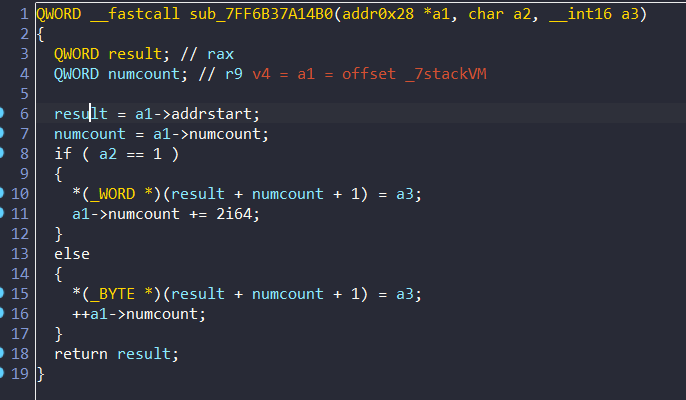

### sub_7FF63FA214A0

Ở hàm này thì chỉ giảm giá trị của `numcount`

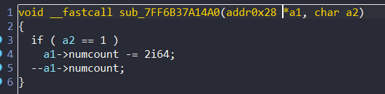

### sub_7FF63FA21390

Hàm này kiểm tra giá trị của `a1 +32` =1 && `numcount` != 0

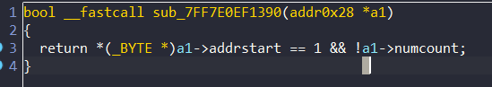

### case 8 

Nếu `buffer[0]` = 1 thì `result -3 AND  result -1`
Không thì `result -1 <<  result `

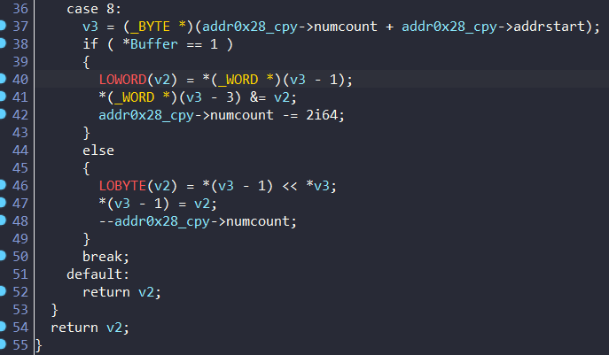

Vậy là đã phân tích xong ý nghĩa của các hàm. Bây giờ chúng ta sẽ viết script để reverse

## FIND FLAG

### REVERSE SCRIPT

Qua những phân tích bên trên, ta có thể thấy chương trình sẽ lấy các giá trị đã tạo lập ở đầu hàm main để encrypt flag của chúng ta => những giá trị đó là vmcode.

Vậy nên đầu tiên chúng ta sẽ lấy vmcode trước. Mình vào địa chỉ của `v32[0]` để lấy làm điểm bắt đầu:


Sau khi lướt xuống thì đến đoạn giá trị đều bằng 0 nên mình sẽ lấy mảng đến địa chỉ `0x0000004AA8EFFD8D`:


Lấy được mảng `afv32` ra thì ta thấy 20 kí tự `a` được truyền vào mảng :


nên mình đã viết script để tìm ra được vị trí của các số trong mảng để thay thế bằng input khác:

```w = [28, 29, 78, 79, 116, 117, 154, 155, 192, 193, 230, 231, 268, 269, 306, 307, 344, 345, 382, 383]```

Sau khi tìm được các dữ liệu như chương trình gốc, mình đã viết 1 script để in ra thứ tự các lệnh mà chương trình này thực hiện để mã hóa:

```python
afv32=[ 0x00, 0x06, 0x00, 0x01, 0x01, 0x06, 0x0C, 0x0D, 0x01, 0x06, 
  0x00, 0x08, 0x01, 0x05, 0x01, 0x06, 0x22, 0x38, 0x01, 0x06, 
  0xFF, 0x00, 0x01, 0x08, 0x01, 0x02, 0x01, 0x06, 0x61, 0x61, 
  0x01, 0x01, 0x01, 0x06, 0x69, 0x4E, 0x01, 0x00, 0x00, 0x07, 
  0x00, 0x00, 0x01, 0x06, 0x0C, 0x0D, 0x01, 0x06, 0x2D, 0x41, 
  0x01, 0x02, 0x01, 0x06, 0x00, 0x08, 0x01, 0x05, 0x01, 0x06, 
  0x22, 0x38, 0x01, 0x06, 0x55, 0x22, 0x01, 0x01, 0x01, 0x06, 
  0xFF, 0x00, 0x01, 0x08, 0x01, 0x02, 0x01, 0x06, 0x61, 0x61, 
  0x01, 0x01, 0x01, 0x06, 0x32, 0x6A, 0x01, 0x00, 0x00, 0x07, 
  0x00, 0x00, 0x01, 0x06, 0x49, 0x30, 0x01, 0x06, 0x00, 0x08, 
  0x01, 0x05, 0x01, 0x06, 0x3E, 0x5E, 0x01, 0x06, 0xFF, 0x00, 
  0x01, 0x08, 0x01, 0x02, 0x01, 0x06, 0x61, 0x61, 0x01, 0x01, 
  0x01, 0x06, 0x45, 0x0A, 0x01, 0x00, 0x00, 0x07, 0x00, 0x00, 
  0x01, 0x06, 0x3B, 0x20, 0x01, 0x06, 0x00, 0x08, 0x01, 0x05, 
  0x01, 0x06, 0x6B, 0x2D, 0x01, 0x06, 0xFF, 0x00, 0x01, 0x08, 
  0x01, 0x02, 0x01, 0x06, 0x61, 0x61, 0x01, 0x01, 0x01, 0x06, 
  0x5B, 0x78, 0x01, 0x00, 0x00, 0x07, 0x00, 0x00, 0x01, 0x06, 
  0x2B, 0x79, 0x01, 0x06, 0x00, 0x08, 0x01, 0x05, 0x01, 0x06, 
  0x70, 0x41, 0x01, 0x06, 0xFF, 0x00, 0x01, 0x08, 0x01, 0x02, 
  0x01, 0x06, 0x61, 0x61, 0x01, 0x01, 0x01, 0x06, 0x37, 0x45, 
  0x01, 0x00, 0x00, 0x07, 0x00, 0x00, 0x01, 0x06, 0x78, 0x79, 
  0x01, 0x06, 0x00, 0x08, 0x01, 0x05, 0x01, 0x06, 0x34, 0x41, 
  0x01, 0x06, 0xFF, 0x00, 0x01, 0x08, 0x01, 0x02, 0x01, 0x06, 
  0x61, 0x61, 0x01, 0x01, 0x01, 0x06, 0x55, 0x0A, 0x01, 0x00, 
  0x00, 0x07, 0x00, 0x00, 0x01, 0x06, 0x6A, 0x36, 0x01, 0x06, 
  0x00, 0x08, 0x01, 0x05, 0x01, 0x06, 0x2D, 0x01, 0x01, 0x06, 
  0xFF, 0x00, 0x01, 0x08, 0x01, 0x02, 0x01, 0x06, 0x61, 0x61, 
  0x01, 0x01, 0x01, 0x06, 0x58, 0x1E, 0x01, 0x00, 0x00, 0x07, 
  0x00, 0x00, 0x01, 0x06, 0x75, 0x1B, 0x01, 0x06, 0x00, 0x08, 
  0x01, 0x05, 0x01, 0x06, 0x3B, 0x17, 0x01, 0x06, 0xFF, 0x00, 
  0x01, 0x08, 0x01, 0x02, 0x01, 0x06, 0x61, 0x61, 0x01, 0x01, 
  0x01, 0x06, 0x0F, 0x19, 0x01, 0x00, 0x00, 0x07, 0x00, 0x00, 
  0x01, 0x06, 0x77, 0x7C, 0x01, 0x06, 0x00, 0x08, 0x01, 0x05, 
  0x01, 0x06, 0x45, 0x30, 0x01, 0x06, 0xFF, 0x00, 0x01, 0x08, 
  0x01, 0x02, 0x01, 0x06, 0x61, 0x61, 0x01, 0x01, 0x01, 0x06, 
  0x76, 0x03, 0x01, 0x00, 0x00, 0x07, 0x00, 0x00, 0x01, 0x06, 
  0x0F, 0x37, 0x01, 0x06, 0x00, 0x08, 0x01, 0x04, 0x01, 0x06, 
  0x3B, 0x23, 0x01, 0x06, 0x00, 0xFF, 0x01, 0x08, 0x01, 0x02, 
  0x01, 0x06, 0x61, 0x61, 0x01, 0x01, 0x01, 0x06, 0x4A, 0x12, 
  0x01, 0x00, 0x00, 0x07, 0x00, 0x00, 0xF6, 0x7F, 0x00, 0x00, 
  0x53, 0x40, 0x41, 0x84, 0x19, 0x08, 0x00, 0x00, 0x01, 0x00, 
  0x00, 0x00, 0x00, 0x00]
c = 0
b =0
count1 =0
v11= 0
buffer=[0xe0,0xe1,0xe2,0xe3,0xe4,0xe5,0xe6,0xe7,0xe8,0xe9,0xea,0xeb,0xec,0xed,0xee,0xef,0xf0,0xf1,0xf2,0xf3]
w = [28, 29, 78, 79, 116, 117, 154, 155, 192, 193, 230, 231, 268, 269, 306, 307, 344, 345, 382, 383]
for o in range (10):
    afv32[w[o*2+1]] = buffer[o*2]
    afv32[w[o*2]] = buffer[o*2+1]

for u in range(len(buffer)):
    buffer[u] = 100 + u
result =[0]*100
v12 = 0x5300
def case(a):
    global c
    temp0 =0
    temp1 =0
    match a:
        case 0:
            
            if buffer[0]== 1:
               print("0CMP {}, {} ".format(hex(result[c-4]),hex(result[c-2])) )
               print("0CMP {}, {} ".format(hex(result[c-3]),hex(result[c-1])) )
               (result[c-4]) = (result[c-4]) == (result[c-2])
               (result[c-3]) = (result[c-3]) == (result[c-1])
               c-=2
            else:
               print("0CMP {},{} ".format(hex(result[c-1]),hex(result[c-2])) )
               (result[c-2]) = (result[c-1]) == (result[c-2])
               c-=1
            print("\n")
        case 1:
            if buffer[0]== 1:
                print("1XOR {},{} ".format(hex(result[c-4]),hex(result[c-2])) )
                print("1XOR {},{} ".format(hex(result[c-3]),hex(result[c-1])) )
                (result[c-4]) ^= (result[c-2])
                (result[c-3]) ^= (result[c-1])
                c-=2
            else:
               print("1XOR {},{} ".format(hex(result[c-2]),hex(result[c-1])) )
               (result[c-2]) ^= (result[c-1]) 
               c-=1
        case 2:
            if buffer[0]== 1:
                temp0 = (result[c-3]<<8) + (result[c-4])
                temp1 = (result[c-1]<<8) + (result[c-2])
                print("2ADD {},{} ".format(hex(temp0),hex(temp1)) )
                temp0 += temp1
                result[c-4] = temp0 & 0xff
                result[c-3] = (temp0 & 0xff00) >> 8
                c-=2
            else:
                print("2ADD {},{} ".format(hex(result[c-2]),hex(result[c-1])) )
                result[c-2] += result[c-1]
                c-=1
        case 4:
            if buffer[0]==1:
                temp0 = (result[c-3]<<8) + (result[c-4])
                temp1 = (result[c-1]<<8) + (result[c-2])
                print("4SHL {},{} ".format(hex(temp0),hex(temp1)) )
                temp0 <<= temp1
                result[c-4] = temp0 & 0xff
                result[c-3] = (temp0 & 0xff00) >> 8
                c-=2
            else:
                print("4SHL {},{} ".format(hex(result[c-2]),hex(result[c-1])) )
                result[c-2] <<= result[c-1]
                c-= 1
        case 5:
            if buffer[0]==1:
                temp0 = (result[c-3]<<8) + (result[c-4])
                temp1 = (result[c-1]<<8) + (result[c-2])
                print("5SHR {},{} ".format(hex(temp0),hex(temp1)) )
                temp0 >>= temp1
                result[c-4] = temp0 & 0xff
                result[c-3] = (temp0 & 0xff00) >> 8
                c-=2
            else:
                print("5SHR {},{} ".format(hex(result[c-2]),hex(result[c-1])) )
                result[c-2] >>= result[c-1]
                c-= 1

        case 6:
            if buffer[0]== 1:
               print("6MOV {},{} ".format(hex(result[c]),hex(buffer[8])) )
               print("6MOV {},{} ".format(hex(result[c+1]),hex(buffer[9])) )
               result[c]=buffer[8]
               result[c+1]=buffer[9]
               c += 2

            else:
                print("6MOV {},{} ".format(hex(result[c]),hex(buffer[8])) )
                result[c]=buffer[8]
                c +=1
        case 7:
            if buffer[0]== 1:
               c -= 2
            else:
                c -=1
        case 8:
            if buffer[0]==1:
                print("8AND {},{} ".format(hex(result[c-4]),hex(result[c-2])) )
                print("8AND {},{} ".format(hex(result[c-3]),hex(result[c-1])) )
                result[c-4] &= result[c-2]
                result[c-3] &= result[c-1]
                c-=2
            else:
                print("8SHL {},{} ".format(hex(result[c-2]),hex(result[c-1])) )
                result[c-2] <<= result[c-1]
                c -=1


def bf (count, num,times):
    while times !=-1:
        buffer[count]= (num & (0xff<<(8*times)))>>(8*times)
        count +=1
        times -=1
addrmaloc= 0x928372
while count1 < 0x18C:
    if afv32[count1 + 1] == 6:
        buffer[0]= afv32[count1]
        bf(1,addrmaloc,2)
        
        buffer[4]= afv32[count1 + 1] 
        bf(5,000000,2)
        v11 = (afv32[count1 + 3]<<0x8)+(afv32[count1 + 2])
        bf(8,v11,1)
        
        bf(10,v12,1)
        count1 +=4
    else:   
        buffer[0]= afv32[count1]
        bf(1,0x006B00,2)
        buffer[4]= afv32[count1+1]
        bf(5,000000,2)
        bf(8,0x00006500,3)
        
        count1+=2

    # print("Buffer:")
    # for i in buffer:
    #     print (hex(i))
    case(buffer[4])
    
    # if(b<c):
    #     b=c
    # print("Result:")
    # for o in range(b):
    #     print (hex(result[o]))

```

**OUTPUT:**

```
6MOV 0x0,0x1 
6MOV 0x0,0xd 
6MOV 0x0,0xc 
6MOV 0x0,0x8 
6MOV 0x0,0x0 
5SHR 0xc0d,0x8 
6MOV 0x8,0x38 
6MOV 0x0,0x22 
6MOV 0x0,0x0 
6MOV 0x0,0xff 
8AND 0x38,0x0 
8AND 0x22,0xff 
2ADD 0xc,0x2200 
6MOV 0x0,0xe0 
6MOV 0x22,0xe1
1XOR 0xc,0xe0
1XOR 0x22,0xe1
6MOV 0xe0,0x4e
6MOV 0xe1,0x69
0CMP 0xec, 0x4e
0CMP 0xc3, 0x69


0CMP 0x0,0x1


6MOV 0x0,0xd
6MOV 0x0,0xc
6MOV 0x4e,0x41
6MOV 0x69,0x2d
2ADD 0xc0d,0x2d41
6MOV 0x41,0x8
6MOV 0x2d,0x0
5SHR 0x394e,0x8
6MOV 0x8,0x38
6MOV 0x0,0x22
6MOV 0x0,0x22
6MOV 0xff,0x55
1XOR 0x38,0x22
1XOR 0x22,0x55
6MOV 0x22,0x0
6MOV 0x55,0xff
8AND 0x1a,0x0
8AND 0x77,0xff
2ADD 0x39,0x7700
6MOV 0x0,0xe2
6MOV 0x77,0xe3
1XOR 0x39,0xe2
1XOR 0x77,0xe3
6MOV 0xe2,0x6a
6MOV 0xe3,0x32
0CMP 0xdb, 0x6a
0CMP 0x94, 0x32


0CMP 0x0,0x0


6MOV 0x0,0x30
6MOV 0x0,0x49
6MOV 0x6a,0x8
6MOV 0x32,0x0
5SHR 0x4930,0x8
6MOV 0x8,0x5e
6MOV 0x0,0x3e
6MOV 0x0,0x0
6MOV 0xff,0xff
8AND 0x5e,0x0
8AND 0x3e,0xff
2ADD 0x49,0x3e00
6MOV 0x0,0xe4
6MOV 0x3e,0xe5
1XOR 0x49,0xe4
1XOR 0x3e,0xe5
6MOV 0xe4,0xa
6MOV 0xe5,0x45
0CMP 0xad, 0xa
0CMP 0xdb, 0x45


0CMP 0x0,0x1


6MOV 0x0,0x20
6MOV 0x0,0x3b
6MOV 0xa,0x8
6MOV 0x45,0x0
5SHR 0x3b20,0x8
6MOV 0x8,0x2d
6MOV 0x0,0x6b
6MOV 0x0,0x0 
6MOV 0xff,0xff
8AND 0x2d,0x0
8AND 0x6b,0xff
2ADD 0x3b,0x6b00
6MOV 0x0,0xe6
6MOV 0x6b,0xe7
1XOR 0x3b,0xe6
1XOR 0x6b,0xe7
6MOV 0xe6,0x78
6MOV 0xe7,0x5b
0CMP 0xdd, 0x78
0CMP 0x8c, 0x5b


0CMP 0x0,0x0


6MOV 0x0,0x79
6MOV 0x0,0x2b
6MOV 0x78,0x8
6MOV 0x5b,0x0
5SHR 0x2b79,0x8
6MOV 0x8,0x41
6MOV 0x0,0x70
6MOV 0x0,0x0
6MOV 0xff,0xff
8AND 0x41,0x0
8AND 0x70,0xff
2ADD 0x2b,0x7000
6MOV 0x0,0xe8
6MOV 0x70,0xe9
1XOR 0x2b,0xe8
1XOR 0x70,0xe9
6MOV 0xe8,0x45
6MOV 0xe9,0x37
0CMP 0xc3, 0x45
0CMP 0x99, 0x37


0CMP 0x0,0x1


6MOV 0x0,0x79
6MOV 0x0,0x78
6MOV 0x45,0x8
6MOV 0x37,0x0
5SHR 0x7879,0x8
6MOV 0x8,0x41
6MOV 0x0,0x34
6MOV 0x0,0x0
6MOV 0xff,0xff
8AND 0x41,0x0
8AND 0x34,0xff
2ADD 0x78,0x3400
6MOV 0x0,0xea
6MOV 0x34,0xeb
1XOR 0x78,0xea
1XOR 0x34,0xeb
6MOV 0xea,0xa
6MOV 0xeb,0x55
0CMP 0x92, 0xa
0CMP 0xdf, 0x55


0CMP 0x0,0x0


6MOV 0x0,0x36
6MOV 0x0,0x6a
6MOV 0xa,0x8
6MOV 0x55,0x0
5SHR 0x6a36,0x8
6MOV 0x8,0x1
6MOV 0x0,0x2d
6MOV 0x0,0x0
6MOV 0xff,0xff
8AND 0x1,0x0
8AND 0x2d,0xff
2ADD 0x6a,0x2d00
6MOV 0x0,0xec
6MOV 0x2d,0xed
1XOR 0x6a,0xec
1XOR 0x2d,0xed
6MOV 0xec,0x1e
6MOV 0xed,0x58
0CMP 0x86, 0x1e
0CMP 0xc0, 0x58


0CMP 0x0,0x1


6MOV 0x0,0x1b
6MOV 0x0,0x75
6MOV 0x1e,0x8
6MOV 0x58,0x0
5SHR 0x751b,0x8
6MOV 0x8,0x17
6MOV 0x0,0x3b
6MOV 0x0,0x0
6MOV 0xff,0xff
8AND 0x17,0x0
8AND 0x3b,0xff
2ADD 0x75,0x3b00
6MOV 0x0,0xee
6MOV 0x3b,0xef
1XOR 0x75,0xee
1XOR 0x3b,0xef
6MOV 0xee,0x19
6MOV 0xef,0xf 
0CMP 0x9b, 0x19
0CMP 0xd4, 0xf


0CMP 0x0,0x0


6MOV 0x0,0x7c
6MOV 0x0,0x77
6MOV 0x19,0x8
6MOV 0xf,0x0
5SHR 0x777c,0x8
6MOV 0x8,0x30
6MOV 0x0,0x45
6MOV 0x0,0x0
6MOV 0xff,0xff
8AND 0x30,0x0
8AND 0x45,0xff
2ADD 0x77,0x4500
6MOV 0x0,0xf0
6MOV 0x45,0xf1
1XOR 0x77,0xf0
1XOR 0x45,0xf1
6MOV 0xf0,0x3
6MOV 0xf1,0x76
0CMP 0x87, 0x3
0CMP 0xb4, 0x76


0CMP 0x0,0x1


6MOV 0x0,0x37
6MOV 0x0,0xf
6MOV 0x3,0x8
6MOV 0x76,0x0
4SHL 0xf37,0x8
6MOV 0x8,0x23
6MOV 0x0,0x3b
6MOV 0x0,0xff
6MOV 0xff,0x0
8AND 0x23,0xff
8AND 0x3b,0x0
2ADD 0x3700,0x23
6MOV 0x23,0xf2
6MOV 0x0,0xf3
1XOR 0x23,0xf2
1XOR 0x37,0xf3
6MOV 0xf2,0x12
6MOV 0xf3,0x4a
0CMP 0xd1, 0x12
0CMP 0xc4, 0x4a


0CMP 0x0,0x0
```
Ta thấy mỗi lần, chương trình sẽ lấy lần lượt 2 kí tự của mình để xor với số cho trước sau đó cmp => để tìm ra flag chúng ta chỉ cần làm ngược lại


Script python mình đã viết để tìm ra flag:

``` python
flag = []
cipher = [0x4e,0xc,0x69,0x22,0x6a,0x39,0x32,0x77,0xa,0x49,0x45,0x3e,0x78,0x3b,0x5b,0x6b,0x45,0x2b,0x37,0x70,0xa,0x78,0x55,0x34,0x1e,0x6a,0x58,0x2d,0x19,0x75,0xf,0x3b,0x3,0x77,0x76,0x45,0x12,0x23,0x4a,0x37]
         
for i in range(10):
  flag.append( chr(cipher[i*4] ^ cipher[i*4+1]))
  flag.append( chr(cipher[i*4+2] ^ cipher[i*4+3]))
  print(flag[i*2],end="")
  print(flag[i*2+1],end="")
```

### IDA PYTHON

Mình đã viết một script python để print ra thứ tự các lệnh:

``` python
while 1:
    idaapi.continue_process()
    idaapi.wait_for_next_event(WFNE_SUSP, -1)
    name_func = get_func_name(get_reg_value('rip'))
    
    if name_func in "CMP":
        if get_reg_value('rdx')==1:
            print(name_func,hex(get_wide_word(get_reg_value('r10')-1)))
        else:
            print(name_func,hex(get_wide_byte(get_reg_value('r10')-1)))
    elif name_func in "SHR" or name_func in "ADD" or name_func in "XOR" or name_func in "SHL" or name_func in "SUB":
        if get_reg_value('rdx')==1: 
            print(name_func,hex(get_wide_word(get_reg_value('r9')-3)),hex(get_wide_word(get_reg_value('r9')-1)))
        else:
            print(name_func,hex(get_wide_byte(get_reg_value('r9')-1)),hex(get_wide_byte(get_reg_value('r9'))))
    elif name_func in "MOV":
        if get_reg_value('rdx')==1: 
            print(name_func,hex(get_reg_value('r8w')))
        else:
            print(name_func,hex(get_reg_value('r8b')))
    elif get_reg_value('rip') == 0x00007FF6AF931B06: 
        break
    else:
        print("\n")
```

Để sử dụng hàm `idaapi.wait_for_next_event(WFNE_SUSP, -1)` thì mình đã đặt breakpoint ở các hàm khác nhau để xác định tên hàm và các giá trị mà hàm đó sẽ lấy ra để tính toán:

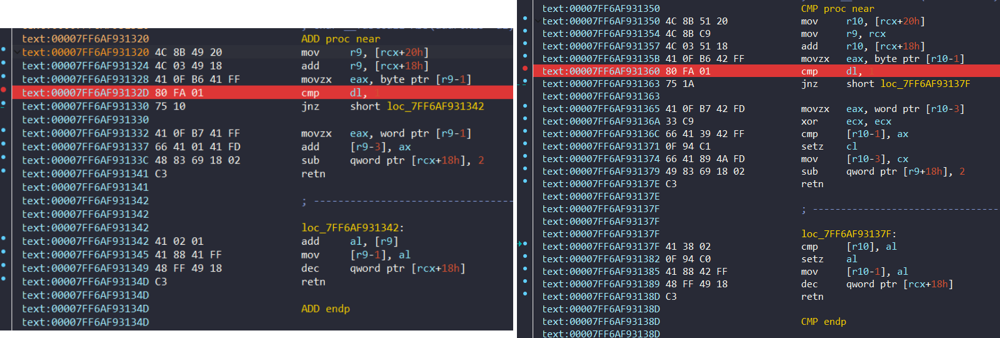

Bên cạnh đó, để kết thúc vòng lặp `while` thì mình đã sử dụng địa chỉ ngay sau khi thoát ra vòng lặp để làm giá trị so sánh:

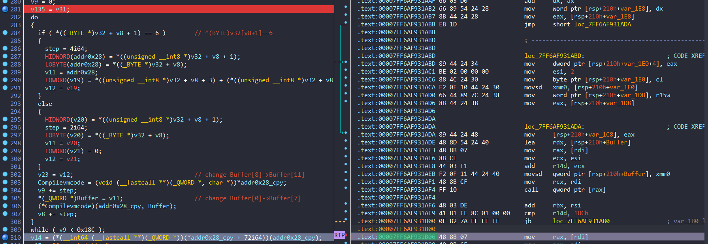

**OUTPUT**

```MOV 0x1
MOV 0xc0d
MOV 0x8
SHR 0xc0d 0x8
MOV 0x2238
MOV 0xff00
ADD 0xc 0x2200
MOV 0x6161
XOR 0xcd 0x1838
XOR 0x220c 0x6161
MOV 0x694e
CMP 0x694e


CMP 0x1
MOV 0xc0d
MOV 0x2d41
ADD 0xc0d 0x2d41
MOV 0x8
SHR 0x394e 0x8
MOV 0x2238
MOV 0x5522
XOR 0xcd 0x1838
XOR 0x2238 0x5522
MOV 0xff00
ADD 0x39 0x7700
MOV 0x6161
XOR 0xcd 0x1838
XOR 0x7739 0x6161
MOV 0x326a
CMP 0x326a


CMP 0x0
MOV 0x4930
MOV 0x8
SHR 0x4930 0x8
MOV 0x3e5e
MOV 0xff00
ADD 0x49 0x3e00
MOV 0x6161
XOR 0xcd 0x1838
XOR 0x3e49 0x6161
MOV 0x450a
CMP 0x450a


CMP 0x1
MOV 0x3b20
MOV 0x8
SHR 0x3b20 0x8
MOV 0x6b2d
MOV 0xff00
ADD 0x3b 0x6b00
MOV 0x6161
XOR 0xcd 0x1838
XOR 0x6b3b 0x6161
MOV 0x5b78
CMP 0x5b78


CMP 0x0
MOV 0x2b79
MOV 0x8
SHR 0x2b79 0x8
MOV 0x7041
MOV 0xff00
ADD 0x2b 0x7000
MOV 0x6161
XOR 0xcd 0x1838
XOR 0x702b 0x6161
MOV 0x3745
CMP 0x3745


CMP 0x1
MOV 0x7879
MOV 0x8
SHR 0x7879 0x8
MOV 0x3441
MOV 0xff00
ADD 0x78 0x3400
MOV 0x6161
XOR 0xcd 0x1838
XOR 0x3478 0x6161
MOV 0x550a
CMP 0x550a


CMP 0x0
MOV 0x6a36
MOV 0x8
SHR 0x6a36 0x8
MOV 0x2d01
MOV 0xff00
ADD 0x6a 0x2d00
MOV 0x6161
XOR 0xcd 0x1838
XOR 0x2d6a 0x6161
MOV 0x581e
CMP 0x581e


CMP 0x1
MOV 0x751b
MOV 0x8
SHR 0x751b 0x8
MOV 0x3b17
MOV 0xff00
ADD 0x75 0x3b00
MOV 0x6161
XOR 0xcd 0x1838
XOR 0x3b75 0x6161
MOV 0xf19
CMP 0xf19


CMP 0x0
MOV 0x777c
MOV 0x8
SHR 0x777c 0x8
MOV 0x4530
MOV 0xff00
ADD 0x77 0x4500
MOV 0x6161
XOR 0xcd 0x1838
XOR 0x4577 0x6161
MOV 0x7603
CMP 0x7603


CMP 0x1
MOV 0xf37
MOV 0x8
SHL 0xf37 0x8
MOV 0x3b23
MOV 0xff
ADD 0x3700 0x23
MOV 0x6161
XOR 0xcd 0x1838
XOR 0x3723 0x6161
MOV 0x4a12
CMP 0x4a12


CMP 0x0
```
Từ đó mình viết script để tìm ra flag:

``` python

data = [0x220c, 0x7739, 0x3e49, 0x6b3b, 0x702b, 0x3478, 0x2d6a, 0x3b75, 0x4577, 0x3723]
cipher = [0x694e, 0x326a, 0x450a, 0x5b78, 0x3745, 0x550a, 0x581e, 0xf19, 0x7603, 0x4a12]
print(''.join((d ^ c).to_bytes(2,"little").decode() for d, c in zip(data, cipher)))

```

## Flag: ```BKSEC{C0nGratul4t31}```