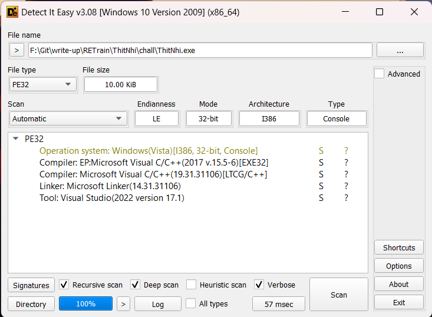
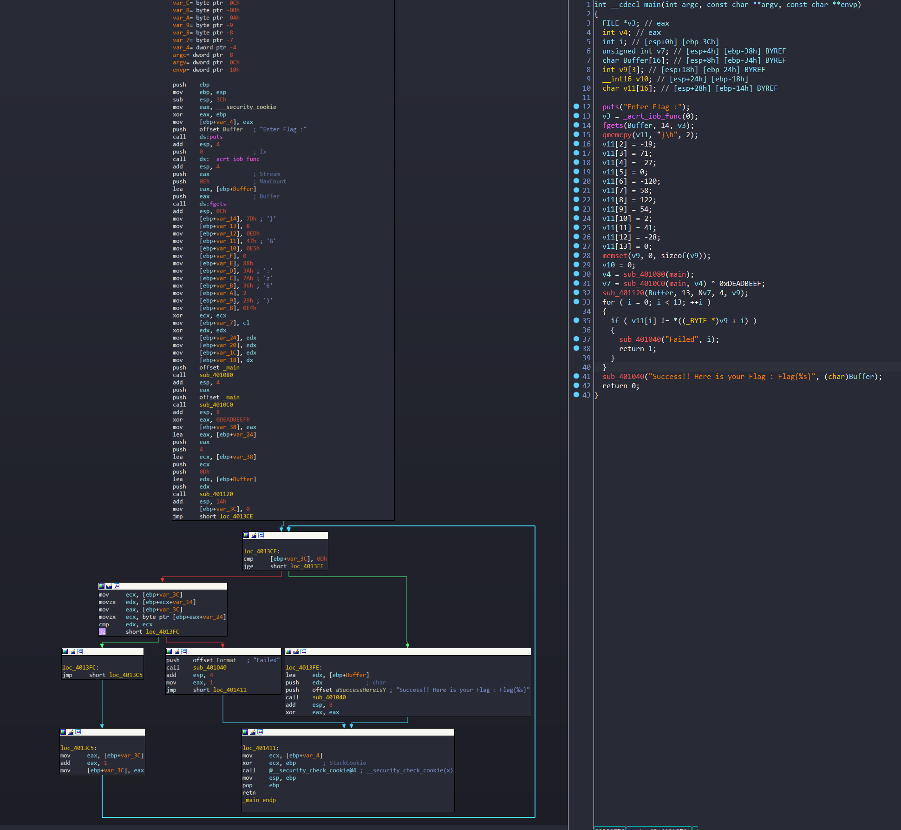
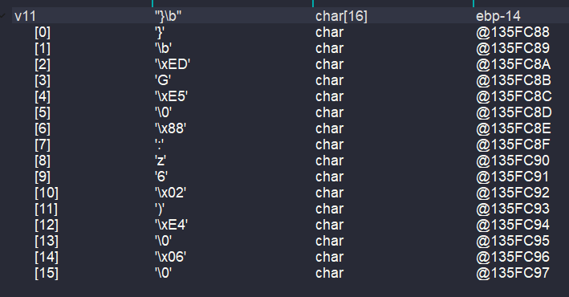
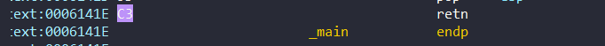
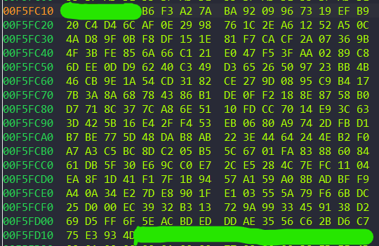
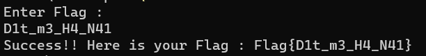

# RC4 Encryption Algorithm and Software,Hardware Breakpoint 
## Software,Hardware Breakpoint
Các bạn có thể tham khảo tài liệu gốc ở đây:
[Part 1](http://www.nynaeve.net/?p=80)

[Part 2](http://www.nynaeve.net/?p=81)

Khi chúng ta debug 1 chương trình thì sẽ có 2 loại breakpoint: **Software Breakpoint** và **Hardware Breakpoint**

#### Software Breakpoint

***Cách hoạt động***

Các **Software Breakpoint** được thiết lập bằng các lệnh `bp`(Set Breakpoint) hoặc `bu`(Set Unresolved Breakpoint) trong trình gỡ lỗi như WinDbg. 

Khi đặt **Software Breakpoint** thì tức là ta đang sửa đổi bộ nhớ của chương trình bằng cách thay thế byte đầu tiên của dòng lệnh muốn đặt **Software Breakpoint**  bằng lệnh int 3 (opcode `0xCC`).  Sau khi tiếp tục chương trình, trình gỡ lỗi sẽ thay thế opcode `0xCC` thành byte ban đầu và tiếp tục thực thi.

***Ưu điểm***

-Có thể đặt không giới hạn số breakpoint

***Lưu ý***

-Sẽ tạo ra kết quả không mong muốn khi vừa thực thi vùng mà ta đang đặt breakpoint, vừa đọc vùng đó.

#### Hardware Breakpoint

***Cách hoạt động***

**Hardware Breakpoint** sử dụng các thanh ghi phần cứng đặc biệt được gọi là thanh ghi "Dr" (để gỡ lỗi) trên nền tảng x86. Các thanh ghi này cho phép ta thiết lập tối đa bốn địa chỉ bộ nhớ special exception. Bộ xử lý đưa ra một special exception khi một vị trí bộ nhớ được đọc, ghi hoặc thực thi, khiến chương trình dừng lại.

***Ưu điểm***

- Không sửa đổi bộ nhớ của mục tiêu. 

- Có thể đặt **memory breakpoint** (tốt cho việc theo dõi các sự cố hỏng bộ nhớ, truy cập bộ nhớ để đọc hoặc ghi ).  


***Lưu ý***

- Khi đặt **memory breakpoint** thì ta cần lưu ý 2 điều:

1) Độ dài của vùng nhớ phải có độ dài là một luỹ thừa của 2 (1,2,4,8,16,32,... byte là độ dài hợp lệ)

2) Kích thước vùng nhớ mà ta đặt **memory breakpoint** nhỏ hơn kích thức con trỏ của kiến trúc (x86(32-bit): 4 byte; x64(64-bit): 8byte) 

- Nếu ta cố gắng đặt **Hardware Breakpoint** trong khi trình khởi tạo DLL đang được gọi thì breakpoint đó sẽ không được đặt (Vì trong khi trình khởi tạo DLL thì bộ xử lý thực hiện việc đặt các ngữ cảnh (context) và quản lý các thread mới. Hardware breakpoints cũng phụ thuộc vào các ngữ cảnh này để theo dõi và kích hoạt. Vậy nên nó cũng có thể làm thay đổi ngữ cảnh sử dụng bởi hardware breakpoints. )

- Chúng ta có thể khắc phục điều trên bằng cách dùng lệnh .apply_dbp được sử dụng để khôi phục các điểm ngắt phần cứng. Nó có thể được sử dụng để kích hoạt lại các điểm ngắt phần cứng sau khi chúng bị can thiệp, chẳng hạn như trong quá trình khởi tạo DLL hoặc sau khi gọi SetThreadContext.

## RC4 Encryption Algorithm

#### DIE

Đề bài cho ta file PE32



#### IDA

*Mình có để file ida có comment trong thư mục chall nhé*

Mở file bằng Ida:



Trước tiên chương trình bảo ta nhập flag và lưu flag ta nhập vào biến `v3`, sau đó dùng hàm `fget` để lưu 13 kí tự từ `v3` vào `Buffer`

```C
puts("Enter Flag :");
v3 = _acrt_iob_func(0);
fgets(Buffer, 14, v3); 
```

Tiếp đến, dùng hàm `qmemcpy` để copy lần lượt 2 kí tự `}`,`\b` vào `v11[0]`, `v11[1]`
```C
  qmemcpy(v11, "}\b", 2);
  v11[2] = -19;
  v11[3] = 71;
  v11[4] = -27;
  v11[5] = 0;
  v11[6] = -120;
  v11[7] = 58;
  v11[8] = 122;
  v11[9] = 54;
  v11[10] = 2;
  v11[11] = 41;
  v11[12] = -28;
  v11[13] = 0;
```

Mình dùng **watch view** để xem các giá trị của v11:



`memset(v9, 0, sizeof(v9));`. Chương trình dùng hàm `memset` để đặt các phần tử của mảng `v9` = 0

Ấn vào hàm `sub_401080` ta được:

```C
int __cdecl sub_401080(unsigned __int8 *a1)
{
  int v2; // [esp+0h] [ebp-Ch]
  int v3; // [esp+4h] [ebp-8h]

  v3 = 0;
  do
  {
    ++v3;
    v2 = *a1++;
  }
  while ( v2 != 195 );
  return v3;
}
```
Thấy chương trình dùng vòng lặp `do-while` với điều kiện `v2 != 195`. Chuyển từ dec -> hex: 195 -> C3

Vì giá trị truyền vào là hàm main nên ta thử xem byte C3 trong hàm main ở đâu:



Thấy C3 là `retn` (Kết thúc hàm) => Vòng lặp này dùng để đếm số byte trong hàm `main`

`v4 = sub_401080((unsigned __int8 *)main);` 

Vậy `v4` = số byte hàm main

```C
int __cdecl sub_2610C0(int a1, unsigned int a2)
{
  unsigned int i; // [esp+4h] [ebp-8h]

  for ( i = 0; i < a2; ++i )                    // Tim xem co byte co gia tri la CC trong ham a2 khong
  {
    if ( (*(unsigned __int8 *)(i + a1) ^ 0x55) == 153 )
      return 19;
  }
  return 55;
}
```

`a1` là hàm main, `a2` = số byte của hàm main

Ta thấy trong vòng lặp for có hàm if với điều kiện `(*(unsigned __int8 *)(i + a1) ^ 0x55) == 153`. Ta lấy 153 XOR với 0x55 = 0xCC. Mà 0xCC là opcode để đặt **Software Breakpoint** 

Vậy hàm này check xem rằng có Software Breakpoint nào ở trong hàm đã truyền vào không. Nếu có thì trả về giá trị = 19 còn không có thì trả giá trị = 55

`.text:0006132C 8D 45 CC                                lea     eax, [ebp+Buffer]`

Vì chương trình đã đặt sẵn 0xCC vào hàm main rồi nên ở câu lệnh `v7 = sub_610C0((int)main, v4) ^ 0xDEADBEEF;` hàm sub_610C0 sẽ luôn trả về 19 => v7 = 0xDEADBEFC

```C
// Buffer: EDX, &v7:ECX, v9:EAX
int __cdecl sub_61120(int a1, int a2, _DWORD *a3, int a4, int a5)
{
  int v5; // eax
  int result; // eax
  char v7[512]; // [esp+0h] [ebp-21Ch]
  int v8; // [esp+200h] [ebp-1Ch]
  int k; // [esp+204h] [ebp-18h]
  int v10; // [esp+208h] [ebp-14h]
  int j; // [esp+20Ch] [ebp-10h]
  int i; // [esp+210h] [ebp-Ch]
  int v13; // [esp+214h] [ebp-8h]
  char v14; // [esp+21Bh] [ebp-1h]

  v13 = 0;
  v8 = 0;
  v10 = 0;
  v5 = sub_61080((unsigned __int8 *)sub_61120); // tinh so byte cua ham sub_261120
  result = *a3 + sub_610C0((int)sub_61120, v5); // v7 + 13 || v7 + 37
  *a3 = result;                                 // DEADBF33
  for ( i = 0; i < 256; ++i )                   // v7[0->255]= lan luot 4 ki tu tu result 
                                                // v7[256->511] = stt tu 0-> 255
  {
    v7[i + 256] = i;
    v7[i] = *((_BYTE *)a3 + i % a4);
    result = i + 1;
  }
  for ( j = 0; j < 256; ++j )                   // Dao vi tri cac gia tri 
  {
    v13 = ((unsigned __int8)v7[j] + v13 + (unsigned __int8)v7[j + 256]) % 256;
    v14 = v7[v13 + 256];                        // lay stt de truyen gia tri cua thu tu do vao v14
    v7[v13 + 256] = v7[j + 256];                // thay vi tri v13 bang j
    v7[j + 256] = v14;                          // gan gia tri vao thu tu j+256
    result = j + 1;
  }
  v13 = 0;
  for ( k = 0; k < a2; ++k )
  {
    v10 = (v10 + 1) % 256;                      // gia tri cua v10 tu 1->13
    v13 = (v13 + (unsigned __int8)v7[v10 + 256]) % 256;
    v14 = v7[v13 + 256];
    v7[v13 + 256] = v7[v10 + 256];              // Doi vi tri v13 - v10 
    v7[v10 + 256] = v14;
    v8 = ((unsigned __int8)v7[v13 + 256] + (unsigned __int8)v7[v10 + 256]) % 256;
    *(_BYTE *)(k + a5) = v7[v8 + 256] ^ *(_BYTE *)(k + a1);
    result = k + 1;
  }
  return result;
}
```

Đây là hàm `sub_61120` chứa thuật toán mã hoá RC4


```C
v5 = sub_61080((unsigned __int8 *)sub_61120); // tinh so byte cua ham sub_261120
  result = *a3 + sub_610C0((int)sub_61120, v5); // v7 + 13 || v7 + 37
  *a3 = result;                                 // DEADBF33
```

Đầu tiên, hàm này sẽ xét xem trong hàm `sub_61120` này có đặt **Software Breakpoint** hay không

Thì sau khi xem hàm `sub_61120` dưới dạng hex thì không có nên result = 0xDEADBF33. **(Tuy nhiên trong quá trình debug thì không được đặt breakpoint vì như thế chương trình cho rằng có Software Breakpoint trong hàm)**

```C
for ( i = 0; i < 256; ++i )                   // v7[0->255]= lan luot 4 ki tu tu result 
                                                // v7[256->511] = stt tu 0-> 255
  {
    v7[i + 256] = i;
    v7[i] = *((_BYTE *)a3 + i % a4);
    result = i + 1;
  }
```
Vòng lặp này gán lần lượt 4 giá trị là `33`,`BF`,`AD`, `DE` vào `v7[0->255]` và gán giá trị từ 0 -> 0xFF vào `v7[256->511]`

```C
for ( j = 0; j < 256; ++j )                   // Dao vi tri cac gia tri 
  {
    v13 = ((unsigned __int8)v7[j] + v13 + (unsigned __int8)v7[j + 256]) % 256;
    v14 = v7[v13 + 256];                        // lay stt de truyen gia tri cua thu tu do vao v14
    v7[v13 + 256] = v7[j + 256];                // thay vi tri v13 bang j
    v7[j + 256] = v14;                          // gan gia tri vao thu tu j+256
    result = j + 1;
  }
```

Ở vòng lặp thứ 2 thì chương trình đảo giá trị giữa v7[j + 256] và v7 [v13 +256]. Sau khi đảo xong ta có các giá trị từ 0 -> 0xFF đã ở các vị trí lộn xộn:



```C
for ( k = 0; k < a2; ++k )
  {
    v10 = (v10 + 1) % 256;                      // gia tri cua v10 tu 1->13
    v13 = (v13 + (unsigned __int8)v7[v10 + 256]) % 256;
    v14 = v7[v13 + 256];
    v7[v13 + 256] = v7[v10 + 256];              // Doi vi tri v13 - v10 
    v7[v10 + 256] = v14;
    v8 = ((unsigned __int8)v7[v13 + 256] + (unsigned __int8)v7[v10 + 256]) % 256;
    *(_BYTE *)(k + a5) = v7[v8 + 256] ^ *(_BYTE *)(k + a1);
    result = k + 1;
  }
```

Ở vòng lặp cuối cùng này nhìn qua ta thấy vòng lặp sẽ tính giá trị của v8 rồi lấy giá trị của mảng `v7[v8 + 256]` XOR với từng phần tử của flag mình nhập vào sau đó lưu vào mảng `v9` (k + a5)

Do giá trị của `v7[v10 + 256]` không thay đổi theo flag mình nhập vào nên suy ra giá trị `v13`, `v7[v13 + 256]`, `v7[v8 + 256]`  sẽ không thay đổi theo giá trị đầu vào. 

Vậy nên mình debug và xem giá trị của  `v7[v8 + 256]` bằng bao nhiêu. Thì mình biết được giá trị lần lượt sau mỗi vòng lặp là : 

`v7[v8 + 256] = [0x39,0x39,0x99,0x18,0x88,0x33,0xD7,0x72,0x4E,0x69,0x4C,0x1D,0xD5 ]`

Sau khi lưu flag đã được mã hoá vào mảng `v9` thì chương trình dùng vòng lặp for để check từng phần tử của mảng `v11` và mảng `v9` có giống nhau không. 
```C
  for ( i = 0; i < 13; ++i )
  {
    if ( v11[i] != *((_BYTE *)v9 + i) )
    {
      sub_401040("Failed", i);
      return 1;
    }
  }
  sub_401040("Success!! Here is your Flag : Flag{%s}", (char)Buffer);
```
Vậy nên ta lấy từng phần tử mảng `v11` xor với các giá trị của `v7[v8 + 256]` thì sẽ ra được flag cần nhập vào. Mình đã viết 1 script Python để tìm ra flag:

```Python
v11 = [b'}', b'\x08', b'\xED', b'G',b'\xE5', b'\0', b'\x88', b':', b'z', b'6', b'\x02', b')', b'\xE4']
v9 = [0x39,0x39,0x99,0x18,0x88,0x33,0xD7,0x72,0x4E,0x69,0x4C,0x1D,0xD5 ]

result = [chr(a[0] ^ b) for a, b in zip(v11, v9)]

for chr_value in result:
    print(chr_value,end='')

```
Kết quả chương trình này cho ra là:

`D1t_m3_H4_N41`
 
 Nhập vào ThitNhi.exe:

 

 **Flag:**  `Flag{D1t_m3_H4_N41}`

