# Crack_me1

Đề bài cho ta file [crack_me1.exe](.\chall\crack_me1.exe). Mình sẽ thử chạy file:

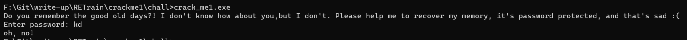

Bài này yêu cầu ta nhập password đúng. Cho file vào DIE thì đây là file 32-bit.

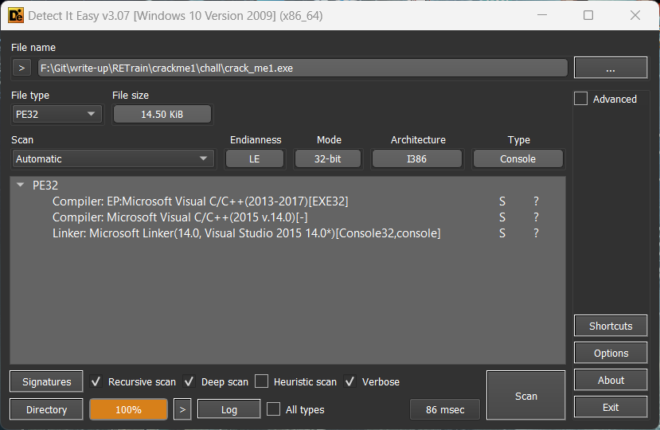

Chúng ta sẽ cùng phân tích chương trình trong ida

## IDA

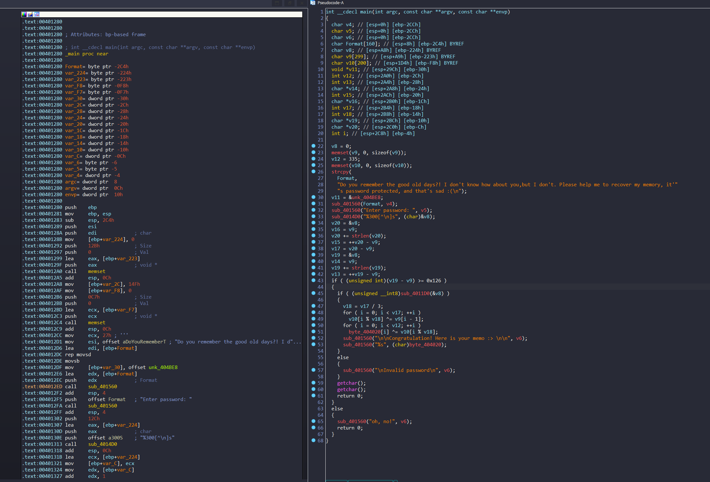 

Sau khi mở file bằng ida thì ta đã có thể xem luôn được mã giả C. 

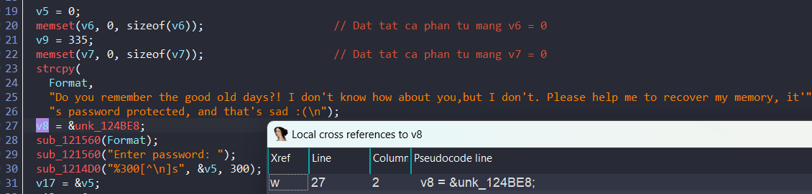

Ở phần đầu, chương trình sẽ đặt tất cả các phần tử mảng của `v6`, `v7` = 0.

`v8` được gán địa chỉ của `unk_404BE8`nhưng `v8` chỉ xuất hiện mỗi chỗ đó nên ta tạm thời bỏ qua. Tiếp đến in ra giá trị của biến `Format`.

`sub_4014D0("%300[^\n]s", (char)&v5);` dòng này yêu cầu chúng ta nhập kí tự vào địa chỉ của `v5`; `%300[^\n]` nghĩa là chúng ta được phép nhập tối đa 300 kí tự và kết thúc đọc khi gặp `\n`.

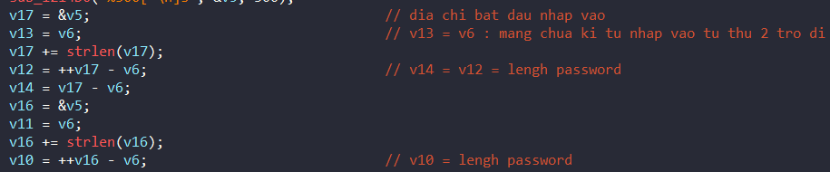

`v7` là địa chỉ lưu trữ kí tự thứ 1 ;`v6` là địa chỉ lưu trữ kí tự thứ 2 ta nhập vào. Do đó, cả đoạn code này chỉ là tính chiều dài `password` ta nhập vào.

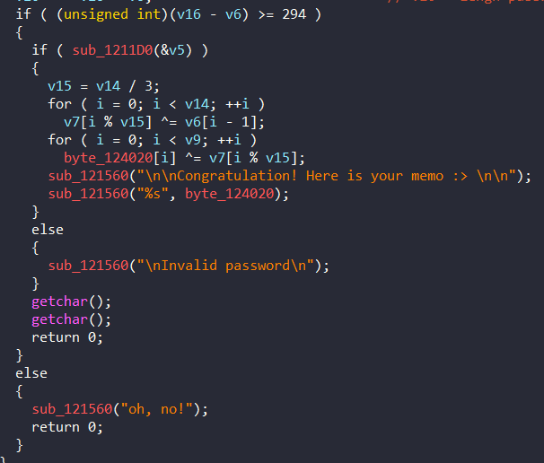

Sau đó, chương trình check xem độ dài `password` có >= 294 không. Nếu không thì print ra và kết thúc chương trình. Còn ngược lại thì sẽ gọi hàm `sub_1211D0` với tham số truyền vào là địa chỉ của `v5`(Địa chỉ lưu trữ `password` ta nhập vào)

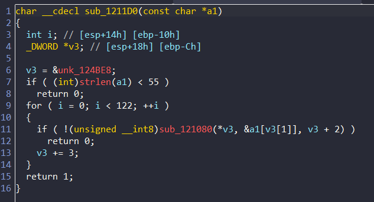

Đây là hàm `sub_1211D0`. Đầu tiên, `v3` được gán địa chỉ của`unk_404BE8`; sau đó kiểm tra password ta nhập vào có nhỏ hơn 55 không. Nếu không thì thực hiện vòng lặp for bên dưới.

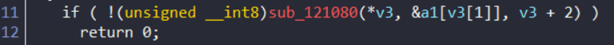

Bắt đầu vòng lặp, chương trình gọi hàm `sub_121080` và truyền vào 3 tham số: (giá trị tại địa chỉ `v3`, địa chỉ của password ta nhập vào, địa chỉ của `v3` + 2)

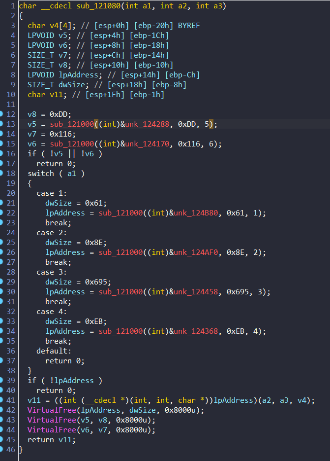

Ta thấy `v5`, `v6`,`lpAddress` được gán với giá trị trả về của hàm `sub_121000` nên ta sẽ vào phân tích hàm này:

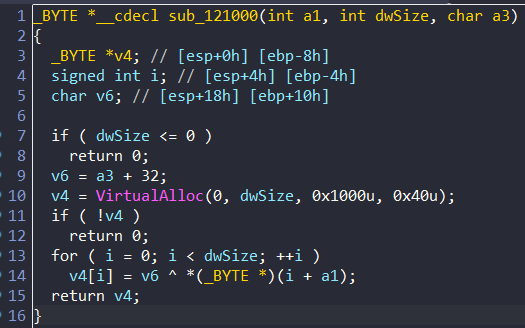

Đầu tiên, chương trình sẽ kiểm tra độ dài password ta nhập vào; tiếp đến `v6 = a3 + 0x20;` với a3 là kí tự cho trước. 

Sau đó chương trình dùng hàm API [VirtualAlloc](https://learn.microsoft.com/en-us/windows/win32/api/memoryapi/nf-memoryapi-virtualalloc) để cấp phát bộ nhớ ảo với kích thước là giá trị của `dwSize`. Nếu không tạo lập thành công thì `v4` = 0 và `return 0;`. Ngược lại thì `v4` là địa chỉ của vùng được phân bổ dùng vòng lặp for tính toán và ghi giá trị sau khi tính toán vào từng phần tử của mảng v4 

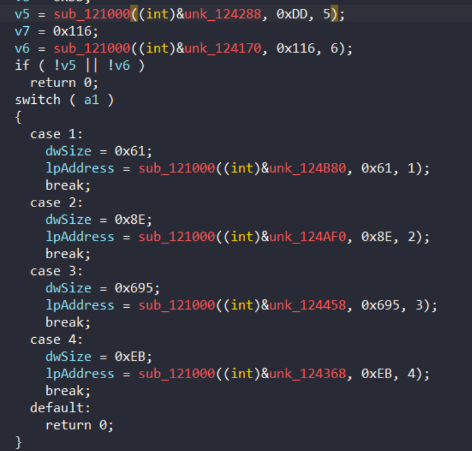

Nếu giá trị của v5 hoặc v6 được trả về địa chỉ hợp lệ thì sẽ vào bên trong hàm if và bắt đầu xét giá trị của a1. 

Trong mỗi case sẽ gọi hàm sub_311000 để cấp phát bộ nhớ ảo. Sau khi xong thì trả địa chỉ vào lpAddress. Nếu tạo thành công thì hàm lpAddress được gọi.


Mà a1 chính là giá trị v3 của hàm trước. Mà a1 chỉ thay đổi giá trị ở dòng 13.
Mình sẽ chuyển sang asm:

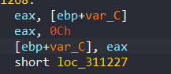
Ta thấy sau mỗi lần hàm sub_121080 trả về giá trị khác 0 thì địa chỉ của v3 tăng thêm `0xC`. Ấn vào v3 để xem giá trị:

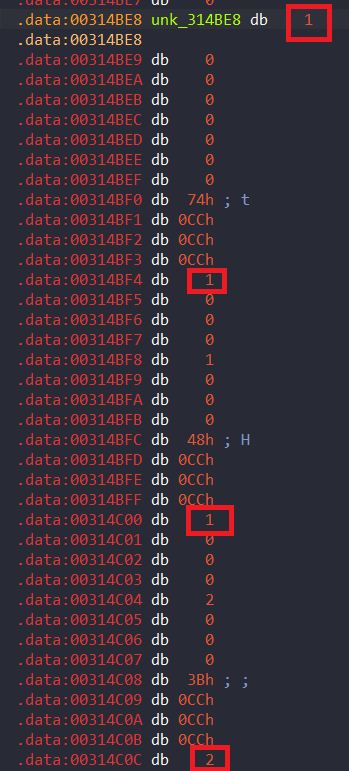

Giá trị ban đầu của `v3` = 1. Sau mỗi lần tăng giá trị v3 thì ta thấy `a1 = 1`  3 lần liên tiếp sau đó tiếp theo là ` a1 = 2`. 

=> Ở hàm switch case thì sẽ vào `case 1` 3 lần.

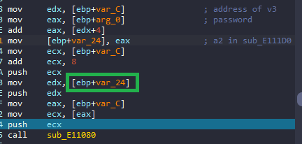

`a2` là tham số đầu vào đầu tiên của hàm `lpAddress`. Thông qua code asm thì a2 là kí tự ta nhập vào ở vị trí thứ tự là giá trị ở v3 + 4 byte

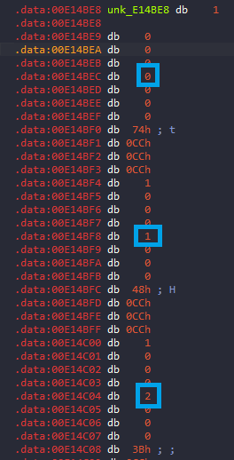

=> 3 kí tự đầu tiên lần lượt được truyền vào trong 3 lần đầu. Nên ta sẽ debug khi chương trình gọi hàm lpAddress xem ở đó chương trình làm gì.


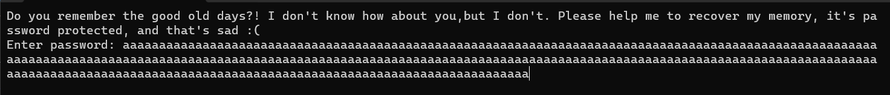

Do độ dài password dài hơn 294 kí tự nên mình để tạm 296 kí tự `a`

### Case 1

Đây là hàm lpAddress khi chương trình vào case 1:

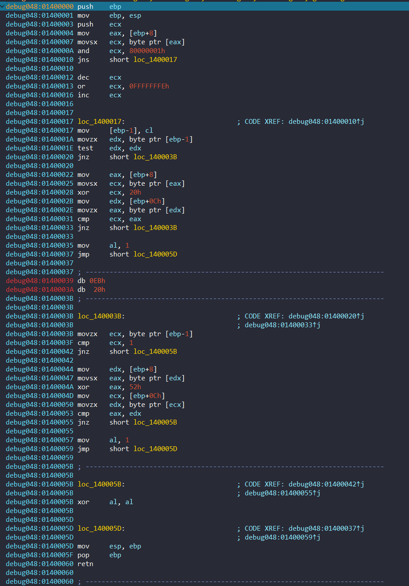

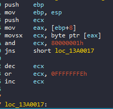

Đầu tiên,chương trình sẽ truyền vào `eax` địa chỉ password ta nhập vào, tiếp đến truyền kí tự ở địa chỉ đó vào `ecx`. Sau đó thực hiện phép toán `AND` để check xem `ecx` dương hay âm. Nếu là số dương thì sẽ nhảy đến `loc_13A0017`. Mà kí tự mình nhập vào luôn dương nên ta không cần quan tâm đến những dòng này

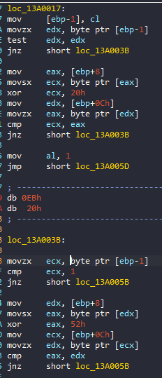

Sau khi nhảy đến `loc_13A0017` thì chương trình sẽ check kết quả của `cl`. Nếu `cl = 0` thì thực hiện tiếp, còn không thì nhảy tới `loc_13A003B`.

Ta thấy ở cả 2 cách encrypt này đều so sánh kết quả sau khi encrypt với giá trị tại địa chỉ nằm ở [ebp+0Ch] (Tức là `a3` khi bên mã giả). Mà `a3 = v3 + 2` tức là lấy giá trị của v3 + thêm 8 bit.

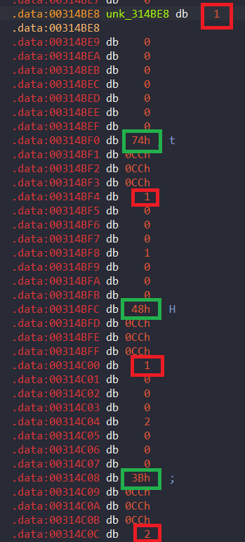

3 ô vuông màu xanh của hình trên chính là cipher của chúng ta trong 3 lần đầu này. 

Sau khi thử xor cả `0x20` và `0x52` thì kí tự thứ 1 và 2 encrypt cách 1 còn kí tự thứ 3 encrypt cách 2 vì nếu dùng cách còn lại thì kết quả sẽ không phải là ascii

**=> 3 kí tự đầu tiên là "Thi"**

### Case 2

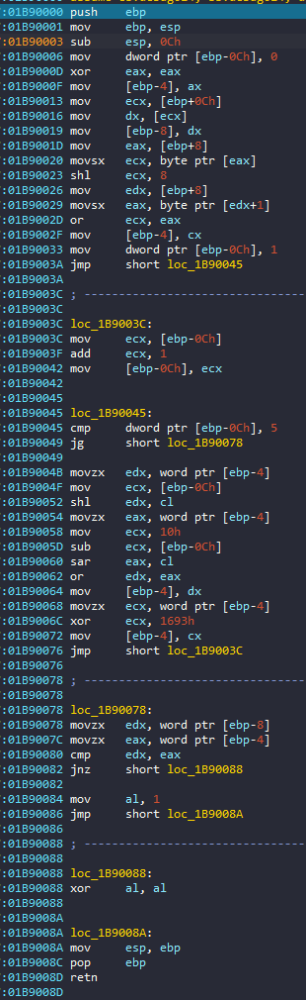

Đây là code tại địa chỉ `lpAddress` khi `a1 = 2`

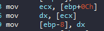

Tại [ebp + 0Ch] chứa địa chỉ của `v3 +2`.Nhưng lần này chương trình lấy 2 byte 

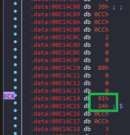

Do là little edian => `dx = 0x2481`

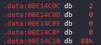

Giá trị ở `v3 + 4 byte` = 0x88 => a2 là kí tự thứ 137.

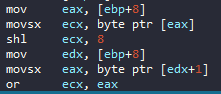

Đoạn code trên thì chương trình ghép kí tự thứ 137 và 138 vào bằng phép `OR`. 

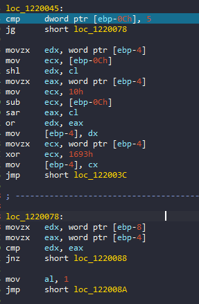

Đây là đoạn mã hóa của case này. Thì mình có viết script python mô phỏng lại cách encrypt:

```python
def  get_last_2_bytes(target):
    return target&0xffff
    
Merge = 0x6161
for i in range(1,6):
    Temp1 = Merge
    Temp2 = Merge
    Temp1 <<= i
    Temp2 >>= (0x10-i)
    Merge = (Temp1 | Temp2)
    Merge ^= 0x1693
    Merge = get_last_2_bytes(Merge)

print(hex(Merge))
```

Dưới đây là script reverse:
```python
def  get_last_2_bytes(target):
    return target&0xffff
for bf in range(0x2020,0x7F80):
    Merge = bf
    for i in range(1,6):
        Temp1 = Merge
        Temp2 = Merge
        Temp1 <<= i
        Temp2 >>= (0x10-i)
        Merge = (Temp1 | Temp2)
        Merge ^= 0x1693
        Merge = get_last_2_bytes(Merge)

    if Merge == 0x2481 :
        print(hex(bf),"\n")
        
```

Kết quả sau khi chạy: `0x6520`

**=> Kí tự thứ 137 và 138 là "e "**

### Case 3

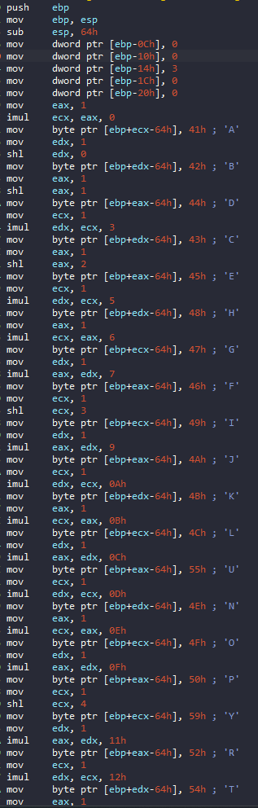 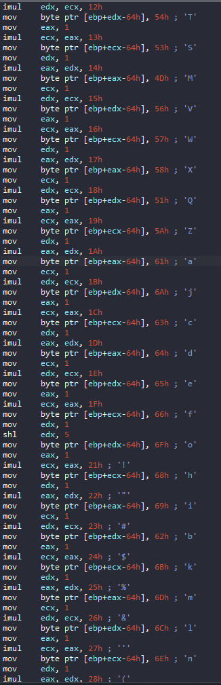 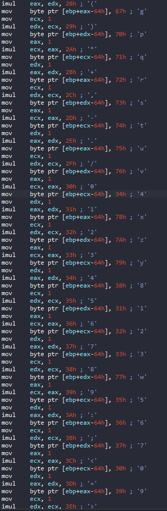 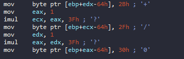

Đoạn đầu tiên này chỉ là set up một số giá trị và gán lần lượt các kí tự lên trên stack

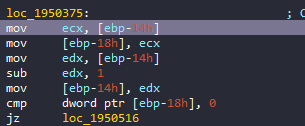

Do giá trị tại `[ebp-14h]` ban đầu được gán bằng 3 nên đoạn code trên là vòng lặp 3 lần. 

.png) 

Đây cũng là vòng lặp 3 lần lấy lần lượt 3 kí tự từ thứ tự 112 trong password ta nhập vào. hàm `loc_1950511` chỉ là nhảy lại về hàm `loc_195375` bên trên

.png)

Ta thấy tất cả các lệnh `imul` đều nhân với 0 tương đương với lệnh `mov eax, 0`. Đoạn code này sẽ lấy kí tự thứ 112 và encrypt. Được kết quả bao nhiêu thì lấy giá trị với thứ tự đó với mảng cho trước và so sánh với cipher. Cụ thể ở đây là `0x63`

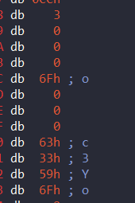 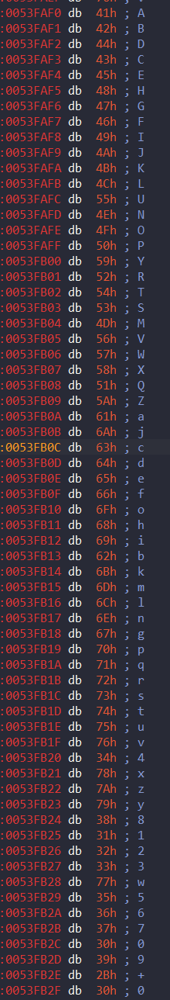

Giá trị `0x63` tại địa chỉ `0053FB0C` và `[ebp-64h] = 0053FAF0 ` => `eax = 0x1c` thì sẽ đúng. 

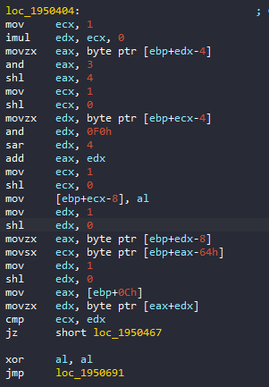

8 dòng đầu tiên chỉ là tính toán `eax` và `ecx = 1` => `edx` là kí tự thứ 113

Cũng tương tự như hàm loc trên là encrypt kí tự, được kết quả bao nhiêu lấy giá trị thứ tự đó với mảng cho trước và so sánh với cipher. Lần này là `0x33` => `eax = 0x37` 

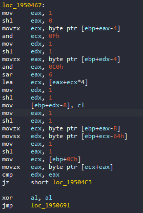

Kí tự thứ 114 với cipher là `0x59` => `ecx = 0x10`

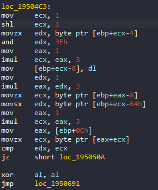

Đây là hàm chốt, cipher là `0x6f`=> `ecx = 0x20`

Mình viết script để decrypt:

```python
def  get_last_bytes(target):
    return target&0xff

for bf1 in range (0x20,0x7f):
    out1 = bf1
    bf1 = bf1 & 0xfc
    bf1 = bf1 >>2
    if bf1 == 0x1c :
        bf1 = out1
        bf1 = bf1 & 3
        bf1 = bf1 << 4
        for bf2 in range (0x20,0x7f):
            out2 = bf2
            bf2 = bf2 & 0xf0
            bf2 = bf2 >> 4
            if bf1 + bf2 == 0x37:
                bf2 = out2
                bf2 = bf2 & 0xf
                for bf3 in range (0x20,0x7f):
                    out3 = bf3
                    bf3 = bf3 & 0xc0
                    bf3 = bf3 >> 6
                    temp = bf3 + (bf2 *4)
                    if get_last_bytes(temp) == 0x10:
                        bf3 = out3
                        bf3 = bf3 & 0x3f
                        if bf3 == 0x20:
                            print(chr(out1),chr(out2),chr(out3))

```

**=> Kí tự thứ 112 và 113 là "st "**

### Case 4

Case 4 mình có ghi chú bên cạnh code để dễ đọc hơn vì đây là case có code dài nhất 

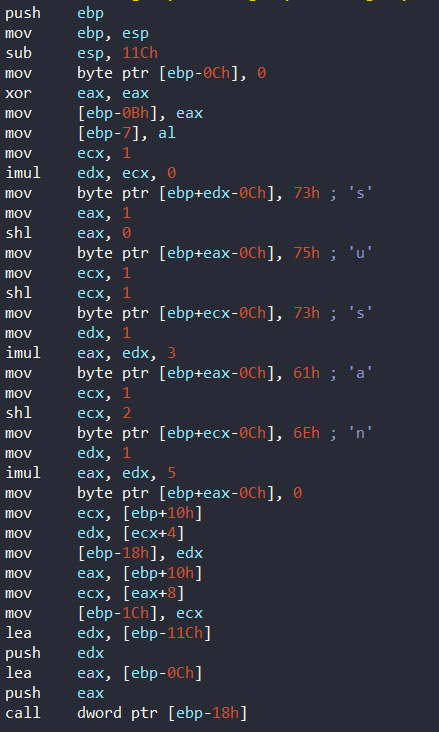

Ở đoạn code trên thì chương trình đơn giản chỉ tạo lập và gán các giá trị. Sau đó gọi hàm tại địa chỉ `[ebp-18]` với 1 lệnh push địa chỉ của "susan" lên

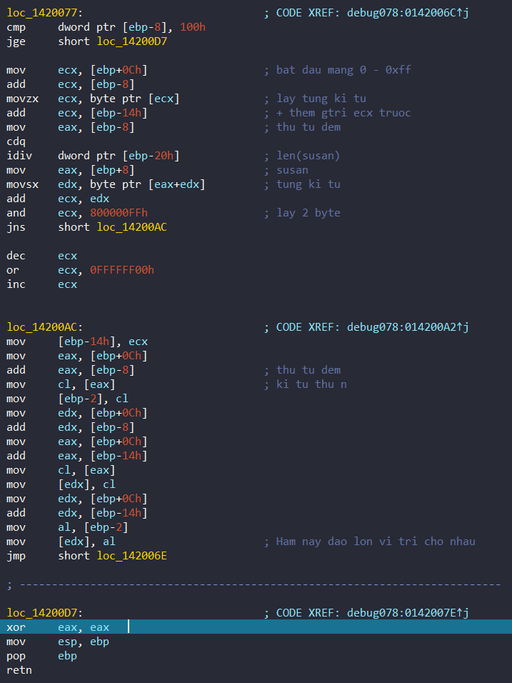

Hàm này sẽ khởi tạo 1 mảng có giá trị từ `0x00` -> `0xff`. Sau đó sẽ thay đổi giá trị giữa 2 vị trí. Do cách thức tính toán không thay đổi các giá trị nên kết thúc hàm sẽ cho ra một mảng không thay đổi qua các lần khác nhau:

```python
arr = [     0x73, 0xE9, 0x39, 0xD0, 0x98, 0xBB, 0xD6, 0x23, 0x16, 0x19, 
            0xFC, 0x7C, 0x0F, 0x32, 0x80, 0xB2, 0x9C, 0x57, 0x36, 0x9E, 
            0x91, 0x4D, 0xDF, 0x7A, 0x08, 0x42, 0x76, 0xA5, 0x11, 0xAD, 
            0x3E, 0xD2, 0x65, 0x4F, 0x71, 0x20, 0xA0, 0x28, 0xC3, 0x33, 
            0x4E, 0x6C, 0x79, 0x95, 0xAF, 0x6B, 0xC8, 0x70, 0xA2, 0x41, 
            0x92, 0xBA, 0x4B, 0xD1, 0xE3, 0xBC, 0x2B, 0xF4, 0x1C, 0x46, 
            0x78, 0xD9, 0xB6, 0x04, 0xED, 0x96, 0x68, 0x97, 0xF5, 0x09, 
            0x3A, 0x25, 0xEB, 0xBE, 0x49, 0xD8, 0x6D, 0xB5, 0x13, 0x7E, 
            0x00, 0x77, 0x6F, 0xB4, 0x0E, 0x1D, 0xB7, 0x2C, 0xCA, 0x7F, 
            0x3C, 0x5F, 0x7D, 0xA9, 0x88, 0xC4, 0xC0, 0x5E, 0x18, 0xCD, 
            0xE0, 0x0C, 0x62, 0x29, 0x54, 0x84, 0x07, 0x47, 0xC9, 0xF7, 
            0x2E, 0x06, 0xE2, 0x24, 0x83, 0xE4, 0x52, 0x15, 0x45, 0x43, 
            0xDA, 0x31, 0x82, 0x87, 0xB8, 0x14, 0xE7, 0xCF, 0xE5, 0x40, 
            0x1A, 0xDD, 0x9A, 0x35, 0x85, 0xF3, 0x63, 0xB1, 0xF0, 0x3D, 
            0x0D, 0xEA, 0x8B, 0xEE, 0x99, 0xAE, 0xA4, 0x51, 0xA8, 0x1E, 
            0x1B, 0xC5, 0x34, 0x4C, 0xFD, 0xFF, 0xEC, 0x37, 0x64, 0x75, 
            0x05, 0x01, 0x8C, 0x21, 0xA3, 0x60, 0x50, 0x6A, 0xB9, 0x5C, 
            0x53, 0xCE, 0x26, 0xC1, 0x3B, 0xF2, 0x3F, 0x66, 0xCC, 0x2F, 
            0xA1, 0x94, 0x56, 0x59, 0x4A, 0x9F, 0xD7, 0x89, 0x48, 0x5B, 
            0x12, 0x9D, 0x8F, 0x55, 0xD5, 0xBF, 0x5D, 0x2D, 0xF8, 0x1F, 
            0x30, 0x0B, 0x5A, 0x44, 0x67, 0x2A, 0x38, 0xF9, 0xF6, 0x6E, 
            0x7B, 0xEF, 0xE8, 0x8A, 0xDE, 0xC7, 0xF1, 0xA7, 0xCB, 0xDC, 
            0xD4, 0xD3, 0x27, 0xFE, 0x10, 0x02, 0xBD, 0x90, 0xFA, 0xE1, 
            0x69, 0xE6, 0x72, 0xAB, 0xAC, 0x22, 0x8E, 0x86, 0x9B, 0xFB, 
            0xA6, 0x17, 0xB3, 0x61, 0x74, 0xC6, 0xC2, 0x58, 0xB0, 0xAA, 
            0xDB, 0x93, 0x8D, 0x03, 0x0A, 0x81]
```

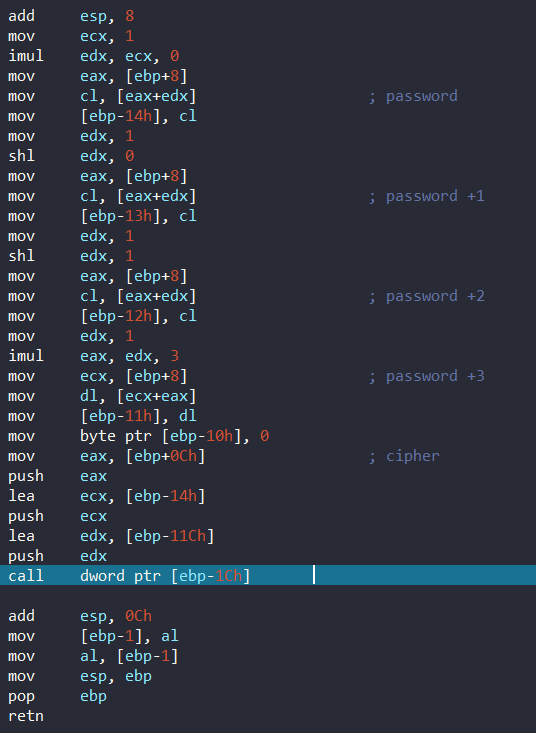

Đoạn code trên sẽ lấy 4 kí tự trong password ta nhập vào bắt đầu từ kí tự thứ 19. Tiếp đến sẽ push địa chỉ của `cipher`, `password` vào trong hàm `[ebp-1Ch]`

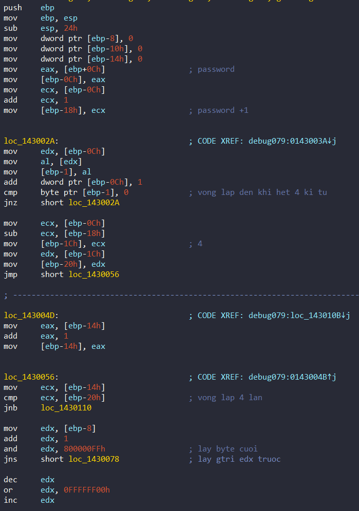

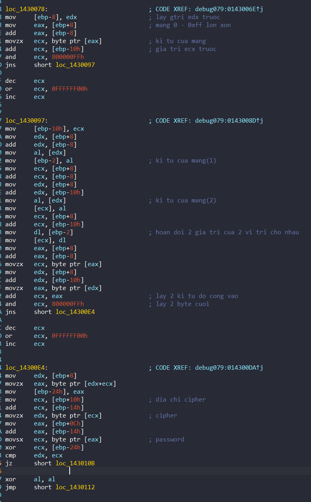

Khi vào hàm, chương trình sẽ tính toán giá trị ở [ebp-8] và [ebp-10]. 

Tiếp theo sẽ hoán đổi giá trị của 2 phần tử vị trí [ebp-8] và [ebp-10] trong mảng vừa nãy; đồng thời lấy 2 giá trị đó cộng tổng, được bao nhiêu thì sẽ lấy giá trị tại vị trí đó `XOR` với kí tự đang xét và so sánh với cipher.

Qua đó mình viết script reverse case4:

```python 
arr = [0x73, 0xE9, 0x39, 0xD0, 0x98, 0xBB, 0xD6, 0x23, 0x16, 0x19, 
  0xFC, 0x7C, 0x0F, 0x32, 0x80, 0xB2, 0x9C, 0x57, 0x36, 0x9E, 
  0x91, 0x4D, 0xDF, 0x7A, 0x08, 0x42, 0x76, 0xA5, 0x11, 0xAD, 
  0x3E, 0xD2, 0x65, 0x4F, 0x71, 0x20, 0xA0, 0x28, 0xC3, 0x33, 
  0x4E, 0x6C, 0x79, 0x95, 0xAF, 0x6B, 0xC8, 0x70, 0xA2, 0x41, 
  0x92, 0xBA, 0x4B, 0xD1, 0xE3, 0xBC, 0x2B, 0xF4, 0x1C, 0x46, 
  0x78, 0xD9, 0xB6, 0x04, 0xED, 0x96, 0x68, 0x97, 0xF5, 0x09, 
  0x3A, 0x25, 0xEB, 0xBE, 0x49, 0xD8, 0x6D, 0xB5, 0x13, 0x7E, 
  0x00, 0x77, 0x6F, 0xB4, 0x0E, 0x1D, 0xB7, 0x2C, 0xCA, 0x7F, 
  0x3C, 0x5F, 0x7D, 0xA9, 0x88, 0xC4, 0xC0, 0x5E, 0x18, 0xCD, 
  0xE0, 0x0C, 0x62, 0x29, 0x54, 0x84, 0x07, 0x47, 0xC9, 0xF7, 
  0x2E, 0x06, 0xE2, 0x24, 0x83, 0xE4, 0x52, 0x15, 0x45, 0x43, 
  0xDA, 0x31, 0x82, 0x87, 0xB8, 0x14, 0xE7, 0xCF, 0xE5, 0x40, 
  0x1A, 0xDD, 0x9A, 0x35, 0x85, 0xF3, 0x63, 0xB1, 0xF0, 0x3D, 
  0x0D, 0xEA, 0x8B, 0xEE, 0x99, 0xAE, 0xA4, 0x51, 0xA8, 0x1E, 
  0x1B, 0xC5, 0x34, 0x4C, 0xFD, 0xFF, 0xEC, 0x37, 0x64, 0x75, 
  0x05, 0x01, 0x8C, 0x21, 0xA3, 0x60, 0x50, 0x6A, 0xB9, 0x5C, 
  0x53, 0xCE, 0x26, 0xC1, 0x3B, 0xF2, 0x3F, 0x66, 0xCC, 0x2F, 
  0xA1, 0x94, 0x56, 0x59, 0x4A, 0x9F, 0xD7, 0x89, 0x48, 0x5B, 
  0x12, 0x9D, 0x8F, 0x55, 0xD5, 0xBF, 0x5D, 0x2D, 0xF8, 0x1F, 
  0x30, 0x0B, 0x5A, 0x44, 0x67, 0x2A, 0x38, 0xF9, 0xF6, 0x6E, 
  0x7B, 0xEF, 0xE8, 0x8A, 0xDE, 0xC7, 0xF1, 0xA7, 0xCB, 0xDC, 
  0xD4, 0xD3, 0x27, 0xFE, 0x10, 0x02, 0xBD, 0x90, 0xFA, 0xE1, 
  0x69, 0xE6, 0x72, 0xAB, 0xAC, 0x22, 0x8E, 0x86, 0x9B, 0xFB, 
  0xA6, 0x17, 0xB3, 0x61, 0x74, 0xC6, 0xC2, 0x58, 0xB0, 0xAA, 
  0xDB, 0x93, 0x8D, 0x03, 0x0A, 0x81]
cipher = [ 0xDD, 0x20, 0xB1, 0x1A]
def  get_last_bytes(target):
    return target&0xff
ebp8 = 0
ebp10 = 0
for p in range (4):
    ebp8 = get_last_bytes(ebp8 + 1)
    ebp10 = get_last_bytes(arr[ebp8]+ ebp10)
    temp = arr[ebp8]
    arr[ebp8] = arr[ebp10]
    arr[ebp10] = temp
    sum = get_last_bytes(arr[ebp8] + arr[ebp10])
    result = arr[sum] ^ cipher[p]
    print(chr(result),end="")
    
```
**=> Kí tự thứ 19,20,21 và 22 là "usly"**

## Decrypt

Dựa vào cách giải quyết từng case bên trên, mình đã gộp lại thành 1 script để tìm password:

```python
cipher = [ 
  0x01, 0x00, 0x00, 0x00, 0x00, 0x00, 0x00, 0x00, 0x74, 0xCC, 
  0xCC, 0xCC, 0x01, 0x00, 0x00, 0x00, 0x01, 0x00, 0x00, 0x00, 
  0x48, 0xCC, 0xCC, 0xCC, 0x01, 0x00, 0x00, 0x00, 0x02, 0x00, 
  0x00, 0x00, 0x3B, 0xCC, 0xCC, 0xCC, 0x02, 0x00, 0x00, 0x00, 
  0x88, 0x00, 0x00, 0x00, 0x81, 0x24, 0xCC, 0xCC, 0x03, 0x00, 
  0x00, 0x00, 0x6F, 0x00, 0x00, 0x00, 0x63, 0x33, 0x59, 0x6F, 
  0x02, 0x00, 0x00, 0x00, 0x84, 0x00, 0x00, 0x00, 0x01, 0x01, 
  0xCC, 0xCC, 0x02, 0x00, 0x00, 0x00, 0x0A, 0x00, 0x00, 0x00, 
  0x35, 0xAF, 0xCC, 0xCC, 0x01, 0x00, 0x00, 0x00, 0xD0, 0x00, 
  0x00, 0x00, 0x33, 0xCC, 0xCC, 0xCC, 0x03, 0x00, 0x00, 0x00, 
  0x0F, 0x00, 0x00, 0x00, 0x64, 0x4D, 0x78, 0x76, 0x04, 0x00, 
  0x00, 0x00, 0x12, 0x00, 0x00, 0x00, 0xDD, 0x20, 0xB1, 0x1A, 
  0x01, 0x00, 0x00, 0x00, 0x06, 0x01, 0x00, 0x00, 0x0C, 0xCC, 
  0xCC, 0xCC, 0x03, 0x00, 0x00, 0x00, 0xE8, 0x00, 0x00, 0x00, 
  0x6A, 0x44, 0x42, 0x35, 0x02, 0x00, 0x00, 0x00, 0x1D, 0x00, 
  0x00, 0x00, 0xA6, 0x21, 0xCC, 0xCC, 0x02, 0x00, 0x00, 0x00, 
  0x1F, 0x00, 0x00, 0x00, 0xBE, 0x8A, 0xCC, 0xCC, 0x01, 0x00, 
  0x00, 0x00, 0x21, 0x00, 0x00, 0x00, 0x4C, 0xCC, 0xCC, 0xCC, 
  0x02, 0x00, 0x00, 0x00, 0x22, 0x00, 0x00, 0x00, 0x26, 0x0E, 
  0xCC, 0xCC, 0x01, 0x00, 0x00, 0x00, 0x24, 0x00, 0x00, 0x00, 
  0x35, 0xCC, 0xCC, 0xCC, 0x01, 0x00, 0x00, 0x00, 0x5D, 0x00, 
  0x00, 0x00, 0x3B, 0xCC, 0xCC, 0xCC, 0x03, 0x00, 0x00, 0x00, 
  0x2B, 0x00, 0x00, 0x00, 0x6A, 0x45, 0x39, 0x75, 0x04, 0x00, 
  0x00, 0x00, 0x16, 0x00, 0x00, 0x00, 0x88, 0x3F, 0xED, 0x0D, 
  0x03, 0x00, 0x00, 0x00, 0xEB, 0x00, 0x00, 0x00, 0x6A, 0x33, 
  0x56, 0x7A, 0x02, 0x00, 0x00, 0x00, 0x32, 0x00, 0x00, 0x00, 
  0x35, 0xAF, 0xCC, 0xCC, 0x02, 0x00, 0x00, 0x00, 0x30, 0x00, 
  0x00, 0x00, 0xAB, 0x2F, 0xCC, 0xCC, 0x02, 0x00, 0x00, 0x00, 
  0x08, 0x00, 0x00, 0x00, 0x81, 0x36, 0xCC, 0xCC, 0x03, 0x00, 
  0x00, 0x00, 0x34, 0x00, 0x00, 0x00, 0x6A, 0x6C, 0x63, 0x75, 
  0x01, 0x00, 0x00, 0x00, 0x37, 0x00, 0x00, 0x00, 0x00, 0xCC, 
  0xCC, 0xCC, 0x02, 0x00, 0x00, 0x00, 0x38, 0x00, 0x00, 0x00, 
  0x25, 0x3C, 0xCC, 0xCC, 0x03, 0x00, 0x00, 0x00, 0x53, 0x00, 
  0x00, 0x00, 0x49, 0x46, 0x52, 0x67, 0x01, 0x00, 0x00, 0x00, 
  0x3E, 0x00, 0x00, 0x00, 0x21, 0xCC, 0xCC, 0xCC, 0x01, 0x00, 
  0x00, 0x00, 0x3F, 0x00, 0x00, 0x00, 0x54, 0xCC, 0xCC, 0xCC, 
  0x01, 0x00, 0x00, 0x00, 0x92, 0x00, 0x00, 0x00, 0x37, 0xCC, 
  0xCC, 0xCC, 0x01, 0x00, 0x00, 0x00, 0x86, 0x00, 0x00, 0x00, 
  0x74, 0xCC, 0xCC, 0xCC, 0x04, 0x00, 0x00, 0x00, 0x09, 0x01, 
  0x00, 0x00, 0xC0, 0x36, 0xFD, 0x13, 0x01, 0x00, 0x00, 0x00, 
  0x4A, 0x00, 0x00, 0x00, 0x00, 0xCC, 0xCC, 0xCC, 0x01, 0x00, 
  0x00, 0x00, 0x0D, 0x01, 0x00, 0x00, 0x52, 0xCC, 0xCC, 0xCC, 
  0x04, 0x00, 0x00, 0x00, 0x4D, 0x00, 0x00, 0x00, 0xC1, 0x3D, 
  0xBA, 0x43, 0x03, 0x00, 0x00, 0x00, 0x1C, 0x01, 0x00, 0x00, 
  0x64, 0x32, 0x77, 0x6F, 0x04, 0x00, 0x00, 0x00, 0x3A, 0x00, 
  0x00, 0x00, 0xCD, 0x73, 0xB0, 0x0C, 0x04, 0x00, 0x00, 0x00, 
  0x56, 0x00, 0x00, 0x00, 0xCD, 0x73, 0xB9, 0x06, 0x03, 0x00, 
  0x00, 0x00, 0x5A, 0x00, 0x00, 0x00, 0x51, 0x32, 0x6D, 0x79, 
  0x04, 0x00, 0x00, 0x00, 0x0F, 0x01, 0x00, 0x00, 0xCB, 0x36, 
  0xAE, 0x10, 0x01, 0x00, 0x00, 0x00, 0x5E, 0x00, 0x00, 0x00, 
  0x3D, 0xCC, 0xCC, 0xCC, 0x02, 0x00, 0x00, 0x00, 0x5F, 0x00, 
  0x00, 0x00, 0x01, 0x21, 0xCC, 0xCC, 0x04, 0x00, 0x00, 0x00, 
  0x68, 0x00, 0x00, 0x00, 0x88, 0x27, 0xB5, 0x06, 0x01, 0x00, 
  0x00, 0x00, 0xBA, 0x00, 0x00, 0x00, 0x44, 0xCC, 0xCC, 0xCC, 
  0x04, 0x00, 0x00, 0x00, 0x9A, 0x00, 0x00, 0x00, 0xDC, 0x3A, 
  0xBA, 0x06, 0x03, 0x00, 0x00, 0x00, 0x6C, 0x00, 0x00, 0x00, 
  0x49, 0x46, 0x4A, 0x6D, 0x04, 0x00, 0x00, 0x00, 0x04, 0x00, 
  0x00, 0x00, 0x88, 0x62, 0xAE, 0x43, 0x04, 0x00, 0x00, 0x00, 
  0x72, 0x00, 0x00, 0x00, 0xC1, 0x20, 0xFD, 0x0E, 0x02, 0x00, 
  0x00, 0x00, 0xC7, 0x00, 0x00, 0x00, 0x3D, 0x86, 0xCC, 0xCC, 
  0x01, 0x00, 0x00, 0x00, 0x7A, 0x00, 0x00, 0x00, 0x2B, 0xCC, 
  0xCC, 0xCC, 0x04, 0x00, 0x00, 0x00, 0x7B, 0x00, 0x00, 0x00, 
  0x88, 0x27, 0xB8, 0x0D, 0x01, 0x00, 0x00, 0x00, 0xC6, 0x00, 
  0x00, 0x00, 0x0E, 0xCC, 0xCC, 0xCC, 0x01, 0x00, 0x00, 0x00, 
  0x83, 0x00, 0x00, 0x00, 0x2B, 0xCC, 0xCC, 0xCC, 0x01, 0x00, 
  0x00, 0x00, 0x03, 0x00, 0x00, 0x00, 0x01, 0xCC, 0xCC, 0xCC, 
  0x04, 0x00, 0x00, 0x00, 0x93, 0x00, 0x00, 0x00, 0x88, 0x23, 
  0xBC, 0x13, 0x04, 0x00, 0x00, 0x00, 0xA9, 0x00, 0x00, 0x00, 
  0x88, 0x37, 0xB2, 0x43, 0x03, 0x00, 0x00, 0x00, 0x0C, 0x00, 
  0x00, 0x00, 0x5A, 0x47, 0x6D, 0x43, 0x04, 0x00, 0x00, 0x00, 
  0x8A, 0x00, 0x00, 0x00, 0xCE, 0x36, 0xBC, 0x11, 0x04, 0x00, 
  0x00, 0x00, 0x8E, 0x00, 0x00, 0x00, 0xDB, 0x73, 0xBC, 0x11, 
  0x04, 0x00, 0x00, 0x00, 0xAF, 0x00, 0x00, 0x00, 0xD1, 0x27, 
  0xB5, 0x0A, 0x02, 0x00, 0x00, 0x00, 0x44, 0x00, 0x00, 0x00, 
  0x25, 0xA5, 0xCC, 0xCC, 0x01, 0x00, 0x00, 0x00, 0x97, 0x00, 
  0x00, 0x00, 0x37, 0xCC, 0xCC, 0xCC, 0x02, 0x00, 0x00, 0x00, 
  0x98, 0x00, 0x00, 0x00, 0x01, 0x2F, 0xCC, 0xCC, 0x04, 0x00, 
  0x00, 0x00, 0x61, 0x00, 0x00, 0x00, 0xDC, 0x3C, 0xFD, 0x02, 
  0x01, 0x00, 0x00, 0x00, 0x9E, 0x00, 0x00, 0x00, 0x52, 0xCC, 
  0xCC, 0xCC, 0x04, 0x00, 0x00, 0x00, 0x9F, 0x00, 0x00, 0x00, 
  0xDB, 0x7D, 0xFD, 0x3A, 0x04, 0x00, 0x00, 0x00, 0x46, 0x00, 
  0x00, 0x00, 0xCB, 0x26, 0xB1, 0x17, 0x01, 0x00, 0x00, 0x00, 
  0xA7, 0x00, 0x00, 0x00, 0x33, 0xCC, 0xCC, 0xCC, 0x01, 0x00, 
  0x00, 0x00, 0x2F, 0x00, 0x00, 0x00, 0x00, 0xCC, 0xCC, 0xCC, 
  0x01, 0x00, 0x00, 0x00, 0x87, 0x00, 0x00, 0x00, 0x48, 0xCC, 
  0xCC, 0xCC, 0x01, 0x00, 0x00, 0x00, 0xAD, 0x00, 0x00, 0x00, 
  0x33, 0xCC, 0xCC, 0xCC, 0x01, 0x00, 0x00, 0x00, 0xAE, 0x00, 
  0x00, 0x00, 0x4E, 0xCC, 0xCC, 0xCC, 0x04, 0x00, 0x00, 0x00, 
  0xC9, 0x00, 0x00, 0x00, 0xC7, 0x26, 0xFD, 0x00, 0x02, 0x00, 
  0x00, 0x00, 0xB3, 0x00, 0x00, 0x00, 0x22, 0xA1, 0xCC, 0xCC, 
  0x01, 0x00, 0x00, 0x00, 0xB5, 0x00, 0x00, 0x00, 0x00, 0xCC, 
  0xCC, 0xCC, 0x04, 0x00, 0x00, 0x00, 0xB6, 0x00, 0x00, 0x00, 
  0xD1, 0x3C, 0xA8, 0x43, 0x03, 0x00, 0x00, 0x00, 0x65, 0x00, 
  0x00, 0x00, 0x51, 0x33, 0x59, 0x73, 0x01, 0x00, 0x00, 0x00, 
  0xBB, 0x00, 0x00, 0x00, 0x37, 0xCC, 0xCC, 0xCC, 0x01, 0x00, 
  0x00, 0x00, 0xBC, 0x00, 0x00, 0x00, 0x31, 0xCC, 0xCC, 0xCC, 
  0x04, 0x00, 0x00, 0x00, 0xD2, 0x00, 0x00, 0x00, 0xDC, 0x73, 
  0xA9, 0x0C, 0x03, 0x00, 0x00, 0x00, 0xBF, 0x00, 0x00, 0x00, 
  0x5A, 0x54, 0x42, 0x38, 0x02, 0x00, 0x00, 0x00, 0xC2, 0x00, 
  0x00, 0x00, 0x81, 0x21, 0xCC, 0xCC, 0x01, 0x00, 0x00, 0x00, 
  0xDA, 0x00, 0x00, 0x00, 0x4E, 0xCC, 0xCC, 0xCC, 0x04, 0x00, 
  0x00, 0x00, 0x7F, 0x00, 0x00, 0x00, 0xC9, 0x30, 0xB4, 0x17, 
  0x04, 0x00, 0x00, 0x00, 0x76, 0x00, 0x00, 0x00, 0xCD, 0x21, 
  0xB8, 0x0F, 0x04, 0x00, 0x00, 0x00, 0xFB, 0x00, 0x00, 0x00, 
  0xCD, 0x73, 0xAD, 0x11, 0x02, 0x00, 0x00, 0x00, 0xCD, 0x00, 
  0x00, 0x00, 0xA6, 0x26, 0xCC, 0xCC, 0x01, 0x00, 0x00, 0x00, 
  0xCF, 0x00, 0x00, 0x00, 0x00, 0xCC, 0xCC, 0xCC, 0x02, 0x00, 
  0x00, 0x00, 0x4B, 0x00, 0x00, 0x00, 0x25, 0x2C, 0xCC, 0xCC, 
  0x01, 0x00, 0x00, 0x00, 0xD1, 0x00, 0x00, 0x00, 0x31, 0xCC, 
  0xCC, 0xCC, 0x02, 0x00, 0x00, 0x00, 0xBD, 0x00, 0x00, 0x00, 
  0xA3, 0x22, 0xCC, 0xCC, 0x03, 0x00, 0x00, 0x00, 0x13, 0x01, 
  0x00, 0x00, 0x49, 0x47, 0x6D, 0x79, 0x02, 0x00, 0x00, 0x00, 
  0xC4, 0x00, 0x00, 0x00, 0x26, 0xA4, 0xCC, 0xCC, 0x03, 0x00, 
  0x00, 0x00, 0xEF, 0x00, 0x00, 0x00, 0x6A, 0x47, 0x6D, 0x6C, 
  0x04, 0x00, 0x00, 0x00, 0xDC, 0x00, 0x00, 0x00, 0xCD, 0x73, 
  0xBC, 0x0D, 0x01, 0x00, 0x00, 0x00, 0xEE, 0x00, 0x00, 0x00, 
  0x00, 0xCC, 0xCC, 0xCC, 0x04, 0x00, 0x00, 0x00, 0xE4, 0x00, 
  0x00, 0x00, 0xC6, 0x27, 0xAF, 0x0C, 0x03, 0x00, 0x00, 0x00, 
  0x1A, 0x00, 0x00, 0x00, 0x5A, 0x31, 0x39, 0x55, 0x01, 0x00, 
  0x00, 0x00, 0x2E, 0x00, 0x00, 0x00, 0x35, 0xCC, 0xCC, 0xCC, 
  0x04, 0x00, 0x00, 0x00, 0xE0, 0x00, 0x00, 0x00, 0xCC, 0x73, 
  0xBE, 0x0C, 0x01, 0x00, 0x00, 0x00, 0xDB, 0x00, 0x00, 0x00, 
  0x35, 0xCC, 0xCC, 0xCC, 0x02, 0x00, 0x00, 0x00, 0xF2, 0x00, 
  0x00, 0x00, 0x8C, 0xA4, 0xCC, 0xCC, 0x04, 0x00, 0x00, 0x00, 
  0xF4, 0x00, 0x00, 0x00, 0x88, 0x32, 0xB3, 0x07, 0x02, 0x00, 
  0x00, 0x00, 0x25, 0x00, 0x00, 0x00, 0xA7, 0x39, 0xCC, 0xCC, 
  0x04, 0x00, 0x00, 0x00, 0x40, 0x00, 0x00, 0x00, 0x88, 0x37, 
  0xB4, 0x05, 0x01, 0x00, 0x00, 0x00, 0xFF, 0x00, 0x00, 0x00, 
  0x3D, 0xCC, 0xCC, 0xCC, 0x03, 0x00, 0x00, 0x00, 0x00, 0x01, 
  0x00, 0x00, 0x51, 0x32, 0x56, 0x6B, 0x03, 0x00, 0x00, 0x00, 
  0x03, 0x01, 0x00, 0x00, 0x64, 0x58, 0x4A, 0x6D, 0x04, 0x00, 
  0x00, 0x00, 0x27, 0x00, 0x00, 0x00, 0xC7, 0x1D, 0xBA, 0x3C, 
  0x02, 0x00, 0x00, 0x00, 0x07, 0x01, 0x00, 0x00, 0x2B, 0x06, 
  0xCC, 0xCC, 0x04, 0x00, 0x00, 0x00, 0xA3, 0x00, 0x00, 0x00, 
  0xC7, 0x26, 0xFD, 0x00, 0x01, 0x00, 0x00, 0x00, 0xA8, 0x00, 
  0x00, 0x00, 0x4E, 0xCC, 0xCC, 0xCC, 0x01, 0x00, 0x00, 0x00, 
  0x0E, 0x01, 0x00, 0x00, 0x3D, 0xCC, 0xCC, 0xCC, 0x03, 0x00, 
  0x00, 0x00, 0xF8, 0x00, 0x00, 0x00, 0x49, 0x46, 0x52, 0x67, 
  0x04, 0x00, 0x00, 0x00, 0xD6, 0x00, 0x00, 0x00, 0x88, 0x30, 
  0xB5, 0x02, 0x02, 0x00, 0x00, 0x00, 0x16, 0x01, 0x00, 0x00, #
  0x25, 0x86, 0xCC, 0xCC, 0x04, 0x00, 0x00, 0x00, 0x18, 0x01, 
  0x00, 0x00, 0xDC, 0x20, 0xFD, 0x0C, 0x02, 0x00, 0x00, 0x00, 
  0x51, 0x00, 0x00, 0x00, 0xA8, 0xA2, 0xCC, 0xCC, 0x03, 0x00, 
  0x00, 0x00, 0x1F, 0x01, 0x00, 0x00, 0x63, 0x6C, 0x56, 0x33, 
  0x03, 0x00, 0x00, 0x00, 0x22, 0x01, 0x00, 0x00, 0x51, 0x58, 
  0x4A, 0x6B, 0x01, 0x00, 0x00, 0x00, 0x25, 0x01, 0x00, 0x00, 
  0x0E, 0xCC, 0xCC, 0xCC
]
flag = ["a"]*294
charr = [ 0x41, 0x42, 0x44, 0x43, 0x45, 0x48, 0x47, 0x46, 0x49, 0x4A, 
  0x4B, 0x4C, 0x55, 0x4E, 0x4F, 0x50, 0x59, 0x52, 0x54, 0x53, 
  0x4D, 0x56, 0x57, 0x58, 0x51, 0x5A, 0x61, 0x6A, 0x63, 0x64, 
  0x65, 0x66, 0x6F, 0x68, 0x69, 0x62, 0x6B, 0x6D, 0x6C, 0x6E, 
  0x67, 0x70, 0x71, 0x72, 0x73, 0x74, 0x75, 0x76, 0x34, 0x78, 
  0x7A, 0x79, 0x38, 0x31, 0x32, 0x33, 0x77, 0x35, 0x36, 0x37, 
  0x30, 0x39, 0x2B, 0x30]
def  get_last_2_bytes(target):
    return target&0xffff
def  get_last_bytes(target):
    return target&0xff
def find(target):
    for u in range(len(charr)):
        if charr[u] == target:
            return u

def decrypt(case, pos, c1,c2,c3,c4 ):
    match case:
        case 1:
            temp = c1 ^ 0x52
            if temp & 0x80000001 == 1 and temp >= 0x20 and temp < 0x7f:
                flag[pos] = chr(temp)
            else:
                temp = c1 ^ 0x20 
                flag[pos] = chr(temp)
        case 2:
            Cipherr = (c2<<8) + c1
            for bf in range(0x2020,0x7F80):
                Merge = bf
                for i in range(1,6):
                    Temp1 = Merge
                    Temp2 = Merge
                    Temp1 <<= i
                    Temp2 >>= (0x10-i)
                    Merge = (Temp1 | Temp2)
                    Merge ^= 0x1693
                    Merge = get_last_2_bytes(Merge)

                if Merge == Cipherr :
                    flag[pos] = chr(bf>>8 )
                    flag[pos+1] = chr(bf&0xff)
        case 3:
            for bf1 in range (0x20,0x7f):
                out1 = bf1
                bf1 = bf1 & 0xfc
                bf1 = bf1 >>2
                if bf1 == find(c1) :
                    bf1 = out1
                    bf1 = bf1 & 3
                    bf1 = bf1 << 4
                    for bf2 in range (0x20,0x7f):
                        out2 = bf2
                        bf2 = bf2 & 0xf0
                        bf2 = bf2 >> 4
                        if bf1 + bf2 == find(c2):
                            bf2 = out2
                            bf2 = bf2 & 0xf
                            for bf3 in range (0x20,0x7f):
                                out3 = bf3
                                bf3 = bf3 & 0xc0
                                bf3 = bf3 >> 6
                                temp = bf3 + (bf2 *4)
                                if get_last_bytes(temp) == find(c3):
                                    bf3 = out3
                                    bf3 = bf3 & 0x3f
                                    if bf3 == find(c4):
                                        flag[pos] =  chr(out1)
                                        flag[pos+1] = chr(out2)
                                        flag[pos+2] = chr(out3)
        case 4:
            arr = [0x73, 0xE9, 0x39, 0xD0, 0x98, 0xBB, 0xD6, 0x23, 0x16, 0x19, 
            0xFC, 0x7C, 0x0F, 0x32, 0x80, 0xB2, 0x9C, 0x57, 0x36, 0x9E, 
            0x91, 0x4D, 0xDF, 0x7A, 0x08, 0x42, 0x76, 0xA5, 0x11, 0xAD, 
            0x3E, 0xD2, 0x65, 0x4F, 0x71, 0x20, 0xA0, 0x28, 0xC3, 0x33, 
            0x4E, 0x6C, 0x79, 0x95, 0xAF, 0x6B, 0xC8, 0x70, 0xA2, 0x41, 
            0x92, 0xBA, 0x4B, 0xD1, 0xE3, 0xBC, 0x2B, 0xF4, 0x1C, 0x46, 
            0x78, 0xD9, 0xB6, 0x04, 0xED, 0x96, 0x68, 0x97, 0xF5, 0x09, 
            0x3A, 0x25, 0xEB, 0xBE, 0x49, 0xD8, 0x6D, 0xB5, 0x13, 0x7E, 
            0x00, 0x77, 0x6F, 0xB4, 0x0E, 0x1D, 0xB7, 0x2C, 0xCA, 0x7F, 
            0x3C, 0x5F, 0x7D, 0xA9, 0x88, 0xC4, 0xC0, 0x5E, 0x18, 0xCD, 
            0xE0, 0x0C, 0x62, 0x29, 0x54, 0x84, 0x07, 0x47, 0xC9, 0xF7, 
            0x2E, 0x06, 0xE2, 0x24, 0x83, 0xE4, 0x52, 0x15, 0x45, 0x43, 
            0xDA, 0x31, 0x82, 0x87, 0xB8, 0x14, 0xE7, 0xCF, 0xE5, 0x40, 
            0x1A, 0xDD, 0x9A, 0x35, 0x85, 0xF3, 0x63, 0xB1, 0xF0, 0x3D, 
            0x0D, 0xEA, 0x8B, 0xEE, 0x99, 0xAE, 0xA4, 0x51, 0xA8, 0x1E, 
            0x1B, 0xC5, 0x34, 0x4C, 0xFD, 0xFF, 0xEC, 0x37, 0x64, 0x75, 
            0x05, 0x01, 0x8C, 0x21, 0xA3, 0x60, 0x50, 0x6A, 0xB9, 0x5C, 
            0x53, 0xCE, 0x26, 0xC1, 0x3B, 0xF2, 0x3F, 0x66, 0xCC, 0x2F, 
            0xA1, 0x94, 0x56, 0x59, 0x4A, 0x9F, 0xD7, 0x89, 0x48, 0x5B, 
            0x12, 0x9D, 0x8F, 0x55, 0xD5, 0xBF, 0x5D, 0x2D, 0xF8, 0x1F, 
            0x30, 0x0B, 0x5A, 0x44, 0x67, 0x2A, 0x38, 0xF9, 0xF6, 0x6E, 
            0x7B, 0xEF, 0xE8, 0x8A, 0xDE, 0xC7, 0xF1, 0xA7, 0xCB, 0xDC, 
            0xD4, 0xD3, 0x27, 0xFE, 0x10, 0x02, 0xBD, 0x90, 0xFA, 0xE1, 
            0x69, 0xE6, 0x72, 0xAB, 0xAC, 0x22, 0x8E, 0x86, 0x9B, 0xFB, 
            0xA6, 0x17, 0xB3, 0x61, 0x74, 0xC6, 0xC2, 0x58, 0xB0, 0xAA, 
            0xDB, 0x93, 0x8D, 0x03, 0x0A, 0x81]
            cipheror = [c1,c2,c3,c4]
            ebp8 = 0
            ebp10 = 0
            for p in range (4):
                ebp8 = get_last_bytes(ebp8 + 1)
                ebp10 = get_last_bytes(arr[ebp8]+ ebp10)
                temp = arr[ebp8]
                arr[ebp8] = arr[ebp10]
                arr[ebp10] = temp
                sum = get_last_bytes(arr[ebp8] + arr[ebp10])
                result = arr[sum] ^ cipheror[p]
                flag[pos+p] = chr(result)
    

for o in range (122):
    i = o * 0xC
    if cipher [i+5] != 0:
        position = ((cipher[i+5] & 0x0f)<<8) + cipher[i+4] 
    else:
        position = cipher[i+4]
    decrypt(cipher[i],position,cipher[i+8],cipher[i+9],cipher[i+10],cipher[i+11])
for i in range (len(flag)):
    print(flag[i],end="")

```

**PASSWORD:** `ThiS 1s A rIdiCuLously l0ng_Lon9_l0ng_loNg_lOng strIng. The most difficult thing is the decision to act, the rest is merely tenacity. The fears are paper tigers. You can do anything you decide to do. You can act to change and control your life; and the procedure, the process is its own reward.`

Chạy lại chương trình:

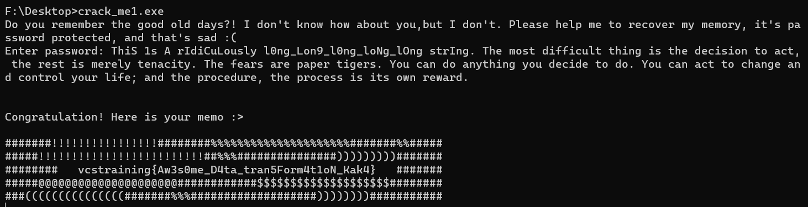

**FLAG:** `vcstraining{Aw3s0me_D4ta_tran5Form4t1oN_Kak4}` 


