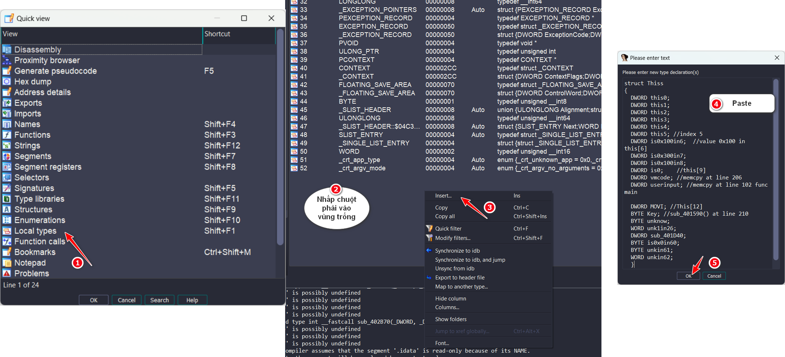

## Vmcode

Đề bài cho chúng ta file `vmcode.exe - 32 bit`. Chúng ta hãy cùng phân tích trong ida nhé

Đầu tiên thì chương trình gán giá trị vào biến và từng phần tử của mảng:

<center>


</center>

Mình đã đổi tên hàm và tên biến cho dễ hiểu hơn. Đoạn code này yêu cầu ta nhập vào và string ta nhập vào được lưu ở `Strinput`; tiếp đến gọi hàm `sub_401630` với 3 tham số được truyền vào:


Nhưng khi mình ấn vào hàm thì lại thấy có 4 tham số được truyền vào nên mình trỏ vào tham số truyền vào khi gọi hàm đó rồi nhấn `F5` để ida Decompiling:

 


Ở trong hàm `sub_401630`, chương trình gán các giá trị vào mảng `this`. :


Ở dòng 11, hàm `sub_CD2C10` là hàm kiểm tra xem chương trình đã cấp phát bộ nhớ động và lưu địa chỉ vào `this[11]`, `this[0]` và biến `is0in10`.Nếu thành công thì sẽ khởi tạo các giá trị tại địa chỉ đó = 0 .

Tên hàm trong hình bị thay đổi do sau khi debug thì `ImageBase` thay đổi. Ngoài ra mình còn dùng struct và thay đổi tên biến cho dễ đọc.


Do tham số truyền vào của hàm này là this[6] => mình gán biến this của hàm này với struct:

```
struct sub
{
  DWORD is0x100in6;
  DWORD is0x300;
  DWORD is0x100in8;
  DWORD is0;
  DWORD is0in10;
  DWORD is0in11;
};
```


Sau khi gán giá trị vào mảng `this` xong, chương trình copy `0x135` phần tử ở mảng `v9` trong hàm `main` sau đó clear dữ liệu từ this[0] -> this[5](`OWORD`: OctaWORD). Rồi gọi hàm `sub_311590` với tham số truyền vào là địa chỉ của `this` và `a2`(offset lưu trữ string `KMACTF`)


Hàm `sub_401590` hay `sub_311590` là hàm mã hóa bằng thuật toán **RC4** với Key là `KMACTF`. Sau đó lấy 48 phần tử đầu của S-box đã được hoán vị và lưu vào byte đầu tiên của this[13],this[13+4],this[13+8],...


Để lấy key, mình đã debug tới dòng code sau khi truyền key vào mảng this để lấy offset của `this[12]` và sử dụng IDAPython để viết script:


Kết thúc hàm `sub_401630`, chương trình gán giá trị ở địa chỉ `Strinput` vào địa chỉ ở trong `this[11]`(Địa chỉ của dữ liệu đã được cấp phát ở hàm `sub_CD2C10` ) 

Sau đó gọi hàm `sub_402B70` với tham số truyền vào là offset của `this`.Sau đó chương trình gọi hàm `j_j_free()` để giải phóng bộ nhớ:


Nhìn qua hàm `sub_402B70` ta thấy có rất nhiều 
chỗ như trong hình thì khi nhìn vào rất là khó để biết được đó là cái gì nên mình sẽ viết struct cho `this`. 


Do tham số `this` được khởi tạo với kích thước là `DWORD` => `this[]` có kích thước là `DWORD`. Ở dòng 13, chương trình lấy `WORD(this + 26)` tức `DWORD (this + 13)` => `this[13]`. 


Đây là struct của `this`:

```
struct Thiss
{
  DWORD this0;
  DWORD this1;
  DWORD this2;
  DWORD this3;
  DWORD this4;
  DWORD this5; //index 5
  DWORD is0x100in6;  //value 0x100 in this[6]
  DWORD is0x300in7;
  DWORD is0x100in8;
  DWORD is0;    //this[9]
  DWORD vmcode; //memcpy at line 206 
  DWORD userinput; //memcpy at line 102 func main

  DWORD MOVI; //This[12]
  BYTE Key; //sub_401590() at line 210
  BYTE unknow;
  WORD unk1in26;
  DWORD offsetfunc;
  BYTE is0x0in60;
  BYTE unkin61;
  WORD unkin62;
  }
```

Giờ chúng ta sẽ insert struct này vào ida:



Sau khi insert xong thì ta quay lại hàm `sub_40270` và tiến hành chuyển đổi this sang struct:


Do `result` bắt đầu từ `this[12]` nên mình sẽ viết struct riêng cho nó:

```
struct structtmp
{
  DWORD MOVI;
  BYTE KEYRC4;
  BYTE isInt;
  WORD unk1in28;
  DWORD offsetfunc;
  BYTE is0x0in60;
  BYTE unkin61;
  WORD unkin62;
};

```

Sau khi convert xong thì hàm `sub_40270` sẽ trông như thế này:


Đầu tiên chương trình sẽ dùng vòng lặp while thứ nhất với điều kiện là `TRUE` => Chỉ out vòng lặp khi gặp break.

Vòng lặp while thứ 2 là vòng lặp 48 lần kiểm tra xem byte ở `vmcode[step]` có bằng `Key[count]` không.

Nếu bằng thì gán byte đó vào `v2`. Sau khi kết thúc vòng lặp while 2 thì sẽ kiểm tra `v2` xem có byte nào giống không. Nếu có thì gọi hàm lưu ở `offsetfunc` với tham số là `this`. Nếu thành công thì chương trình sẽ tính toán step mới để thực hiện vòng lặp tiếp theo.

Đây là 1 ví dụ về giá trị của từng biến trong hàm này để chúng ta có thể hiểu rõ hơn nhé:


Lấy "MOVI" làm mốc, mình viết script trong ida python để lấy lần lượt tên, opcode của func đó và Step của 48 funcion đầu tiên:

``` python
offset = 0x010FFAA4

for i in range(48):
    print(
        bytes.fromhex(hex(get_wide_dword(get_wide_dword(offset + (i * 16))))[2:]).decode('utf-8')[::-1], # Printing names
        hex(get_wide_byte(offset + 4 + (i * 16))),                                                       # Printing opcode
        hex(get_wide_byte(offset + 5 + (i * 16)))                                                        # Printing step
    )

```
Đây là output:
```
MOVI 0xb7 0x4
MOVR 0x4e 0x2
LODI 0xdc 0x4
LODR 0x67 0x2
STRI 0x96 0x4
STRR 0xc 0x2
ADDI 0x28 0x4
ADDR 0x6a 0x2
SUBI 0xfb 0x4
SUBR 0xff 0x2
ANDB 0x5d 0x3
ANDW 0x6c 0x4
ANDR 0x2e 0x2
YORB 0x5f 0x3
YORW 0xb 0x4
YORR 0x63 0x2
XORB 0x57 0x3
XORW 0x1 0x4
XORR 0x29 0x2
NOTR 0x4a 0x2
MULI 0x8f 0x4
MULR 0x25 0x2
DIVI 0x72 0x4
DIVR 0x83 0x2
SHLI 0x39 0x4
SHLR 0x9f 0x2
SHRI 0xfa 0x4
SHRR 0x58 0x2
PUSH 0x3e 0x2
POOP 0x10 0x2
CMPB 0x59 0x3
CMPW 0xf 0x4
CMPR 0x55 0x2
JMPI 0x5 0x3
JMPR 0xab 0x2
JPAI 0x14 0x3
JPAR 0x4f 0x2
JPBI 0x54 0x3
JPBR 0xbd 0x2
JPEI 0x27 0x3
JPER 0xd 0x2
JPNI 0x18 0x3
JPNR 0x87 0x2
CALL 0x1d 0x3
RETN 0xf9 0x1
SHIT 0xce 0x1
NOPE 0x50 0x1
GRMN 0x34 0x1
```
Mình sẽ viết script python để mô phỏng lại thuật toán của hàm `sub_40270` đồng thời in ra thứ tự tên các hàm được gọi:

```python
vmcode = [  0xDC, 0x00, 0x00, 0x00, 0x28, 0x00, 0xBD, 0x03, 0x0F, 0x00, 
            0x13, 0x51, 0x18, 0x33, 0x01, 0xDC, 0x00, 0x02, 0x00, 0xB7, 
            0x02, 0x2E, 0x00, 0x29, 0x02, 0x0F, 0x00, 0x6D, 0x30, 0x18, 
            0x33, 0x01, 0xDC, 0x00, 0x04, 0x00, 0xB7, 0x02, 0x0B, 0x00, 
            0x29, 0x02, 0x0F, 0x00, 0x6F, 0x33, 0x18, 0x33, 0x01, 0xDC, 
            0x00, 0x06, 0x00, 0x28, 0x00, 0x69, 0x03, 0x0F, 0x00, 0xC8, 
            0x34, 0x18, 0x33, 0x01, 0xDC, 0x00, 0x08, 0x00, 0xB7, 0x02, 
            0x2B, 0x00, 0x29, 0x02, 0xB7, 0x02, 0x57, 0x00, 0x29, 0x02, 
            0x0F, 0x00, 0x0F, 0x5F, 0x18, 0x33, 0x01, 0xDC, 0x00, 0x0A, 
            0x00, 0xB7, 0x02, 0x61, 0x00, 0x29, 0x02, 0xB7, 0x02, 0x61, 
            0x00, 0x29, 0x02, 0xB7, 0x02, 0x40, 0x00, 0x29, 0x02, 0x0F, 
            0x00, 0x23, 0x68, 0x18, 0x33, 0x01, 0xDC, 0x00, 0x0C, 0x00, 
            0xFB, 0x00, 0x4F, 0x03, 0x0F, 0x00, 0xE5, 0x2D, 0x18, 0x33, 
            0x01, 0xDC, 0x00, 0x0E, 0x00, 0xB7, 0x02, 0x46, 0x00, 0x29, 
            0x02, 0x0F, 0x00, 0x77, 0x33, 0x18, 0x33, 0x01, 0xDC, 0x00, 
            0x10, 0x00, 0xB7, 0x02, 0x1F, 0x00, 0x29, 0x02, 0xB7, 0x02, 
            0x1C, 0x00, 0x29, 0x02, 0xB7, 0x02, 0x26, 0x00, 0x29, 0x02, 
            0x0F, 0x00, 0x4B, 0x39, 0x18, 0x33, 0x01, 0xDC, 0x00, 0x12, 
            0x00, 0xB7, 0x02, 0x0F, 0x00, 0x29, 0x02, 0xB7, 0x02, 0x57, 
            0x00, 0x29, 0x02, 0xB7, 0x02, 0x3F, 0x00, 0x29, 0x02, 0x0F, 
            0x00, 0x54, 0x5F, 0x18, 0x33, 0x01, 0xDC, 0x00, 0x14, 0x00, 
            0xB7, 0x02, 0x37, 0x00, 0x29, 0x02, 0xB7, 0x02, 0x58, 0x00, 
            0x29, 0x02, 0xB7, 0x02, 0x4C, 0x00, 0x29, 0x02, 0x0F, 0x00, 
            0x41, 0x31, 0x18, 0x33, 0x01, 0xDC, 0x00, 0x16, 0x00, 0xB7, 
            0x02, 0x24, 0x00, 0x29, 0x02, 0x0F, 0x00, 0x1D, 0x5F, 0x18, 
            0x33, 0x01, 0xDC, 0x00, 0x18, 0x00, 0xB7, 0x02, 0x1A, 0x00, 
            0x29, 0x02, 0xB7, 0x02, 0x1C, 0x00, 0x29, 0x02, 0x0F, 0x00, 
            0x6E, 0x34, 0x18, 0x33, 0x01, 0xDC, 0x00, 0x1A, 0x00, 0xFB, 
            0x00, 0x80, 0x03, 0x0F, 0x00, 0xEE, 0x60, 0x18, 0x33, 0x01, 
            0xDC, 0x00, 0x1C, 0x00, 0xFB, 0x00, 0x09, 0x01, 0x0F, 0x00, 
            0x6A, 0x20, 0x18, 0x33, 0x01, 0x34, 0xCE, 0x50, 0xCE]

Key = [0xb7,0x4e,0xdc,0x67,0x96,0xc,0x28,0x6a,0xfb,0xff,0x5d,
        0x6c,0x2e,0x5f,0xb,0x63,0x57,0x1,0x29,0x4a,0x8f,0x25,
        0x72,0x83,0x39,0x9f,0xfa,0x58,0x3e,0x10,0x59,0xf,0x55,
        0x5,0xab,0x14,0x4f,0x54,0xbd,0x27,0xd,0x18,0x87,0x1d,
        0xf9,0xce,0x50,0x34]

FuncNames = ['MOVI','MOVR','LODI','LODR','STRI','STRR','ADDI','ADDR','SUBI','SUBR','ANDB','ANDW','ANDR','YORB','YORW','YORR','XORB','XORW','XORR','NOTR','MULI','MULR','DIVI','DIVR','SHLI','SHLR','SHRI','SHRR','PUSH','POOP','CMPB','CMPW','CMPR','JMPI','JMPR','JPAI','JPAR','JPBI','JPBR','JPEI','JPER','JPNI','JPNR','CALL','RETN','SHIT','NOPE','GRMN']

jmpstep = [0x4,0x2,0x4,0x2,0x4,0x2,0x4,0x2,0x4,0x2,0x3,0x4,0x2,0x3,0x4,0x2,0x3,0x4,0x2,0x2,0x4,0x2,0x4,0x2,0x4,0x2,0x4,0x2,0x2,0x2,0x3,0x4,0x2,0x3,0x2,0x3,0x2,0x3,0x2,0x3,0x2,0x3,0x2,0x3,0x1,0x1,0x1,0x1]

ord = []
stp = []
flag = []
strinput = [0]*48
step = 0
while step < len(vmcode):
    count = 0
    while count <= 48 :
        if  vmcode [step] == Key[count]:
            ord.append(FuncNames[count])
            stp.append(step)
            step += jmpstep[count]
            break
        count +=1
print (ord)
```

Đây là output:

```
['LODI', 'ADDI', 'CMPW', 'JPNI', 'LODI', 'MOVI', 'XORR', 'CMPW', 'JPNI', 'LODI',
 'MOVI', 'XORR', 'CMPW', 'JPNI', 'LODI', 'ADDI', 'CMPW', 'JPNI', 'LODI', 'MOVI', 
 'XORR', 'MOVI', 'XORR', 'CMPW', 'JPNI', 'LODI', 'MOVI', 'XORR', 'MOVI', 'XORR',
 'MOVI', 'XORR', 'CMPW', 'JPNI', 'LODI', 'SUBI', 'CMPW', 'JPNI', 'LODI', 'MOVI',
 'XORR', 'CMPW', 'JPNI', 'LODI', 'MOVI', 'XORR', 'MOVI', 'XORR', 'MOVI', 'XORR',
 'CMPW', 'JPNI', 'LODI', 'MOVI', 'XORR', 'MOVI', 'XORR', 'MOVI', 'XORR', 'CMPW',
 'JPNI', 'LODI', 'MOVI', 'XORR', 'MOVI', 'XORR', 'MOVI', 'XORR', 'CMPW', 'JPNI',
 'LODI', 'MOVI', 'XORR', 'CMPW', 'JPNI', 'LODI', 'MOVI', 'XORR', 'MOVI', 'XORR',
 'CMPW', 'JPNI', 'LODI', 'SUBI', 'CMPW', 'JPNI', 'LODI', 'SUBI', 'CMPW', 'JPNI',
 'GRMN', 'SHIT', 'NOPE', 'SHIT']
```

Do các hàm truyền vào ida đặt tên là `sub_xxxxx` thì rất khó nhìn nên mình dùng script để đổi tên. Trong đó offset là địa chỉ `this[12]`:

```python
offset = 0x010FFAA4 
for i in range(48):
    (get_func_name(get_wide_dword(offset+8+(i*16)))))
```

 Chúng ta hãy bóc tách từng hàm nhé:

#### LODI

Chương trình load `step` ở trong vmcode sau đó load `count` để lấy các kí tự input truyền vào `this0 + v4`


Khi check opcode của hàm `LODI` là 0xDC thì `step`(gtri tại byte T1) luôn = 0 và `count` của mỗi lần cách nhau 0x02.


Vậy hàm này truyền 2 kí tự từ `userinput` vào `this0`

#### ADDI

Như hàm `LODI`; `v4` luôn bằng 0. Hàm `ADDI` sẽ lấy `this0` + giá trị tại byte T2


#### CMPW

Như ta thấy ở dòng 13 thì `v4` lấy `WORD` sau đó `cmp` với `this0` => `v4` sẽ là `cipher`. 


#### JPNI

Hàm này check xem khi `checker` có < `0x10000` không. Nếu không thì giá trị truyền vào `step` khiến ta out vòng lặp khi kiểm tra giá trị của `step`


#### MOVI

Khác với những hàm trên thì lần này `v4` = 2:


Vậy hàm này truyền giá trị từ 2 byte trong `vmcode` -> `this2`


#### XORR

Hàm `XORR` chỉ giống như "this0 ^= this2"


#### SUBI

Hàm `SUBI` chỉ giống như "this0 -= v5"


#### GRMN

Print("That's it")

#### SHIT

Return 0

#### NOPE

Print("WRONG")

Dựa vào những dữ kiện trên, mình đã viết script mô tả flow của chương trình:

```python
vmcode = [0xDC, 0x00, 0x00, 0x00, 0x28, 0x00, 0xBD, 0x03, 0x0F, 0x00, 
  0x13, 0x51, 0x18, 0x33, 0x01, 0xDC, 0x00, 0x02, 0x00, 0xB7, 
  0x02, 0x2E, 0x00, 0x29, 0x02, 0x0F, 0x00, 0x6D, 0x30, 0x18, 
  0x33, 0x01, 0xDC, 0x00, 0x04, 0x00, 0xB7, 0x02, 0x0B, 0x00, 
  0x29, 0x02, 0x0F, 0x00, 0x6F, 0x33, 0x18, 0x33, 0x01, 0xDC, 
  0x00, 0x06, 0x00, 0x28, 0x00, 0x69, 0x03, 0x0F, 0x00, 0xC8, 
  0x34, 0x18, 0x33, 0x01, 0xDC, 0x00, 0x08, 0x00, 0xB7, 0x02, 
  0x2B, 0x00, 0x29, 0x02, 0xB7, 0x02, 0x57, 0x00, 0x29, 0x02, 
  0x0F, 0x00, 0x0F, 0x5F, 0x18, 0x33, 0x01, 0xDC, 0x00, 0x0A, 
  0x00, 0xB7, 0x02, 0x61, 0x00, 0x29, 0x02, 0xB7, 0x02, 0x61, 
  0x00, 0x29, 0x02, 0xB7, 0x02, 0x40, 0x00, 0x29, 0x02, 0x0F, 
  0x00, 0x23, 0x68, 0x18, 0x33, 0x01, 0xDC, 0x00, 0x0C, 0x00, 
  0xFB, 0x00, 0x4F, 0x03, 0x0F, 0x00, 0xE5, 0x2D, 0x18, 0x33, 
  0x01, 0xDC, 0x00, 0x0E, 0x00, 0xB7, 0x02, 0x46, 0x00, 0x29, 
  0x02, 0x0F, 0x00, 0x77, 0x33, 0x18, 0x33, 0x01, 0xDC, 0x00, 
  0x10, 0x00, 0xB7, 0x02, 0x1F, 0x00, 0x29, 0x02, 0xB7, 0x02, 
  0x1C, 0x00, 0x29, 0x02, 0xB7, 0x02, 0x26, 0x00, 0x29, 0x02, 
  0x0F, 0x00, 0x4B, 0x39, 0x18, 0x33, 0x01, 0xDC, 0x00, 0x12, 
  0x00, 0xB7, 0x02, 0x0F, 0x00, 0x29, 0x02, 0xB7, 0x02, 0x57, 
  0x00, 0x29, 0x02, 0xB7, 0x02, 0x3F, 0x00, 0x29, 0x02, 0x0F, 
  0x00, 0x54, 0x5F, 0x18, 0x33, 0x01, 0xDC, 0x00, 0x14, 0x00, 
  0xB7, 0x02, 0x37, 0x00, 0x29, 0x02, 0xB7, 0x02, 0x58, 0x00, 
  0x29, 0x02, 0xB7, 0x02, 0x4C, 0x00, 0x29, 0x02, 0x0F, 0x00, 
  0x41, 0x31, 0x18, 0x33, 0x01, 0xDC, 0x00, 0x16, 0x00, 0xB7, 
  0x02, 0x24, 0x00, 0x29, 0x02, 0x0F, 0x00, 0x1D, 0x5F, 0x18, 
  0x33, 0x01, 0xDC, 0x00, 0x18, 0x00, 0xB7, 0x02, 0x1A, 0x00, 
  0x29, 0x02, 0xB7, 0x02, 0x1C, 0x00, 0x29, 0x02, 0x0F, 0x00, 
  0x6E, 0x34, 0x18, 0x33, 0x01, 0xDC, 0x00, 0x1A, 0x00, 0xFB, 
  0x00, 0x80, 0x03, 0x0F, 0x00, 0xEE, 0x60, 0x18, 0x33, 0x01, 
  0xDC, 0x00, 0x1C, 0x00, 0xFB, 0x00, 0x09, 0x01, 0x0F, 0x00, 
  0x6A, 0x20, 0x18, 0x33, 0x01, 0x34, 0xCE, 0x50, 0xCE]

this = [0, 0, 0, 0, 0, 0, 256, 768, 256, 12311528, vmcode, 12311248, ['MOVI', 183, 4, 0, 1908032, 0, 0, 0], ['MOVR', 78, 2, 0, 1908096, 0, 0, 0], ['LODI', 220, 4, 0, 1908192, 0, 0, 0], ['LODR', 103, 2, 0, 1908272, 0, 0, 0], ['STRI', 150, 4, 0, 1908384, 0, 0, 0], ['STRR', 12, 2, 0, 1908464, 0, 0, 0], ['ADDI', 40, 4, 0, 1908576, 0, 0, 0], ['ADDR', 106, 2, 0, 1908640, 0, 0, 0], ['SUBI', 251, 4, 0, 1908736, 0, 0, 0], ['SUBR', 255, 2, 0, 1908800, 0, 0, 0], ['ANDB', 93, 3, 0, 1908896, 0, 0, 0], ['ANDW', 108, 4, 0, 1908976, 0, 0, 0], ['ANDR', 46, 2, 0, 1909040, 0, 0, 0], ['YORB', 95, 3, 0, 1909136, 0, 0, 0], ['YORW', 11, 4, 0, 1909216, 0, 0, 0], ['YORR', 99, 2, 0, 1909280, 0, 0, 0], ['XORB', 87, 3, 0, 1909376, 0, 0, 0], ['XORW', 1, 4, 0, 1909456, 0, 0, 0], ['XORR', 41, 2, 0, 1909520, 0, 0, 0], ['NOTR', 74, 2, 0, 1909616, 0, 0, 0], ['MULI', 143, 4, 0, 1909712, 0, 0, 0], ['MULR', 37, 2, 0, 1909792, 0, 0, 0], ['DIVI', 114, 4, 0, 1909888, 0, 0, 0], ['DIVR', 131, 2, 0, 1909984, 0, 0, 0], ['SHLI', 57, 4, 0, 1910096, 0, 0, 0], ['SHLR', 159, 2, 0, 1910160, 0, 0, 0], ['SHRI', 250, 4, 0, 1910256, 0, 0, 0], ['SHRR', 88, 2, 0, 1910320, 0, 0, 0], ['PUSH', 62, 2, 0, 1910416, 0, 0, 0], ['POOP', 16, 2, 0, 1910512, 0, 0, 0], ['CMPB', 89, 3, 0, 1910592, 0, 0, 0], ['CMPW', 15, 4, 0, 1910688, 0, 0, 0], ['CMPR', 85, 2, 0, 1910784, 0, 0, 0], ['JMPI', 5, 3, 0, 1910912, 1, 0, 0], ['JMPR', 171, 2, 0, 1910944, 1, 0, 0], ['JPAI', 20, 3, 0, 1911008, 1, 0, 0], ['JPAR', 79, 2, 0, 1911056, 1, 0, 0], ['JPBI', 84, 3, 0, 1911120, 1, 0, 0], ['JPBR', 189, 2, 0, 1911168, 1, 0, 0], ['JPEI', 39, 3, 0, 1911232, 1, 0, 0], ['JPER', 13, 2, 0, 1911280, 1, 0, 0], ['JPNI', 24, 3, 0, 1911344, 1, 0, 0], ['JPNR', 135, 2, 0, 1911392, 1, 0, 0], ['CALL', 29, 3, 0, 1911456, 1, 0, 0], ['RETN', 249, 1, 0, 1911552, 1, 0, 0], ['SHIT', 206, 1, 0, 1911584, 0, 0, 0], ['NOPE', 80, 1, 0, 1911632, 0, 0, 0], ['GRMN', 52, 1, 0, 1911600, 0, 0, 0]]

def runvm(this):
    v2 = []
    while 1:
        v3 = 0x30
        cnt = 12
        while v3:
            res = this[cnt]
            if this[10][this[4]] == res[1]:
                v2 = res
                break
            cnt += 1
            v3 -= 1
        if v2[0] == 'LODI':

            print('lodi')
        elif v2[0] == 'ADDI':
            
            print('addi ' + hex(vmcode[this[4] + 2 + 1] * 0x100 + vmcode[this[4] + 2]))
        elif v2[0] == 'SUBI':
            print('subi ' + hex(vmcode[this[4] + 2 + 1] * 0x100 + vmcode[this[4] + 2]))
        elif v2[0] == 'MOVI':
            
            this[vmcode[this[4] + 1]] = hex(vmcode[this[4] + 2 + 1] * 0x100 + vmcode[this[4] + 2])
            print('movi ' + this[vmcode[this[4] + 1]])
        elif v2[0] == 'XORR':
            print('xorr ' + this[vmcode[this[4] + 1] & 0xf])
        elif v2[0] == 'CMPW':
            print('cmpw ' + hex(vmcode[this[4] + 2 + 1] * 0x100 + vmcode[this[4] + 2]))
        elif v2[0] == 'JPNI':
            print('jpni')
            print()
            this[4] += 3
        elif v2[0] == 'GRMN':
            print("That's it")
        elif v2[0] == 'SHIT':
            print('SHIT')
            return
        if v2[5] == 0:
            this[4] += v2[2]

runvm(this)
```

**Output:**

```
lodi
addi 0x3bd
cmpw 0x5113
jpni

lodi
movi 0x2e
xorr 0x2e
cmpw 0x306d
jpni

lodi
movi 0xb
xorr 0xb
cmpw 0x336f
jpni

lodi
addi 0x369
cmpw 0x34c8
jpni

lodi
movi 0x2b
xorr 0x2b
movi 0x57
xorr 0x57
cmpw 0x5f0f
jpni

lodi
movi 0x61
xorr 0x61
movi 0x61
xorr 0x61
movi 0x40
xorr 0x40
cmpw 0x6823
jpni

lodi
subi 0x34f
cmpw 0x2de5
jpni

lodi
movi 0x46
xorr 0x46
cmpw 0x3377
jpni

lodi
movi 0x1f
xorr 0x1f
movi 0x1c
xorr 0x1c
movi 0x26
xorr 0x26
cmpw 0x394b
jpni

lodi
movi 0xf
xorr 0xf
movi 0x57
xorr 0x57
movi 0x3f
xorr 0x3f
cmpw 0x5f54
jpni

lodi
movi 0x37
xorr 0x37
movi 0x58
xorr 0x58
movi 0x4c
xorr 0x4c
cmpw 0x3141
jpni

lodi
movi 0x24
xorr 0x24
cmpw 0x5f1d
jpni

lodi
movi 0x1a
xorr 0x1a
movi 0x1c
xorr 0x1c
cmpw 0x346e
jpni

lodi
subi 0x380
cmpw 0x60ee
jpni

lodi
subi 0x109
cmpw 0x206a
jpni

That's it
SHIT
```

Từ flow trên mình viết ra script để tìm flag:

``` python
vmcode = [  0xDC, 0x00, 0x00, 0x00, 0x28, 0x00, 0xBD, 0x03, 0x0F, 0x00, 
            0x13, 0x51, 0x18, 0x33, 0x01, 0xDC, 0x00, 0x02, 0x00, 0xB7, 
            0x02, 0x2E, 0x00, 0x29, 0x02, 0x0F, 0x00, 0x6D, 0x30, 0x18, 
            0x33, 0x01, 0xDC, 0x00, 0x04, 0x00, 0xB7, 0x02, 0x0B, 0x00, 
            0x29, 0x02, 0x0F, 0x00, 0x6F, 0x33, 0x18, 0x33, 0x01, 0xDC, 
            0x00, 0x06, 0x00, 0x28, 0x00, 0x69, 0x03, 0x0F, 0x00, 0xC8, 
            0x34, 0x18, 0x33, 0x01, 0xDC, 0x00, 0x08, 0x00, 0xB7, 0x02, 
            0x2B, 0x00, 0x29, 0x02, 0xB7, 0x02, 0x57, 0x00, 0x29, 0x02, 
            0x0F, 0x00, 0x0F, 0x5F, 0x18, 0x33, 0x01, 0xDC, 0x00, 0x0A, 
            0x00, 0xB7, 0x02, 0x61, 0x00, 0x29, 0x02, 0xB7, 0x02, 0x61, 
            0x00, 0x29, 0x02, 0xB7, 0x02, 0x40, 0x00, 0x29, 0x02, 0x0F, 
            0x00, 0x23, 0x68, 0x18, 0x33, 0x01, 0xDC, 0x00, 0x0C, 0x00, 
            0xFB, 0x00, 0x4F, 0x03, 0x0F, 0x00, 0xE5, 0x2D, 0x18, 0x33, 
            0x01, 0xDC, 0x00, 0x0E, 0x00, 0xB7, 0x02, 0x46, 0x00, 0x29, 
            0x02, 0x0F, 0x00, 0x77, 0x33, 0x18, 0x33, 0x01, 0xDC, 0x00, 
            0x10, 0x00, 0xB7, 0x02, 0x1F, 0x00, 0x29, 0x02, 0xB7, 0x02, 
            0x1C, 0x00, 0x29, 0x02, 0xB7, 0x02, 0x26, 0x00, 0x29, 0x02, 
            0x0F, 0x00, 0x4B, 0x39, 0x18, 0x33, 0x01, 0xDC, 0x00, 0x12, 
            0x00, 0xB7, 0x02, 0x0F, 0x00, 0x29, 0x02, 0xB7, 0x02, 0x57, 
            0x00, 0x29, 0x02, 0xB7, 0x02, 0x3F, 0x00, 0x29, 0x02, 0x0F, 
            0x00, 0x54, 0x5F, 0x18, 0x33, 0x01, 0xDC, 0x00, 0x14, 0x00, 
            0xB7, 0x02, 0x37, 0x00, 0x29, 0x02, 0xB7, 0x02, 0x58, 0x00, 
            0x29, 0x02, 0xB7, 0x02, 0x4C, 0x00, 0x29, 0x02, 0x0F, 0x00, 
            0x41, 0x31, 0x18, 0x33, 0x01, 0xDC, 0x00, 0x16, 0x00, 0xB7, 
            0x02, 0x24, 0x00, 0x29, 0x02, 0x0F, 0x00, 0x1D, 0x5F, 0x18, 
            0x33, 0x01, 0xDC, 0x00, 0x18, 0x00, 0xB7, 0x02, 0x1A, 0x00, 
            0x29, 0x02, 0xB7, 0x02, 0x1C, 0x00, 0x29, 0x02, 0x0F, 0x00, 
            0x6E, 0x34, 0x18, 0x33, 0x01, 0xDC, 0x00, 0x1A, 0x00, 0xFB, 
            0x00, 0x80, 0x03, 0x0F, 0x00, 0xEE, 0x60, 0x18, 0x33, 0x01, 
            0xDC, 0x00, 0x1C, 0x00, 0xFB, 0x00, 0x09, 0x01, 0x0F, 0x00, 
            0x6A, 0x20, 0x18, 0x33, 0x01, 0x34, 0xCE, 0x50, 0xCE]

Key = [0xb7,0x4e,0xdc,0x67,0x96,0xc,0x28,0x6a,0xfb,0xff,0x5d,
        0x6c,0x2e,0x5f,0xb,0x63,0x57,0x1,0x29,0x4a,0x8f,0x25,
        0x72,0x83,0x39,0x9f,0xfa,0x58,0x3e,0x10,0x59,0xf,0x55,
        0x5,0xab,0x14,0x4f,0x54,0xbd,0x27,0xd,0x18,0x87,0x1d,
        0xf9,0xce,0x50,0x34]

FuncNames = ['MOVI','MOVR','LODI','LODR','STRI','STRR','ADDI','ADDR','SUBI','SUBR','ANDB','ANDW','ANDR','YORB','YORW','YORR','XORB','XORW','XORR','NOTR','MULI','MULR','DIVI','DIVR','SHLI','SHLR','SHRI','SHRR','PUSH','POOP','CMPB','CMPW','CMPR','JMPI','JMPR','JPAI','JPAR','JPBI','JPBR','JPEI','JPER','JPNI','JPNR','CALL','RETN','SHIT','NOPE','GRMN']

jmpstep = [0x4,0x2,0x4,0x2,0x4,0x2,0x4,0x2,0x4,0x2,0x3,0x4,0x2,0x3,0x4,0x2,0x3,0x4,0x2,0x2,0x4,0x2,0x4,0x2,0x4,0x2,0x4,0x2,0x2,0x2,0x3,0x4,0x2,0x3,0x2,0x3,0x2,0x3,0x2,0x3,0x2,0x3,0x2,0x3,0x1,0x1,0x1,0x1]

ord = []
stp = []
flag = []
strinput = [0]*48
step = 0
while step < len(vmcode):
    count = 0
    while count <= 48 :
        if  vmcode [step] == Key[count]:
            ord.append(FuncNames[count])
            stp.append(step)
            step += jmpstep[count]
            break
        count +=1
i =0
while i < (len(ord)-4):
    if ord[i] == 'LODI':

        if ord[i+1] == 'ADDI':
            cipher =  (((vmcode[stp[i+2]+3]&0xff)<<8)&0xffff) + vmcode[stp[i+2]+2]
            this2 =   (((vmcode[stp[i+1]+3]&0xff)<<8)&0xffff) + vmcode[stp[i+1]+2]
            result = cipher - this2
            flag.append(chr(result&0x00ff))
            flag.append(chr((result&0xff00)>>8))
            i += 4
        elif  ord[i+1] == 'MOVI':
            if ord[i+5] == 'MOVI':
                cipher =  (((vmcode[stp[i+7]+3]&0xff)<<8)&0xffff) + vmcode[stp[i+7]+2]
                this2 = vmcode[stp[i+5]+2]&0xff
                result = cipher ^ this2
                this2 = vmcode[stp[i+3]+2]&0xff
                result ^= this2
                this2 = vmcode[stp[i+1]+2]&0xff
                result ^= this2
                flag.append(chr(result&0x00ff))
                flag.append(chr((result&0xff00)>>8))
                i+= 9
            elif ord[i+3] == 'MOVI':
                cipher =  (((vmcode[stp[i+5]+3]&0xff)<<8)&0xffff) + vmcode[stp[i+5]+2]
                this2 = vmcode[stp[i+3]+2]&0xff
                result = cipher ^ this2
                this2 = vmcode[stp[i+1]+2]&0xff
                result ^= this2
                flag.append(chr(result&0x00ff))
                flag.append(chr((result&0xff00)>>8))
                i+= 7
            else:
                cipher =  (((vmcode[stp[i+3]+3]&0xff)<<8)&0xffff) + vmcode[stp[i+3]+2]
                this2 = vmcode[stp[i+1]+2]&0xff
                result = cipher ^ this2
                flag.append(chr(result&0x00ff))
                flag.append(chr((result&0xff00)>>8))
                i += 5
        elif ord[i+1] == 'SUBI':
            cipher =  (((vmcode[stp[i+2]+3]&0xff)<<8)&0xffff) + vmcode[stp[i+2]+2]
            this2 =   (((vmcode[stp[i+1]+3]&0xff)<<8)&0xffff) + vmcode[stp[i+1]+2]
            result = cipher + this2
            flag.append(chr(result&0x00ff))
            flag.append(chr((result&0xff00)>>8))
            i += 4

for i in flag:
    print(i,end="")

```
### FLAG: `VMC0d3_1s_ch4113n93_b19_h4nds!`


